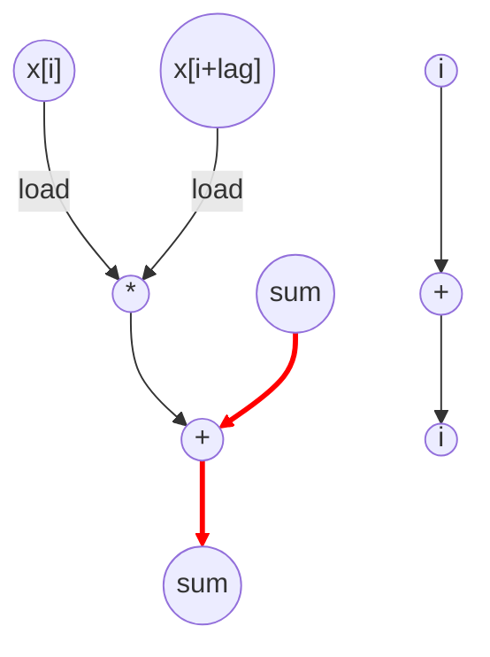

# Autocorrelation Performance
Parameters: `x_size = 128`, `max_lag = 32`

## Kernel Properties
- **Input-independent**: cycle and op counts are functions of `x_size` and `max_lag` only; values of `x` do not affect the schedule.
- **Per-lag inner trip count**: `inner_iters(lag) = x_size − lag` for `lag ∈ [0, max_lag)`. Sum is `Σ_{lag=0..31}(128 − lag) = 3,600`. 

## Cycle + Instruction Count
- Expected cycle count:  
inner cycles = 3,600  
fill (32 × 2) = 64  
outer store = 32  
**total ≈ 3,728**
- loads = 7,200   (2 × 3,600)
- stores = 32   (1 × max_lag)
- adds = 3,600   (1 × 3,600; i++ excluded as loop control)
- multiplies = 3,600

## Data Dependency Graph
