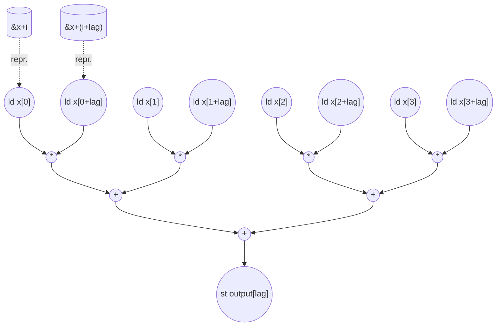

# Autocorrelation Performance
Parameters: `x_size = 128`, `max_lag = 32`. Difficulty: **L1 Static-Affine**.

Kernel:
```cpp
for (uint32_t lag = 0; lag < max_lag; lag++) {
  float sum = 0.0f;
  for (uint32_t i = 0; i < x_size - lag; i++) {
    sum += x[i] * x[i + lag];
  }
  output[lag] = sum;
}
```

## Loop classification
| dim   | trip_count       | kind      | II   | notes |
|-------|------------------|-----------|------|-------|
| `lag` | `max_lag` = 32   | parallel  | n/a  | each iter privatizes `sum` and writes a distinct `output[lag]` — no carry through register or memory. |
| `i`   | `x_size − lag` (varies) | reduction | n/a  | carried dep is `sum += …` — associative float sum, tree-reduced under the ASAP model. |

Note (float reductions): The inner reduction is bit-identical to a serial accumulation only if `sum` is summed in tree order. The ASAP model tree-reduces float `+` for lowest-latency depth; bit-equivalence to the CPU reference under arbitrary inputs is **not** guaranteed.

## Critical path (`total_cycles`)

Per-`lag` critical path (single unrolled outer instance, inner reduction over `N = x_size − lag` products):
```
1 (addr add for x[i+lag]) + 1 (load x[i] ‖ x[i+lag]) + 1 (mul) + ceil(log2(N)) (tree-reduce) + 1 (store output[lag])
= 4 + ceil(log2(x_size − lag))
```

`lag` is a parallel dim → fully unrolled → all 32 instances overlap. `total_cycles` is the **max** over lag, dominated by `lag = 0`:

```
total_cycles = 4 + ceil(log2(x_size))
             = 4 + ceil(log2(128))
             = 4 + 7
             = 11
```

For every `lag ∈ [0, 32)` here, `N ∈ [97, 128]` and `ceil(log2(N)) = 7`, so all 32 lag-instances have identical depth 11.

## Op counts

Total inner iterations across all lag values:
```
Σ_{lag=0..31} (x_size − lag) = Σ_{k=97..128} k = (97 + 128) · 32 / 2 = 3,600
```

### Algorithmic
| op      | count | source |
|---------|-------|--------|
| loads   | 7,200 | `x[i]` (3,600) + `x[i+lag]` (3,600) |
| stores  | 32    | `output[lag] = sum` (one per lag; the sole materialized scalar — `sum` itself collapses into tree edges) |
| mul     | 3,600 | `x[i] * x[i+lag]` per inner iter |
| add     | 3,568 | reduction adds, `N−1` per lag: `Σ_{lag} (x_size − lag − 1) = 3,600 − 32` |

`sum` itself is collapsed into tree edges under the tree-reduce schedule, so its init store and per-iter L/S are not charged.

### Overhead (address + induction + bound + param)
| op           | count  | source |
|--------------|--------|--------|
| loads        | 3,634  | inner `i` reads: 3,600; outer `lag` reads: 32; param hoists (`x_size`, `max_lag`): 2 |
| stores       | 3,632  | inner `i` writes: 3,600; outer `lag` writes: 32 |
| adds         | 3,664  | `i++` (3,600) + `lag++` (32) + bound `x_size − lag` (32, hoisted per outer iter) |
| address_adds | 3,600  | addr-gen for `&x[i+lag]` (1 add/iter × 3,600). `&x[i]` is a bare-variable subscript → no inline arithmetic → 0 address_adds. |
| compares     | 3,632  | inner bound `i < x_size − lag` (3,600) + outer bound `lag < max_lag` (32) |

`&x[i+lag]` has inline arithmetic (`i + lag`) in the subscript, so it charges 1 address_add per access. `&x[i]` is a bare-variable subscript with no inline arithmetic, so it charges no address_add.

### Totals
| op           | total  |
|--------------|--------|
| loads        | **10,834** |
| stores       | **3,664** |
| adds         | **7,232** |
| address_adds | **3,600** |
| mul          | **3,600** |
| compares     | **3,632** |
| div / bitop / transcendental | 0 |

## Data Dependency Graph
Per-lag dataflow under the ASAP + tree-reduce model. Tree branches are shown for `N = 4` for legibility; the actual tree for `lag = 0` has depth `ceil(log2(128)) = 7`. No data dependencies in this kernel. 



Outer `lag` dim is fully unrolled → 32 such graphs run in parallel, each computing one `output[lag]`. No edges cross between lag-instances (distinct sums, distinct output addresses, read-only `x`).

## Delta vs. prior (serial-model) eval
| metric        | old (serial) | new (ASAP) | reason for change |
|---------------|--------------|------------|-------------------|
| total_cycles  | 3,728        | **11**     | outer `lag` is parallel (32× unroll), inner `i` is a float reduction → tree (`log2 N`), not `N` |
| loads         | 7,200        | **10,834** | now charges induction-var reads + param hoists (uniform 1-cycle L/S for all named scalars) |
| stores        | 32           | **3,664**  | now charges induction-var writes (uniform 1-cycle L/S for all named scalars) |
| adds          | 3,600        | **7,232**  | adds now include `i++`/`lag++` (3,632), bound subs (32), and the reduction tree uses `N−1` adds (3,568 vs 3,600); address-gen is now tracked separately under `address_adds` |
| address_adds  | (not listed) | **3,600**  | address arithmetic now tracked as a distinct op category: only `&x[i+lag]` (3,600) charges, since its subscript has inline arithmetic; `&x[i]` is a bare subscript and charges none |
| mul           | 3,600        | 3,600      | unchanged |
| compares      | (not listed) | **3,632**  | per-iter bound checks now counted as dynamic ops |

## CGRA-Constrained Model

The ASAP bound above assumes unlimited functional units and memory bandwidth. This section adds a second lower bound for a CGRA with **separate** arithmetic and memory-issue resources (no shared or bidirectional memory port):

- `P` — arithmetic PEs, homogeneous, one op/cycle each (divides, compares, bitops, transcendentals included).
- `L` — load-issue lanes, one load/cycle each.
- `S` — store-issue lanes, one store/cycle each.

Every counted load consumes an `L` slot and every counted store an `S` slot — **including** induction-variable accesses. Every counted non-load/store op consumes a `P` slot; in particular the **`address_adds` for `&x[i+lag]` are PE work, not load traffic** — they count toward `A`, not `LD`. With `CP` the ASAP dependency bound (`total_cycles`), `A` the counted non-load/store ops, `LD` the loads, and `ST` the stores:

```
compute = ceil(A / P)
load    = ceil(LD / L)
store   = ceil(ST / S)
cycles  = max(CP, compute, load, store)
```

**Counts (from the op-count totals above, x_size = 128, max_lag = 32).**
- `CP = 11`
- `A  = adds (7,232) + address_adds (3,600) + mul (3,600) + compares (3,632) = 18,064`
- `LD = 10,834`
- `ST = 3,664`

**6×6 example (`P = 36`, `L = 12`, `S = 12`).**
```
compute = ceil(18,064 / 36) = 502
load    = ceil(10,834 / 12) = 903
store   = ceil(3,664 / 12)  = 306
cycles  = max(11, 502, 903, 306) = 903
```

**Bottleneck: load-bound.** ASAP collapses this kernel to `CP = 11` (outer `lag` parallel, inner sum tree-reduced), but that depends on issuing all 3,600 products' operand loads at once. Each product needs two array loads (`x[i]`, `x[i+lag]`) plus induction reads, so `LD = 10,834` dominates and `load = 903` sets the floor — above `compute = 502` and well above `store = 306` (only 32 reduction outputs are stored, the accumulator collapsing into tree edges). The 2-loads-per-1-store reduction shape is exactly what makes loads the binding memory resource here.
