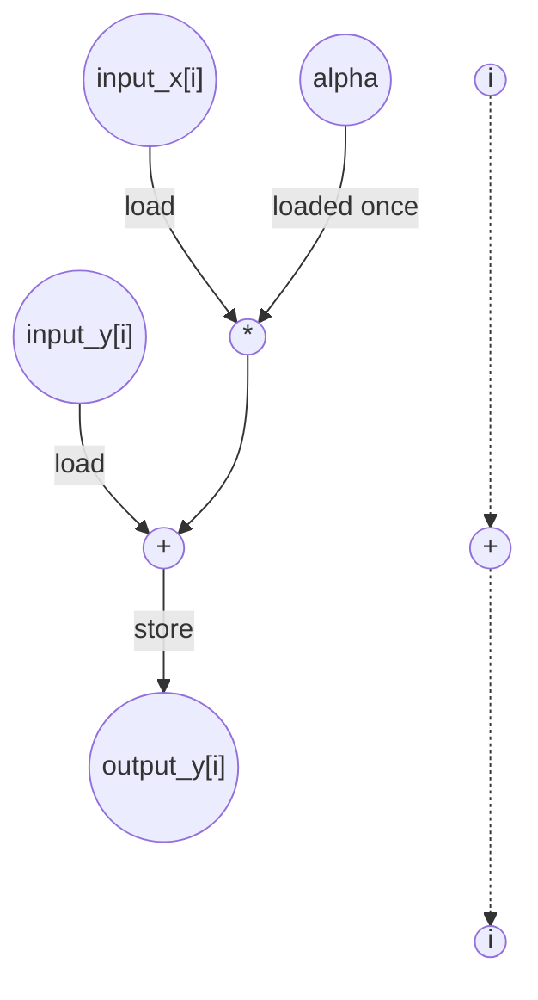

# AXPY Performance
Parameters: `N = 8`, `alpha = 3`

## Cycle + Instruction Count

**Loop classification.** `i` (trip = `N` = 8): **parallel** — no carry through register or memory; `alpha` is read-only, `input_x` / `input_y` are read-only, and each iter writes a distinct `output_y[i]`. Fully unrolled → all 8 lanes overlap.

**Critical path (`total_cycles = 5`).** Per-iter chain through `input_x` (the longer of the two load chains):
```
1 (addr add) + 1 (load input_x[i]) + 1 (mul) + 1 (add) + 1 (store output_y[i]) = 5
```
The `input_y` chain is shorter (no mul): `1 + 1 + 1 + 1 = 4`. `alpha` is loop-invariant, hoisted once. The 8 lanes are independent, so `total_cycles` stays at the per-instance depth.

**Op counts (N = 8).**

| op       | algorithmic | overhead | total |
|----------|-------------|----------|------:|
| loads    | 16 (`input_x[i]`, `input_y[i]`) | 8 (`i` read) + 2 (`alpha`, `N` param hoists) | **26** |
| stores   | 8 (`output_y[i]`) | 8 (`i` write) | **16** |
| adds     | 8 (`α·x + y`)     | 24 (addr-gen: 3 arrays × 8 iters) + 8 (`i++`) | **40** |
| mul      | 8                 | 0 | **8** |
| compares | 0                 | 8 (bound `i < N`) | **8** |

Each per-iter address computation (`&input_x[i]`, `&input_y[i]`, `&output_y[i]`) is a 1-D incremental-stride access → 1 add each. The induction var `i` charges (load + add + store + cmp) per iter.

## Data Dependency Graph
Shown is one of 8 parallel instances; lanes share alpha, which is loaded once. 
