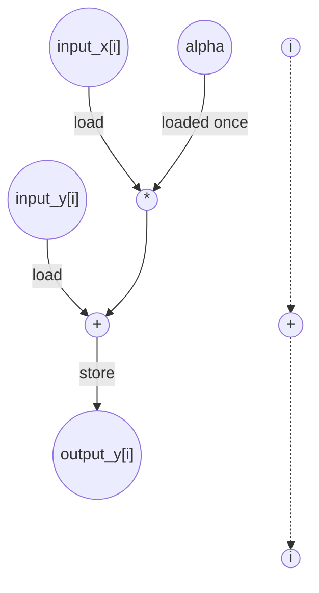

# AXPY Performance
Parameters: `N = 8`, `alpha = 3`

## Cycle + Instruction Count

**Loop classification.** `i` (trip = `N` = 8): **parallel** — no carry through register or memory; `alpha` is read-only, `input_x` / `input_y` are read-only, and each iter writes a distinct `output_y[i]`. Fully unrolled → all 8 lanes overlap.

**Critical path (`total_cycles = 4`).** Per-iter chain through `input_x` (the longer of the two load chains):
```
1 (load input_x[i]) + 1 (mul) + 1 (add) + 1 (store output_y[i]) = 4
```
The bare `[i]` subscripts add no address-gen cycle. The `input_y` chain is shorter (no mul): `1 + 1 + 1 = 3`. `alpha` is loop-invariant, hoisted once. The 8 lanes are independent, so `total_cycles` stays at the per-instance depth.

**Op counts (N = 8).**

| op           | algorithmic | overhead | total |
|--------------|-------------|----------|------:|
| loads        | 16 (`input_x[i]`, `input_y[i]`) | 8 (`i` read) + 2 (`alpha`, `N` param hoists) | **26** |
| stores       | 8 (`output_y[i]`) | 8 (`i` write) | **16** |
| adds         | 8 (`α·x + y`)     | 8 (`i++`) | **16** |
| address_adds | 0                 | 0 (bare `[i]` subscripts charge no address add) | **0** |
| mul          | 8                 | 0 | **8** |
| compares     | 0                 | 8 (bound `i < N`) | **8** |

The array accesses (`input_x[i]`, `input_y[i]`, `output_y[i]`) all use bare-variable subscripts, so none charges an address add. The induction var `i` charges (load + add + store + cmp) per iter.

## Data Dependency Graph
Shown is one of 8 parallel instances; lanes share alpha, which is loaded once. 


## CGRA-Constrained Model

The ASAP bound above assumes unlimited functional units and memory bandwidth. This section adds a second lower bound for a CGRA with **separate** arithmetic and memory-issue resources (no shared or bidirectional memory port):

- `P` — arithmetic PEs, homogeneous, one op/cycle each (divides, compares, bitops, transcendentals included).
- `L` — load-issue lanes, one load/cycle each.
- `S` — store-issue lanes, one store/cycle each.

Every counted load consumes an `L` slot and every counted store an `S` slot — **including** induction-variable and memory-backed-scalar accesses. Every counted non-load/store op (adds, `address_adds`, multiplies, compares, …) consumes a `P` slot. With `CP` the ASAP dependency bound (`total_cycles`), `A` the counted non-load/store ops, `LD` the counted loads, and `ST` the counted stores:

```
compute = ceil(A / P)
load    = ceil(LD / L)
store   = ceil(ST / S)
cycles  = max(CP, compute, load, store)
```

**Counts (from the op-count totals above, N = 8).**
- `CP = 4`
- `A  = adds (16) + address_adds (0) + mul (8) + compares (8) = 32`
- `LD = 26`
- `ST = 16`

**6×6 example (`P = 36`, `L = 12`, `S = 12`).**
```
compute = ceil(32 / 36) = 1
load    = ceil(26 / 12) = 3
store   = ceil(16 / 12) = 2
cycles  = max(4, 1, 3, 2) = 4
```

**Bottleneck: dependency-bound.** `CP = 4` exceeds every resource term, so even a 6×6 fabric runs this tiny kernel at its ASAP depth — the elementwise work is far too small to saturate 36 PEs or 12+12 memory lanes. The kernel only becomes load-bound once `N` grows enough that `ceil(2N + overhead / 12)` overtakes the constant 4-cycle chain.

<!-- BEGIN CGRA-SCHED:axpy -->
### Finite-Resource Schedule Estimate (time-local)

*Reproducible estimate for the deterministic criticality-priority list-schedule policy defined in [`docs/spec-kernel-performance.md`](../../../docs/spec-kernel-performance.md). It is **not** a lower bound (the aggregate model above is the lower bound) and **not** cycle-accurate RTL; it exposes the short windows of local `P`/`L`/`S` pressure that the aggregate model smooths over.*

**Resource configuration:** `P = 36`, `L = 12`, `S = 12` (`6x6`).

| region | CP | A | LD | ST | aggregate | scheduled (makespan) |
|--------|---:|--:|---:|---:|----------:|---------------------:|
| axpy | 4 | 32 | 26 | 16 | 4 | 5 |

- **scheduled_cycles** = 5  (sum of ordered-region makespans)
- **aggregate_cycles** = 4  (the lower bound above, unchanged)
- **gap_cycles** = 1  (scheduled − aggregate)
- **gap_ratio** = 1.25  (scheduled / aggregate)

**Local `P`/`L`/`S` pressure** (saturated cycles / longest saturated run / peak ready backlog):
- `P`: 0 / 0 / 0
- `L`: 2 / 2 / 14
- `S`: 1 / 1 / 2

<!-- END CGRA-SCHED:axpy -->
