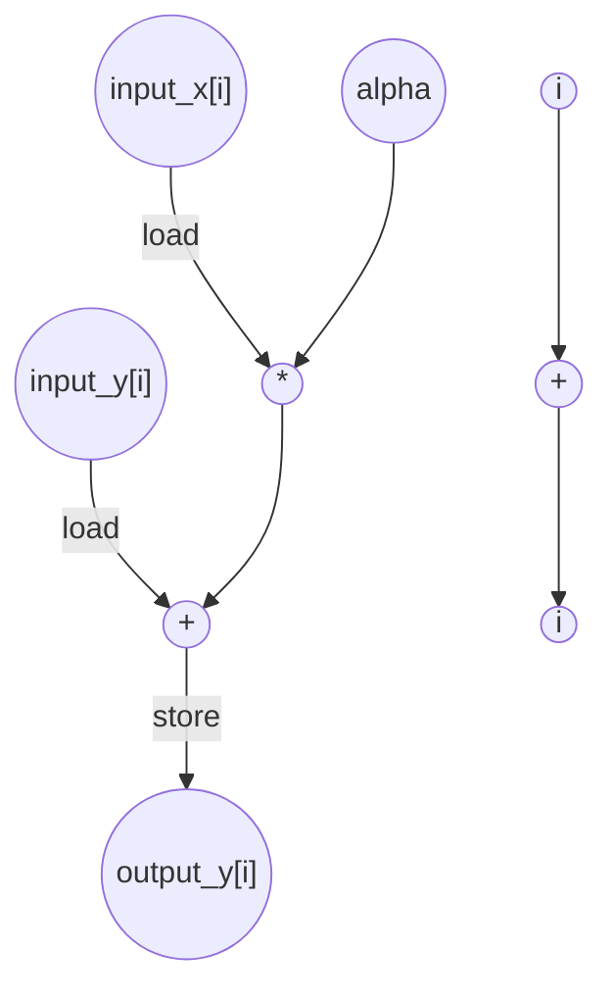

# AXPY Performance
Parameters: `N = 8`, `alpha = 3`

## Cycle + Instruction Count
- Expected cycle count:  
loop cycles = 8 * 1 
**total ≈ 8**
- loads = 16   (2 × 8)
- stores = 8   (1 × N)
- adds = 8
- multiplies = 8

## Data Dependency Graph
