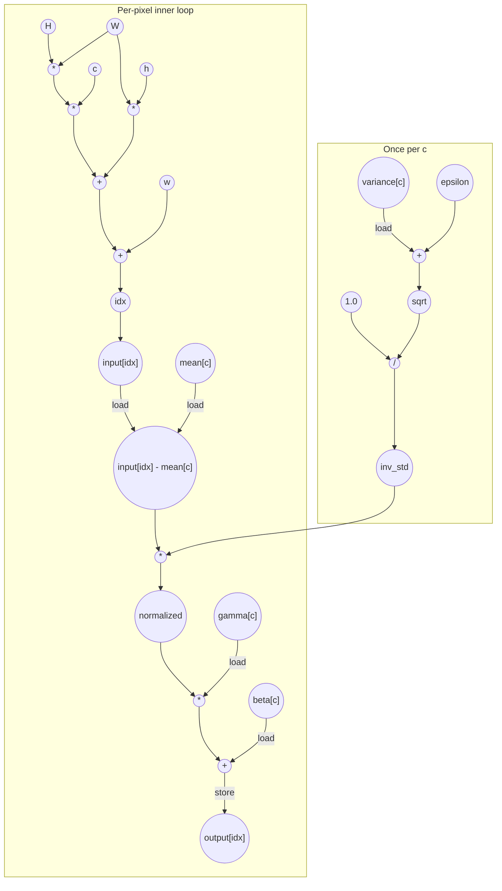

# Batchnorm Performance
Parameters: `C = 4`, `H = 8`, `W = 8`

## Cycle + Instruction Count
- Expected cycle count:
  - `N = C * H * W = 4 * 8 * 8 = 256`
    -  `II = 1` because there is no loop-carried data recurrence in the pixel loop
  - `inner_cycles = N * II = 256`
  - `outer_cycles = C * 3 = 12` for `variance[c] + epsilon`, `sqrtf`, and reciprocal division
  - **total ≈ 268**
- Operation counts:
  - loads = `N` input loads + `4 * C` channel-parameter loads = `256 + 16 = 272`
  - stores = `N` output stores = `256`
  - adds/subtracts = `4 * N` inner adds/subs + `C` variance/epsilon adds = `1024 + 4 = 1028`
  - multiplies = `5 * N = 1280`
  - divides = `C = 4`
  - transcendentals = `sqrt: C = 4`

Index arithmetic is intentionally counted here: per pixel, `idx = c * (H * W) + h * W + w`
contributes 3 multiplies and 2 adds.

## Data Dependency Graph

