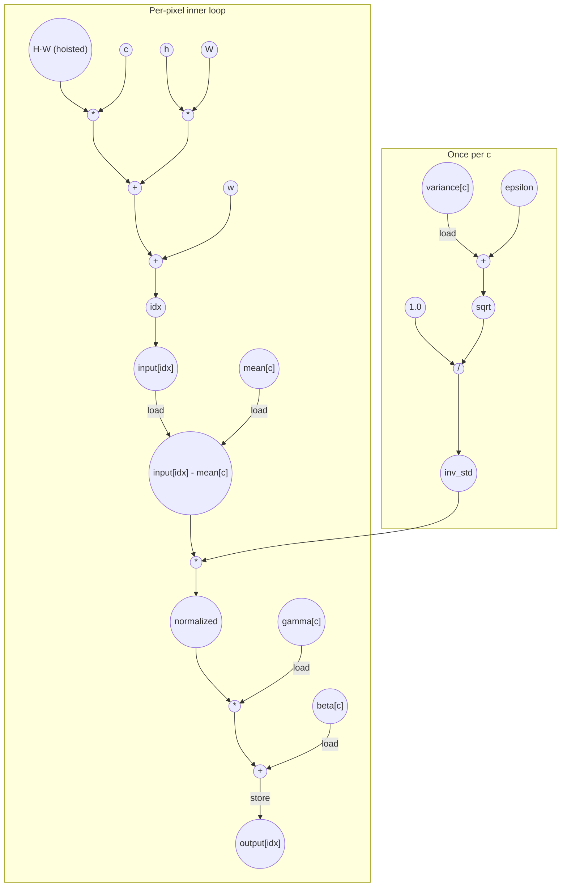

# Batchnorm Performance
Parameters: `C = 4`, `H = 8`, `W = 8` → `N = C·H·W = 256`

## Cycle + Instruction Count

**Loop classification.**
- `c` (trip = `C` = 4): **parallel** — each channel computes its own `inv_std` and writes a distinct slice of `output[]`; no carry through register or memory.
- `h` (trip = `H` = 8): **parallel** — each iter writes a distinct `output[idx]`.
- `w` (trip = `W` = 8): **parallel** — each iter writes a distinct `output[idx]`.

All three dims fully unroll → C·H·W = 256 pixel lanes overlap. `H*W` is loop-invariant and computed once. `inv_std`, `mean[c]`, `gamma[c]`, `beta[c]`, `variance[c]` are invariant across `(h, w)` and hoisted to per-`c` scope (one load each per channel, not per pixel) — same convention as axpy for `alpha`.

**Critical path (`total_cycles = 10`).** Two parallel chains converge at `mult_norm`; the per-pixel index/normalize chain (`… → idx → load(input) → sub → …`) dominates the `inv_std` chain (4 cycles), so it sets the depth. `c`, `h`, `w` are fully-unrolled **parallel** iterators, hence per-lane compile-time constants whose induction reads (`load/incr/store/compare`) are counted overhead off the output-reachable path; the index arithmetic therefore roots on the loop-invariant `H*W` product (a precomputed mul, available at cycle 1), not on an iterator read:
```
1 (H·W hoist available; variance[c], mean[c], gamma[c], beta[c] loads — parallel; c/h/w per-lane constants, induction reads off-path)
+ 1 (mul c·HW; mul h·W; add variance + ε — parallel)
+ 1 (add cHW + hW; sqrt(variance + ε) — parallel)
+ 1 (add + w → idx; div(1.0 / sqrt) → inv_std — parallel)
+ 1 (load input[idx])
+ 1 (sub input − mean)
+ 1 (mul × inv_std → normalized)
+ 1 (mul × gamma)
+ 1 (add + beta)
+ 1 (store output[idx])
= 10
```

Assumes 2-input adders/multipliers. The 3-input sum `c·HW + h·W + w` tree-reduces in `ceil(log2(3)) = 2` add-cycles (its leaf multiplies `c·HW`, `h·W` consume the per-lane constants and the loop-invariant `H*W`/`W`, so they begin at cycle 2 after the `H*W` hoist, never gated on an iterator read). `inv_std` finishes by cycle 4 — well before `mult_norm` needs it at cycle 7 — so the per-channel setup fully overlaps the per-pixel index chain and never extends `total_cycles`. `H*W` is precomputed once before the c loop and treated as available at cycle 1.

**Op counts (N = 256, C = 4).**

| op           | algorithmic | overhead | total |
|--------------|-------------|----------|------:|
| loads        | N (`input[idx]`) + 4·C (`variance/mean/gamma/beta[c]` hoisted per c) = 272 | 292 (`c`, `h`, `w` iter reads) + 4 (`ε`, `C`, `H`, `W` param hoists) = 296 | **568** |
| stores       | N (`output[idx]`) = 256 | 292 (`c`, `h`, `w` iter writes) | **548** |
| adds         | N (sub) + N (`+ β`) + C (`+ ε`) = 516 | 2·N (`cHW + hW`, `+ w` → named scalar `idx`) + 292 (`c++`, `h++`, `w++`) = 804 | **1320** |
| address_adds | 0 | 0 (`input[idx]`, `output[idx]` use the bare precomputed scalar `idx` — no inline arithmetic in the brackets) | **0** |
| muls         | 2·N (`× inv_std`, `× γ`) = 512 | 2·N (`c · HW`, `h · W`) + 1 (`H · W` hoist) = 513 | **1025** |
| divides      | C (`1 / sqrt`) = 4 | 0 | **4** |
| sqrt         | C = 4 | 0 | **4** |
| compares     | 0 | 292 (`c<C`, `h<H`, `w<W`) | **292** |

The named scalar `idx = c·HW + h·W + w` is computed per pixel with `H*W` hoisted to a single mul outside the c loop: per pixel, 2 muls (`c · HW`, `h · W`) and 2 adds (tree-reduced 3-input sum) — these adds count as regular `adds` (named-scalar arithmetic), not `address_adds`. Because `input[idx]` and `output[idx]` subscript with the bare precomputed scalar `idx` (no arithmetic baked inline into the brackets), neither access charges an `address_add`, so `address_adds = 0`. The induction vars `c, h, w` each charge `load + add + store + cmp` per iter, summed across nesting as `C + C·H + C·H·W = 292`. `ε`, `C`, `H`, `W` are scalar params loaded once each.

## Data Dependency Graph
Shown is one of N parallel pixel lanes; the per-channel `inv_std` subgraph runs once per `c` and broadcasts to all H·W pixels of that channel. `H*W` is precomputed once outside the c loop.


## CGRA-Constrained Model

The ASAP bound above assumes unlimited functional units and memory bandwidth. This section adds a second lower bound for a CGRA with **separate** arithmetic and memory-issue resources (no shared or bidirectional memory port):

- `P` — arithmetic PEs, homogeneous, one op/cycle each (divides, compares, **sqrt** and other transcendentals included).
- `L` — load-issue lanes, one load/cycle each.
- `S` — store-issue lanes, one store/cycle each.

Every counted load consumes an `L` slot and every counted store an `S` slot — **including** induction-variable and memory-backed-scalar accesses. Every counted non-load/store op (adds, `address_adds`, multiplies, divides, sqrt, compares, …) consumes a `P` slot. With `CP` the ASAP dependency bound (`total_cycles`), `A` the counted non-load/store ops, `LD` the loads, and `ST` the stores:

```
compute = ceil(A / P)
load    = ceil(LD / L)
store   = ceil(ST / S)
cycles  = max(CP, compute, load, store)
```

**Counts (from the op-count totals above, N = 256, C = 4).**
- `CP = 10`
- `A  = adds (1320) + address_adds (0) + muls (1025) + divides (4) + sqrt (4) + compares (292) = 2645`
- `LD = 568`
- `ST = 548`

**6×6 example (`P = 36`, `L = 12`, `S = 12`).**
```
compute = ceil(2645 / 36) = 74
load    = ceil(568 / 12)  = 48
store   = ceil(548 / 12)  = 46
cycles  = max(10, 74, 48, 46) = 74
```

**Bottleneck: compute-bound.** The 256 fully-unrolled pixel lanes expose ~2.6k homogeneous ops but only 36 PEs to run them, so `compute = 74` dominates — a 7.4× stretch over the ASAP depth of 10. The arithmetic mix (1.3k adds, ~1k muls) outweighs memory traffic, so memory lanes (48 load / 46 store) sit below the compute bound. Adding PEs lowers `cycles` until `P ≈ 2645/48 ≈ 55`, where the load lanes would become the next bottleneck.

<!-- BEGIN CGRA-SCHED:batchnorm -->
### Finite-Resource Schedule Estimate (time-local)

*Reproducible estimate for the deterministic criticality-priority list-schedule policy defined in [`docs/spec-kernel-performance.md`](../../../docs/spec-kernel-performance.md). It is **not** a lower bound (the aggregate model above is the lower bound) and **not** cycle-accurate RTL; it exposes the short windows of local `P`/`L`/`S` pressure that the aggregate model smooths over.*

**Resource configuration:** `P = 36`, `L = 12`, `S = 12` (`6x6`).

| region | CP | A | LD | ST | aggregate | scheduled (makespan) |
|--------|---:|--:|---:|---:|----------:|---------------------:|
| batchnorm | 10 | 2645 | 568 | 548 | 74 | 98 |

- **scheduled_cycles** = 98  (sum of ordered-region makespans)
- **aggregate_cycles** = 74  (the lower bound above, unchanged)
- **gap_cycles** = 24  (scheduled − aggregate)
- **gap_ratio** = 1.3243  (scheduled / aggregate)

**Local `P`/`L`/`S` pressure** (saturated cycles / longest saturated run / peak ready backlog):
- `P`: 73 / 73 / 769
- `L`: 47 / 47 / 300
- `S`: 45 / 45 / 356

<!-- END CGRA-SCHED:batchnorm -->
