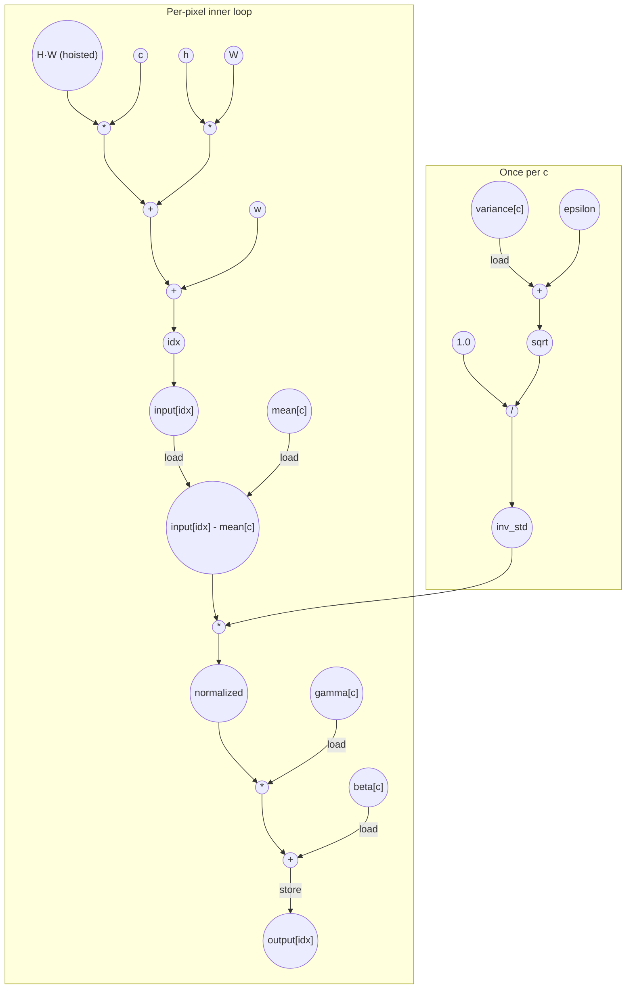

# Batchnorm Performance
Parameters: `C = 4`, `H = 8`, `W = 8` → `N = C·H·W = 256`

## Cycle + Instruction Count

**Loop classification.**
- `c` (trip = `C` = 4): **parallel** — each channel computes its own `inv_std` and writes a distinct slice of `output[]`; no carry through register or memory.
- `h` (trip = `H` = 8): **parallel** — each iter writes a distinct `output[idx]`.
- `w` (trip = `W` = 8): **parallel** — each iter writes a distinct `output[idx]`.

All three dims fully unroll → C·H·W = 256 pixel lanes overlap. `H*W` is loop-invariant and computed once. `inv_std`, `mean[c]`, `gamma[c]`, `beta[c]`, `variance[c]` are invariant across `(h, w)` and hoisted to per-`c` scope (one load each per channel, not per pixel) — same convention as axpy for `alpha`.

**Critical path (`total_cycles = 10`).** Two parallel chains converge at `mult_norm`; the `idx → load(input) → sub` chain (6 cycles) dominates the `inv_std` chain (4 cycles), so it sets the depth:
```
1 (loads: c, h, w, variance[c], mean[c], gamma[c], beta[c] - parallel)
+ 1 (mul c·HW; mul h·W; add variance + ε — parallel)
+ 1 (add cHW + hW; sqrt(variance + ε) — parallel)
+ 1 (add + w → idx; div(1.0 / sqrt) → inv_std — parallel)
+ 1 (load input[idx])
+ 1 (sub input − mean)
+ 1 (mul × inv_std → normalized)
+ 1 (mul × gamma)
+ 1 (add + beta)
+ 1 (store output[idx])
= 10
```

Assumes 2-input adders/multipliers. The 3-input sum `c·HW + h·W + w` tree-reduces in `ceil(log2(3)) = 2` add-cycles. `inv_std` finishes by cycle 4 — well before `mult_norm` needs it at cycle 7 — so the per-channel setup fully overlaps the per-pixel address chain and never extends `total_cycles`. `H*W` is precomputed once before the c loop and treated as available at cycle 1.

**Op counts (N = 256, C = 4).**

| op       | algorithmic | overhead | total |
|----------|-------------|----------|------:|
| loads    | N (`input[idx]`) + 4·C (`variance/mean/gamma/beta[c]` hoisted per c) = 272 | 292 (`c`, `h`, `w` iter reads) + 4 (`ε`, `C`, `H`, `W` param hoists) = 296 | **568** |
| stores   | N (`output[idx]`) = 256 | 292 (`c`, `h`, `w` iter writes) | **548** |
| adds     | N (sub) + N (`+ β`) + C (`+ ε`) = 516 | 2·N (`cHW + hW`, `+ w`) + 292 (`c++`, `h++`, `w++`) = 804 | **1320** |
| muls     | 2·N (`× inv_std`, `× γ`) = 512 | 2·N (`c · HW`, `h · W`) + 1 (`H · W` hoist) = 513 | **1025** |
| divides  | C (`1 / sqrt`) = 4 | 0 | **4** |
| sqrt     | C = 4 | 0 | **4** |
| compares | 0 | 292 (`c<C`, `h<H`, `w<W`) | **292** |

Address arithmetic for `idx = c·HW + h·W + w` is counted with `H*W` hoisted to a single mul outside the c loop: per pixel, 2 muls (`c · HW`, `h · W`) and 2 adds (tree-reduced 3-input sum). The induction vars `c, h, w` each charge `load + add + store + cmp` per iter, summed across nesting as `C + C·H + C·H·W = 292`. `ε`, `C`, `H`, `W` are scalar params loaded once each.

## Data Dependency Graph
Shown is one of N parallel pixel lanes; the per-channel `inv_std` subgraph runs once per `c` and broadcasts to all H·W pixels of that channel. `H*W` is precomputed once outside the c loop.

