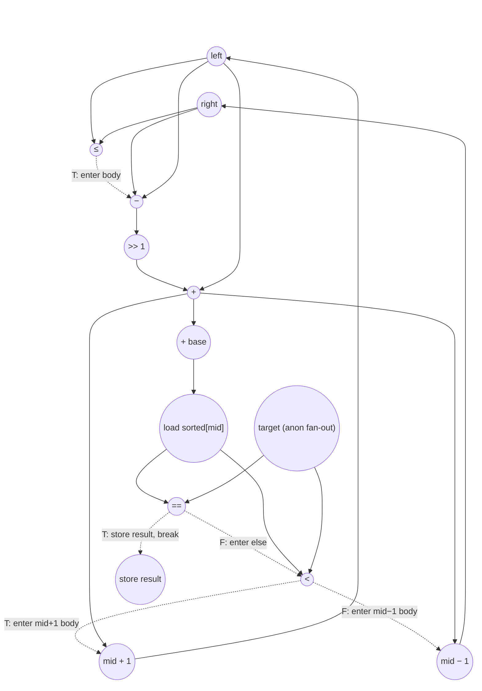

# Binary Search Performance
Parameters: `N = 10`, `M = 5`.
- `float input_sorted[N] = {1.0f, 3.0f, 5.0f, 7.0f, 9.0f, 11.0f, 13.0f, 15.0f, 17.0f, 19.0f};`
- `float input_targets[M] = {7.0f, 2.0f, 15.0f, 20.0f, 1.0f};`
- Counts below assume the input parameters above.

## Loop classification

| dim   | trip_count | kind | II | notes |
|-------|------------|------|----|-------|
| `t`   | `M` = 5    | parallel | n/a | each outer iter privatizes `target`, `left`, `right`, `result` and writes a distinct `output_indices[t]`; `input_sorted` is read-only. Fully unrolled. |
| inner `while` | data-dependent | sequential (data-dep termination) | 11 | carries `left`, `right` (and `result` on break) via scalar. Trip count is input-dependent; for the given inputs the per-target trips are `{4, 3, 2, 4, 3}` (worst-case bound `⌈log2(N+1)⌉ = 4`). Under no-predication, the per-iter critical path includes three compare→body gaps: the `while` bound check `left ≤ right` gates the body's first op; `cmp_eq` gates the else branch's `cmp_lt`; `cmp_lt` gates the update arithmetic and its store. |

Per-target trips for these inputs:

| t | target | trip | exit |
|---|--------|------|------|
| 0 | 7   | 4 | break on cmp_eq at iter 4 |
| 1 | 2   | 3 | bound check fails after iter 3 |
| 2 | 15  | 2 | break on cmp_eq at iter 2 |
| 3 | 20  | 4 | bound check fails after iter 4 |
| 4 | 1   | 3 | break on cmp_eq at iter 3 |

Σ body iters = 16; Σ bound-check evaluations = 18 (16 passing + 2 failing — the 3 break exits skip the next check).

## Critical path (`total_cycles`)

Per inner-iter recurrence (II = 11 cycles for non-break iters), the carry chain from `left/right` loaded at iter `k` to `left/right` stored at iter `k`:
```
1  (load left ‖ load right)
+ 1  (cmp left ≤ right)                          [while-bound check]
+ 1  (sub right − left)                           [body fires after cmp_le]
+ 1  (shift >> 1)
+ 1  (add → mid)
+ 1  (addr-gen for &input_sorted[mid])
+ 1  (load input_sorted[mid])
+ 1  (cmp_eq sorted[mid] == target)               [break check]
+ 1  (cmp_lt sorted[mid] < target)                [inside else of cmp_eq]
+ 1  (add mid+1 OR sub mid−1)                     [inside else-if cmp_lt]
+ 1  (store new left or right)
= 11
```
Under no-predication, three compare→body gaps stretch the body beyond its raw dataflow depth: (a) `sub right−left` cannot fire in parallel with `cmp_le` because it lives inside the `while` body — it waits for `cmp_le` to retire; (b) `cmp_lt` is inside the `else` of `if (cmp_eq)`, so it waits for `cmp_eq`; (c) the update arithmetic (`mid + 1` or `mid − 1`) sits inside the `else if (cmp_lt)` body and waits for `cmp_lt`, with the store one cycle further. Only one of `add` / `sub` actually fires per iter (the taken branch); the other is not counted.

For a **break iter** (cmp_eq = TRUE), the chain terminates earlier: `... → cmp_eq → store result` = 9 cycles, since the break exits without firing `cmp_lt` or the update arithmetic.

**Per-outer-t prologue** (before entering the while):
- Critical chain: `load N → sub N−1 → store right` (3 cycles) — feeds iter 1's `load right`. The `static_cast<int32_t>(N)` is free under our convention (casts aren't in the counted op set). No `if` in the prologue, so strict no-pred adds no gaps here.
- Parallel chains: `load input_targets[t]` (the value flows directly to the inner cmps — `target` is single-decl and not loop-carried, so it is anonymous dataflow with no store and no per-use load), `store left = 0`, `store result = −1`. Constants `0` and `−1` need no load; the stores to `left` and `result` (memory-backed: multi-assignment + loop-carried) still cost 1 cycle each, but they overlap the critical chain.

`t` is parallel → fully unrolled → `total_cycles` is the max over the 5 outer instances. For each instance with trip `K`:
```
per-target depth (break exit)     = 3 (prologue) + 11·(K−1) + 9 (break iter) + 3 (post-loop)
                                  = 11·K + 4
per-target depth (non-break exit) = 3 (prologue) + 11·K + 2 (failing cmp_le) + 3 (post-loop)
                                  = 11·K + 8
```
The post-loop ternary `(result == −1) ? 0xFFFFFFFF : (uint32_t)result` takes 3 cycles: `load result → cmp → store output_indices[t]`. Under strict no-pred, the store waits for the cmp to resolve; both arms' values are free (a constant and an already-loaded scalar with a free cast), so the arms add no compute cycles.

Per-target depths for these inputs:

| t | target | trip | exit | depth |
|---|--------|------|------|------:|
| 0 | 7   | 4 | break | 11·4 + 4 = **48** |
| 1 | 2   | 3 | non-break | 11·3 + 8 = **41** |
| 2 | 15  | 2 | break | 11·2 + 4 = **26** |
| 3 | 20  | 4 | non-break | 11·4 + 8 = **52** |
| 4 | 1   | 3 | break | 11·3 + 4 = **37** |

Under `t` parallel-unroll, `total_cycles = max = 52` (t=3, target=20, non-break exit with `K = 4`). Note that the max-cycles target isn't necessarily the max-trip target — when trips tie, a non-break exit beats a break exit by the cost of the final failing bound check plus the savings from the break iter's shorter (9-cycle) tail.

## Op counts

### Algorithmic
| op       | count | source |
|----------|-------|--------|
| loads    | 21    | `input_sorted[mid]` (16) + `input_targets[t]` (5) |
| stores   | 5     | `output_indices[t]` |
| adds     | 8     | inner `left = mid + 1` (cmp_lt = T paths, 8 occurrences) |
| subs     | 21    | inner `right − left` (16) + inner `right = mid − 1` (cmp_lt = F paths, 5 occurrences) |
| shifts   | 16    | `>> 1` per while loop body |
| compares | 47    | bound check `left ≤ right` (18) + `sorted[mid] == target` (16) + `sorted[mid] < target` (13 — skipped on the 3 break iters) |

### Overhead (named scalars, induction, address-gen, param hoists)
| op           | count | source |
|--------------|-------|--------|
| loads        | 48    | carried `left` (18, 1 per inner iter incl bound-check-fail) + carried `right` (18) + scalar `result` (5, post-loop read) + iter `t` (5) + param hoists `N`, `M` (2). `target` is anonymous (single-decl, not loop-carried) — no overhead L charged; the boundary load of `input_targets[t]` is already counted under algorithmic loads. `mid` is likewise anonymous and free. |
| stores       | 36    | scalar `left` (5 init + 8 body updates = 13) + scalar `right` (5 init + 5 body updates = 10) + scalar `result` (5 init + 3 break stores = 8) + iter `t` (5). `target` is anonymous — no store. |
| adds         | 21    | inner `mid = left + (right−left)/2` outer add (16, named scalar) + outer `t++` (5) |
| address_adds | 26    | `&sorted[mid]` (16) + `&input_targets[t]` (5) + `&output_indices[t]` (5) — 1 per `[]` access, incremental-stride |
| subs         | 1     | `N − 1` (hoisted outside outer t since `N` is loop-invariant) |
| compares     | 10    | outer `result == −1` (5) + outer `t < M` (5) |

### Totals
| op           | total |
|--------------|------:|
| loads        | **69** |
| stores       | **41** |
| adds         | **29** |
| address_adds | **26** |
| subs         | **22** |
| shifts       | **16** |
| compares     | **57** |
| muls / divs / transcendentals | 0 |

## Data Dependency Graph
Per-body (one inner iter of `while (left <= right)`. Under `t` parallel-unroll, 5 such graphs run concurrently, one per target. The recurrence closes back via `store left → load left` (or `store right → load right`) at the next iter.


