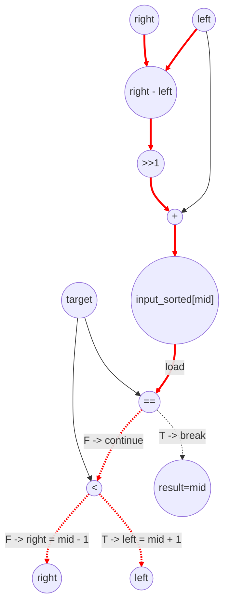

# Binary Search Performance
Parameters: `N = 10`, `M = 5`  
- `float input_sorted[N] = {1.0f, 3.0f, 5.0f, 7.0f, 9.0f, 11.0f, 13.0f, 15.0f, 17.0f, 19.0f};`  
- `float input_targets[M] = {7.0f, 2.0f, 15.0f, 20.0f, 1.0f};`
- Cycle counts and instruction counts below assume above input parameters

## Cycle + Instruction Count
- Critical Path (7 cycles). Ex. `right - left` -> `>> 1` -> `+` -> `load` -> `==` -> `<` -> `right` or `left`
    - Not this critical path assumes that cmp_eq and cmp_lt do not fire in parallel. If they did, the critical path would actually be 6 cycles.
- Expected cycle count:  
loop cycles = 7 * (4 + 2 + 3 + 4 + 3)  
**total ≈ 112**
- loads = 16 inner + 5 outer = 21
- stores = 0 inner + 5 outer = 10
- adds/subs = (16 * 4) inner + 0 outer = 64
- shifts = (16 * 1) inner + 0 outer = 16
- compare = (2 * 16) inner + 23 outer = 55
    - 18 outer comparisons for while (left <= right)
    - 5 outer comparisons for (result == -1)

## Data Dependency Graph (inner while loop)
