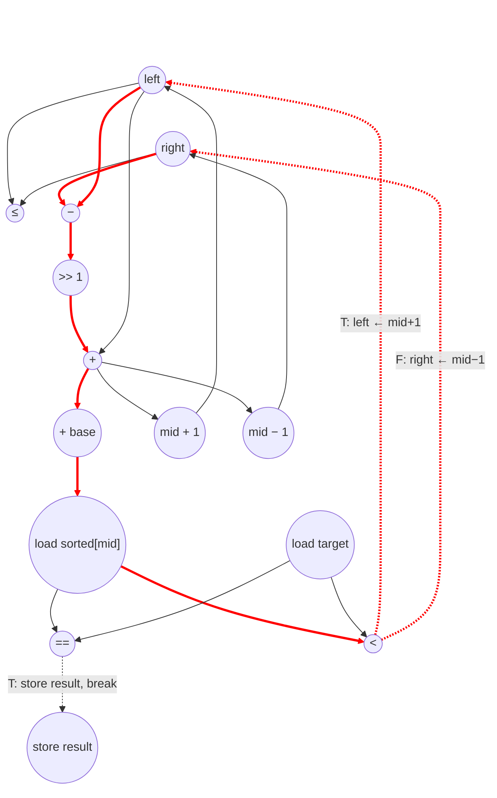

# Binary Search Performance
Parameters: `N = 10`, `M = 5`.
- `float input_sorted[N] = {1.0f, 3.0f, 5.0f, 7.0f, 9.0f, 11.0f, 13.0f, 15.0f, 17.0f, 19.0f};`
- `float input_targets[M] = {7.0f, 2.0f, 15.0f, 20.0f, 1.0f};`
- Counts below assume the input parameters above.

## Loop classification

| dim   | trip_count | kind | II | notes |
|-------|------------|------|----|-------|
| `t`   | `M` = 5    | parallel | n/a | each outer iter privatizes `target`, `left`, `right`, `result` and writes a distinct `output_indices[t]`; `input_sorted` is read-only. Fully unrolled. |
| inner `while` | data-dependent | sequential (data-dep termination) | 8 | carries `left`, `right` (and `result` on break) via scalar. Trip count is input-dependent; for the given inputs the per-target trips are `{4, 3, 2, 4, 3}` (worst-case bound `⌈log2(N+1)⌉ = 4`). The termination compare `left ≤ right` sits on the critical path of the exit path. |

Per-target trips for these inputs:

| t | target | trip | exit |
|---|--------|------|------|
| 0 | 7   | 4 | break on cmp_eq at iter 4 |
| 1 | 2   | 3 | bound check fails after iter 3 |
| 2 | 15  | 2 | break on cmp_eq at iter 2 |
| 3 | 20  | 4 | bound check fails after iter 4 |
| 4 | 1   | 3 | break on cmp_eq at iter 3 |

Σ body iters = 16; Σ bound-check evaluations = 18 (16 passing + 2 failing — the 3 break exits skip the next check).

## Critical path (`total_cycles`)

Per inner-iter recurrence (II = 8 cycles), the carry chain from `left/right` loaded at iter `k` to `left/right` stored at iter `k`:
```
1 (load left ‖ load right)
+ 1 (sub right − left   ‖ cmp left ≤ right)
+ 1 (shift >> 1)
+ 1 (add → mid)
+ 1 (addr-gen for &input_sorted[mid])
+ 1 (load input_sorted[mid])
+ 1 (cmp_eq ‖ cmp_lt, in parallel under unbounded fan-out)
+ 1 (store new left or right, gated by cmp_lt select)
= 8
```
`cmp_eq` and `cmp_lt` depend on the same operands (`sorted[mid]`, `target`) and fire in the same cycle. The update arithmetic (`mid + 1`, `mid − 1`) only needs `mid` so it slides earlier and is ready by the time cmps complete; the store is gated by cmp_lt selecting which value to commit. The bound check at cycle 2 runs parallel to `sub` and never extends the body depth — but its result decides whether the next iter fires.

**Per-outer-t prologue** (before entering the while):
- Critical chain: `load N → sub N−1 → store right` (3 cycles) — feeds iter 1's `load right`. The `static_cast<int32_t>(N)` is free under our convention (casts aren't in the counted op set).
- Parallel chains: `load input_targets[t] → store target`, `store left = 0`, `store result = −1`. Constants `0` and `−1` need no load; the stores themselves still cost 1 cycle each per Convention 6 (named-write rule), but they overlap the critical chain.

`t` is parallel → fully unrolled → `total_cycles` is the max over the 5 outer instances. For each instance with trip `K`:
```
per-target depth = setup + 8·K + (2 if non-break exit else 0) + post-loop
                 = 3 (load N → sub N−1 → store right)
                 + 8·K
                 + 2 (extra failing cmp_le on non-break paths only)
                 + 3 (load result → cmp == −1 → store output_indices[t])
```
The longest non-break path with `K = 4` (t=3, target=20) gives `3 + 32 + 2 + 3 = 40`. The break path with `K = 4` (t=0, target=7) gives `3 + 32 + 0 + 3 = 38`. Under `t` parallel-unroll, `total_cycles = max = 40`. Note that the max-cycles target isn't necessarily the max-trip target — when trips tie, a non-break exit beats a break exit by the cost of the final failing bound check.

For comparison, the prior serial-model bound was `7 × 16 = 112` cycles.

**Note on the `mid ± 1` calculation (not definitive):** Both `mid + 1` and `mid − 1` depend only on `mid` (ready at cycle 4), so they can fire in parallel with the addr-gen / load / cmps; the cycle-8 store is then a free select gated by `cmp_lt`. This is what makes II = 8 instead of 9. The op count below uses the **source-level dynamic** interpretation (count only the branch actually taken per iter), giving 8 adds + 5 subs for updates. A speculative interpretation (both branches always fire) would double-count to 13+13 = 26 update ops; the critical-path number is unaffected either way.

## Op counts

### Algorithmic
| op       | count | source |
|----------|-------|--------|
| loads    | 21    | `input_sorted[mid]` (16) + `input_targets[t]` (5) |
| stores   | 5     | `output_indices[t]` |
| adds     | 8     | inner `left = mid + 1` (cmp_lt = T paths, 8 occurrences) |
| subs     | 21    | inner `right − left` (16) + inner `right = mid − 1` (cmp_lt = F paths, 5 occurrences) |
| shifts   | 16    | `>> 1` per while loop body |
| compares | 47    | bound check `left ≤ right` (18) + `sorted[mid] == target` (16) + `sorted[mid] < target` (13 — skipped on the 3 break iters) |

### Overhead (named scalars, induction, address-gen, param hoists)
| op       | count | source |
|----------|-------|--------|
| loads    | 53    | scalar `target` (5, hoisted per outer t and fanned to both cmps) + carried `left` (18, 1 per inner iter incl bound-check-fail) + carried `right` (18) + scalar `result` (5, post-loop read) + iter `t` (5) + param hoists `N`, `M` (2) |
| stores   | 41    | scalar `target` (5) + scalar `left` (5 init + 8 body updates = 13) + scalar `right` (5 init + 5 body updates = 10) + scalar `result` (5 init + 3 break stores = 8) + iter `t` (5) |
| adds     | 47    | inner `mid = left + (right−left)/2` outer add (16) + inner addr-gen `&sorted[mid]` (16) + outer addr-gen `&input_targets[t]` (5) + outer addr-gen `&output_indices[t]` (5) + outer `t++` (5) |
| subs     | 1     | `N − 1` (hoisted outside outer t since `N` is loop-invariant) |
| compares | 10    | outer `result == −1` (5) + outer `t < M` (5) |

### Totals
| op       | total |
|----------|------:|
| loads    | **74** |
| stores   | **46** |
| adds     | **55** |
| subs     | **22** |
| shifts   | **16** |
| compares | **57** |
| muls / divs / transcendentals | 0 |

## Data Dependency Graph
Per-body (one inner iter of `while (left <= right)`. Under `t` parallel-unroll, 5 such graphs run concurrently, one per target. The recurrence closes back via `store left → load left` (or `store right → load right`) at the next iter.



## Delta vs. prior (serial-model) eval
| metric        | old (serial) | new (ASAP) | reason |
|---------------|--------------|------------|--------|
| total_cycles  | 112          | **40**     | outer `t` is parallel (5× unroll → max over instances); the 4× max-trip inner loop now dominates, plus setup/exit/post-loop overhead. |
| loads         | 21           | **74**     | now charges carry-scalar reads (`left`, `right` per inner iter), hoisted scalar reads (`target`, `result`), iter reads (`t`), and param hoists under the uniform 1-cycle L/S rule. |
| stores        | 10           | **46**     | now charges init stores (`target`, `left`, `right`, `result` per outer t), iter writes (`t`), and body update stores. |
| adds + subs   | 64           | **77**     | adds now include address-gen (16 inner + 10 outer) and `t++` (5); inner update is correctly split between add (`mid+1` × 8) and sub (`mid−1` × 5). |
| shifts        | 16           | 16         | unchanged. |
| compares      | 55           | **57**     | added outer `t < M` (5); inner `cmp_lt` correctly drops to 13 since the 3 break iters skip it; bound check (18) and `result == −1` (5) preserved. |
