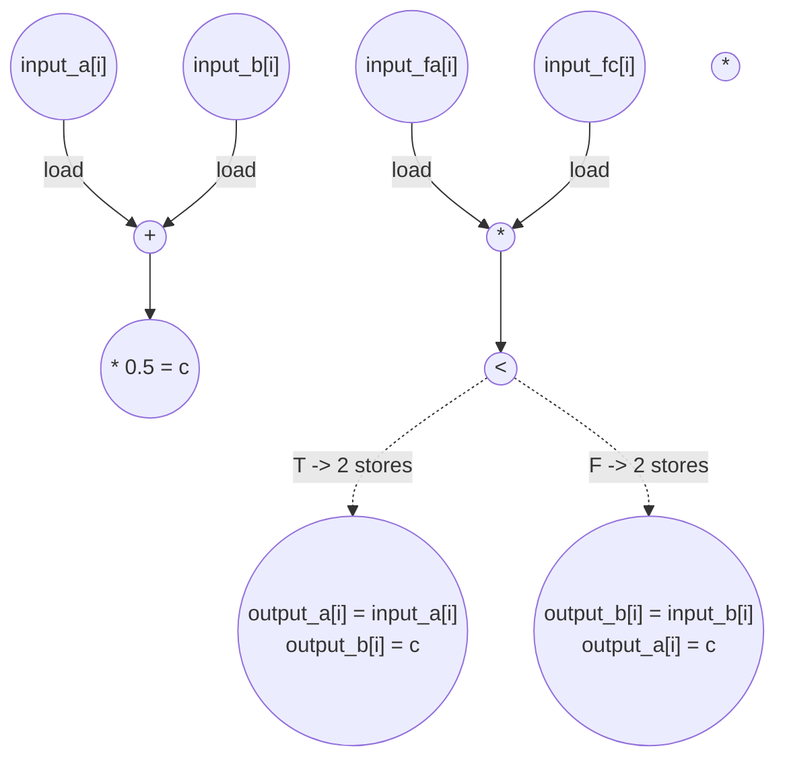

# Bisection Step Performance
Parameters: `N = 64`

## Cycle + Instruction Count
- Expected cycle count:  
loop cycles = 64 * 1  
**total ≈ 64**
- loads = 256   (4 × 64)
- stores = 128   (2 × 64)
- adds = 64
- multiplies = 128   (2 × 64)
- compares = 64

## Data Dependency Graph
