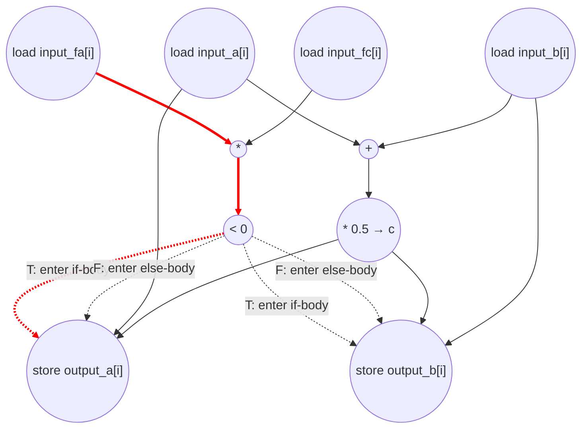

# Bisection Step Performance
Parameters: `N = 64`.
- `float input_a[N]`, `float input_b[N]`, `float input_fa[N]`, `float input_fc[N]` — kernel inputs.
- `float output_a[N]`, `float output_b[N]` — kernel outputs.
- Counts below assume `N = 64`.

## Loop classification

| dim | trip_count | kind | II | notes |
|-----|------------|------|----|-------|
| `i` | `N` = 64   | parallel | n/a | Each iter reads four distinct input elements and writes to two distinct output elements `output_a[i]`, `output_b[i]`; no carried scalar, no aliasing across iters. `c` is a transient per-iter intermediate. Fully unrolled. Under no-predication, the `if (fa*fc < 0)` compare gates every op inside the if/else body — including the output stores — so the body fires no earlier than the cycle after the compare retires. All array subscripts are bare `[i]` (no inline arithmetic), so no address-add or address-gen cycle is charged for any access. |

## Critical path (`total_cycles`)

Under parallel-unroll of `i`, the body is straight-line and `total_cycles` is just the per-iter critical-path depth (identical across the 64 instances). `c = (a+b)*0.5` and the compare `fa*fc < 0` both sit *before* the `if` in source order, so they fire unconditionally; the output stores sit *inside* the if/else body and wait for the compare under strict no-pred. All subscripts are bare `[i]`, so no address-gen cycle is charged for any access:

```
1 (load input_a[i] ‖ input_b[i] ‖ input_fa[i] ‖ input_fc[i])
+ 1 (add a+b ‖ mul fa*fc)
+ 1 (mul (a+b)*0.5 → c ‖ cmp fa*fc < 0)                    [cmp retires at end of cycle]
+ 1 (store output_a[i] ‖ store output_b[i])                 [inside if/else body — waits for cmp]
= 4
```

The two compute chains — `(a+b) * 0.5` and `(fa * fc) < 0` — have the same depth (two ops after the loads), so neither dominates and both retire together at the end of cycle 3. Under no-predication, the if/else body cannot begin before the compare retires: the two conditional stores (`output_a[i] = ...` / `output_b[i] = ...`) sit inside the if/else and slip to cycle 4. Only the taken arm's value commits: the `cmp = T` branch writes `(input_a[i], c)`, the `cmp = F` branch writes `(c, input_b[i])`. Both arms touch the same two output addresses, so the store count is the same either way. The induction-var load `i` and store `i` are counted as ops but do not lie on the critical path: each unrolled instance treats `i` as a per-instance constant, and the bare `[i]` array accesses charge no address arithmetic, so the loads have no runtime parent and execute in parallel with the (free) iter read.

## Op counts

### Algorithmic
| op       | count | source |
|----------|-------|--------|
| loads    | 256   | `input_a[i]`, `input_b[i]`, `input_fa[i]`, `input_fc[i]` (4 per iter × 64). Each name is loaded once per iter and fanned to all consumers (e.g. `input_a[i]` feeds both `a+b` and the if-branch store of `output_a[i]`). |
| stores   | 128   | `output_a[i]`, `output_b[i]` (2 per iter × 64) |
| adds     | 64    | `input_a[i] + input_b[i]` per iter |
| muls     | 128   | `(a+b) * 0.5` (64) + `input_fa[i] * input_fc[i]` (64) |
| compares | 64    | `fa*fc < 0` per iter |

### Overhead (address-gen, induction, param hoist)
| op           | count | source |
|--------------|-------|--------|
| loads        | 65    | iter `i` (64 per-iter reads) + param `N` (1 hoisted, loop-invariant) |
| stores       | 64    | iter `i` (64 per-iter writes after `i++`) |
| adds         | 64    | iter `i++` (64) |
| address_adds | 0     | all 6 array accesses use bare `[i]` subscripts (no inline arithmetic in the brackets), so no address-add is charged for any access |
| compares     | 64    | iter bound check `i < N` |

The local `c = (a+b) * 0.5f` is a per-iter dataflow value with no carry across iterations; it's treated as a **transient (anonymous-equivalent) intermediate** and isn't separately charged a named load/store. `c` does lie on the critical path through `add → mul → store`, so the cycle accounting is unaffected by this choice.

### Totals
| op           | total |
|--------------|------:|
| loads        | **321** |
| stores       | **192** |
| adds         | **128** |
| address_adds | **0** |
| muls         | **128** |
| compares     | **128** |
| divs / subs / shifts / transcendentals | 0 |

## Data Dependency Graph
Per-iter body of the parallel-unrolled `i` loop. Under `i` parallel-unroll, 64 such graphs run concurrently with no edges between them. Under no-predication, the `cmp_lt` compare gates the stores inside the if/else body — shown as dotted "gate" edges. All subscripts are bare `[i]`, so no address-gen nodes appear. Red edges mark the critical-path chain through `load_fa/fc → mul_p → cmp_lt → [gate] → store`.



## CGRA-Constrained Model

The ASAP bound above assumes unlimited functional units and memory bandwidth. This section adds a second lower bound for a CGRA with **separate** arithmetic and memory-issue resources (no shared or bidirectional memory port):

- `P` — arithmetic PEs, homogeneous, one op/cycle each (divides, compares, bitops, transcendentals included).
- `L` — load-issue lanes, one load/cycle each.
- `S` — store-issue lanes, one store/cycle each.

Every counted load consumes an `L` slot and every counted store an `S` slot — **including** induction-variable and memory-backed-scalar accesses. Every counted non-load/store op (adds, `address_adds`, multiplies, compares, …) consumes a `P` slot. The op counts already reflect strict no-predication (only the taken arm of `if (fa*fc<0)` is counted), so the resource bound inherits that. With `CP` the ASAP dependency bound (`total_cycles`), `A` the counted non-load/store ops, `LD` the loads, and `ST` the stores:

```
compute = ceil(A / P)
load    = ceil(LD / L)
store   = ceil(ST / S)
cycles  = max(CP, compute, load, store)
```

**Counts (from the op-count totals above, N = 64).**
- `CP = 4`
- `A  = adds (128) + address_adds (0) + muls (128) + compares (128) = 384`
- `LD = 321`
- `ST = 192`

**6×6 example (`P = 36`, `L = 12`, `S = 12`).**
```
compute = ceil(384 / 36) = 11
load    = ceil(321 / 12) = 27
store   = ceil(192 / 12) = 16
cycles  = max(4, 11, 27, 16) = 27
```

**Bottleneck: load-bound.** Each of the 64 parallel lanes issues four input loads plus an induction read, so `LD = 321` dominates: with only 12 load lanes, `load = 27` sets the floor — far above the 4-cycle ASAP chain and above both `compute = 11` and `store = 16`. The 4-loads-to-2-stores asymmetry of the kernel is what makes loads, not stores, the binding memory resource.
