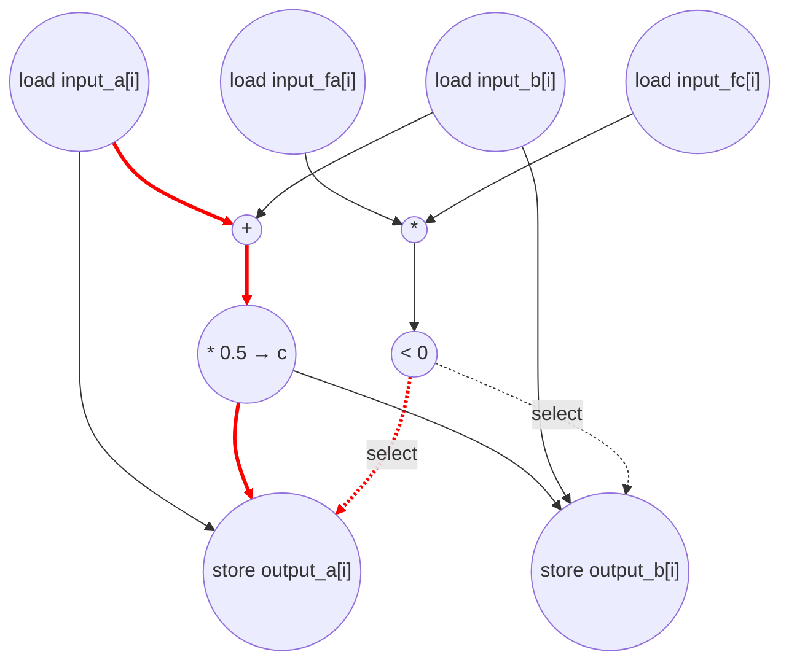

# Bisection Step Performance
Parameters: `N = 64`.
- `float input_a[N]`, `float input_b[N]`, `float input_fa[N]`, `float input_fc[N]` — kernel inputs.
- `float output_a[N]`, `float output_b[N]` — kernel outputs.
- Counts below assume `N = 64`.

## Loop classification

| dim | trip_count | kind | II | notes |
|-----|------------|------|----|-------|
| `i` | `N` = 64   | parallel | n/a | Each iter reads four distinct input elements and writes to two distinct output elements `output_a[i]`, `output_b[i]`; no carried scalar, no aliasing across iters. `c` is a transient per-iter intermediate. Fully unrolled. |

## Critical path (`total_cycles`)

Under parallel-unroll of `i`, the body is straight-line and `total_cycles` is just the per-iter critical-path depth (identical across the 64 instances):

```
1 (addr-gen for &input_a[i] ‖ &input_b[i] ‖ &input_fa[i] ‖ &input_fc[i] ‖ &output_a[i] ‖ &output_b[i])
+ 1 (load input_a[i] ‖ input_b[i] ‖ input_fa[i] ‖ input_fc[i])
+ 1 (add a+b ‖ mul fa*fc)
+ 1 (mul (a+b)*0.5 → c ‖ cmp fa*fc < 0)
+ 1 (store output_a[i] ‖ output_b[i], gated by cmp select)
= 5
```

The two compute chains — `(a+b) * 0.5` and `(fa * fc) < 0` — have the same depth (two ops after the loads), so neither dominates. With unbounded fan-out, all four input loads fire in cycle 2, and the two output stores fire in cycle 5 with the compare gating which value commits (`input_a[i]` vs `c` for `output_a`; `c` vs `input_b[i]` for `output_b`). The induction-var load `i` and store `i` are counted as ops but do not lie on the critical path: each unrolled instance treats `i` as a per-instance constant, so the cycle-1 addr-gens for the array accesses have no runtime parent and execute in parallel with the (free) iter read.

## Op counts

### Algorithmic
| op       | count | source |
|----------|-------|--------|
| loads    | 256   | `input_a[i]`, `input_b[i]`, `input_fa[i]`, `input_fc[i]` (4 per iter × 64). Each name is loaded once per iter and fanned to all consumers (e.g. `input_a[i]` feeds both `a+b` and the if-branch store of `output_a[i]`). |
| stores   | 128   | `output_a[i]`, `output_b[i]` (2 per iter × 64) |
| adds     | 64    | `input_a[i] + input_b[i]` per iter |
| muls     | 128   | `(a+b) * 0.5` (64) + `input_fa[i] * input_fc[i]` (64) |
| compares | 64    | `fa*fc < 0` per iter |

### Overhead (address-gen, induction, param hoist)
| op           | count | source |
|--------------|-------|--------|
| loads        | 65    | iter `i` (64 per-iter reads) + param `N` (1 hoisted, loop-invariant) |
| stores       | 64    | iter `i` (64 per-iter writes after `i++`) |
| adds         | 64    | iter `i++` (64) |
| address_adds | 384   | addr-gen for 6 array accesses per iter (`input_a`, `input_b`, `input_fa`, `input_fc`, `output_a`, `output_b`) = 6 × 64 — 1 per `[]` access, incremental-stride |
| compares     | 64    | iter bound check `i < N` |

The local `c = (a+b) * 0.5f` is a per-iter dataflow value with no carry across iterations; it's treated as a **transient (anonymous-equivalent) intermediate** and isn't separately charged a named load/store. `c` does lie on the critical path through `add → mul → store`, so the cycle accounting is unaffected by this choice.

### Totals
| op           | total |
|--------------|------:|
| loads        | **321** |
| stores       | **192** |
| adds         | **128** |
| address_adds | **384** |
| muls         | **128** |
| compares     | **128** |
| divs / subs / shifts / transcendentals | 0 |

## Data Dependency Graph
Per-iter body of the parallel-unrolled `i` loop. Under `i` parallel-unroll, 64 such graphs run concurrently with no edges between them. Red edges mark a representative critical-path chain (`load → add → mul → store`); the predicate chain (`compute addr → load → mul → cmp → store-gate`) has equal depth.


