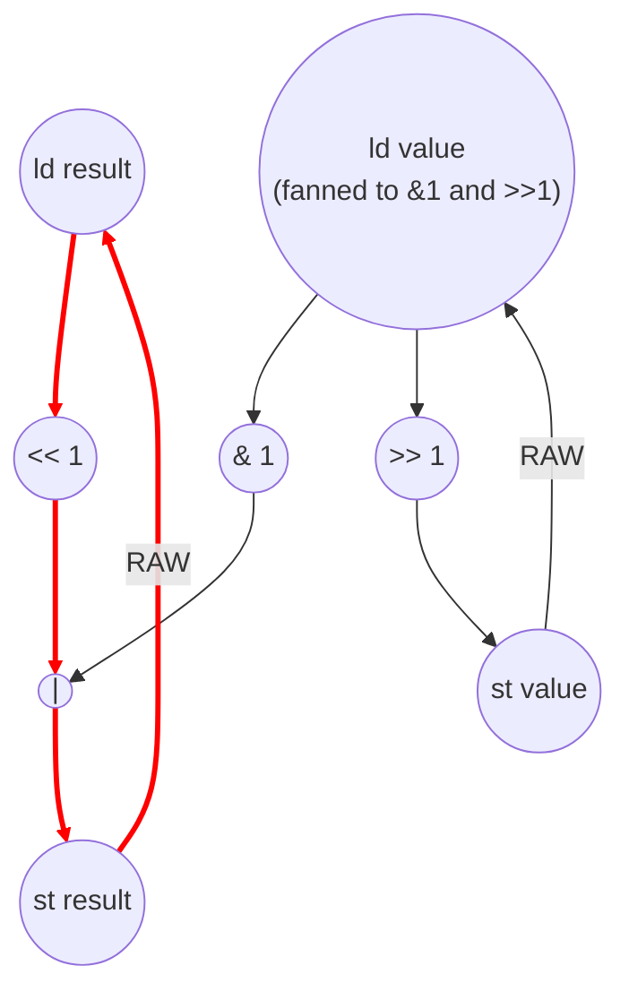

# Bit Reverse Performance
Parameters: `N = 256`, `BITS = 32`.

## Loop structure
Two nested loops:
- **i-loop** (outer): `i = 0 .. N − 1`, `N` iters. Each iter reads `input_data[i]`,
  initializes `result = 0`, runs the inner loop, stores `output_reversed[i]`.
  No value is produced in iter `i` and consumed in iter `i+1` — i-loop is
  **parallel** (fully unrolled, contributes its per-iter critical path once).
- **bit-loop** (inner): `bit = 0 .. BITS − 1`, `BITS = 32` iters. Per iter:
  ```
  result = (result << 1) | (value & 1);
  value  >>= 1;
  ```
  Carries `result` and `value` across iterations. Both recurrences are
  non-associative (shift-and-merge, shift), so the bit-loop is
  **sequential**.

## Loop-carried recurrence
Two parallel scalar recurrences in the bit-loop:

- **result recurrence** (`II = 4`): the chain `load result → << 1 → | → store result`
  must complete before the next iter's `load result` can fire.
- **value recurrence** (`II = 3`): the chain `load value → >> 1 → store value`.
  `value` is read twice in the body (`value & 1` and `value >>= 1`) with no
  write between the reads, so it is loaded **once** and fanned out to both
  uses; the `&1` consumer is slack off this single load.

The `value & 1` and `result << 1` happen in the same cycle (both depend only
on the just-loaded scalars). The `|` joins them in the following cycle, then
the `store result` closes the heavier recurrence. The induction carry on
`bit` (`load bit → +1 → store bit`) is a third parallel recurrence at II = 3.

**II_bit = max(4, 3, 3) = 4**, set by the `result` recurrence.

## Cycle count
Outer i-loop is parallel, so `total_cycles` is the per-outer-iter critical
path.

Per outer iter:
- **Prologue** — `load i → load input_data[i] → store value`, 3 cycles. The
  subscript `input_data[i]` is a bare `[i]` (no inline arithmetic in the
  brackets), so it charges no address-add and adds no cycle of its own. In
  parallel: `store result = 0` (1 cycle, the literal 0 is anonymous). The
  value-path dominates → 3 cycles before inner iter 0's `load value` fires.
- **bit-loop** — `BITS · II_bit = 32 · 4 = 128` cycles.
- **Epilogue** — `load result → store output_reversed[i]`, 2 cycles. The
  output-address add overlaps with the inner loop.

`total_cycles = 3 + 128 + 2 = 133`.

`critical_path = 3 (prologue) + 32 · 4 (bit recurrence) + 2 (epilogue) = 133`

Note: the bit-loop `II` is set by the `result` recurrence
(`load result → << 1 → | → store result`, 4 cycles). Collapsing the two
`value` reads into a single load shortens the *value* recurrence's load
count but not `II_bit`, because that load sits on the slack `value`
recurrence (3 cycles), not on the dominating `result` recurrence. The only
critical-path change comes from fix A (dropping the prologue address-add
cycle), so `total_cycles` falls from 134 to 133.

## Loop dimensions
| dim  | trip   | kind       | II  |
|------|--------|------------|-----|
| i    | N=256  | parallel   | —   |
| bit  | 32     | sequential | 4   |

## Op counts
Per inner iter (one `bit` step):
- 3 loads — `result` (for `<<1`), `value` (one load fanned to both `&1` and
  `>>=`, no write between the reads), `bit` (iterator).
- 3 stores — `result`, `value`, `bit`.
- 4 bitops — `<<1`, `&1`, `|`, `>>1`.
- 1 add — `bit` increment.
- 1 compare — `bit < 32`.

Per outer iter (init + inner + finalize + outer overhead):
- Init: 1 load (`input_data[i]`), 2 stores (`value`, `result = 0`).
- Inner body (32 iters): 96 loads, 96 stores, 128 bitops, 32 adds, 32 compares.
- Finalize: 1 load (`result`), 1 store (`output_reversed[i]`).
- Outer overhead: 1 load (`i`), 1 store (`i`), 1 add (`i + 1`), 0 address_adds (`input_data[i]` and `output_reversed[i]` are bare `[i]` subscripts with no inline arithmetic in the brackets), 1 compare (`i < N`).

Per-outer-iter totals: 99 loads, 100 stores, 128 bitops, 33 adds, 0 address_adds, 33 compares.

Aggregated across `N = 256` outer iters (plus one hoisted load of the `N`
parameter):

| op           | count                       |
|--------------|-----------------------------|
| loads        | `256 · 99 + 1  = 25,345`    |
| stores       | `256 · 100     = 25,600`    |
| bitops       | `256 · 128     = 32,768`    |
| adds         | `256 · 33      =  8,448`    |
| address_adds | `0             =      0`    |
| compares     | `256 · 33      =  8,448`    |
| multiplies / divides / transcendentals | 0 |

Split:
- **Algorithmic** (`<<1`, `&1`, `|`, `>>1`): `4 · BITS · N = 32,768` bitops.
- **Overhead** (scalar L/S of `result`/`value`, induction L/S/add/cmp,
  outer L/S of `i`, init/finalize array I/O): everything else. There are no
  address_adds — both array accesses use bare `[i]` subscripts.
  Overhead dominates because the inner body is itself a chain of load/stores on `result` and `value`.

## Data Dependency Graph
One iteration of outer loop shown, since all outer loop iterations can be executed in parallel. 


The red chain is the result recurrence that sets `II_bit = 4`. The value
recurrence (right side, 3 cycles) and the `bit` induction carry (not drawn,
also 3 cycles) run in parallel and are slack against the result chain.

## CGRA-Constrained Model

The ASAP bound above assumes unlimited functional units and memory bandwidth. This section adds a second lower bound for a CGRA with **separate** arithmetic and memory-issue resources (no shared or bidirectional memory port):

- `P` — arithmetic PEs, homogeneous, one op/cycle each (divides, bitops, compares, transcendentals included).
- `L` — load-issue lanes, one load/cycle each.
- `S` — store-issue lanes, one store/cycle each.

Every counted load consumes an `L` slot and every counted store an `S` slot — **including** the per-bit scalar round-trips of `result`/`value` and the induction-variable accesses. Every counted non-load/store op (bitops, adds, `address_adds`, compares, …) consumes a `P` slot. With `CP` the ASAP dependency bound (`total_cycles`), `A` the counted non-load/store ops, `LD` the loads, and `ST` the stores:

```
compute = ceil(A / P)
load    = ceil(LD / L)
store   = ceil(ST / S)
cycles  = max(CP, compute, load, store)
```

**Counts (from the op-count totals above, N = 256, BITS = 32).**
- `CP = 133`
- `A  = bitops (32,768) + adds (8,448) + address_adds (0) + compares (8,448) = 49,664`
- `LD = 25,345`
- `ST = 25,600`

**6×6 example (`P = 36`, `L = 12`, `S = 12`).**
```
compute = ceil(49,664 / 36) = 1,380
load    = ceil(25,345 / 12) = 2,113
store   = ceil(25,600 / 12) = 2,134
cycles  = max(133, 1,380, 2,113, 2,134) = 2,134
```

**Bottleneck: store-bound.** This is the sharpest gap between the two models. ASAP reports `CP = 133` because the 256 outer lanes are parallel and overlap fully — but that requires issuing all 256 lanes' work at once. With only 12 store lanes, the 25,600 scalar+array+induction stores alone need `store = 2,134` cycles (a 16× stretch over ASAP), just edging out `load = 2,113`. The per-bit `result`/`value`/`bit` store round-trips dominate `ST`, so this model exposes that the kernel is memory-issue-throughput limited, not latency limited. Even raising `P` to thousands leaves `cycles` pinned at the store bound until `S` is widened.
