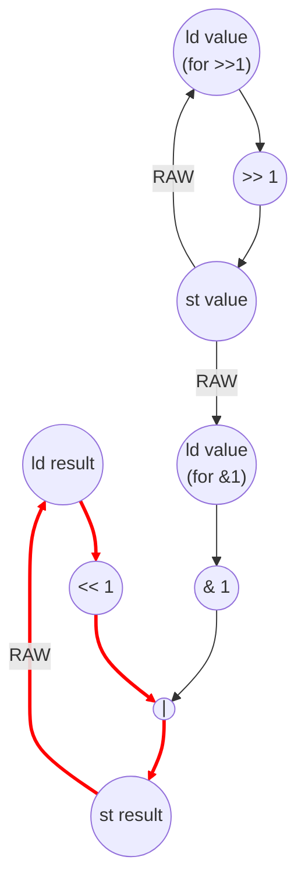

# Bit Reverse Performance
Parameters: `N = 256`, `BITS = 32`.

## Loop structure
Two nested loops:
- **i-loop** (outer): `i = 0 .. N − 1`, `N` iters. Each iter reads `input_data[i]`,
  initializes `result = 0`, runs the inner loop, stores `output_reversed[i]`.
  No value is produced in iter `i` and consumed in iter `i+1` — i-loop is
  **parallel** (fully unrolled, contributes its per-iter critical path once).
- **bit-loop** (inner): `bit = 0 .. BITS − 1`, `BITS = 32` iters. Per iter:
  ```
  result = (result << 1) | (value & 1);
  value  >>= 1;
  ```
  Carries `result` and `value` across iterations. Both recurrences are
  non-associative (shift-and-merge, shift), so the bit-loop is
  **sequential**.

## Loop-carried recurrence
Two parallel scalar recurrences in the bit-loop:

- **result recurrence** (`II = 4`): the chain `load result → << 1 → | → store result`
  must complete before the next iter's `load result` can fire.
- **value recurrence** (`II = 3`): the chain `load value → >> 1 → store value`.

The `value & 1` and `result << 1` happen in the same cycle (both depend only
on the just-loaded scalars). The `|` joins them in the following cycle, then
the `store result` closes the heavier recurrence. The induction carry on
`bit` (`load bit → +1 → store bit`) is a third parallel recurrence at II = 3.

**II_bit = max(4, 3, 3) = 4**, set by the `result` recurrence.

## Cycle count
Outer i-loop is parallel, so `total_cycles` is the per-outer-iter critical
path.

Per outer iter:
- **Prologue** — `load i → add (input_addr) → load input_data[i] → store value`,
  4 cycles. In parallel: `store result = 0` (1 cycle, the literal 0 is
  anonymous). The value-path dominates → 4 cycles before inner iter 0's
  `load value` fires.
- **bit-loop** — `BITS · II_bit = 32 · 4 = 128` cycles.
- **Epilogue** — `load result → store output_reversed[i]`, 2 cycles. The
  output-address add overlaps with the inner loop.

`total_cycles = 4 + 128 + 2 = 134`.

`critical_path = 4 (prologue) + 32 · 4 (bit recurrence) + 2 (epilogue) = 134`

## Loop dimensions
| dim  | trip   | kind       | II  |
|------|--------|------------|-----|
| i    | N=256  | parallel   | —   |
| bit  | 32     | sequential | 4   |

## Op counts
Per inner iter (one `bit` step):
- 4 loads — `result` (for `<<1`), `value` (for `&1`), `value` (for `>>=`), `bit` (iterator).
- 3 stores — `result`, `value`, `bit`.
- 4 bitops — `<<1`, `&1`, `|`, `>>1`.
- 1 add — `bit` increment.
- 1 compare — `bit < 32`.

Per outer iter (init + inner + finalize + outer overhead):
- Init: 1 load (`input_data[i]`), 2 stores (`value`, `result = 0`).
- Inner body (32 iters): 128 loads, 96 stores, 128 bitops, 32 adds, 32 compares.
- Finalize: 1 load (`result`), 1 store (`output_reversed[i]`).
- Outer overhead: 1 load (`i`), 1 store (`i`), 1 add (`i + 1`), 2 adds (input/output address gen), 1 compare (`i < N`).

Per-outer-iter totals: 131 loads, 100 stores, 128 bitops, 35 adds, 33 compares.

Aggregated across `N = 256` outer iters (plus one hoisted load of the `N`
parameter):

| op           | count                       |
|--------------|-----------------------------|
| loads        | `256 · 131 + 1 = 33,537`    |
| stores       | `256 · 100     = 25,600`    |
| bitops       | `256 · 128     = 32,768`    |
| adds         | `256 · 35      =  8,960`    |
| compares     | `256 · 33      =  8,448`    |
| multiplies / divides / transcendentals | 0 |

Split:
- **Algorithmic** (`<<1`, `&1`, `|`, `>>1`): `4 · BITS · N = 32,768` bitops.
- **Overhead** (scalar L/S of `result`/`value`, induction L/S/add/cmp,
  address adds, outer L/S of `i`, init/finalize array I/O): everything else.
  Overhead dominates because the inner body is itself a chain of load/stores on `result` and `value`.

## Data Dependency Graph
One iteration of outer loop shown, since all outer loop iterations can be executed in parallel. 


The red chain is the result recurrence that sets `II_bit = 4`. The value
recurrence (right side, 3 cycles) and the `bit` induction carry (not drawn,
also 3 cycles) run in parallel and are slack against the result chain.
