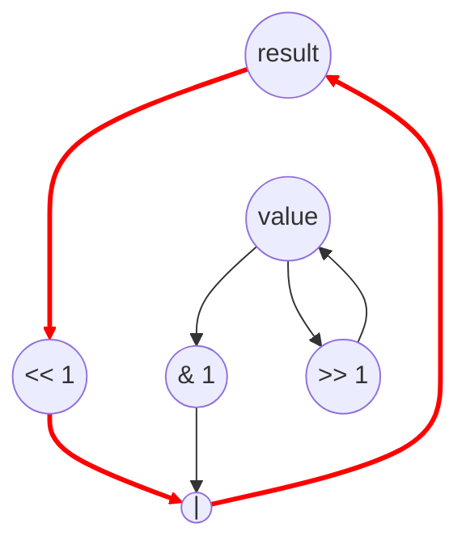

# Bit Reverse Performance
Parameters: `N = 256`, `BITS = 32`

## Cycle + Instruction Count
- Expected cycle count:
  - `II = 2` for the inner loop: the `result` recurrence is `result → (<<1) → (|) → result`
  - `inner_cycles = N * BITS * II = 256 * 32 * 2 = 16,384`
  - `outer_cycles = N * 2 = 512` for one load (`value = input_data[i]`) and one store (`output_reversed[i] = result`) per outer iter; `result = 0` is a constant init with no cycle cost.
  - **total ≈ 16,896**
- loads = `N = 256`   (1 × N, outside inner loop)
- stores = `N = 256`   (1 × N, outside inner loop)
- bitops = `4 * N * BITS = 32,768`
  - per inner iter: 1 shift-left, 1 bitand, 1 bitor, 1 shift-right

## Data Dependency Graph (Inner Loop)

