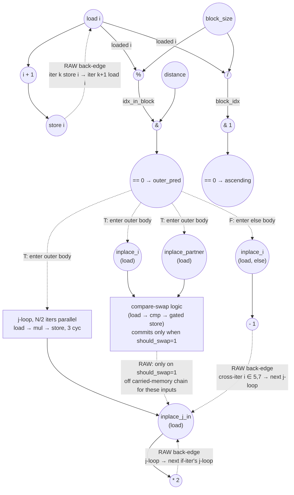

# ASAP Model Notes
- Outer `i` is **sequential**, not parallel — the loop-counter induction chain dominates.
- Inner `j` is **parallel** within one if-iter (distinct addresses `inplace[N/2 + k]`). Under full unroll the j-loop body contributes its per-iter critical path *once* (`load → mul → store = 3 cycles`), not `trip × II`. Cross-iter serialization is between *successive if-iters' j-loops*, not between j-iters of one j-loop.
- Under no-predication, four nested gates serialize the if-branch: outer `(idx_in_block & distance) == 0`, `partner < N`, `if (ascending)`, and `if (should_swap)`. The else-branch is gated by `¬outer_pred`. Every op inside an arm — loads, value compute, store — waits for its gating compare(s) to retire. No mux or AND-enable bitop is charged; only the taken arm's ops fire.
- Predicates cannot settle in parallel: the chained loop counter (store i → next iter's load i) serializes each iter's load i, so iter k's predicate retires at C(7+3k) even under unlimited hardware.

# Bitonic Stage (Modified) Performance
Parameters: `N = 8`, `stage = 1`, `pass = 0` ⇒ `distance = 1`, `block_size = 4`.
- `float input[N] = {3.0f, 1.0f, 4.0f, 2.0f, 8.0f, 6.0f, 7.0f, 5.0f};`

For these inputs:
- Active lanes (`outer_pred = T`): `i ∈ {0, 2, 4, 6}` — 4 of 8. The other 4 take the else branch.
- All 4 active lanes pass `partner < N` (partners 1, 3, 5, 7 are all `< 8`).
- `ascending = 1` for `i ∈ {0, 2}` (block 0); `ascending = 0` for `i ∈ {4, 6}` (block 1).
- `should_swap = 1` for `i ∈ {0, 2}` (3 > 1, 4 > 2); `should_swap = 0` for `i ∈ {4, 6}` (8 < 6 false, 7 < 5 false).
- Compare-swap commits: `i ∈ {0, 2}` only — touching `inplace[0,1]` and `inplace[2,3]`, disjoint from the j-loop's `inplace[N/2..N-1]` chain. Iters 4 and 6 still load and cmp (to compute `should_swap`), but no store fires.

## Modification vs. baseline `bitonic_stage`
Two extra paths are grafted onto each outer `i` iteration.

- **If branch** (`(idx_in_block & distance) == 0`): after the predicated swap, a nested inner loop runs
  ```cpp
  for (uint32_t j = N/2; j < N; ++j) inplace[j] *= 2;
  ```
- **Else branch**: `inplace[i] -= 1;` (was a no-op in baseline).

For `N=8, distance=1`, `idx_in_block & distance = i & 1`, so `i ∈ {0,2,4,6}` take the if branch (N/2 iters) and `i ∈ {1,3,5,7}` take the else branch (N/2 iters).

## Loop classification

| dim   | trip_count | kind | II | notes |
|-------|------------|------|----|-------|
| `i`   | `N` = 8    | sequential | 3 (`load i → i+1 → store i`) | Sequential dim with two carries present: the loop-counter induction (`II = 3`) and a memory-aliasing carry through `inplace[N/2..N-1]` (every if-iter's j-loop reads-then-writes the slice; `i ∈ {5,7}` else writes the slice; `i ∈ {4,6}` compare-swap would write it if `should_swap = 1`, but it is 0 for these inputs, so those writers drop out). A sequential-dim iterator is **not** a per-lane constant, so its read chains across iters; the resulting 8-link counter chain dominates the 5-link memory chain and sets the critical path. |
| inner `j` | `N/2` = 4 | parallel | n/a | Each j-iter writes a distinct `inplace[N/2 + k]`. Within one if-iter the j-loop fully unrolls and contributes its per-iter depth once (`load → mul → store = 3 cycles`). `trip × II` does **not** apply. Serialization is between *successive if-iters' j-loops*, not between j-iters of a single j-loop. |

## Critical path (`total_cycles`)

Because `i` is **sequential**, its iterator is not a per-lane constant: each iter's `load i` chains from the prior iter's `store i` (a read-after-write on the loop counter), the same way the FFT butterfly's sequential `j` is modeled. The induction link `load i → i + 1 → store i` is `II = 3`, so the 8 outer iters form a 7-link chain that serializes every iter's predicate compute. **That iterator chain — not the in-place memory recurrence — is the longest path:** the 8-deep counter chain dwarfs the 5-link `inplace[N/2..N-1]` recurrence.

```
Prologue (loop-invariant compute, broadcast via dataflow):
  C1: load pass         ‖ load stage         ‖ load N
  C2: 1 << pass = distance  ‖ stage + 1     ‖ N >> 1 = N/2
  C3: 1 << (stage + 1) = block_size

Sequential-iterator induction chain (II = 3 per link; iter k's `load i`
waits on iter k-1's `store i`; the first read floors on block_size at C3):
  C4  load i (iter 0)   C5  i+1   C6  store i
  C7  load i (iter 1)   C8  i+1   C9  store i
  C10 load i (iter 2)   C11 i+1   C12 store i
  C13 load i (iter 3)   C14 i+1   C15 store i
  C16 load i (iter 4)   C17 i+1   C18 store i
  C19 load i (iter 5)   C20 i+1   C21 store i
  C22 load i (iter 6)   C23 i+1   C24 store i
  C25 load i (iter 7)                       ← deepest iterator read

iter 7 is an else lane (i = 7 odd); its predicate then its in-place write:
  C26 i % block_size = idx_in_block
  C27 idx_in_block & distance
  C28 == 0 → outer_pred           [¬outer_pred selects the else arm]
  C29 load inplace[7]             ← else body; bare subscript, gated by outer_pred (C28)
  C30 inplace[7] − 1
  C31 store inplace[7]

total_cycles = 31
```

The binding path is the counter walking `i = 0 → 7` (`C4 → C25`, seven `II = 3` links), then iter 7's predicate (`C26 → C28`) feeding its else write to `inplace[7]` (`C29 → C31`). Each iter's predicate is gated on its own `load i`, and because the counter is a serial recurrence those reads cannot all fire at once — iter `k`'s read lands at `C(4 + 3k)`, so `outer_pred` for iter `k` retires at `C(7 + 3k)` (iter 7 at C28).

**The in-place memory recurrence is now slack.** With every predicate serialized behind the counter, the cross-iter `inplace` chains finish no later than the iterator chain that gates them:
- `inplace[5]` (`iter 0/2/4 j-loop → iter 5 else → iter 6 j-loop`) closes at **C28** — three cycles below the bound.
- `inplace[7]` (`iter 0/2/4/6 j-loop → iter 7 else`) closes at **C31**, but its final else write is reached through iter 7's `outer_pred` (C28, set by the iterator chain); the memory carry from iter 6's j-loop also lands at C28, so the two coincide rather than stack — the iterator chain, not the aliasing, is what set C28.
- Compare-swap commits (`i ∈ {0, 2}`, touching `inplace[0..3]`) and the non-committing loads on `i ∈ {4, 6}` sit well off this path.

For comparison, baseline `bitonic_stage` (`i` **parallel** — iterator rooted as a per-lane constant) is `total_cycles = 11`. Making `i` sequential forces the loop counter into a serial recurrence that serializes all 8 outer iters, inflating the depth to **31 cycles, ≈ 2.8×**. Under this model the serial loop counter, not the in-place aliasing, dominates the critical path.

## Op counts

Counts use the **source-level dynamic** interpretation under strict no-pred. The outer `if/else` fires only the taken arm per outer iter; `if (ascending)` fires only one of `cmp_gt` / `cmp_lt`; `if (should_swap)` fires the swap stores only when `should_swap = 1`. No mux or AND-enable bitops are charged anywhere.

Per-iter transient scalars (`block_idx`, `idx_in_block`, `half_block`, `ascending`, `partner`, `should_swap`, `temp`) are treated as anonymous-equivalent intermediates and contribute no named L/S, same convention as baseline. The loop-invariants `block_size`, `distance`, and `N/2` are computed once in the prologue and broadcast via dataflow.

### Algorithmic
| op       | count | source |
|----------|-------|--------|
| loads    | 28    | compare-swap `inplace[i]` (4) + `inplace[partner]` (4) — every active lane loads to compute the cmp, regardless of `should_swap`; j-loop `inplace[j]` ((N/2)² = 16); else `inplace[i]` (4) |
| stores   | 24    | compare-swap commits on swap lanes only: `inplace[i]` (2) + `inplace[partner]` (2) for `i ∈ {0, 2}`; j-loop `inplace[j]` (16); else `inplace[i]` (4) |
| adds     | 4     | `partner = i + distance` on if-iters |
| subs     | 4     | `inplace[i] -= 1` on else-iters |
| muls     | 16    | j-loop `inplace[j] *= 2` ((N/2)² = 16) |
| divs     | 8     | `i / block_size` per outer iter (unconditional, computed before the outer if) |
| mods     | 8     | `i % block_size` per outer iter (unconditional) |
| compares | 24    | `(block_idx & 1) == 0 → ascending` (8, unconditional) + `(idx_in_block & distance) == 0 → outer_pred` (8, unconditional) + `partner < N` (4, active lanes) + taken-arm value compares: `cmp_gt` (2, `ascending = 1` lanes) + `cmp_lt` (2, `ascending = 0` lanes) — only the taken arm of `if (ascending)` fires |
| bitops   | 16    | `block_idx & 1` (8) + `idx_in_block & distance` (8). No mux or AND-enable under strict no-pred: source-level `if/else` and conditional stores lower to dataflow gating, not to bitop-level control logic. |

### Overhead (induction, address-gen, prologue, dead code)
| op           | count | source |
|--------------|-------|--------|
| loads        | 27    | outer `i` reads (N = 8) + j induction reads, one per j-iter on active lanes ((N/2)² = 16) + param hoists `pass`, `stage`, `N` (3). `block_size`, `distance`, `N/2` flow as anonymous-equivalent loop-invariants — no per-iter load. |
| stores       | 24    | outer `i++` writes (8) + j induction writes ((N/2)² = 16). |
| adds         | 25    | outer `i++` (8) + inner `j++` (16) + prologue `stage + 1` (1) |
| address_adds | 0     | All `inplace[...]` subscripts are bare scalars / induction vars: `inplace[i]` (`i` induction var), `inplace[partner]` (`partner` is a named scalar; the `i + distance` that produces it is a regular add, not address arithmetic), and `inplace[j]` (`j` induction var). A bare-variable subscript charges zero address_adds and adds no cycle of its own. |
| compares     | 24    | outer bound `i < N` (8) + inner bound `j < N` per j-iter on active lanes (16) |
| bitops       | 11    | dead `half_block = block_size >> 1` (8, unconditional per the dead-code convention) + prologue `1 << pass` (1) + `1 << (stage+1)` (1) + `N >> 1` for hoisted j-init (1) |

### Totals
| op           | total |
|--------------|------:|
| loads        | **55** |
| stores       | **48** |
| adds         | **29** |
| address_adds | **0** |
| subs         | **4**  |
| muls         | **16** |
| divs         | **8**  |
| mods         | **8**  |
| bitops       | **27** |
| compares     | **48** |
| shifts / transcendentals | 0 |

Compared to the prior soft-predication accounting (`stores = 52, bitops = 35, compares = 52`), strict no-pred drops:
- 4 compare-swap stores that no longer fire (iters 4 and 6, where `should_swap = 0`),
- 8 bitops (4 ascending-arm muxes and 4 AND-enable swap gates that exist only in the soft lowering),
- 4 untaken-arm value compares (the alternate of `cmp_gt` / `cmp_lt` on each active lane).

The j-loop still dominates on both axes: it owns every chain link on the critical path, and contributes 16 of 28 algorithmic loads, 16 of 24 algorithmic stores, all 16 muls, 16 of 25 overhead adds (`j++`), and 16 of 24 overhead compares (`j < N`). No `address_adds` are charged anywhere — every `inplace[...]` subscript is a bare scalar / induction var.

## Data Dependency Graph
The compare-swap subgraph mirrors the baseline `bitonic_stage_eval.md` strict layout (compares gate addr-gens, loads, value compares, and the swap stores in sequence) and is collapsed below. The **dominant carry is the sequential-iterator induction** (`load i → i+1 → store i`, with each iter's `load i` reading the prior iter's `store i`); it serializes all 8 outer iters and sets the critical path. A second, shorter loop-carried recurrence runs through `inplace[N/2..N-1]` (dashed memory back-edges): three writers feed the j-loop's read set — the j-loop itself (RAW recurrence), the compare-swap (commits only when `should_swap = 1`, for these inputs only on iters 0, 2 which touch `inplace[0..3]`, so it doesn't intersect the carried slice), and the else (cross-iter for `i ∈ {5,7}`) — but that chain is shorter than the iterator chain and stays slack.

Writer examples for the (slack) carried-memory chain:
- j-loop: across outer iterations of the i-loop (e.g. j-loop in `i = 2` depends on the j-loop in `i = 0`).
- compare-swap: when `should_swap = 1`, `inplace[i] ↔ temp ↔ inplace[partner]` must complete before subsequent j-loop reads of those slots; for the test inputs this only matters within `i ∈ {0, 2}` for `inplace[0..3]`, off the carried chain.
- else: `inplace[i] -= 1` in `i = 5` must complete before `inplace[5]` is modified again by `i = 6`'s j-loop.



## CGRA-Constrained Model

The ASAP bound above assumes unlimited functional units and memory bandwidth. This section adds a second lower bound for a CGRA with **separate** arithmetic and memory-issue resources (no shared or bidirectional memory port):

- `P` — arithmetic PEs, homogeneous, one op/cycle each (divides, mods, bitops, compares, transcendentals included).
- `L` — load-issue lanes, one load/cycle each.
- `S` — store-issue lanes, one store/cycle each.

Every counted load consumes an `L` slot and every counted store an `S` slot — **including** induction-variable and memory-backed-scalar accesses. Every counted non-load/store op (adds, subs, `address_adds`, muls, divides, mods, bitops, compares, …) consumes a `P` slot. With `CP` the ASAP dependency bound (`total_cycles`), `A` the counted non-load/store ops, `LD` the loads, and `ST` the stores:

```
compute = ceil(A / P)
load    = ceil(LD / L)
store   = ceil(ST / S)
cycles  = max(CP, compute, load, store)
```

**Counts (from the op-count totals above, N = 8, distance = 1).**
- `CP = 31`
- `A  = adds (29) + address_adds (0) + subs (4) + muls (16) + divs (8) + mods (8) + bitops (27) + compares (48) = 140`
- `LD = 55`
- `ST = 48`

**6×6 example (`P = 36`, `L = 12`, `S = 12`).**
```
compute = ceil(140 / 36) = 4
load    = ceil(55 / 12)  = 5
store   = ceil(48 / 12)  = 4
cycles  = max(31, 4, 5, 4) = 31
```

**Per-iteration view (sequential `i`).** The binding carried dependence is the loop-counter induction `load i → i+1 → store i` with `II_dependency = 3` (a memory-aliasing carry through `inplace[N/2..N-1]` also runs at `II = 3` per link, but its chain is shorter and stays slack). Applying resources to one link (`A_iter = 1`, `LD_iter = 1`, `ST_iter = 1`):
```
II_constrained = max(II_dependency, ceil(1/36), ceil(1/12), ceil(1/12)) = max(3, 1, 1, 1) = 3
```
so finite resources do not widen the initiation interval, and the 8-link iterator chain (plus iter 7's predicate-and-write tail) still sets the depth.

**Bottleneck: dependency-bound.** The sequential-iterator induction chain — eight `II = 3` links walking `i = 0 → 7`, then iter 7's predicate and its else write — gives the 31-cycle critical path and dwarfs the aggregate resource terms (≤5), so `CP = 31` binds. The recurrence is serial regardless of how many PEs or memory lanes are provisioned — only removing the cross-iteration dependence (not adding hardware) would shorten it.

<!-- BEGIN CGRA-SCHED:bitonic_stage-modified -->
### Finite-Resource Schedule Estimate (time-local)

*Reproducible estimate for the deterministic criticality-priority list-schedule policy defined in [`docs/spec-kernel-performance.md`](../../../docs/spec-kernel-performance.md). It is **not** a lower bound (the aggregate model above is the lower bound) and **not** cycle-accurate RTL; it exposes the short windows of local `P`/`L`/`S` pressure that the aggregate model smooths over.*

**Resource configuration:** `P = 36`, `L = 12`, `S = 12` (`6x6`).

| region | CP | A | LD | ST | aggregate | scheduled (makespan) |
|--------|---:|--:|---:|---:|----------:|---------------------:|
| bitonic_stage-modified | 31 | 140 | 55 | 48 | 31 | 31 |

- **scheduled_cycles** = 31  (sum of ordered-region makespans)
- **aggregate_cycles** = 31  (the lower bound above, unchanged)
- **gap_cycles** = 0  (scheduled − aggregate)
- **gap_ratio** = 1  (scheduled / aggregate)

**Local `P`/`L`/`S` pressure** (saturated cycles / longest saturated run / peak ready backlog):
- `P`: 0 / 0 / 0
- `L`: 1 / 1 / 7
- `S`: 0 / 0 / 0

<!-- END CGRA-SCHED:bitonic_stage-modified -->
