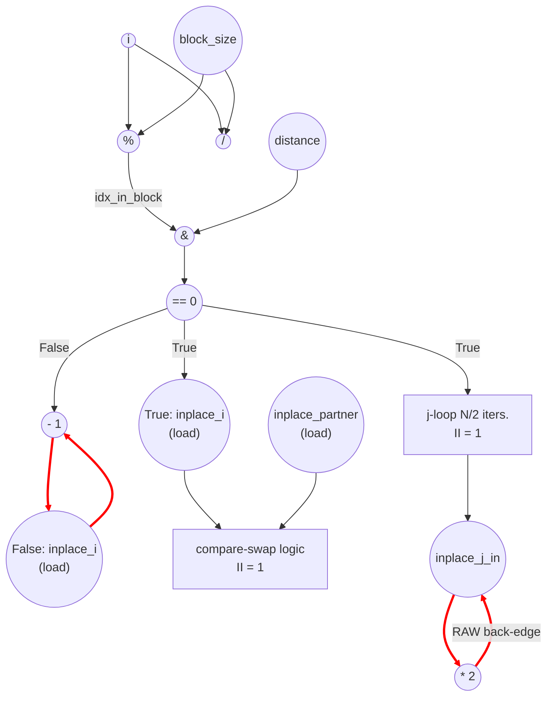

# Bitonic Stage (Modified) Performance
Parameters: `N = 8`, `stage = 1`, `pass = 0` ⇒ `distance = 1`, `block_size = 4`
`float input[N] = {3.0f, 1.0f, 4.0f, 2.0f, 8.0f, 6.0f, 7.0f, 5.0f};`

## Modification vs. baseline `bitonic_stage`
Two extra paths are grafted onto each outer `i` iteration (present identically in `_cpu` and `_dsa`):

- **If branch** (`(idx_in_block & distance) == 0`): after the predicated swap, a nested inner loop runs
  ```cpp
  for (uint32_t j = N/2; j < N; ++j) inplace[j] *= 2;
  ```
- **Else branch**: `inplace[i] -= 1;` (was a no-op in baseline).

For `N=8, distance=1`, `idx_in_block & distance = i & 1`, so `i ∈ {0,2,4,6}` take the if branch (4 iters) and `i ∈ {1,3,5,7}` take the else branch (4 iters).

## Cycle + Instruction Count
- Expected cycle count:
  - **Outer i-loop** — `II_outer = 1`. The compare-swap dataflow is unchanged from baseline; the new else-branch `inplace[i] -= 1` writes only `inplace[i]` for odd `i`, which never collides with another active outer iteration's compare-swap (those touch `inplace[i], inplace[i+1]` for even `i`). `outer_inner_cycles = N × II_outer = 8`.
  - **Inner j-loop** — within a single j-loop, the 4 j-iters write distinct addresses `inplace[4..7]`, so `II_j = 1`. Across if-iters, however, every j-loop reads-then-writes the *same* address set `inplace[N/2..N-1]`, creating a loop-carried RAW chain through memory; successive j-loops serialize. Effective `j_cycles = (N/2 if-iters) × (N/2 j-trip) × II_j = 4 × 4 × 1 = 16`.
  - `outer_cycles ≈ 2` for the loop-invariant prologue (`distance = 1 << pass`, `block_size = 1 << (stage+1)`).
  - **total ≈ 8 + 16 + 2 = 26**
- loads = `2·(N/2) + (N/2)·(N/2) + (N/2) = 8 + 16 + 4 = 28`
  (compare-swap pair on if-iters; `inplace[j]` in nested j-loop; `inplace[i]` on else-iters)
- stores = `2·(N/2) + (N/2)·(N/2) + (N/2) = 8 + 16 + 4 = 28`
  (predicated swap counted at worst case; j-loop writeback; else writeback)
- multiplies = `(N/2)·(N/2) = 16`   (j-loop `inplace[j] *= 2`)
- adds = `(N/2) + (N/2) = 8`   (`partner = i + distance` on if-iters + `inplace[i] − 1` on else-iters)
- divs = `1 · N = 8`   (`block_idx = i / block_size`)
- mods = `1 · N = 8`   (`idx_in_block = i % block_size`)
- bitops = `2 · N = 16`   (`block_idx & 1`, `idx_in_block & distance`)
- compares = `2 · N + 3 · (N/2) = 16 + 12 = 28`
  (per outer iter: `ascending == 0`, `(idx_in_block & distance) == 0`; per if-iter: `partner < N`, value `>`, value `<`)
- transcendentals = 0

The j-loop, not the compare-swap, is the cycle-dominant term here: the inplace[N/2..N-1] RAW recurrence forces j-loop serialization across if-iters, so the modification roughly triples the baseline's total of 10 cycles even though `N` is unchanged.

## Data Dependency Graph
The compare-swap subgraph is identical to baseline `bitonic_stage_eval.md` and is collapsed below. The diagram highlights the two new edges and the cross-iter recurrence introduced by the modification.



The red back-edge `inplace_j_out -> inplace_j_in` is the recurrence that drives `total` past `inner_cycles_outer = 8` and is responsible for the `(N/2)^2` j-loop term in the cycle count.
