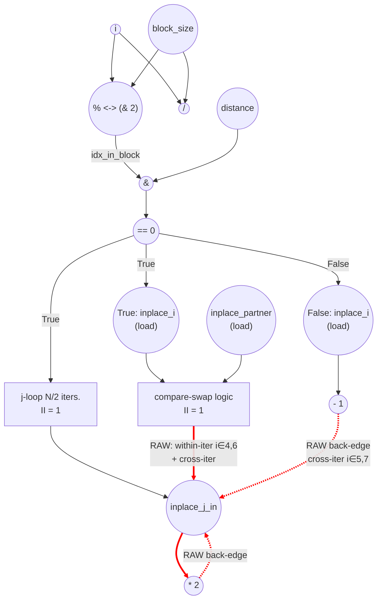

# ASAP Model Notes
- Outer `i` is **sequential**, not parallel — the j-loop's read-modify-write on `inplace[N/2..N-1]` carries through every if-iter, and the `i ∈ {4,6}` compare-swap stores plus the `i ∈ {5,7}` else stores all alias that slice. This is the "in-place updates that alias across iterations" exception under Convention 3.
- Inner `j` is **parallel** within one if-iter (distinct addresses `inplace[N/2 + k]`), for all i iterations (since the j loop executes after all logic with i is complete). Under full unroll the j-loop body contributes its per-iter critical path *once* (`load → mul → gated-store = 3 cycles`), not `trip × II`.
- Per-iter chain-link latency on the memory recurrence depends on which writer separates two consecutive updates to a slot in `inplace[N/2..N-1]`:
  - j-loop → next link: 3 cycles
  - else → next link: 3 cycles
  - compare-swap → next link: 5 cycles (load → cmp → mux → AND → gated-store, same as baseline)
- iter 0's j-loop pays a 1-cycle stall waiting for the outer predicate to settle; subsequent if-iters' j-loops see the predicate already ready.

# Bitonic Stage (Modified) Performance
Parameters: `N = 8`, `stage = 1`, `pass = 0` ⇒ `distance = 1`, `block_size = 4`.
- `float input[N] = {3.0f, 1.0f, 4.0f, 2.0f, 8.0f, 6.0f, 7.0f, 5.0f};`

## Modification vs. baseline `bitonic_stage`
Two extra paths are grafted onto each outer `i` iteration.

- **If branch** (`(idx_in_block & distance) == 0`): after the predicated swap, a nested inner loop runs
  ```cpp
  for (uint32_t j = N/2; j < N; ++j) inplace[j] *= 2;
  ```
- **Else branch**: `inplace[i] -= 1;` (was a no-op in baseline).

For `N=8, distance=1`, `idx_in_block & distance = i & 1`, so `i ∈ {0,2,4,6}` take the if branch (N/2 iters) and `i ∈ {1,3,5,7}` take the else branch (N/2 iters).

## Loop classification

| dim   | trip_count | kind | II | notes |
|-------|------------|------|----|-------|
| `i`   | `N` = 8    | sequential | variable (3 or 5 per chain link) | Carried recurrence through memory on `inplace[N/2..N-1]`. Every if-iter's j-loop reads-then-writes the slice; `i ∈ {4,6}` compare-swap also writes `inplace[4,5]` / `inplace[6,7]`; `i ∈ {5,7}` else writes `inplace[5]` / `inplace[7]`. Memory-aliasing carry, not register. |
| inner `j` | `N/2` = 4 | parallel | n/a | Each j-iter writes a distinct `inplace[N/2 + k]`. Within one if-iter the j-loop fully unrolls and contributes its per-iter depth once (load → mul → gated-store = 3 cycles). `trip × II` does **not** apply. Serialization is between *successive if-iters' j-loops*, not between j-iters of a single j-loop. |

## Critical path (`total_cycles`)

Two phases: (a) a prologue plus per-iter predicate compute that runs in parallel across all 8 outer iters under unbounded fan-out, and (b) the cross-iter memory chain through `inplace[N/2..N-1]` in source order.

```
Prologue (loop-invariant compute, broadcast via dataflow):
  C1: load pass         ‖ load stage         ‖ load N
  C2: 1 << pass         ‖ stage + 1          ‖ N >> 1
       (distance ready;                       N/2 ready, hoisted j-init)
  C3: 1 << (stage + 1)                                       (block_size ready)

Per-iter predicate (parallel across the 8 outer iters):
  C4: load i
  C5: i / block_size    ‖ i % block_size      ‖ i + distance     ‖ &inplace[i]      ‖ &inplace[N/2 + k]
  C6: block_idx & 1 (mod 2 operation)    ‖ idx_in_block & dist ‖ partner < N      ‖ &inplace[partner]
  C7: ==0 → ascending   ‖ ==0 → predicate     (predicate / ¬predicate ready start C8)
```

j-loop stores commit when both the mul value and the outer predicate are ready, so iter 0 stalls one cycle for the predicate; every later if-iter's j-loop sees the predicate already settled. The longest chain runs through `inplace[5]`:

```
  C5  load inplace[5]    (iter 0 j-loop)        ← initial memory
  C6  mul × 2
  C8  gated-store        (iter 0 j-loop; +1 cycle predicate stall)

  C9  load inplace[5]    (iter 2 j-loop)
  C10 mul × 2
  C11 gated-store

  C12 load inplace[4,5]  (iter 4 compare-swap)
  C13 cmp_gt ‖ cmp_lt
  C14 mux → should_swap
  C15 AND → enable
  C16 gated-store        (iter 4 compare-swap commit)

  C17 load inplace[5]    (iter 4 j-loop, j=5 sub-chain)
  C18 mul × 2
  C19 gated-store

  C20 load inplace[5]    (iter 5 else)
  C21 sub 1
  C22 gated-store

  C23 load inplace[5]    (iter 6 j-loop, j=5 sub-chain)
  C24 mul × 2
  C25 gated-store

total_cycles = 25
```

The `inplace[7]` chain (`iter 0 j-loop → iter 2 j-loop → iter 4 j-loop (j=7) → iter 6 compare-swap → iter 6 j-loop (j=7) → iter 7 else`) also lands at C25 and ties for the bound. Other writers retire earlier and stay off the critical path:
- iter 0's compare-swap writes `inplace[0,1]`, iter 2's writes `inplace[2,3]` — no alias with the memory chain.
- iter 1, 3 else writes hit `inplace[1,3]` — also off-chain.
- iter 4 j-loop is internally split: `j ∈ {6,7}` only depends on iter 2's j-loop (load C12, store C14), while `j ∈ {4,5}` waits for iter 4's compare-swap (load C17, store C19). Under unbounded fan-out both sub-chains coexist in the same j-loop instance.

Under fully unbound hardware (infinite throughput model), each update to the output (ex. inplace[5]) only has to wait for the previous writer to finish. For example here is what iter 6's sub-operations have to wait for.

| iter 6 sub-op | what it reads | who last wrote that | so it waits for |
|---|---|---|---|
| predicate / addr-gen for `i=6` | just `i=6` + loop-invariants | nobody | nothing — fires at C4–C7 in parallel with every other iter's predicate |
| compare-swap (touches `inplace[6,7]`) | `inplace[6]`, `inplace[7]` | iter 4's j-loop (j=6,7 sub-chain, done at C14) | iter 4, not iter 5 |
| j-loop, j=4 | `inplace[4]` | iter 4's j-loop j=4 (C19) | iter 4 |
| j-loop, j=5 | `inplace[5]` | iter 5's else (C22) | iter 5's else commit only, not all of iter 5 |
| j-loop, j=6 / j=7 | `inplace[6,7]` | iter 6's own compare-swap (C16) | iter 6's own compare-swap (within-iter) |

The "sequential" classification of `i` only means a loop-carried dep exists somewhere — it does **not** mean each iter must finish before the next can start. iter 6's compare-swap (C12–C16) actually overlaps with iter 5's else (C20–C22) since they touch disjoint slots; only the iter 6 j-loop's `j=5` sub-chain waits on iter 5's else commit.


For comparison, baseline `bitonic_stage` (`i` parallel-unrolled) is 11 cycles; the modification's memory recurrence inflates that to **25 cycles, ≈ 2.3×**, with the j-loop link multiplied by `i` providing most of the inflation.

## Op counts

Counts use the **source-level dynamic** interpretation for the outer if/else — only the actually-taken branch fires per outer iter. This matches `binary_search`'s precedent (see its `mid ± 1` note) and aligns with the prior version of this file. Inner mux-style gates within the if-branch (`ascending ? cmp_gt : cmp_lt`, the `partner < N` guard, the `should_swap` swap-gate) still count speculatively — both inner sub-compute always fires, only the store is mux-routed — consistent with the baseline.

Per-iter transient scalars (`block_idx`, `idx_in_block`, `half_block`, `ascending`, `partner`, `should_swap`, `temp`) are treated as anonymous-equivalent intermediates and contribute no named L/S, same convention as baseline. The loop-invariants `block_size`, `distance`, and `N/2` are computed once in the prologue and broadcast via dataflow.

### Algorithmic
| op       | count | source |
|----------|-------|--------|
| loads    | 28    | compare-swap `inplace[i]` (N/2 = 4) + `inplace[partner]` (4) + j-loop `inplace[j]` ((N/2)² = 16) + else `inplace[i]` (N/2 = 4) |
| stores   | 28    | compare-swap `inplace[i]`, `inplace[partner]` mux-gated by the AND-enable (8) + j-loop `inplace[j]` (16) + else `inplace[i]` gated by ¬predicate (4) |
| adds     | 4     | `partner = i + distance` on if-iters |
| subs     | 4     | `inplace[i] -= 1` on else-iters |
| muls     | 16    | j-loop `inplace[j] *= 2` ((N/2)² = 16) |
| divs     | 8     | `i / block_size` per outer iter |
| mods     | 8     | `i % block_size` per outer iter |
| compares | 28    | `(block_idx & 1) == 0 → ascending` (8) + `(idx_in_block & distance) == 0 → predicate` (8) + per if-iter `partner < N` (4) + `cmp_gt` (4) + `cmp_lt` (4); both value compares fire in parallel and the mux selects on `ascending` |
| bitops   | 24    | `block_idx & 1` (8) + `idx_in_block & distance` (8) + ascending-mux selecting `cmp_gt` vs `cmp_lt` (4) + 3-input AND swap-enable `predicate ∧ partner<N ∧ should_swap` (4) |

### Overhead (induction, address-gen, prologue, dead code)
| op           | count | source |
|--------------|-------|--------|
| loads        | 27    | outer `i` reads (N = 8) + j induction reads, one per j-iter ((N/2)² = 16) + param hoists `pass`, `stage`, `N` (3). `block_size`, `distance`, `N/2` flow as anonymous-equivalent loop-invariants — no per-iter load. |
| stores       | 24    | outer `i++` writes (8) + j induction writes ((N/2)² = 16). |
| adds         | 25    | outer `i++` (8) + inner `j++` (16) + prologue `stage + 1` (1) |
| address_adds | 28    | `&inplace[i]` per outer iter, shared by both branches (8) + `&inplace[partner]` per if-iter (4) + `&inplace[j]` per j-iter (16) — 1 per `[]` access, incremental-stride |
| compares     | 24    | outer bound `i < N` (8) + inner bound `j < N` per j-iter (16) |
| bitops       | 11    | dead `half_block = block_size >> 1` counted at every iter per the dead-code convention (8) + prologue `1 << pass` (1) + `1 << (stage+1)` (1) + `N >> 1` for hoisted j-init (1) |

### Totals
| op           | total |
|--------------|------:|
| loads        | **55** |
| stores       | **52** |
| adds         | **29** |
| address_adds | **28** |
| subs         | **4**  |
| muls         | **16** |
| divs         | **8**  |
| mods         | **8**  |
| bitops       | **35** |
| compares     | **52** |
| shifts / transcendentals | 0 |

The j-loop dominates on both axes: it owns every chain link except the two compare-swap stops on the critical path, and contributes 16 of 28 algorithmic loads/stores, all 16 muls, 16 of 25 overhead adds (`j++`) plus 16 of 28 `address_adds` (`&inplace[j]`), and 16 of 24 overhead compares (`j < N`).

## Data Dependency Graph
The compare-swap subgraph is identical to baseline `bitonic_stage_eval.md` and is collapsed below. Solid edges are within-iter dataflow; dashed edges are loop-carried back-edges through `inplace[N/2..N-1]`. Three writers feed the j-loop's read set: the j-loop itself (RAW recurrence), the compare-swap (for `i ∈ {4,6}` and cross-iter into later if-iters), and the else (cross-iter for `i ∈ {5,7}`).

Writer examples:
- j-loop: across outer iterations of the i-loop (ex. j-loop in i = 2 depends on the j-loop in i = 1)
- compare-swap: inplace[i] <-> temp <-> inplace[partner] must complete before j-loop begins
- else: inplace[i] -= 1 in i = 5 must complete before inplace[5] is modified again


