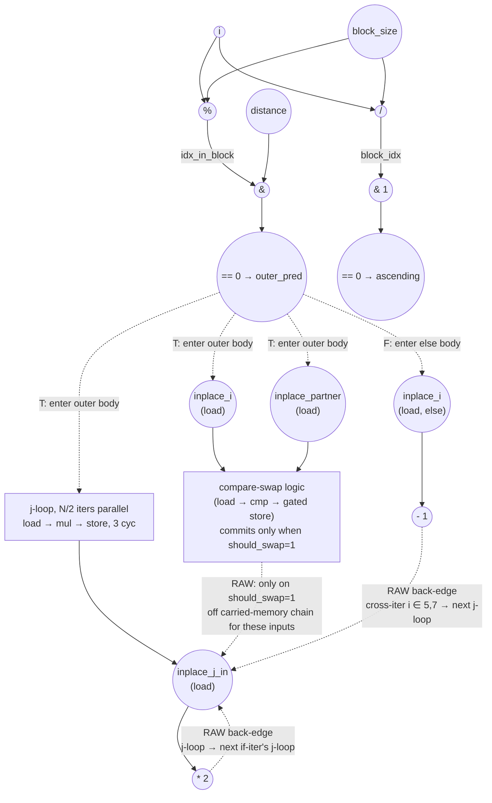

# ASAP Model Notes
- Outer `i` is **sequential**, not parallel — the j-loop's read-modify-write on `inplace[N/2..N-1]` carries through every if-iter, `i ∈ {5,7}` else stores also alias that slice, and `i ∈ {4,6}` compare-swap *would* write into it when `should_swap = 1`. This is the "in-place updates that alias across iterations" exception under the carried-memory convention.
- Inner `j` is **parallel** within one if-iter (distinct addresses `inplace[N/2 + k]`). Under full unroll the j-loop body contributes its per-iter critical path *once* (`load → mul → store = 3 cycles`), not `trip × II`. Cross-iter serialization is between *successive if-iters' j-loops*, not between j-iters of one j-loop.
- Under no-predication, four nested gates serialize the if-branch: outer `(idx_in_block & distance) == 0`, `partner < N`, `if (ascending)`, and `if (should_swap)`. The else-branch is gated by `¬outer_pred`. Every op inside an arm — addr-gens, loads, value compute, store — waits for its gating compare(s) to retire. No mux or AND-enable bitop is charged; only the taken arm's ops fire.
- Per-iter chain link latencies through `inplace[N/2..N-1]`:
  - j-loop → next link: 3 cycles (load → mul → store)
  - else → next link: 3 cycles (load → sub → store)
  - compare-swap → next link: 3 cycles (load → cmp → store) **only when `should_swap = 1`**; otherwise the store never fires and the chain skips this writer entirely.
- iter 0's j-loop pays a multi-cycle stall while outer_pred resolves: under strict no-pred, the j-loop's addr-gen, load, and store *all* wait for outer_pred, not just the store. Subsequent if-iters' j-loops see outer_pred already settled (in parallel across lanes), so they pay only the 3-cycle chain link.

# Bitonic Stage (Modified) Performance
Parameters: `N = 8`, `stage = 1`, `pass = 0` ⇒ `distance = 1`, `block_size = 4`.
- `float input[N] = {3.0f, 1.0f, 4.0f, 2.0f, 8.0f, 6.0f, 7.0f, 5.0f};`

For these inputs:
- Active lanes (`outer_pred = T`): `i ∈ {0, 2, 4, 6}` — 4 of 8. The other 4 take the else branch.
- All 4 active lanes pass `partner < N` (partners 1, 3, 5, 7 are all `< 8`).
- `ascending = 1` for `i ∈ {0, 2}` (block 0); `ascending = 0` for `i ∈ {4, 6}` (block 1).
- `should_swap = 1` for `i ∈ {0, 2}` (3 > 1, 4 > 2); `should_swap = 0` for `i ∈ {4, 6}` (8 < 6 false, 7 < 5 false).
- Compare-swap commits: `i ∈ {0, 2}` only — touching `inplace[0,1]` and `inplace[2,3]`, disjoint from the j-loop's `inplace[N/2..N-1]` chain. Iters 4 and 6 still load and cmp (to compute `should_swap`), but no store fires.

## Modification vs. baseline `bitonic_stage`
Two extra paths are grafted onto each outer `i` iteration.

- **If branch** (`(idx_in_block & distance) == 0`): after the predicated swap, a nested inner loop runs
  ```cpp
  for (uint32_t j = N/2; j < N; ++j) inplace[j] *= 2;
  ```
- **Else branch**: `inplace[i] -= 1;` (was a no-op in baseline).

For `N=8, distance=1`, `idx_in_block & distance = i & 1`, so `i ∈ {0,2,4,6}` take the if branch (N/2 iters) and `i ∈ {1,3,5,7}` take the else branch (N/2 iters).

## Loop classification

| dim   | trip_count | kind | II | notes |
|-------|------------|------|----|-------|
| `i`   | `N` = 8    | sequential | 3 per chain link (uniform under strict no-pred) | Carried recurrence through memory on `inplace[N/2..N-1]`. Every if-iter's j-loop reads-then-writes the slice; `i ∈ {5,7}` else writes the slice; `i ∈ {4,6}` compare-swap would write the slice if `should_swap = 1` (for the test inputs, it's 0, so those writers drop out and the chain skips them). Memory-aliasing carry, not register. |
| inner `j` | `N/2` = 4 | parallel | n/a | Each j-iter writes a distinct `inplace[N/2 + k]`. Within one if-iter the j-loop fully unrolls and contributes its per-iter depth once (`load → mul → store = 3 cycles`). `trip × II` does **not** apply. Serialization is between *successive if-iters' j-loops*, not between j-iters of a single j-loop. |

## Critical path (`total_cycles`)

Two phases: (a) a prologue plus per-iter predicate compute that runs in parallel across all 8 outer iters under unbounded fan-out, and (b) the cross-iter memory chain through `inplace[N/2..N-1]` in source order.

```
Prologue (loop-invariant compute, broadcast via dataflow):
  C1: load pass         ‖ load stage         ‖ load N
  C2: 1 << pass = distance  ‖ stage + 1     ‖ N >> 1 = N/2
  C3: 1 << (stage + 1) = block_size

Per-iter predicate (parallel across all 8 outer lanes):
  C4: load i
  C5: i / block_size = block_idx  ‖ i % block_size = idx_in_block  ‖ block_size >> 1 = half_block (dead)
  C6: block_idx & 1     ‖ idx_in_block & distance
  C7: == 0 → ascending  ‖ == 0 → outer_pred       [outer_pred / ¬outer_pred retire]
```

Under strict no-pred, every op inside the outer arm waits for outer_pred to retire (C7). The subscripts are bare scalars (`inplace[i]`, `inplace[partner]`, `inplace[j]`), so no address-gen cycle is charged; the j-loop's first loads fire at C8 (first chain link reads initial memory) once outer_pred has retired. Subsequent if-iters' j-loops see outer_pred already settled and their chain links cost 3 cycles each. Compare-swap stores fire only on lanes where `should_swap = 1` (`i ∈ {0, 2}`, touching `inplace[0..3]`); the `inplace[N/2..N-1]` chain therefore runs through j-loops and the `i ∈ {5,7}` else writes without picking up any compare-swap commits.

The longest chain runs through `inplace[5]`:

```
  C8  load inplace[5]   (iter 0 j-loop, j=5)        ← initial memory; bare subscript, no addr-gen; gated by outer_pred (C7)
  C9  mul × 2
  C10 store inplace[5]  (iter 0 j-loop commits)

  C11 load inplace[5]   (iter 2 j-loop, j=5)
  C12 mul × 2
  C13 store inplace[5]

  C14 load inplace[5]   (iter 4 j-loop, j=5)        ← iter 4 compare-swap loads inplace[5] at C14 in parallel; cmp_lt at C15 returns 0 (8<6 false) → no store
  C15 mul × 2
  C16 store inplace[5]

  C17 load inplace[5]   (iter 5 else)               ← else body gated by ¬outer_pred (C7); load waits for prior writer (C16)
  C18 sub 1
  C19 store inplace[5]

  C20 load inplace[5]   (iter 6 j-loop, j=5)        ← iter 6 compare-swap touches inplace[6,7], not [5]
  C21 mul × 2
  C22 store inplace[5]

total_cycles = 22
```

The `inplace[7]` chain (`iter 0 j-loop → iter 2 j-loop → iter 4 j-loop → iter 6 j-loop → iter 7 else`) also lands at C22 and ties for the bound — same structure, with iter 6 compare-swap dropped (`should_swap = 0`, 7<5 false) and iter 7 else as the terminal writer.

Other slots retire earlier and stay off the critical path:
- `inplace[0,1]`: iter 0 compare-swap commits at C12 (load C10, cmp_gt C11, store C12 — `should_swap = 1`); iter 1 else writes at C15 (load C13 waits on C12, sub C14, store C15). No further writers.
- `inplace[2,3]`: iter 2 compare-swap commits at C12; iter 3 else at C15.
- `inplace[4]`: only j-loops touch it (iter 4 compare-swap `should_swap = 0`). 4 j-loop links — last store at C19.
- `inplace[6]`: only j-loops touch it (iter 6 compare-swap `should_swap = 0`). 4 j-loop links — last store at C19.

Under unbounded fan-out, the per-iter predicate compute for all 8 lanes runs in parallel through C8. Subscripts are bare, so no address-gen cycle is charged; only the loads on the carried memory chain serialize. iter 4's compare-swap loads `inplace[5]` at C14 in parallel with iter 4's j-loop load of `inplace[5]` — both are reads, no conflict — then iter 4's cmp_lt at C15 produces `should_swap = 0` and no store fires. Iter 6 behaves symmetrically for `inplace[7]`.

Under fully unbound hardware (infinite throughput model), each update to a slot only has to wait for the previous *committing* writer to finish. For example, iter 6's sub-operations wait for:

| iter 6 sub-op | what it reads | who last wrote that | so it waits for |
|---|---|---|---|
| predicate for `i=6` | `i=6` + loop-invariants | nobody | nothing — fires at C4–C8 in parallel with every other iter's predicate |
| compare-swap loads (`inplace[6,7]`) | `inplace[6]`, `inplace[7]` | iter 4's j-loop (j=6,7 sub-chain, done at C16) | iter 4's j-loop — produces `should_swap = 0`, no store |
| j-loop, j=4 | `inplace[4]` | iter 4's j-loop j=4 (C16) | iter 4's j-loop |
| j-loop, j=5 | `inplace[5]` | iter 5's else (C19) | iter 5's else commit only, not all of iter 5 |
| j-loop, j=6 / j=7 | `inplace[6,7]` | iter 4's j-loop (C16) | iter 4's j-loop (iter 6's own compare-swap doesn't commit, so no within-iter wait) |

The "sequential" classification of `i` only means a loop-carried dep exists somewhere — it does **not** mean each iter must finish before the next can start. iter 6's compare-swap (load C17, cmp C18, no store) overlaps with iter 5's else (C17–C19) since they touch disjoint slots; only the iter 6 j-loop's `j=5` sub-chain waits on iter 5's else commit.

For comparison, baseline `bitonic_stage` (`i` parallel-unrolled) is 12 cycles under strict no-pred; the modification's memory recurrence inflates that to **22 cycles, ≈ 1.8×**, with the j-loop link multiplied across the active-iter sequence providing most of the inflation.

## Op counts

Counts use the **source-level dynamic** interpretation under strict no-pred. The outer `if/else` fires only the taken arm per outer iter; `if (ascending)` fires only one of `cmp_gt` / `cmp_lt`; `if (should_swap)` fires the swap stores only when `should_swap = 1`. No mux or AND-enable bitops are charged anywhere.

Per-iter transient scalars (`block_idx`, `idx_in_block`, `half_block`, `ascending`, `partner`, `should_swap`, `temp`) are treated as anonymous-equivalent intermediates and contribute no named L/S, same convention as baseline. The loop-invariants `block_size`, `distance`, and `N/2` are computed once in the prologue and broadcast via dataflow.

### Algorithmic
| op       | count | source |
|----------|-------|--------|
| loads    | 28    | compare-swap `inplace[i]` (4) + `inplace[partner]` (4) — every active lane loads to compute the cmp, regardless of `should_swap`; j-loop `inplace[j]` ((N/2)² = 16); else `inplace[i]` (4) |
| stores   | 24    | compare-swap commits on swap lanes only: `inplace[i]` (2) + `inplace[partner]` (2) for `i ∈ {0, 2}`; j-loop `inplace[j]` (16); else `inplace[i]` (4) |
| adds     | 4     | `partner = i + distance` on if-iters |
| subs     | 4     | `inplace[i] -= 1` on else-iters |
| muls     | 16    | j-loop `inplace[j] *= 2` ((N/2)² = 16) |
| divs     | 8     | `i / block_size` per outer iter (unconditional, computed before the outer if) |
| mods     | 8     | `i % block_size` per outer iter (unconditional) |
| compares | 24    | `(block_idx & 1) == 0 → ascending` (8, unconditional) + `(idx_in_block & distance) == 0 → outer_pred` (8, unconditional) + `partner < N` (4, active lanes) + taken-arm value compares: `cmp_gt` (2, `ascending = 1` lanes) + `cmp_lt` (2, `ascending = 0` lanes) — only the taken arm of `if (ascending)` fires |
| bitops   | 16    | `block_idx & 1` (8) + `idx_in_block & distance` (8). No mux or AND-enable under strict no-pred: source-level `if/else` and conditional stores lower to dataflow gating, not to bitop-level control logic. |

### Overhead (induction, address-gen, prologue, dead code)
| op           | count | source |
|--------------|-------|--------|
| loads        | 27    | outer `i` reads (N = 8) + j induction reads, one per j-iter on active lanes ((N/2)² = 16) + param hoists `pass`, `stage`, `N` (3). `block_size`, `distance`, `N/2` flow as anonymous-equivalent loop-invariants — no per-iter load. |
| stores       | 24    | outer `i++` writes (8) + j induction writes ((N/2)² = 16). |
| adds         | 25    | outer `i++` (8) + inner `j++` (16) + prologue `stage + 1` (1) |
| address_adds | 0     | All `inplace[...]` subscripts are bare scalars / induction vars: `inplace[i]` (`i` induction var), `inplace[partner]` (`partner` is a named scalar; the `i + distance` that produces it is a regular add, not address arithmetic), and `inplace[j]` (`j` induction var). A bare-variable subscript charges zero address_adds and adds no cycle of its own. |
| compares     | 24    | outer bound `i < N` (8) + inner bound `j < N` per j-iter on active lanes (16) |
| bitops       | 11    | dead `half_block = block_size >> 1` (8, unconditional per the dead-code convention) + prologue `1 << pass` (1) + `1 << (stage+1)` (1) + `N >> 1` for hoisted j-init (1) |

### Totals
| op           | total |
|--------------|------:|
| loads        | **55** |
| stores       | **48** |
| adds         | **29** |
| address_adds | **0** |
| subs         | **4**  |
| muls         | **16** |
| divs         | **8**  |
| mods         | **8**  |
| bitops       | **27** |
| compares     | **48** |
| shifts / transcendentals | 0 |

Compared to the prior soft-predication accounting (`stores = 52, bitops = 35, compares = 52`), strict no-pred drops:
- 4 compare-swap stores that no longer fire (iters 4 and 6, where `should_swap = 0`),
- 8 bitops (4 ascending-arm muxes and 4 AND-enable swap gates that exist only in the soft lowering),
- 4 untaken-arm value compares (the alternate of `cmp_gt` / `cmp_lt` on each active lane).

The j-loop still dominates on both axes: it owns every chain link on the critical path, and contributes 16 of 28 algorithmic loads, 16 of 24 algorithmic stores, all 16 muls, 16 of 25 overhead adds (`j++`), and 16 of 24 overhead compares (`j < N`). No `address_adds` are charged anywhere — every `inplace[...]` subscript is a bare scalar / induction var.

## Data Dependency Graph
The compare-swap subgraph mirrors the baseline `bitonic_stage_eval.md` strict layout (compares gate addr-gens, loads, value compares, and the swap stores in sequence) and is collapsed below. Solid edges are within-iter dataflow; dashed edges are loop-carried back-edges through `inplace[N/2..N-1]`. Three writers feed the j-loop's read set: the j-loop itself (RAW recurrence), the compare-swap (commits only when `should_swap = 1` — for these inputs only on iters 0, 2 which touch `inplace[0..3]`, so doesn't intersect the carried-memory chain), and the else (cross-iter for `i ∈ {5,7}`).

Writer examples for the carried-memory chain:
- j-loop: across outer iterations of the i-loop (e.g. j-loop in `i = 2` depends on the j-loop in `i = 0`).
- compare-swap: when `should_swap = 1`, `inplace[i] ↔ temp ↔ inplace[partner]` must complete before subsequent j-loop reads of those slots; for the test inputs this only matters within `i ∈ {0, 2}` for `inplace[0..3]`, off the carried chain.
- else: `inplace[i] -= 1` in `i = 5` must complete before `inplace[5]` is modified again by `i = 6`'s j-loop.


