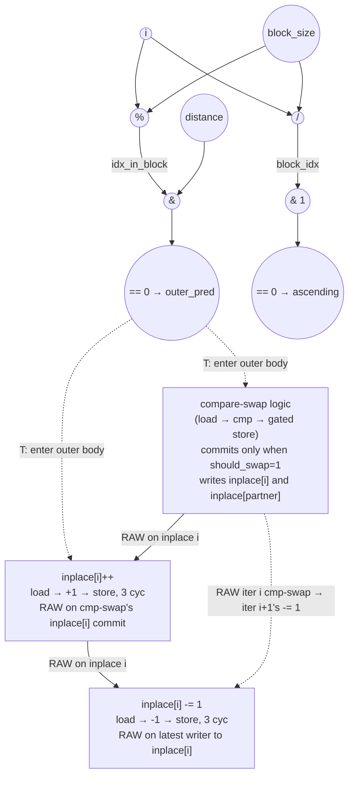

# ASAP Model Notes
- Unlike bitonic_stage, i-iter stores overlap
    - distance is fixed at 1 since pass = 0 in main.cpp, but the next i iter's inplace[i] -= 1 writes to the same array element

- Like standard bitonic_stage, the prologue takes 3 cycles
    - longest path is computation of block_size (load, add, shift)
- Outer predicate is finished at after cycle 6 (mod block_size -> idx_in_block, idx_in_block & distance, == 0 -> finished)
- partner computed at cycle 7, partner < N done at cycle 8, load at cycle 9, cmp at cycle 10
- if should_swap is true, stores happen in parallel at cycle 11
- 3 cycles each for inplace[i]++ and inplace[i]-=1
- For operation counts: there are an extra load, add, store for everytime the outer predicate evaluates to true (4 times)
- There are an extra load, sub, store for every i iteration (8 times)

# Bitonic Stage (Tweak) Performance
Parameters: `N = 8`, `stage = 1`, `pass = 0` ⇒ `distance = 1`, `block_size = 4`.
- `float input[N] = {3.0f, 1.0f, 4.0f, 2.0f, 8.0f, 6.0f, 7.0f, 5.0f};`

For these inputs:
- Active lanes (`outer_pred = T`): `i ∈ {0, 2, 4, 6}` — 4 of 8. The other 4 (`i ∈ {1, 3, 5, 7}`) skip the outer body and only execute the unconditional `inplace[i] -= 1`.
- All 4 active lanes pass `partner < N` (partners 1, 3, 5, 7 are all `< 8`).
- `ascending = 1` for `i ∈ {0, 2}` (block 0); `ascending = 0` for `i ∈ {4, 6}` (block 1).
- `should_swap = 1` for `i ∈ {0, 2}` (3 > 1, 4 > 2); `should_swap = 0` for `i ∈ {4, 6}` (8 < 6 false, 7 < 5 false).
- Compare-swap commits: `i ∈ {0, 2}` only — touching `inplace[0,1]` and `inplace[2,3]`. Iters 4 and 6 still load and cmp (to compute `should_swap`), but no store fires.

## Modification vs. baseline `bitonic_stage`
Two extra writes are grafted onto each outer `i` iteration.

- **Inside the outer if-body**, after the conditional swap: `inplace[i]++;` (fires when `outer_pred = T`, i.e. on active lanes).
- **Outside the outer if-body**, unconditional: `inplace[i] -= 1;` (fires on every lane).

Both are read-modify-write on `inplace[i]`. They serialize behind any prior writer on the same slot — the cmp-swap commit on swap lanes, or the `++` commit on active lanes — and they chain across iterations through memory whenever a cmp-swap commit on iter `i` writes `inplace[partner = i+1]` that iter `i+1`'s `-=1` then reads.

## Loop classification

| dim | trip_count | kind | II | notes |
|-----|------------|------|----|-------|
| `i` | `N` = 8 | sequential | 3 per chain link (load → arith → store) | Carried recurrence through memory on odd-indexed slots (`inplace[1], inplace[3]`) for swap-committing iters. iter 0's cmp-swap writes `inplace[1]`, which iter 1's unconditional `-=1` reads-then-writes; similarly iter 2 → iter 3 on `inplace[3]`. For `i ∈ {4, 6}` the cmp-swap doesn't commit (`should_swap = 0`), so the chain skips those writers and iters 5/7 don't pick up a cross-iter dependency. The "in-place updates that alias across iterations" exception applies; the carry is via memory, not register. |

## Critical path (`total_cycles`)

The binding chain runs **within iter 0** (tied with iter 2), through `inplace[0]` (resp. `inplace[2]`) in source order: cmp-swap commit → `++` → `-=1`. The cross-iter chain through `inplace[1]` (iter 0 cmp-swap → iter 1 `-=1`) terminates at C14, three cycles short of the within-iter chain, because it stacks only one extra load-modify-store onto the C11 cmp-swap commit while the within-iter chain stacks two.

```
Prologue (loop-invariant compute, broadcast via dataflow):
  C1: load stage     ‖ load pass     ‖ load N     ‖ load i (per-lane iter const)
  C2: stage + 1      ‖ 1 << pass = distance
  C3: 1 << (stage + 1) = block_size

Per-iter predicate (parallel across all 8 outer lanes):
  C4: i / block_size = block_idx  ‖  i % block_size = idx_in_block  ‖  block_size >> 1 = half_block (dead, hoisted once)
  C5: block_idx & 1               ‖  idx_in_block & distance
  C6: == 0 → ascending            ‖  == 0 → outer_pred              [outer_pred / ¬outer_pred retire]
```

Iter 0 chain (swap-committing lane, ascending = 1, should_swap = 1):

```
  C7  partner = i + distance = 1                                  [gated by outer_pred at C6]
  C8  partner < N = T                                             [partner<N retires]
  C9  load inplace[0]=3 ‖ load inplace[1]=1                       [gated by partner<N; bare subscripts, no addr-gen cycle]
  C10 cmp_gt → should_swap = 1                                    [taken arm of if(ascending)]
  C11 store inplace[0]=1 ‖ store inplace[1]=3                     [cmp-swap commit, gated by should_swap]
  C12 load inplace[0]=1                                           [++ load; RAW on C11]
  C13 +1 → 2
  C14 store inplace[0]=2                                          [++ commit]
  C15 load inplace[0]=2                                           [-=1 load; RAW on C14]
  C16 -1 → 1
  C17 store inplace[0]=1                                          [-=1 commit]

total_cycles = 17
```

Iter 2 mirrors iter 0 on `inplace[2]` (3 → 2 → 1) and also terminates at C17.

### Symbolic decomposition

```
total_cycles = 3 (prologue: load → add → shift to form block_size)
             + 3 (predicate: mod → and → ==0 → outer_pred)
             + 1 (partner = i + distance)
             + 1 (partner < N)
             + 1 (load inplace[partner]; bare subscript, no addr-gen cycle)
             + 1 (cmp_gt / cmp_lt → should_swap)
             + 1 (cmp-swap store)
             + 3 (++ : load → +1 → store)
             + 3 (-=1 : load → -1 → store)
             = 17
```

### Per-slot terminal store cycle (for the test inputs)

| slot | writers (in source order) | terminal store cycle |
|------|---------------------------|----------------------|
| `inplace[0]` | iter 0 cmp-swap (C11) → iter 0 `++` (C14) → iter 0 `-=1` (C17) | **C17** |
| `inplace[1]` | iter 0 cmp-swap (C11) → iter 1 `-=1` (C14) | C14 |
| `inplace[2]` | iter 2 cmp-swap (C11) → iter 2 `++` (C14) → iter 2 `-=1` (C17) | **C17** |
| `inplace[3]` | iter 2 cmp-swap (C11) → iter 3 `-=1` (C14) | C14 |
| `inplace[4]` | iter 4 `++` (C9) → iter 4 `-=1` (C12)  [cmp-swap doesn't commit, `++` only gated by `outer_pred`] | C12 |
| `inplace[5]` | iter 5 `-=1` (~C8) [no upstream commit from iter 4's cmp-swap] | early |
| `inplace[6]` | iter 6 `++` (C9) → iter 6 `-=1` (C12) | C12 |
| `inplace[7]` | iter 7 `-=1` (~C8) | early |

For comparison: baseline `bitonic_stage` (`i` parallel-unrolled, no extra writes) is 11 cycles; `bitonic_stage-modified` (j-loop drives long memory recurrence) is 23 cycles. The tweak's extra `++` and `-=1` inflate the chain by a fixed +6 over baseline → **17 cycles, 1.55×**.

## Op counts

Counts use the **source-level dynamic** interpretation under strict no-pred. The outer `if` fires only the taken arm per lane; `if (ascending)` fires only one of `cmp_gt` / `cmp_lt`; `if (should_swap)` fires the swap stores only on swap-commit lanes. The `++` fires on all outer-pred-true lanes (it's outside the `partner < N` and `if (should_swap)` inner guards); the `-=1` fires unconditionally on every iter (it's outside the outer if). No mux or AND-enable bitops are charged anywhere.

Per-iter transient scalars (`block_idx`, `idx_in_block`, `ascending`, `partner`, `should_swap`, `temp`) are treated as anonymous-equivalent intermediates and contribute no named L/S — same convention as baseline. The loop-invariants `block_size`, `distance`, and dead `half_block` are computed once in the prologue and broadcast via dataflow.

### Algorithmic
| op       | count | source |
|----------|-------|--------|
| loads    | 20    | cmp-swap `inplace[i]` (4) + `inplace[partner]` (4) — every active lane loads to compute `should_swap`, regardless of commit; `++` `inplace[i]` (4 active lanes); `-=1` `inplace[i]` (8, every iter) |
| stores   | 16    | cmp-swap commits: `inplace[i]` (2) + `inplace[partner]` (2) for `i ∈ {0, 2}`; `++` `inplace[i]` (4 active lanes); `-=1` `inplace[i]` (8, every iter) |
| adds     | 8     | `partner = i + distance` on active lanes (4) + `++` `inplace[i] + 1` on active lanes (4) |
| subs     | 8     | `-=1` `inplace[i] - 1` on every iter |
| divs     | 8     | `i / block_size` per outer iter (unconditional) |
| mods     | 8     | `i % block_size` per outer iter (unconditional) |
| compares | 24    | `(idx_in_block & distance) == 0` → `outer_pred` (8, unconditional) + `(block_idx & 1) == 0` → `ascending` (8, unconditional) + `partner < N` (4, active lanes) + taken-arm value compares: `cmp_gt` (2, `ascending = 1` lanes) + `cmp_lt` (2, `ascending = 0` lanes) |
| bitops   | 16    | `block_idx & 1` (8) + `idx_in_block & distance` (8) |

### Overhead (induction, address-gen, prologue, dead code)
| op           | count | source |
|--------------|-------|--------|
| loads        | 11    | induction `i` reads (8) + param hoists `pass`, `stage`, `N` (3). `block_size` and `distance` flow as anonymous-equivalent loop-invariants — no per-iter load. |
| stores       | 8     | induction `i` writes (8) |
| adds         | 9     | `i++` (8) + prologue `stage + 1` (1) |
| address_adds | 0     | `inplace[i]` and `inplace[partner]` are bare-scalar subscripts (no arithmetic baked into the brackets), so neither charges an address_add. (`partner = i + distance` is a named scalar computed once and counted as a regular add, not address arithmetic.) |
| compares     | 8     | outer loop bound `i < N` (8) |
| bitops       | 3     | dead `half_block = block_size >> 1` (loop-invariant, counted once per the dead-code rule) + prologue `1 << pass` (1) + `1 << (stage + 1)` (1) |

### Totals
| op           | total |
|--------------|------:|
| loads        | **31** |
| stores       | **24** |
| adds         | **17** |
| address_adds | **0**  |
| subs         | **8**  |
| divs         | **8**  |
| mods         | **8**  |
| compares     | **32** |
| bitops       | **19** |
| muls / shifts / transcendentals | 0 |

Delta from baseline `bitonic_stage` (loads 19, stores 12, adds 13, address_adds 0, subs 0, compares 32, bitops 19):
- `++` adds 4 loads + 4 adds + 4 stores (active lanes).
- `-=1` adds 8 loads + 8 subs + 8 stores (every iter).
- `address_adds` stays 0: all `inplace[…]` subscripts are bare scalars (`i`, `partner`), so no access charges address arithmetic in either baseline or tweak.
- All other categories unchanged — predicate, ascending, partner, and cmp-swap structure is identical to baseline.

## Data Dependency Graph
Active-lane graph (one lane of `i ∈ {0, 2, 4, 6}`); else-lane graph is just the `-=1` chain hanging off the post-if memory state. Solid edges are within-iter dataflow; dashed edges are loop-carried back-edges through `inplace[odd_indices]`. Dotted "gate" edges mark the strict no-pred compare → body serializations.



Each square block can only execute after the previous block that holds the RAW edge completes. The critical-path chain is: `outer_pred gate → cmp-swap commit (C11) → ++ (C12–C14) → -=1 (C15–C17)`.

## CGRA-Constrained Model

The ASAP bound above assumes unlimited functional units and memory bandwidth.
This section adds the aggregate lower bound for a CGRA with separate arithmetic
and memory-issue resources, following `docs/spec-kernel-performance.md`.

With `6x6` resources (`P = 36`, `L = 12`, `S = 12`):

- `CP = 17`
- `A = adds (17) + subs (8) + divs (8) + mods (8) + compares (32) + bitops (19) = 92`
- `LD = 31`
- `ST = 24`

```
compute = ceil(92 / 36) = 3
load    = ceil(31 / 12) = 3
store   = ceil(24 / 12) = 2
cycles  = max(17, 3, 3, 2) = 17
```

**Bottleneck: dependency-bound.** The same-slot compare-swap → `++` → `-=1`
memory chain dominates the small amount of dynamic work in this `N = 8` stage.

<!-- BEGIN CGRA-SCHED:bitonic_stage-tweak -->
### Finite-Resource Schedule Estimate (time-local)

*Reproducible estimate for the deterministic criticality-priority list-schedule policy defined in [`docs/spec-kernel-performance.md`](../../../docs/spec-kernel-performance.md). It is **not** a lower bound (the aggregate model above is the lower bound) and **not** cycle-accurate RTL; it exposes the short windows of local `P`/`L`/`S` pressure that the aggregate model smooths over.*

**Resource configuration:** `P = 36`, `L = 12`, `S = 12` (`6x6`).

| region | CP | A | LD | ST | aggregate | scheduled (makespan) |
|--------|---:|--:|---:|---:|----------:|---------------------:|
| bitonic_stage-tweak | 17 | 92 | 31 | 24 | 17 | 17 |

- **scheduled_cycles** = 17  (sum of ordered-region makespans)
- **aggregate_cycles** = 17  (the lower bound above, unchanged)
- **gap_cycles** = 0  (scheduled − aggregate)
- **gap_ratio** = 1  (scheduled / aggregate)

**Local `P`/`L`/`S` pressure** (saturated cycles / longest saturated run / peak ready backlog):
- `P`: 0 / 0 / 0
- `L`: 1 / 1 / 1
- `S`: 0 / 0 / 0

<!-- END CGRA-SCHED:bitonic_stage-tweak -->
