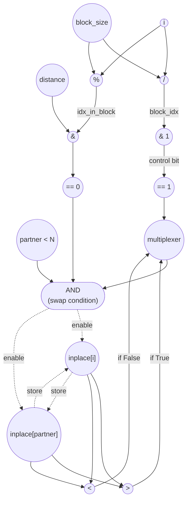

# ASAP Model Notes
- Since swaps only happen when the iterator is on the first half of comparison pairs, the loop can be fully unrolled since there aren't any overlapping loads/stores/ between iterations
- block_size takes 3 cycles to complete (load stage, add, left shift), no store required because it is an intermediate value
- ascending takes a while to compute because it needs both block_idx (1 cycles to divide) and the result of mod, comparison (2 more cycles). ascending is ready at start of cycle 7. Both block_idx and ascending are intermediate values. 
- ascending is ready by the time we hit the if (ascending) statement, which means that should_swap can also be calculated ahead of time + ready by the next cycle.
- **does load/store into temp cause extra cycles? (consult Sihao)**

# Bitonic Stage Performance
Parameters: `N = 8`, `stage = 1`, `pass = 0` ⇒ `distance = 1`, `block_size = 4`.
- `float initial_input[N] = {3.0f, 1.0f, 4.0f, 2.0f, 8.0f, 6.0f, 7.0f, 5.0f};`

## Loop classification

| dim | trip_count | kind | II | notes |
|-----|------------|------|----|-------|
| `i` | `N` = 8    | parallel | n/a | The predicate `(idx_in_block & distance) == 0` makes the active iters touch disjoint pairs `{i, i+distance}`, so **no two iters write the same element of `inplace[]`**: fully unrolled. The body is predicated (not early-exit), so op counts use the **speculative interpretation** — every iter pays the body cost; the swap stores are mux-gated by the AND of `(idx_in_block & distance) == 0`, `partner < N`, and `should_swap`. |

## Critical path (`total_cycles`)

Under parallel-unroll of `i`, the body runs once and `total_cycles` is the per-iter critical-path depth. Per-iter named scalars (`block_idx`, `idx_in_block`, `half_block`, `ascending`, `partner`, `should_swap`, `temp`) are defined and consumed within a single iter with no carry, so they are treated as **transient (anonymous-equivalent) intermediates** — same convention as `c` in bisection_step and `mid` in binary_search. They flow directly via dataflow with no named store/load round-trip. The loop-invariants `block_size` and `distance` are computed in the prologue and broadcast via dataflow to all unrolled lanes (same convention as `alpha` in axpy and `H·W` in batchnorm). The longest chain runs through the `ascending` compare, then mux to `should_swap`, then the AND-enable, then the (parallel) swap stores:

```
Prologue (loop-invariant compute, value broadcasts via dataflow):
  C1: load stage          ‖ load pass
  C2: stage + 1           ‖ 1 << pass            (distance value ready)
  C3: 1 << (stage + 1)                            (block_size value ready)

Per-iter body (parallel-unrolled across i):
  C4: load i
  C5: i / block_size      ‖ i % block_size       ‖ i + distance        ‖ base + i  (addr_i)
  C6: block_idx & 1       ‖ idx_in_block & dist  ‖ partner < N (cmp)   ‖ base + partner (addr_p) ‖ load inplace[i]
  C7: == 0  → ascending   ‖ == 0  → predicate    ‖ load inplace[partner]
  C8: cmp_gt              ‖ cmp_lt
  C9: mux(ascending, cmp_gt, cmp_lt) → should_swap
  C10: AND(predicate, partner < N, should_swap) → enable
  C11: store inplace[i]   ‖ store inplace[partner]   (both gated by enable; values mux-routed)

total_cycles = 11
```

`inplace[i]` and `inplace[partner]` land at C6 and C7 respectively, so the value compares fire at C8 and feed the mux at C9 in lockstep with `ascending` (also at C7). The outer predicate path and `partner < N` finish at C7 / C6 and wait at the AND-gate. With unbounded fan-out, both swap stores fire in the same cycle: the values to commit are just `inplace[partner]` and `inplace[i]`, which are already loaded — `temp` is a source-level convenience that, treated as anonymous-equivalent, does not force serialization.

`total_cycles = 11`, independent of `N` since `i` is parallel.

## Op counts

Speculative accounting: every iter pays the body cost; predicates gate the stores, not the compute. `half_block = block_size / 2` is declared but never read — counted as a dead computation under Convention 5.

### Algorithmic
| op       | count | source |
|----------|-------|--------|
| loads    | 16    | `inplace[i]` (8) + `inplace[partner]` (8) |
| stores   | 16    | swap writes to `inplace[i]` (8) + `inplace[partner]` (8), mux-gated by the AND-enable |
| compares | 40    | `(idx_in_block & distance) == 0` (8) + `(block_idx & 1) == 0` → ascending (8) + `partner < N` (8) + `cmp_gt` (8) + `cmp_lt` (8) — both value compares run in parallel and the mux selects on `ascending` |
| adds     | 8     | `partner = i + distance` |
| divs     | 8     | `i / block_size` |
| mods     | 8     | `i % block_size` |
| bitops   | 32    | `block_idx & 1` for `% 2` (8) + `idx_in_block & distance` (8) + mux `should_swap = ascending ? cmp_gt : cmp_lt` (8) + 3-input AND for swap-enable `predicate ∧ (partner<N) ∧ should_swap` (8). The mux and AND are the control-gating logic that sits on the critical path at C9 and C10. |

### Overhead (induction, address-gen, prologue, dead code)
| op           | count | source |
|--------------|-------|--------|
| loads        | 11    | induction `i` reads (8) + param hoists `pass`, `stage`, `N` (3). `block_size` and `distance` are computed once in the prologue and broadcast via dataflow — no per-iter load. The per-iter transient scalars (`block_idx`, `idx_in_block`, `partner`, `ascending`, `should_swap`, `temp`) flow anonymously and contribute no load. |
| stores       | 8     | induction `i` writes (8). No prologue stores: `block_size` and `distance` flow as anonymous-equivalent loop-invariants. Per-iter transient scalars contribute no store. |
| adds         | 9     | `i++` (8) + prologue `stage+1` (1) |
| address_adds | 16    | `&inplace[i]` (8) + `&inplace[partner]` (8) — 1 per `[]` access, incremental-stride |
| compares     | 8     | loop bound `i < N` |
| bitops       | 10    | dead `half_block = block_size / 2` (strength-reduced to `>> 1`, counted at every iter per Convention 5: 8) + prologue `1 << pass` (1) + `1 << (stage+1)` (1) |

### Totals
| op           | total |
|--------------|------:|
| loads        | **27** |
| stores       | **24** |
| adds         | **17** |
| address_adds | **16** |
| divs         | **8**  |
| mods         | **8**  |
| bitops       | **42** |
| compares     | **48** |
| muls / subs / shifts / transcendentals | 0 |

Load/store columns are dominated by array I/O (16 / 16) plus the induction var (8 / 8); the per-iter transient scalars cost nothing because they flow anonymously. Address-gen for the two array accesses contributes 16 `address_adds` (tracked separately from regular `adds` per the indexing-operator rule). The dead `half_block` is counted under the "golden standard" model.

## Data Dependency Graph
Note that `partner = i + distance` and its edges were omitted for readability. The 2 possible values of `should_swap` are assumed to be calculated in parallel and is passed into the multiplexer. 
