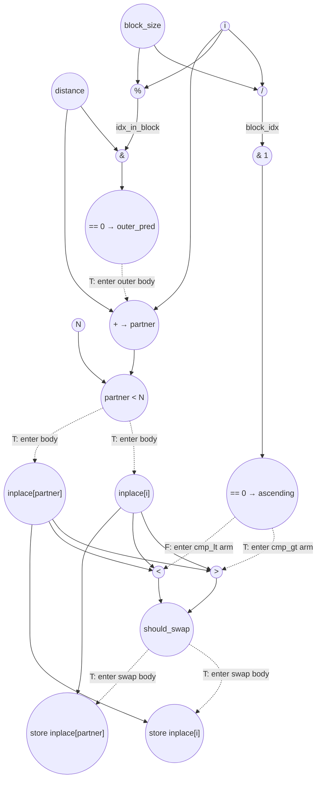

# ASAP Model Notes
- Since swaps only happen when the iterator is on the first half of comparison pairs, the loop can be fully unrolled — there are no overlapping loads/stores between iterations.
- `load i` fires at C1 in parallel with the prologue loads: each parallel-unrolled lane treats `i` as a per-lane constant with no dependency on `stage`, `pass`, or the prologue's loop-invariant compute.
- `block_size` takes 3 cycles to complete (load stage at C1, +1 at C2, left shift at C3), no store required because it is an intermediate value.
- Under no-predication, the kernel has four nested gates: outer `(idx_in_block & distance) == 0`, `partner < N`, `if (ascending)`, and `if (should_swap)`. Each compare retires before the body it gates can fire. Operations in nested if-bodies wait for the latest retiring ancestor compare. The `partner < N` chain ends up binding — it pushes loads, and the value compare for `should_swap` to cycles 9–10, with stores at C11.
- `ascending` and `outer_pred` both retire at C6 in parallel (computed unconditionally before the outer `if`), but they are no longer the binding chain. Only one of `cmp_gt`/`cmp_lt` fires per active lane (the taken arm of `if (ascending)`); only swap lanes (where `should_swap = 1`) commit the inplace writes.
- `block_idx`, `idx_in_block`, `partner`, `ascending`, `should_swap`, `temp` are intermediate (anonymous-equivalent) values — defined and consumed within a single iter with no carry, so they flow as dataflow edges with no named load/store round-trip.

# Bitonic Stage Performance
Parameters: `N = 8`, `stage = 1`, `pass = 0` ⇒ `distance = 1`, `block_size = 4`.
- `float initial_input[N] = {3.0f, 1.0f, 4.0f, 2.0f, 8.0f, 6.0f, 7.0f, 5.0f};`

For these inputs:
- Active lanes (`outer_pred = T`): `i ∈ {0, 2, 4, 6}` — 4 of 8
- All 4 active lanes pass `partner < N` (partners 1, 3, 5, 7 are all `< 8`)
- `ascending = 1` for lanes in block 0 (`i ∈ {0, 2}`); `ascending = 0` for lanes in block 1 (`i ∈ {4, 6}`)
- `should_swap = 1` for `i ∈ {0, 2}` (3 > 1, 4 > 2); `should_swap = 0` for `i ∈ {4, 6}` (8 < 6 is false, 7 < 5 is false)
- Swap lanes: `i ∈ {0, 2}` — 2 of 4 active lanes commit writes

## Loop classification

| dim | trip_count | kind | II | notes |
|-----|------------|------|----|-------|
| `i` | `N` = 8    | parallel | n/a | The predicate `(idx_in_block & distance) == 0` makes the active iters touch disjoint pairs `{i, i+distance}`, so **no two iters write the same element of `inplace[]`**: fully unrolled. Under no-predication, the outer `if` is a true branch — the predicate compare commits first, and only the taken branch's ops fire. Three further nested branches (`if (partner < N)`, `if (ascending) … else …`, `if (should_swap)`) compose under the same rule: each compare retires before its body fires, and only the taken arm contributes ops and cycles. For `N=8, distance=1`, the active lanes are `i ∈ {0,2,4,6}` (4 of 8); within them, only `i ∈ {0,2}` reach the swap body. Ops upstream of and including the outer predicate compute fire on every lane; the partner add, partner-bound check, and inplace loads fire only on the 4 active lanes; the two value compares (`cmp_gt`, `cmp_lt`) fire only on lanes where the taken arm of `if (ascending)` selects them; the swap stores fire only on lanes where `should_swap = 1`. |

## Critical path (`total_cycles`)

Under parallel-unroll of `i`, the body runs once and `total_cycles` is the per-iter critical-path depth, taken as the max over the lane types (skipped lanes terminate at C6; non-swap active lanes at C10; swap lanes at C11). Per-iter named scalars (`block_idx`, `idx_in_block`, `half_block`, `ascending`, `partner`, `should_swap`, `temp`) are defined and consumed within a single iter with no carry, so they are treated as **transient (anonymous-equivalent) intermediates** — same convention as `c` in bisection_step and `mid` in binary_search. They flow directly via dataflow with no named store/load round-trip. The loop-invariants `block_size` and `distance` are computed in the prologue and broadcast via dataflow to all unrolled lanes (same convention as `alpha` in axpy and `H·W` in batchnorm). Under no-predication, the binding chain runs through the four nested gates; on swap lanes (`i ∈ {0,2}`):

```
C1: load stage   ‖ load pass   ‖ load i   ‖ load N       (all kernel inputs and per-lane iter constant)
C2: stage + 1    ‖ 1 << pass = distance
C3: 1 << (stage+1) = block_size
C4: i / block_size = block_idx            ‖ i % block_size = idx_in_block   ‖ block_size >> 1 = half_block (dead)
C5: block_idx & 1                         ‖ idx_in_block & distance
C6: == 0 → ascending                      ‖ == 0 → outer_pred              [outer_pred retires]
C7: partner = i + distance                                                  [inside outer body — waits for outer_pred]
C8: partner < N                                                             [partner<N retires]
C9: load inplace[i] ‖ load inplace[partner]                                 [inside partner<N body — waits for partner<N; bare-scalar subscripts, no addr-gen cycle]
C10: cmp_gt OR cmp_lt → should_swap                                         [taken arm of if (ascending); should_swap retires]
C11: store inplace[i] ‖ store inplace[partner]                              [inside if (should_swap) body — waits for should_swap]

total_cycles = 11
```

The longest chain runs `load pass → 1<<pass → idx_in_block & distance → ==0 → outer_pred → partner = i+distance → partner<N → load inplace[partner] → cmp_gt/lt → should_swap → store`. (The `ascending` chain — `load stage → stage+1 → block_size → block_idx → block_idx&1 → ==0 → ascending` — also lands at C6, in parallel with `outer_pred`; it is no longer binding because the binding path picks up additional depth from the partner-add and partner-bound check after the outer gate retires.) The array subscripts `inplace[i]` and `inplace[partner]` are bare scalars, so the loads fire directly off the gate with no separate address-gen cycle. Both swap stores fire at C11 in parallel: the store value for `inplace[i]` is the already-loaded `inplace[partner]` from C9, and the store value for `inplace[partner]` is the already-loaded `inplace[i]` from C9 — `temp` is a source-level convenience whose anonymous-equivalent treatment lets the two stores fire concurrently.

For lanes where the outer predicate fails (`i ∈ {1,3,5,7}`), the chain terminates at C6 — the body never enters. For lanes where `outer_pred = T` and `partner < N = T` but `should_swap = 0` (`i ∈ {4,6}` for these inputs), the chain terminates at C10 with `should_swap = cmp_lt` retiring and no stores firing. The max — and hence `total_cycles` — is set by swap lanes at 11.

`total_cycles = 11`, independent of `N` since `i` is parallel.

## Op counts

No-predication accounting at every nested `if`: an op contributes to the count only if its enclosing arm is taken on a given lane. `ascending` and `half_block` are computed unconditionally before the outer `if` (source lines 24–25), so they fire on every lane. `half_block = block_size / 2` is declared but never read — counted as a dead computation but does not extend the critical path.

For the test inputs (`N=8, distance=1, block_size=4`, initial `[3,1,4,2,8,6,7,5]`):
- All 8 lanes pay for the unconditional prologue + `block_idx`, `idx_in_block`, `half_block`, `(block_idx & 1) == 0`, `(idx_in_block & distance) == 0`, and the loop bound check.
- The 4 active lanes (`i ∈ {0,2,4,6}`) additionally pay for `partner = i + distance`, `partner < N`, the two inplace loads (bare-scalar subscripts, no addr-gen), and one of `cmp_gt`/`cmp_lt` (the taken arm of `if (ascending)`).
- The 2 swap lanes (`i ∈ {0,2}`) additionally pay for the two swap stores.

### Algorithmic
| op       | count | source |
|----------|-------|--------|
| loads    | 8     | `inplace[i]` (4) + `inplace[partner]` (4) — active lanes only |
| stores   | 4     | swap writes to `inplace[i]` (2) + `inplace[partner]` (2) — swap lanes only (`i ∈ {0,2}`) |
| compares | 24    | `(idx_in_block & distance) == 0` → outer_pred (8, every lane) + `(block_idx & 1) == 0` → ascending (8, computed unconditionally before outer if) + `partner < N` (4, active lanes) + `cmp_gt` (2, active lanes with `ascending=1`) + `cmp_lt` (2, active lanes with `ascending=0`) — only the taken arm of `if (ascending)` fires |
| adds     | 4     | `partner = i + distance` — inside outer body, active lanes only |
| divs     | 8     | `i / block_size` — unconditional |
| mods     | 8     | `i % block_size` — unconditional |
| bitops   | 16    | `block_idx & 1` for `% 2` (8, unconditional) + `idx_in_block & distance` (8, unconditional). No mux or AND-enable under strict no-pred: the source-level if/else and the conditional store lower to dataflow gating, not to bitop-level control logic. |

### Overhead (induction, address-gen, prologue, dead code)
| op           | count | source |
|--------------|-------|--------|
| loads        | 11    | induction `i` reads (8) + param hoists `pass`, `stage`, `N` (3). `block_size` and `distance` are computed once in the prologue and broadcast via dataflow — no per-iter load. The per-iter transient scalars (`block_idx`, `idx_in_block`, `partner`, `ascending`, `should_swap`, `temp`) flow anonymously and contribute no load. |
| stores       | 8     | induction `i` writes (8). No prologue stores: `block_size` and `distance` flow as anonymous-equivalent loop-invariants. Per-iter transient scalars contribute no store. |
| adds         | 9     | `i++` (8) + prologue `stage+1` (1) |
| address_adds | 0     | `inplace[i]` and `inplace[partner]` are bare-scalar subscripts (no arithmetic baked inline into the brackets), so neither charges an address_add. The arithmetic that produces `partner` is a regular `add` (already counted under Algorithmic), not an address_add. |
| compares     | 8     | loop bound `i < N` |
| bitops       | 10    | dead `half_block = block_size / 2` (strength-reduced to `>> 1`, computed unconditionally before outer if, counted at every iter as a dead op: 8) + prologue `1 << pass` (1) + `1 << (stage+1)` (1) |

### Totals
| op           | total |
|--------------|------:|
| loads        | **19** |
| stores       | **12** |
| adds         | **13** |
| address_adds | **0**  |
| divs         | **8**  |
| mods         | **8**  |
| bitops       | **26** |
| compares     | **32** |
| muls / subs / shifts / transcendentals | 0 |

Load column is dominated by array I/O on the 4 active lanes (8) plus the induction var (8) and three param hoists (3). Stores: 4 from the 2 swap lanes' inplace writes plus 8 from the induction `i` writes. The array accesses `inplace[i]` and `inplace[partner]` are bare-scalar subscripts, so they contribute 0 `address_adds` (no arithmetic baked inline into the brackets). The dead `half_block` is counted as work but never on the critical path.

## Data Dependency Graph
Active-lane graph (one lane of `i ∈ {0,2,4,6}`). Under `i` parallel-unroll, 8 such graphs run concurrently — 4 active lanes proceed past `outer_pred`, of which 4 pass `partner < N`, of which 2 fire the swap stores. Dotted "gate" edges mark the strict no-pred compare→body serializations.


