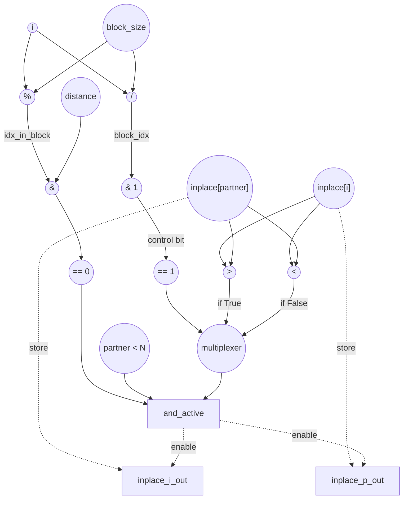

# Bitonic Stage Performance
Parameters: `N = 8`, `stage = 1`, `pass = 0` ⇒ `distance = 1`, `block_size = 4`  
`float initial_input[N] = {3.0f, 1.0f, 4.0f, 2.0f, 8.0f, 6.0f, 7.0f, 5.0f};`

## Cycle + Instruction Count
- Expected cycle count:
  - `II = 1` — active iterations are independent. The predicate `(idx_in_block & distance) == 0` selects only the lower element of each compare-pair (even values of i), so iter `i` and its partner iter `i+distance` are never both active, and writes to `inplace[i]` / `inplace[i+distance]` never collide across iters.
  - `inner_cycles = N * II = 8`
  - `outer_cycles ≈ 2` for the loop-invariant prologue: `distance = 1 << pass`, `block_size = 1 << (stage+1)`.
  - **total ≈ 10**
- loads = `2 * N = 16`   (`inplace[i]`, `inplace[partner]` per iter)
- stores = `2 * N = 16`   (predicated swap; counted at worst-case path)
- divs = `1 * N = 8`   (`block_idx = i / block_size`)
- mods = `1 * N = 8`   (`idx_in_block = i % block_size`)
- bitops = `2 * N = 16`   (`block_idx & 1` for `% 2`, `idx_in_block & distance`)
- compares = `4 * N = 32`   (`ascending == 0`, `(idx_in_block & distance) == 0`, `partner < N`, value `>` or `<`)
- adds = `1 * N = 8`   (`partner = i + distance`)

## Data Dependency Graph
Note that `partner = i + distance` and its edges were omitted for readability. The 2 possible values of `should_swap` are assumed to be calculated in parallel and is passed into the multiplexer. 
