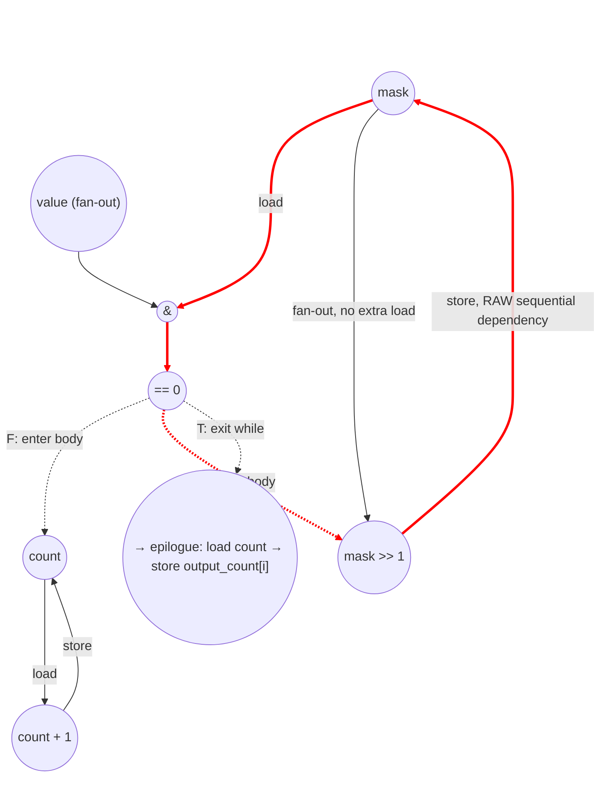

# ASAP Model Notes
- Purpose of the kernel is to count leading zeros
- Has data dependent control flow, breaks out at the first non-leading zero
- Can be fully unrolled because each output_count only depends on the current i-iter's input_data
    - Critical path will be the input with the most leading zeros, excluding zero itself since it has its own branch: 0x1

## Cycle count: 
Prologue (else branch, value != 0):
- C1: load input_data[i]
- C2: cmp value == 0 (false → enter else)
- C3: init store count=0 ‖ init store mask=0x80000000

Considering false branch only since it is longer.
While loop body (5 cycles/iter, governed by mask recurrence):
- +1: load mask                            (header read, gated on prior store)
- +1: AND value & mask
- +1: cmp == 0                             (gates body under no-predication)
- +1: load count               (body op for shift's RHS)
- +1: add count+1 ‖ shift mask>>1
- +1: store count ‖ store mask             (closes the carry)

Exit iter (cmp returns true, body skipped):
- +3: load mask → AND → cmp == 0

Epilogue:
- +1: load count
- +1: store output_count[i]
# CLZ Performance
Parameters: `N = 6`.
- `uint32_t input_data[N] = {0x1, 0x100, 0x10000, 0x1000000, 0x80000000, 0};`
- Expected `output_count[N] = {31, 23, 15, 7, 0, 32};`
- Counts below assume the input parameters above.

## Loop classification

| dim | trip_count | kind | II | notes |
|-----|------------|------|----|-------|
| `i` | `N` = 6 | parallel | n/a | each outer iter privatizes `value`, `count`, `mask` and writes a distinct `output_count[i]`; `input_data` is read-only. Fully unrolled (`LOOM_PARALLEL` + `LOOM_UNROLL(8)`). |
| inner `while` | data-dependent | sequential (data-dep termination) | 5 | carries `mask` and `count` via scalar. Trip count `K` is input-dependent: `K` = number of leading zero bits of `value`; for the given inputs `K = {31, 23, 15, 7, 0, —}` (lane 5 takes the `if (value == 0)` arm and never enters the loop). Under no-predication, the per-iter critical path includes one compare→body gap: the inner head check `(value & mask) == 0` gates the body's update arithmetic and its store. `mask` is read in both the head check and the body shift with no intervening write, so it is loaded once per iter and fanned to both uses. |

`value` is assigned exactly once at its declaration `uint32_t value = input_data[i]` and is not loop-carried, so it is anonymous dataflow — the load of `input_data[i]` fans freely to the `if (value == 0)` cmp and to every in-loop `AND`, with no scalar L/S. `count` and `mask` are reassigned per while-iter (loop-carried), so they are memory-backed and charge one load and one store per named access.

## Critical path (`total_cycles`)

Per-lane structure for the else branch (`value != 0`, while trip count `K`):

**Prologue (3 cycles)** — init stores gated on the if-cmp under no-predication:
```
1 (load input_data[i])                       [bare [i] subscript: no addr-gen cycle]
+ 1 (cmp value == 0)                         [false → enter else]
+ 1 (init store count = 0 ‖ init store mask = 0x80000000)
= 3
```

**Per while-iter recurrence (II = 5 cycles)** — the carry chain through `mask` from one iter to the next:
```
1 (load mask)                                [header read, gated on prior store; fans to AND and shift]
+ 1 (AND value & mask)
+ 1 (cmp == 0)                               [false → enter body under no-pred]
+ 1 (shift mask >> 1 ‖ load count, add count + 1)
+ 1 (store count ‖ store mask)               [closes the carry]
= 5
```
The `value` operand of the `AND` is free fan-out from the prologue's `load input_data[i]`. `mask` is loaded once in the header and fans to both the head `AND` and the body shift (no intervening write), so the shift does not pay its own load. The `count` body chain (load → add → store) runs inside the same window and is not the governing recurrence; the `mask` chain (load → AND → cmp → shift → store) sets II = 5.

**Exit iter (3 cycles, cmp returns true, body skipped):**
```
1 (load mask)
+ 1 (AND value & mask)
+ 1 (cmp == 0)                               [true → exit while]
= 3
```

**Else-epilogue (2 cycles):**
```
1 (load count)                               [bare [i] subscript on output: no addr-gen cycle]
+ 1 (store output_count[i])
= 2
```

Per-lane depth (else branch, trip `K`):
```
depth_else(K) = 3 (prologue) + 5·K + 3 (exit) + 2 (epilogue) = 5·K + 8
```

For the **if branch** (`value == 0`), the lane bypasses the while loop entirely. Under no-predication, the if-body's store waits for the `cmp` to resolve. Both `[]` subscripts are bare `[i]`, so neither charges an addr-gen cycle:
```
depth_if = 1 (load input_data[i])
        + 1 (cmp value == 0)                 [true → enter if]
        + 1 (store output_count[i] = 32)
        = 3
```

Per-lane depths for these inputs:

| i | value | K | branch | depth |
|---|-------|---|--------|------:|
| 0 | 0x1        | 31 | else | 5·31 + 8 = **163** |
| 1 | 0x100      | 23 | else | 5·23 + 8 = **123** |
| 2 | 0x10000    | 15 | else | 5·15 + 8 = **83**  |
| 3 | 0x1000000  | 7  | else | 5·7 + 8 = **43**   |
| 4 | 0x80000000 | 0  | else | 5·0 + 8 = **8**    |
| 5 | 0x0        | —  | if   | **3**              |

Under `i` parallel-unroll, `total_cycles = max = 163` (lane 0, `value = 0x1`). The worst case for any 32-bit non-zero input is `K = 31` (single LSB set), giving `5·31 + 8 = 163`; the zero-input lane always finishes faster on its 3-cycle if-arm.

## Op counts

### Per-lane formulas
Each else-branch lane (trip `K`):
- loads: `1` (input_data[i]) + `2K` (per iter: mask header + count body; `mask` is loaded once and fans to both the head AND and the body shift) + `1` (exit iter mask) + `1` (epilogue count) = `2K + 3`
- stores: `2` (init count, init mask) + `2K` (per iter: count + mask) + `1` (output_count[i]) = `2K + 3`
- adds: `K` (count++ per iter)
- shifts: `K` (mask >>= 1 per iter)
- bitops (AND): `K + 1` (body ANDs + exit AND)
- compares: `1` (value == 0) + `K` (body head cmps) + `1` (exit cmp) = `K + 2`
- address_adds: `0` (both `input_data[i]` and `output_count[i]` use bare `[i]` subscripts — no inline arithmetic)

If-branch lane (value == 0):
- loads: `1`; stores: `1`; compares: `1`; address_adds: `0`; everything else: `0`.

### Algorithmic
| op | count | source |
|----|-------|-------|
| loads | 6 | `input_data[i]` (6) |
| stores | 6 | `output_count[i]` (5 else + 1 if) |
| adds | 76 | `count++` (Σ K = 31+23+15+7+0+0) |
| shifts | 76 | `mask >>= 1` (Σ K) |
| bitops (AND) | 81 | `value & mask` per body iter + exit iter (Σ (K+1) over 5 else-lanes = 32+24+16+8+1) |
| compares | 87 | outer `if (value == 0)` (6) + while-head `(value & mask) == 0` per body + exit iter (Σ (K+1) over else-lanes = 81) |

### Overhead (loop-carried scalars, init stores, induction, address-gen)
| op | count | source |
|----|-------|-------|
| loads | 162 | per else-lane `2K + 2` reads of `mask`/`count` (excluding input_data[i] above): Σ = (2·31+2)+(2·23+2)+(2·15+2)+(2·7+2)+(2·0+2) = 64+48+32+16+2 |
| stores | 162 | per else-lane `2K + 2` init+body stores of `mask`/`count`: Σ = (2·31+2)+(2·23+2)+(2·15+2)+(2·7+2)+(2·0+2) = 64+48+32+16+2 |
| iv loads | 6 | outer `i` reads: one per iter (`N` = 6) |
| iv stores | 7 | outer `i` writes: 6 body writebacks + 1 `i = 0` init |
| iv adds | 6 | `i++` (`N` = 6) |
| iv compares | 6 | bound `i < N` (`N` = 6) |
| address_adds | 0 | both `input_data[i]` and `output_count[i]` use bare `[i]` subscripts — no inline arithmetic, so no address-add is charged |

The outer `i` loop is parallel and fully unrolled, so its iterator is a per-lane constant and stays **off the critical path** — but op counts are independent of scheduling, so the source-level loop-control work is still counted (as in `axpy_eval.md`/`fft_butterfly_eval.md`): the `i` loop (trip `N` = 6) charges 6 iv loads, 6 iv adds, 6 iv compares, and 7 iv stores (6 writebacks + the `i = 0` init). The inner `while` has no separate iterator — its `mask`/`count` carry and the `(value & mask) == 0` termination compare are charged above, not as iv ops.

### Totals
| op | total |
|----|------:|
| loads        | **174** |
| stores       | **175** |
| adds         | **82**  |
| shifts       | **76**  |
| bitops (AND) | **81**  |
| compares     | **93**  |
| address_adds | **0**   |
| muls / divs / transcendentals | 0 |

## Data Dependency Graph
Per-body (one inner iter of `while ((value & mask) == 0)`). Under `i` parallel-unroll, 6 such graphs run concurrently, one per input lane — 5 of them enter the while loop; lane 5 (`value = 0`) takes the if-arm and runs only `load → cmp → store` (both `[i]` subscripts are bare, so no addr-gen cycles). The recurrence closes back via `store mask → load mask` and `store count → load count` at the next iter.



The 5-cycle II is governed by the `mask` recurrence (load mask → AND → cmp → shift → store mask); the `count` body chain fits within this window.