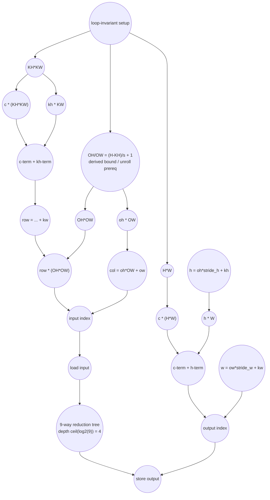

# ASAP Model Notes
- Each output pixel (h, w) is parallel along with each channel (c)
    - The 2 inner loops write to distinct output pixels, therefore they are parallel within a fixed patch offset (kh, kw)
    - Each output is a function of (c, h, w) and depends on the input (c, kh, kw, oh, ow)
    - oh and ow can be written as functions of kh and kw
- Each output pixel's contributors can be tree-reduced because summation is associative

# Column to Image Performance

Parameters (from `main.cpp`): `C = 3`, `H = 8`, `W = 8`, `KH = 3`,
`KW = 3`, `stride_h = 1`, `stride_w = 1`.
Derived sizes: `OH = (H - KH) / stride_h + 1 = 6`, `OW = 6`,
`O = C*H*W = 192` output pixels, and
`T = C*KH*KW*OH*OW = 972` scatter-update iterations.

## Loop classification

The source loop nest is easiest to classify after remapping it to output
coordinates. For a fixed output `(c, h, w)`, valid contributors are the patch
offsets `(kh, kw)` for which
`oh = (h - kh) / stride_h` and `ow = (w - kw) / stride_w` are integral and
in range. Those contributors all sum into the same output pixel.

| dim | trip_count | kind | II | notes |
|-----|------------|------|----|-------|
| zero-fill `i` | `O` = 192 | parallel | n/a | writes one zero identity per output pixel. The stores execute and count; for pixels with contributors they feed the later accumulation identity. |
| channel `c` | `C` = 3 | parallel | n/a | channels write disjoint output slices. |
| output pixel `(h, w)` | `H*W` = 64 per channel | parallel | n/a | different output pixels have independent reduction buckets. |
| valid contributors per `(c,h,w)` | edge-dependent, max 9 | reduction | n/a | overlapping column entries are combined with associative floating-point `+`, tree-reduced for the ASAP latency bound. |

For stride 1 with `KH = KW = 3`, the 1D overlap counts over `h` or `w` are
`{1, 2, 3, 3, 3, 3, 2, 1}`. The 2D fan-in is the product of the row and column
overlaps, so interior output pixels have 9 contributors and boundary pixels
have fewer. The maximum reduction depth is therefore `ceil(log2(9)) = 4`.
Equivalently, treating the zero-fill value as an identity leaf gives
`ceil(log2(10)) = 4`, so it does not change the maximum depth.

This eval keeps the source-level operation counts for the scatter update:
`output[...] += input[...]` charges the dynamic output load, input load, add,
and output store for every scatter iteration. The bucketed reduction
classification is used for dependency depth. A different implementation that
privatizes buckets and writes each output pixel once would have lower memory
traffic; that is not what this source expresses.

## Critical path (`total_cycles`)

The binding lane is one interior output pixel with 9 contributors. The input
address branch is longer than the output-address branch:

```
1 (preheader scalar loads and per-lane iterator constants)
+ 3 (OH/OW setup: sub -> div -> add)
+ 1 (OH*OW, oh*OW, and row partial products)
+ 1 (col = oh*OW + ow, and row*(OH*OW))
+ 1 (input address add row*(OH*OW) + col)
+ 1 (load input)
+ 4 (tree-reduce the 9 contributing values)
+ 1 (store output)
= 13
```

The output address `c*(H*W) + h*W + w` resolves by cycle 6:
`H*W` is hoisted, `h = oh*stride_h + kh` and `w = ow*stride_w + kw`
are ready before the input load, and the two output-address adds finish well
before the reduction result is ready. The zero-fill identity store is also
shallower than the input-address/load path, so it does not extend
`total_cycles`.

```
total_cycles = 13
```

## Op counts

Let `R = C*KH*KW = 27` be the number of `row` computations and
`I = O + C + C*KH + R + R*OH + T = 1,365` be the total dynamic induction
steps across the zero-fill loop and the five scatter loops.

| op | total | source |
|----|------:|--------|
| loads | 3,316 | scatter input/output loads (`2*T = 1,944`) + induction reads (`I = 1,365`) + scalar-parameter loads (`C,H,W,KH,KW,stride_h,stride_w` = 7) |
| stores | 2,529 | zero-fill output stores (`O = 192`) + scatter output stores (`T = 972`) + induction writes (`I = 1,365`) |
| adds | 5,309 | OH/OW setup adds (2) + `row` adds (`2*R = 54`) + `h/w/col` adds (`3*T = 2,916`) + source update adds (`T = 972`) + induction adds (`I = 1,365`) |
| address_adds | 2,916 | output-index adds (`2*T = 1,944`) + input-index adds (`T = 972`) |
| muls | 5,890 | `row` products (`2*R + 1 = 55`) + `h/w/col` products (`3*T = 2,916`) + input-index products (`T + 1 = 973`) + output-index products (`2*T + 1 = 1,945`) + zero-fill bound product (1) |
| divs | 2 | OH/OW setup |
| subs | 2 | OH/OW setup |
| compares | 1,365 | loop-bound checks, one per induction step |
| bitops / transcendentals | 0 | none |

Inline arithmetic inside `input[row * (OH * OW) + col]` and
`output[c * (H * W) + h * W + w]` contributes `address_adds`; multiplications
inside those subscripts remain `muls`. The named temporaries `row`, `h`, `w`,
and `col` are single-assignment anonymous dataflow values, so their arithmetic
counts but they do not add scalar loads or stores.

## Data Dependency Graph

One interior output lane (9 contributors) is shown; the other lanes are
identical and independent, and boundary lanes have fewer contributors. The
binding chain runs through the derived bounds `OH`/`OW` (an unroll
prerequisite) into the input-index branch (`OH*OW`, `row*(OH*OW)`, and
`col = oh*OW + ow`) -> load input -> reduction -> store. The output-address
branch (`c*(H*W) + h*W + w`) consumes `H*W` and direct-bound iterators only; it
resolves by cycle 6 and is slack. Each contributor's input value is ready at
cycle 8; the 9-way associative reduction tree has depth
`ceil(log2(9)) = 4`, so the result stores at cycle 13.


