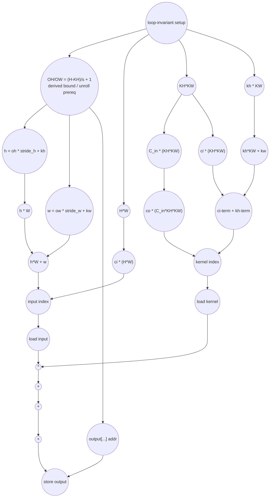

# ASAP Model Notes
- Initial zero-store loop is executed, but it **does not lie on the critical path**
    - Convolution output overwrites all values in the zero-store, and the convolution output arrives later than the zero-store completion, so there is no WAW hazard
    - Zero-store is still included in operation counts
- 

# 2D Convolution Performance
Parameters (from `main.cpp`): `C_in = 3`, `C_out = 4`, `H = 8`, `W = 8`, `KH = 3`, `KW = 3`, `stride_h = 1`, `stride_w = 1`.
Derived sizes: `OH = 6`, `OW = 6`, `P = C_out*OH*OW = 144` output positions, `K = C_in*KH*KW = 27` taps/output.

## Loop classification

| dim | trip_count | kind | II | notes |
|-----|------------|------|----|-------|
| zero-fill `i` | `P` = 144 | parallel | n/a | initializes `output[]` to zero. These stores execute and count, but every element is later overwritten by the convolution writeback. |
| `co` | 4 | parallel | n/a | distinct output-channel slices; no carry through register or memory. |
| `oh` | 6 | parallel | n/a | distinct output rows. |
| `ow` | 6 | parallel | n/a | distinct output columns. |
| `ci*kh*kw` | 27 | reduction | n/a | one `sum += input_val * kernel_val` reduction per output; associative `+` is tree-reduced under the ASAP model. |

The three output-space dims fully unroll to 144 independent output lanes. Each lane has 27 independent tap products, so the full leaf-level parallelism is `144 * 27 = 3,888` multiplies. The current `LOOM_PARALLEL(4, contiguous)` and `LOOM_UNROLL(4)` hints request only a 16-lane outer schedule; that is a hint, not the DAG bound.

`sum` is a reduction accumulator, so the tree-reduced schedule does not charge named loads/stores for it. The `h` and `w` temporaries are single-assignment per tap, so they are anonymous dataflow rather than memory-backed scalars.

## Critical path (`total_cycles`)

The zero-fill pass executes and contributes stores, but it completes before the corresponding convolution writeback and does not extend the path. The live chain is one output lane:
```
1 (preheader loads: params C_in/C_out/H/W/KH/KW/stride_h/stride_w + iterators)
+ 3 (OH/OW: H-KH (sub) -> /stride_h (div) -> +1 (add); trip count / unroll factor ready)
+ 1 (h/w multiplies oh*stride_h, ow*stride_w; kh*KW, and loop-invariant H*W, KH*KW)
+ 1 (h/w adds -> h, w ready; ci*(H*W), ci*(KH*KW), kh*KW+kw)
+ 1 (input-index product h*W; kernel co*(C_in*KH*KW))
+ 1 (input-index partial h*W + w)
+ 1 (input-index final ci*(H*W) + (h*W+w); kernel index also ready by here)
+ 1 (load input || load kernel)
+ 1 (mul input_val * kernel_val)
+ 5 (tree-reduce 27 taps)
+ 1 (store output)
= 17
```

`OH` and `OW` are **derived** loop bounds, not direct kernel inputs: `OH = (H-KH)/stride_h+1` (and `OW` likewise). Under full unrolling the `oh`/`ow` iteration spaces do not exist until their trip counts are known, so this sub -> div -> add chain (ready at cycle 4) is a prerequisite to unrolling and prefixes the live chain — it is not free hoisted setup the way a direct-parameter bound (`co < C_out`, `ci < C_in`, ...) would be. This is a structural/unroll prerequisite, distinct from a data dependence on the body's operands; we charge the bound *computation* (three cycles), not an additional per-lane `oh < OH` gating compare (that compare is already in the op counts).

Only the `oh`/`ow`-indexed input branch is delayed by the prefix. The kernel index `co*(C_in*KH*KW) + ci*(KH*KW) + kh*KW + kw` depends only on direct-bound iterators (`co, ci, kh, kw`) and loop-invariant products, so it starts at cycle 1 and runs concurrently, staying slack. The output-store address `co*(OH*OW)+oh*OW+ow` also depends on `OH`/`OW` but resolves by cycle 7, far ahead of the reduction, so it is slack too. The binding chain is therefore: OH/OW prefix -> `h`/`w` -> input index -> load -> multiply -> 27-tap tree-reduce -> store.

The input subscript `ci*(H*W) + h*W + w` is evaluated as a normal expression DAG: from ready `h` and `w`, three levels (product terms, partial add `h*W + w`, then the final add), with `h`/`w` themselves costing a multiply + an add above the iterators.

## Op counts

Let `I = 5,932` be the total number of dynamic induction-variable steps across the seven source loops (`i`, `co`, `oh`, `ow`, `ci`, `kh`, `kw`).

| op | total | source |
|----|------:|--------|
| loads | 13,716 | input/kernel loads (`2*P*K = 7,776`) + induction reads (`I = 5,932`) + 8 scalar-parameter loads |
| stores | 6,220 | zero-fill stores (`P = 144`) + final output stores (`P = 144`) + induction writes (`I = 5,932`) |
| adds | 17,454 | `h/w` arithmetic (`2*P*K = 7,776`) + reduction adds (`P*K - P = 3,744`) + induction adds (`I = 5,932`) + OH/OW setup adds (2) |
| address_adds | 19,728 | input-index adds (`2*P*K = 7,776`) + kernel-index adds (`3*P*K = 11,664`) + final output-index adds (`2*P = 288`) |
| muls | 31,397 | `h/w` arithmetic (`2*P*K = 7,776`) + tap products (`P*K = 3,888`) + input-index products (`2*P*K + 1 = 7,777`) + kernel-index products (`3*P*K + 2 = 11,666`) + output-index products (`2*P + 1 = 289`) + zero-fill bound product (`1`) |
| divs | 2 | OH/OW setup |
| subs | 2 | OH/OW setup |
| compares | 5,932 | loop bounds |

Inline subscript arithmetic is decomposed as an expression DAG. Adds inside brackets are counted as `address_adds`; multiplies inside brackets are counted under `muls`, with loop-invariant products hoisted once and broadcast. The one-time zero-fill bound setup is loop-invariant and does not affect the critical path.

## Data Dependency Graph

One output lane is shown; the other 143 lanes are identical and independent. The binding chain runs through the derived bounds `OH`/`OW` (an unroll prerequisite) into the input-index branch (`h = oh*stride_h+kh`) -> load -> multiply -> reduction -> store. The kernel-index branch (direct-bound iterators only) starts at cycle 1 and is slack, as is the output-address branch (it consumes `OH`/`OW` but resolves long before the reduction). The actual 27-tap reduction tree has depth 5.



## CGRA-Constrained Model

The ASAP bound above assumes unlimited functional units and memory bandwidth. This section adds a second lower bound for a CGRA with **separate** arithmetic and memory-issue resources (no shared or bidirectional memory port).

> **Symbol note.** Elsewhere in this eval, `P` denotes the number of output positions (`P = C_out·OH·OW = 144`). **Within this section only**, `P` instead denotes the number of arithmetic PEs (the hardware resource). The output-position count is written as `144` here to avoid collision.

- `P` — arithmetic PEs, homogeneous, one op/cycle each (divides, compares, bitops, transcendentals included).
- `L` — load-issue lanes, one load/cycle each.
- `S` — store-issue lanes, one store/cycle each.

Every counted load consumes an `L` slot and every counted store an `S` slot — **including** induction-variable accesses. Every counted non-load/store op consumes a `P` slot; in particular the **`address_adds` from the inline subscript arithmetic are PE work, not load/store traffic** — they count toward `A`. With `CP` the ASAP dependency bound, `A` the counted non-load/store ops, `LD` the loads, and `ST` the stores, each phase's bound is:

```
compute = ceil(A / P)
load    = ceil(LD / L)
store   = ceil(ST / S)
phase   = max(CP, compute, load, store)
```

**Two ordered phases.** The kernel runs a separate zero-fill loop (`for i: output[i] = 0`) *before* the convolution loop (`output[...] = sum`, an overwrite). Both write `output[]`, so the zero-fill must precede the convolution writes (a WAW ordering) and cannot be hidden behind the convolution under finite issue lanes. As with `fft_butterfly`'s barrier-ordered stages, the bound is the **sum** of each phase's `max(...)`, not one kernel-wide `max`. The op-count totals partition exactly across the two phases — the zero-fill loop owns its 144 zero stores plus its `i` induction; the convolution owns everything else:

| phase | CP | A | LD | ST | compute=⌈A/36⌉ | load=⌈LD/12⌉ | store=⌈ST/12⌉ | phase cycles | binding |
|-------|---:|---:|---:|---:|---:|---:|---:|---:|---------|
| zero-fill   | 2  | 289    | 144    | 288   | 9     | 12    | 24  | **24**    | store |
| convolution | 17 | 74,226 | 13,572 | 5,932 | 2,062 | 1,131 | 495 | **2,062** | compute |

- zero-fill: `A = i++ adds (144) + i<144 compares (144) + zero-fill bound product (1) = 289`; `LD = i reads (144)`; `ST = zero stores (144) + i writes (144) = 288`.
- convolution: `A = 74,515 − 289 = 74,226`; `LD = 13,716 − 144 = 13,572`; `ST = 6,220 − 288 = 5,932`. Partition check: `289 + 74,226 = 74,515`, `144 + 13,572 = 13,716`, `288 + 5,932 = 6,220` — all equal the eval's op-count totals.

**6×6 example (`P = 36`, `L = 12`, `S = 12`).**
```
cycles = 24 (zero-fill) + 2,062 (convolution) = 2,086
```
(A naive single kernel-wide aggregate `max(17, ⌈74,515/36⌉, ⌈13,716/12⌉, ⌈6,220/12⌉) = max(17, 2,070, 1,143, 519) = 2,070` would *under*-count, because it lets the ordered zero-fill stores overlap the convolution phase.)

**Bottleneck: convolution compute-bound, with a store-bound zero-fill floor.** The convolution phase dominates: its ~74k homogeneous ops — mostly ~31k multiplies and ~20k `address_adds` from the deep input/kernel index expressions — give `compute = 2,062` on 36 PEs (a ~121× stretch over the ASAP depth of 17). Because inline address arithmetic is charged as PE work (not memory traffic), it inflates the compute term, not the load/store terms; the convolution's loads (1,131) and stores (495) trail well behind. The ordered zero-fill adds a small store-bound floor of 24 (its 288 stores on 12 lanes), for `2,086` total. Widening to `P ≈ 74,226/1,131 ≈ 66` PEs would shift the convolution bottleneck onto its load lanes.
