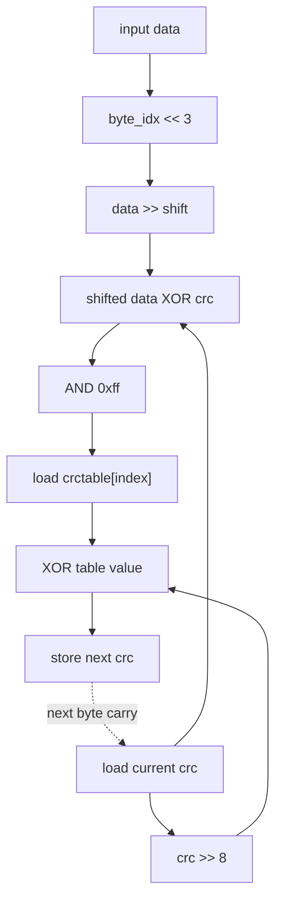

# ASAP Model Notes
Computes crc32 checksum
## Cycle Count (for longest path)
- C1: store crc (polynomial is anonymous)
Enter outer i loop:
- cycle 1: check i < N
- cycle 2: load input_data[i]
- Enter middle byte_idx loop:
    - cycle 1: check byte_idx < 4
    - cycle 2: byte_idx * 8 || load crc
    - cycle 3: data >>
    - cycle 4: & 0xFF
    - cycle 5: crc ^ byte (byte is an intermediate, no load)
    - cycle 6: store crc
    - Enter inner bit loop:
        - cycle 1: load crc
        - cycle 2: crc & 1 (choose true path since it's longer)
        - cycle 3: implicit compare (crc & 1 != 0)
        - cycle 4: crc >> 1
        - cycle 5: ^ polynomial
        - cycle 6: store crc


# CRC32 Performance

Parameters: `N = 256` from `main.cpp`; `input[i] = i * 0x12345678` and the
expected checksum is `0xB8B4D336 = 3098858294`.

## Modeling basis: optimized-IR exception

The protected notes above describe the bit-serial C++ source. This evaluation
instead follows the post-`-O1` algorithmic DAG that Loom receives from
Clang/LLVM, because the compiler transformation makes the source-level golden
model vastly different from the simulated DFG. The optimized IR replaces the
eight-iteration bit loop with the standard byte-at-a-time transition:

```text
table_index = ((data >> (byte_idx << 3)) ^ crc) & 0xff
crc_next    = (crc >> 8) ^ crctable[table_index]
```

The generated Handshake IR contains the 256-entry global `.crctable.2` and one
table load per byte. There is no dynamic `bit` loop and no data-dependent
true-arm count `K` in this model.

Only the algorithmic DAG shape follows the optimized IR. The standard golden
counting conventions remain in force: the named loop-carried `crc` and induction
variables charge their normal loads/stores, loop induction is counted per
iteration, and every counted operation has unit latency. The IR's integer/index
casts are not separate golden-model op categories and are not counted.

## Loop classification

| dim | trip_count | kind | II | notes |
|-----|-----------:|------|---:|-------|
| `i` | `N = 256` | sequential | 28 | Carries `crc` across four sequential byte updates. The source `LOOM_PARALLEL`/`LOOM_UNROLL(8)` hints do not remove this dependence. |
| `byte_idx` | 4 | sequential | 7 | Each table index depends on the current `crc`, and the loaded table value produces the next `crc`. |

The source `bit` dimension is absent from the optimized DAG. A different
parallel-CRC algorithm could combine independent partial CRCs, but the single
lookup-table transformation does not do that.

## Critical path (`total_cycles`)

For one byte, the carried path is seven cycles. Operations shown on the same
line execute in parallel:

```text
1  byte_idx << 3                         || load crc
2  data >> shift_amount                  || crc >> 8
3  shifted_data ^ crc
4  & 0xff
5  load crctable[table_index]
6  (crc >> 8) ^ table_value
7  store crc
```

The table index for byte `b+1` cannot be formed until byte `b` produces its new
CRC state. Therefore the four byte transitions contribute `4 * 7 = 28` cycles
per input word. The fixed path is:

```text
4        cold path to the first input load
+ 28*N   four carried lookup-table updates per word
+ 3      final load crc -> bitwise not -> store output
= 28*N + 7
```

For `N = 256`:

```text
total_cycles = 28*256 + 7 = 7175
```

For the previously compared `N = 4` simulation fixture, the kernel-DAG model is
`28*4 + 7 = 119` cycles. A reported 120-cycle simulation is therefore separated
by only one boundary/control-retirement cycle rather than by a different CRC
algorithm.

## Op counts

All counts below use the optimized lookup-table shape with the standard golden
load/store and induction conventions.

### Per-outer-iteration formulas

- algorithmic loads: `1` input load + `4` table loads = `5`
- `crc` loads: `4`; `crc` stores: `4`
- induction loads/adds/compares: `1` outer + `4` byte = `5` each
- induction stores: `1` outer-body store + `1` byte initialization + `4` byte-body stores = `6`
- shifts: `4 * (byte_idx << 3, data >> shift, crc >> 8) = 12`
- bitops: `4 * (index xor, index mask, table-result xor) = 12`
- address adds: `0`; both `input_data[i]` and `crctable[table_index]` use bare computed indices

Once per kernel, count the initial stores of `crc` and `i`, the zero-length
compare, the final load and bitwise-not of `crc`, and the output store.

### Algorithmic

| op | formula | `N = 256` | source |
|----|---------|----------:|--------|
| loads | `5N` | 1280 | `N` input loads + `4N` CRC-table loads |
| stores | `1` | 1 | final `*output_checksum` |
| shifts | `12N` | 3072 | byte shift amount, data shift, and `crc >> 8` per byte |
| bitops | `12N + 1` | 3073 | three per byte plus final `~crc` |

### Overhead

| op | formula | `N = 256` | source |
|----|---------|----------:|--------|
| loads | `9N + 1` | 2305 | `4N + 1` `crc` loads + `5N` induction loads |
| stores | `10N + 2` | 2562 | `4N + 1` `crc` stores + `6N + 1` induction stores |
| adds | `5N` | 1280 | outer and byte induction increments |
| compares | `5N + 1` | 1281 | outer/byte bounds plus the optimized zero-length guard |
| address_adds | `0` | 0 | no arithmetic appears inside either subscript expression |

### Totals

| op | total |
|----|------:|
| loads | **3585** |
| stores | **2563** |
| adds | **1280** |
| address_adds | **0** |
| multiplies / divides | **0** |
| shifts | **3072** |
| bitops | **3073** |
| compares | **1281** |
| transcendentals | **0** |

The arithmetic demand is
`A = 1280 + 3072 + 3073 + 1281 = 8706`, and the total counted dynamic work is
`8706 + 3585 + 2563 = 14854` operations. The optimized DAG is static-affine;
its counts no longer depend on the distribution of CRC bits.

## Data Dependency Graph

The table precomputes the effect of the source's eight bit updates for every
possible low-byte value. It shortens each carried transition, but the next table
index still depends on the previous table result.



## CGRA-Constrained Model

The aggregate lower bound uses the same optimized dynamic operation set and the
`6x6` resource configuration (`P = 36`, `L = 12`, `S = 12`):

- `CP = 7175`
- `A = 8706`
- `LD = 3585`
- `ST = 2563`

```text
compute = ceil(8706 / 36) = 242
load    = ceil(3585 / 12) = 299
store   = ceil(2563 / 12) = 214
cycles  = max(7175, 242, 299, 214) = 7175
```

**Bottleneck: dependency-bound.** The lookup table removes most of the source
work, but the 1024 byte updates remain one carried CRC chain. The aggregate
resource terms are all far below the critical-path depth.

<!-- BEGIN CGRA-SCHED:crc32 -->
### Finite-Resource Schedule Estimate (time-local)

*Reproducible estimate for the deterministic criticality-priority list-schedule policy defined in [`docs/spec-kernel-performance.md`](../../../docs/spec-kernel-performance.md). It is **not** a lower bound (the aggregate model above is the lower bound) and **not** cycle-accurate RTL; it exposes the short windows of local `P`/`L`/`S` pressure that the aggregate model smooths over.*

**Resource configuration:** `P = 36`, `L = 12`, `S = 12` (`6x6`).

| region | CP | A | LD | ST | aggregate | scheduled (makespan) |
|--------|---:|--:|---:|---:|----------:|---------------------:|
| crc32 | 7175 | 8706 | 3585 | 2563 | 7175 | 7175 |

- **scheduled_cycles** = 7175  (sum of ordered-region makespans)
- **aggregate_cycles** = 7175  (the lower bound above, unchanged)
- **gap_cycles** = 0  (scheduled − aggregate)
- **gap_ratio** = 1  (scheduled / aggregate)

**Local `P`/`L`/`S` pressure** (saturated cycles / longest saturated run / peak ready backlog):
- `P`: 0 / 0 / 0
- `L`: 131 / 131 / 1523
- `S`: 114 / 96 / 246

<!-- END CGRA-SCHED:crc32 -->
