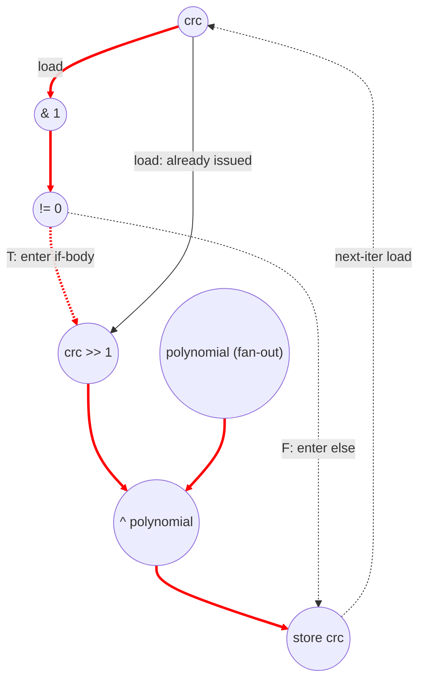

# ASAP Model Notes
Computes crc32 checksum
## Cycle Count (for longest path)
- C1: store crc (polynomial is anonymous)
Enter outer i loop:
- cycle 1: check i < N
- cycle 2: load input_data[i]
- Enter middle byte_idx loop:
    - cycle 1: check byte_idx < 4
    - cycle 2: byte_idx * 8 || load crc
    - cycle 3: data >>
    - cycle 4: & 0xFF
    - cycle 5: crc ^ byte (byte is an intermediate, no load)
    - cycle 6: store crc
    - Enter inner bit loop:
        - cycle 1: load crc
        - cycle 2: crc & 1 (choose true path since it's longer)
        - cycle 3: implicit compare (crc & 1 != 0)
        - cycle 4: crc >> 1
        - cycle 5: ^ polynomial
        - cycle 6: store crc


# CRC32 Performance
Parameters: `N = 256` (from `main.cpp`).
- `input[i] = i * 0x12345678` for `i ∈ [0, N)`.
- Expected `*output_checksum = 0xB8B4D336 = 3098858294`.
- `K = 4065` is the data-dependent number of bit iters where `(crc & 1)` is true (the taken arm of the inner `if`). For this input, simulating the recurrence gives 4065 of the 32·N = 8192 bit iters firing the `^ polynomial`; the remaining 4127 take the shorter false arm.

## Loop classification

| dim | trip_count | kind | II | notes |
|-----|------------|------|----|-------|
| `i` | `N` = 256 | sequential | 180 + ⟨k⟩ avg (worst 212, best 180) | carries `crc` through every byte and bit iter. The per-bit conditional shift-XOR is a non-associative recurrence, so neither tree-reduction nor independent unrolled lanes apply; the outer loop must execute sequentially. Per-outer-iter cycle count = 180 + `k_i`, where `k_i` is the number of true arms in that outer iter; Σ`k_i` = K = 4065 for this input. |
| `byte_idx` | 4 | sequential | 45 + `k_b` (worst 53, best 45) | carries `crc` through `crc ^= byte` and the 8 inner bit iters. `k_b` = # of true arms in that byte iter ∈ [0, 8]. |
| `bit` | 8 | sequential | 6 if true arm, 5 if false arm | carries `crc` through the conditional `(crc >> 1) ^ polynomial` / `crc >> 1` update. Non-associative — cannot tree-reduce. Per-iter cycle count is data-dependent: only the taken arm's ops are on the chain (no-pred convention). |

`polynomial` is assigned once at its declaration and not loop-carried, so it is anonymous dataflow — the constant fans freely to every `^ polynomial` site with no scalar L/S. `data` and `byte` are likewise single-assignment per iter with no carry, so they flow directly via dataflow with no named load/store round-trip. `crc` is reassigned per byte iter and per bit iter (loop-carried), so it is memory-backed and charges 1 load and 1 store per named access.

## Critical path (`total_cycles`)

The carried recurrence on `crc` dominates the schedule. Per-iter recurrences from inside out:

**Per bit iter** — through `crc`. Under strict no-pred, only the taken arm's ops are on the chain:
```
True arm (6 cycles):  load crc → (crc & 1) → (cmp != 0) → (crc >> 1) → (^ polynomial) → store crc
False arm (5 cycles): load crc → (crc & 1) → (cmp != 0) → (crc >> 1)                  → store crc
```
The body op (`crc >> 1`) fires the cycle after the gating compare retires. The taken arm is data-dependent: across the run, `K = 4065` iters take the true arm and `32·N − K = 4127` take the false arm.

**Per byte iter** — through `crc`:
```
1 (cmp byte_idx < 4)                         [bound check, gates body]
+ 1 (byte_idx * 8 ‖ load crc)                [load crc is a body op gated on cmp; no dep on byte chain → parallel]
+ 1 (data >> (byte_idx*8))
+ 1 (& 0xFF) → byte
+ 1 (crc ^ byte)
+ 1 (store crc)                              [closes pre-bit chain]
+ 8 inner bit iters                          [6·k_b + 5·(8 − k_b) = 40 + k_b cycles, where k_b ∈ [0,8] is # true arms in this byte iter]
= 5 (pre-bit) + 40 + k_b = 45 + k_b
```
`byte_idx`'s iv chain (load → add → store → next-iter cmp) runs in parallel with the body and never bottlenecks. Worst case k_b = 8 → II = 53; best case k_b = 0 → II = 45.

**Per outer iter** — 4 byte iters: per-outer-iter contribution to the chain = 4·(5) + 6·k_i + 5·(32 − k_i) = 20 + 160 + k_i = 180 + k_i, where k_i = Σ k_b over that outer iter. Setup of `byte_idx = 0` and `bit = 0` happens in parallel with the prior iter's tail and is fully absorbed in steady state.

**Total cycles (data-dependent on K):**
```
1 (init store crc = 0xFFFFFFFF)
+ 3 (cold start of iter 0: cmp i<N ‖ byte_idx=0 → load input_data ‖ load byte_idx → cmp byte_idx<4)
+ Σ_i (180 + k_i) = 180·N + K        [steady-state outer iter recurrence with actual taken arms]
+ 3 (final: load crc → ~crc → store *output_checksum)
= 180·N + K + 7
```
For `N = 256, K = 4065`: `total_cycles = 180·256 + 4065 + 7 = 50152`.
Worst-case bound (all true arms, K = 32·N = 8192): `212·N + 7 = 54279`.
Best-case bound (all false arms, K = 0): `180·N + 7 = 46087`.

The binding chain is:
`init store crc → load crc (iter 0, byte 0) → crc^byte → store crc → 8 × bit-iter [load crc → AND → cmp → shift → (^poly if true arm) → store crc] → … repeated 4 × N times … → load crc (final) → ~crc → store *output_checksum`. Each bit-iter contributes 5 or 6 cycles depending on whether `crc & 1` resolves false or true at that step.

## Op counts

### Per-outer-iter formulas
- crc loads (loop-carried memory cell): `4` (byte pre-bit headers) + `32` (bit headers) = `36`
- crc stores: `4` (byte pre-bit closers) + `32` (bit closers) = `36`
- iv loads (per iter bound-check read): `1` (i) + `4` (byte_idx) + `32` (bit) = `37`
- iv stores (per-iter writebacks + per-loop-entry inits): `1` (i body) + `1` (byte_idx init) + `4` (byte_idx body) + `4` (bit inits, once per byte iter) + `32` (bit body) = `42`
- iv adds (i++, byte_idx++, bit++): `1 + 4 + 32 = 37`
- iv compares (bound checks): `1 + 4 + 32 = 37`
- algorithmic bitops: `4` (`& 0xFF`) + `4` (`^ byte`) + `32` (`& 1`) + `k_i` (taken-arm `^ polynomial`) = `40 + k_i`
- algorithmic compares: `32` (implicit `(crc & 1) != 0`)
- muls: `4` (`byte_idx * 8`)
- shifts: `4` (`data >>`) + `32` (`crc >> 1`, both arms always shift) = `36`
- address_adds: `0` (`input_data[i]` is a bare-variable subscript — no inline arithmetic in the brackets, so it charges no address_add)
- input_data loads: `1`

Plus once per kernel: `1` init store (`crc = 0xFFFFFFFF`), `1` i-iv init store, `1` final load `crc`, `1` `~crc` bitop, `1` store `*output_checksum`.

For the test inputs (`N = 256`, `K = Σ k_i = 4065`):

### Algorithmic
| op | count | source |
|----|-------|-------|
| loads    | 256    | `input_data[i]` (N = 256) |
| stores   | 1      | `*output_checksum` (1) |
| muls     | 1024   | `byte_idx * 8` per byte iter (4·N) |
| shifts   | 9216   | `data >>` (4·N = 1024) + `crc >> 1` per bit iter, both arms (32·N = 8192) |
| bitops   | 14306  | `& 0xFF` (1024) + `crc ^ byte` (1024) + `crc & 1` (8192) + `^ polynomial` taken-arm only (K = 4065) + `~crc` (1) |
| compares | 8192   | implicit `(crc & 1) != 0` per bit iter (32·N) |

### Overhead (loop-carried `crc` L/S, induction, address-gen)
| op | count | source |
|----|-------|-------|
| loads        | 18689 | crc loads: 36·N + 1 = 9217 (4·N byte pre-bit + 32·N bit headers + 1 final) + iv loads: 37·N = 9472 |
| stores       | 19970 | crc stores: 36·N + 1 = 9217 (1 init + 4·N byte pre-bit + 32·N bit body) + iv stores: 42·N + 1 = 10753 (1 i init + N byte_idx inits + 4·N bit inits + 37·N body writebacks) |
| adds         | 9472  | iv increments: i++ (256) + byte_idx++ (1024) + bit++ (8192) |
| compares     | 9472  | iv bound checks: i<N (256) + byte_idx<4 (1024) + bit<8 (8192) |
| address_adds | 0     | `input_data[i]` is a bare-variable subscript with no inline arithmetic in the brackets — charges no address_add. `*output_checksum` is a bare pointer deref — no `[]`, no address_add. |

### Totals
| op | total |
|----|------:|
| loads        | **18945** |
| stores       | **19971** |
| adds         | **9472**  |
| muls         | **1024**  |
| shifts       | **9216**  |
| bitops       | **14306** |
| compares     | **17664** |
| address_adds | **0**     |
| divs / mods / transcendentals | 0 |

The `crc` carried chain dominates the memory traffic: 9217 of 18945 loads and 9217 of 19971 stores are `crc` round-trips across the 1024 byte iters and 8192 bit iters. The 32·N implicit `!= 0` compares from `if (crc & 1)` (8192) are nearly half the compare count; without strict no-pred those would fuse into a bit-test branch and disappear.

## Data Dependency Graph
Inner bit iter — the binding recurrence on `crc`. Per iter it takes 6 cycles when the true arm is taken (`^ polynomial` on the chain) and 5 cycles when the false arm is taken. The carry edge `store crc → next-iter load crc` closes the loop. The outer byte iter wraps this with a `crc ^= byte` step (one load/store round-trip on crc) before the 8-iter bit loop. The outermost `i` loop wraps that with `data = input_data[i]` and re-runs the byte loop 4 times.



The bit-iter II varies with the taken arm: 6 cycles on true-arm iters, 5 on false-arm iters. The false-arm short-circuit does reduce `total_cycles` — under strict no-pred only the actually-taken arm's ops sit on the chain, so for `N = 256, K = 4065` the depth is 50152 cycles, 4127 cycles below the worst-case bound. The byte and outer loops add no additional recurrence — they multiply the recurrence count (4 × N byte iters × 8 bit iters = 32·N bit iters total).

## CGRA-Constrained Model

The ASAP bound above assumes unlimited functional units and memory bandwidth.
This section adds the aggregate lower bound for a CGRA with separate arithmetic
and memory-issue resources, following `docs/spec-kernel-performance.md`.

With `6x6` resources (`P = 36`, `L = 12`, `S = 12`):

- `CP = 50152`
- `A = adds (9472) + muls (1024) + shifts (9216) + bitops (14306) + compares (17664) = 51682`
- `LD = 18945`
- `ST = 19971`

```
compute = ceil(51682 / 36) = 1436
load    = ceil(18945 / 12) = 1579
store   = ceil(19971 / 12) = 1665
cycles  = max(50152, 1436, 1579, 1665) = 50152
```

**Bottleneck: dependency-bound.** The non-associative `crc` recurrence is far
longer than the aggregate P/L/S resource terms for this input trace.

<!-- BEGIN CGRA-SCHED:crc32 -->
### Finite-Resource Schedule Estimate (time-local)

*Reproducible estimate for the deterministic criticality-priority list-schedule policy defined in [`docs/spec-kernel-performance.md`](../../../docs/spec-kernel-performance.md). It is **not** a lower bound (the aggregate model above is the lower bound) and **not** cycle-accurate RTL; it exposes the short windows of local `P`/`L`/`S` pressure that the aggregate model smooths over.*

**Resource configuration:** `P = 36`, `L = 12`, `S = 12` (`6x6`).

| region | CP | A | LD | ST | aggregate | scheduled (makespan) |
|--------|---:|--:|---:|---:|----------:|---------------------:|
| crc32 | 50152 | 51682 | 18945 | 19971 | 50152 | 50152 |

- **scheduled_cycles** = 50152  (sum of ordered-region makespans)
- **aggregate_cycles** = 50152  (the lower bound above, unchanged)
- **gap_cycles** = 0  (scheduled − aggregate)
- **gap_ratio** = 1  (scheduled / aggregate)

**Local `P`/`L`/`S` pressure** (saturated cycles / longest saturated run / peak ready backlog):
- `P`: 0 / 0 / 0
- `L`: 823 / 823 / 9715
- `S`: 910 / 910 / 1270

<!-- END CGRA-SCHED:crc32 -->
