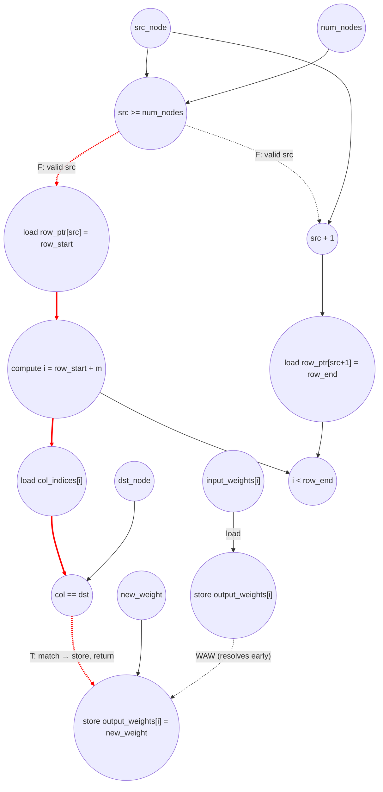

# ASAP Model Notes
- update edge weight in a Compressed Sparse Row graph

## Cycle Count/Critical Path
    Initial state: inputs available
    c1: bounds compare  src_node >= num_nodes
    c2: load row_ptr[src_node] (=row_start)  ‖  addr_add src_node+1     [gated by c1]
    c3: load row_ptr[src_node+1] (=row_end)  ‖  compute i = row_start+m
    c4: load input_col_indices[i]            ‖  bound compare i<row_end  (overlap, off path)
    c5: match compare  col == dst_node
    c6: store output_weights[i]              (needs match @c5)

    Total ≈ 6, with the copy loop running in parallel (c1–c3, hidden)

# Edge Update Performance
Parameters (from `main.cpp`): `num_nodes = 8`, `num_edges = 16`, `src = 2`,
`dst = 4`, `new_weight = 100`.
- `row_ptr = {0, 2, 4, 7, 10, 12, 14, 15, 16}`
- `col_indices = {1, 2, 0, 3, 0, 4, 5, 1, 2, 6, 3, 7, 4, 6, 7, 5}`
- `input_weights[i] = i + 1`
- For `src = 2`: `row_start = row_ptr[2] = 4`, `row_end = row_ptr[3] = 7` →
  degree `D = 3`. The scan reads `col_indices[4] = 0` (miss), then
  `col_indices[5] = 4 == dst` (hit) → stores `output_weights[5] = 100` and
  returns. So `K = 2` search iterations execute; matched index = 5.
- Expected `output_weights = {1,2,3,4,5,100,7,8,9,10,11,12,13,14,15,16}`.

Size parameters used in the formulas:
- `E` = `num_edges` (copy-loop trip count) = 16
- `D` = degree of `src_node` = `row_ptr[src_node+1] − row_ptr[src_node]` = 3
  (max search-loop trip count)
- `K` = search iterations actually executed (`K ≤ D`, data-dependent: the loop
  returns on the first match, so `K` = match position + 1, or `D` on no
  match) = 2

## Loop classification

| dim | trip_count | kind | II | notes |
|-----|------------|------|----|-------|
| copy `i` | `E` = 16 | parallel | n/a | each iter copies `input_weights[i] → output_weights[i]` at a distinct index; no value crosses iterations. Fully unrolled. Connects to the rest only through a write-after-write on `output_weights[matched]`, which resolves long before the matched store. |
| search `i` | `K ≤ D`, `K` = 2 | parallel (data-dependent termination) | n/a | each iter touches only its own `input_col_indices[i]` and a distinct `output_weights[i]`; no carried register/accumulator/in-place dep, so it is parallel by data-dependence. The early `return` makes trip `K` input-dependent, and the match compare `col_indices[i] == dst_node` is the termination predicate on the critical path. |

Neither loop carries a register/accumulator/in-place dependence, so neither
contributes a `trip × II` term to `total_cycles`. Following the parallel-dim
treatment used for `i` in `clz_eval.md` — *under maximum unrolling the iterator
is a compile-time constant per lane: no load, no increment, no bound compare,
no store* — neither loop charges induction-variable ops. (Contrast `crc32_eval.md`,
whose dims are **sequential** and therefore do charge per-iter iv load/add/
store/compare.)

`row_start`, `row_end`, and the loaded `input_col_indices[i]` value are each
assigned exactly once and not loop-carried, so they are anonymous dataflow —
free fan-out from the defining op, no scalar L/S. Only the underlying array
loads (`row_ptr[…]`, `input_col_indices[i]`) are charged. `src_node`,
`num_nodes`, `dst_node`, and `new_weight` are kernel-input scalars and fan out
freely. The conditional store of `new_weight` is the sole algorithmic store of
the search phase and fires only on the matched iteration.

## Critical path (`total_cycles`)

The binding chain is the upstream bounds → row-pointer chain feeding **one**
search-loop iteration; it does not run through the copy loop and does not scale
with any trip count:

```
1 (bounds cmp  src_node >= num_nodes)        [gates all downstream under no-pred]
+ 1 (load row_ptr[src_node] = row_start  ‖  address_add src_node+1)
+ 1 (load row_ptr[src_node+1] = row_end  ‖  compute search i)
+ 1 (load input_col_indices[i]           ‖  bound cmp i<row_end overlaps, off path)
+ 1 (match cmp  input_col_indices[i] == dst_node)
+ 1 (store output_weights[i] = new_weight)   [needs match]
= 6
```

`total_cycles ≈ 6`, constant in `E`, `D`, and `K`. Why the constant depth holds:
- **Copy loop is hidden.** Its per-iteration chain is just
  `load input_weights[i] → store output_weights[i]` (≈2 cycles; bare `[i]`
  subscripts → no address arithmetic), starting at c0. It links to the rest
  only through a write-after-write on `output_weights`, and the copy store
  (~c2) precedes the matched search store (~c6), so it never extends the path.
- **The loop-bound compare does not serialize.** `i < row_end` overlaps the
  body's data path (c4) and adds no cycle once `row_end` is a known scalar —
  treated symmetrically with the copy loop's `i < num_edges`, which is likewise
  not charged. The search store lands at c6 only because its chain cannot
  *start* until `row_start`/`row_end` are produced by the upstream
  bounds-check → `row_ptr` chain (c1–c3); the copy chain has no such upstream
  dependence and starts at c0.
- **The match compare stays on the path** as the genuine data-dependent
  termination predicate of the early-return loop. Iterations are mutually
  independent (each touches only its own `i`), so full unrolling counts the
  per-iteration chain once — the early return selects *which* iteration stores
  but does not lengthen the longest single-iteration chain.

## Op counts

### Per-phase formulas
- **Copy loop** (parallel, trip `E`): `E` loads (`input_weights[i]`) + `E`
  stores (`output_weights[i]`). No iv ops, no bound compare, no address_adds
  (bare `[i]`).
- **Bounds + row pointers**: `1` compare (`src_node >= num_nodes`) + `2` loads
  (`row_ptr[src_node]`, `row_ptr[src_node+1]`) + `1` address_add (`src_node+1`,
  inline subscript arithmetic).
- **Search loop** (parallel, data-dependent termination, trip `K`): `K` loads
  (`input_col_indices[i]`) + `K` compares (`col_indices[i] == dst_node`, the
  termination predicate) + `1` store (matched `output_weights[i] = new_weight`).
  No iv ops, no bound compare, no address_adds (bare `[i]`).

### Algorithmic
| op | count | source |
|----|-------|-------|
| loads    | `E + K + 2` = **20** | `input_weights[i]` (E=16) + `input_col_indices[i]` (K=2) + `row_ptr[·]` (2) |
| stores   | `E + 1` = **17**     | `output_weights[i]` copy (E=16) + matched `output_weights[5]=new_weight` (1) |
| compares | `K + 1` = **3**      | `src_node >= num_nodes` (1) + `col_indices[i] == dst_node` per executed iter (K=2) |

### Overhead (address-gen, induction)
| op | count | source |
|----|-------|-------|
| address_adds | **1** | `src_node + 1` inline in `row_ptr[src_node+1]`. All other subscripts (`[i]`, `[src_node]`) are bare → no address_add. |
| iv loads / adds / stores / bound compares | **0** | both loops are parallel; under maximum unrolling the iterator is resolved per lane and charges nothing (per `clz_eval.md`). |

### Totals
| op | total |
|----|------:|
| loads        | **20** |
| stores       | **17** |
| compares     | **3**  |
| address_adds | **1**  |
| adds / muls / divs / shifts / bitops / transcendentals | 0 |

The work is dominated by the bulk copy (`E` loads + `E` stores = 32 of the 37
memory ops); the actual edge update is a 2-iteration scan (`K` loads, `K`
compares, one store). Both copy and scan run off the critical path of the
upstream bounds → row-pointer chain, so `total_cycles` stays at ≈6 regardless
of `E`, `D`, or `K`.

## Data Dependency Graph
The binding chain is the upstream bounds → row-pointer chain feeding one search
iteration (red). The copy loop (top, parallel) and the non-matching search
iterations run concurrently and off the critical path; they connect only via a
write-after-write on `output_weights` that resolves well before the matched
store. Bare `[i]`/`[src_node]` subscripts charge no address-gen cycle; only the
inline `src_node + 1` does.



The constant 6-cycle depth is set by the upstream bounds → row-pointer chain
(`bounds cmp → load row_start → load row_end`) plus one search iteration's
`load col_indices[i] → match cmp → store`. The copy loop and the additional
non-matching scan iterations add op-count work but never extend the path.
