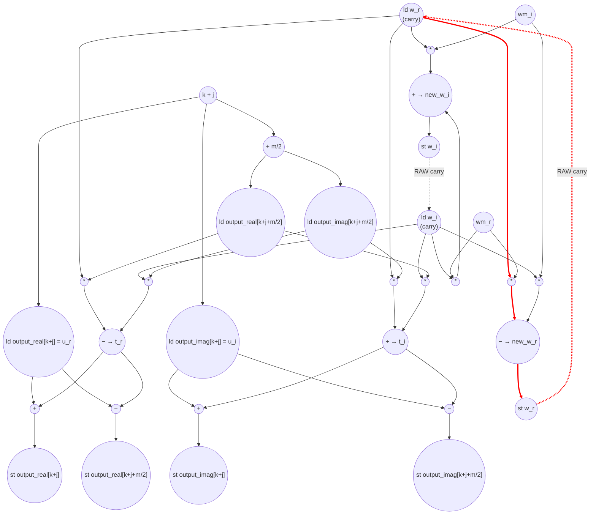

# ASAP Model Notes
- s loop sequential, k loop parallel, j loop sequential
  - s = 4 takes the longest to compute since j iterates m/2 or 8 times
## Cycle Count/Critical Path
Radix-2 DIT, in-place. copy → log2(N) stages; stages serialize (whole-array RMW barrier).

Copy loop (parallel, fully unrolled) — hidden under stage-1 prologue:
- c1: load input_real[i] ‖ load input_imag[i]      (bare [i], no addr_add)
- c2: store output_real[i] ‖ store output_imag[i]

Per-stage prologue (array-independent → overlaps prev stage, off path):
- 1<<s = m  →  -2π/m  →  cosf ‖ sinf = wm_r,wm_i   (~3 cyc, hidden)

Inside the j-loop: TWO data-independent chains; they meet only at t = w·X
  TWIDDLE coefficient (scalar recurrence, II=4) — NOT an addressed load:
  - c?: load w_r ‖ load w_i        (fixed-address scalar; fanned to t_r,t_i,new_w_r,new_w_i)
  - +1: mul w·wm (4 muls)
  - +1: new_w_r = sub ‖ new_w_i = add
  - +1: store w_r ‖ store w_i       (carry → next iter's load)
  → w^(p) ready at 1 + 4p ; last useful is w^(m/2-1) (the w-update in the final iter is dead)

  DATA operand (addressed load) — this is the ONLY place k+j+m/2 lives:
  - counter j (induction, II=3)  →  k+j  →  +m/2     (2 addr_adds; k block-const, m/2 hoisted)
  - load output[k+j+m/2] = X
  → X^(p) ready at 3p + 4

Converge at the butterfly (only meeting point of the two chains):
  - t = w·X   (waits for max of the two arrivals)
  - t_r = sub ‖ t_i = add
  - u ± t     (u = output[k+j] loaded early, off path)
  - store output[k+j] ‖ store output[k+j+m/2]

Per-stage CP = max(2m+1 [twiddle-bound], 1.5m+5 [addr-bound]):
- s=1 m=2 : max(5, 8)  = 8    addr-bound  (j-trip=1 → twiddle recurrence vacuous, w-update fully dead)
- s=2 m=4 : max(9, 11) = 11   addr-bound
- s=3 m=8 : max(17,17) = 17   tie
- s=4 m=16: max(33,29) = 33   twiddle-bound (8-deep rotation; dominates)

Total = 2 (copy) + 8 + 11 + 17 + 33 = 71

# FFT Butterfly Performance
Parameters (from `main.cpp`): `N = 16`, `log2(N) = 4`. 

Radix-2 decimation-in-time Cooley-Tukey: after copying the (bit-reversed) input
into the working `output_*` buffers, `log2(N)` stages combine sub-transforms of
size `m = 2^s`. Per stage, twiddle `wm = e^(−2πi/m)` is formed once, then each
`m`-block runs `m/2` butterflies on the pairs `(k+j, k+j+m/2)`, rotating a running
twiddle `w ← w·wm` between butterflies.

Per-stage geometry (`N = 16`):

| s | `m = 2^s` | `m/2` (j-trip) | `N/m` (k-blocks) | j-iters in stage = `(N/m)·(m/2)` |
|---|-----------|----------------|------------------|----------------------------------|
| 1 | 2  | 1 | 8 | 8 |
| 2 | 4  | 2 | 4 | 8 |
| 3 | 8  | 4 | 2 | 8 |
| 4 | 16 | 8 | 1 | 8 |

Total butterflies = `Σ (N/m)·(m/2) = log2(N)·N/2 = 4·8 = 32`. Total k-block
instances = `Σ N/m = 8+4+2+1 = 15`.

## Loop classification

| dim | trip_count | kind | II | notes |
|-----|------------|------|----|-------|
| copy `i` | `N` = 16 | parallel | — | `output[i] = input[i]` at a distinct index; no carry. `LOOM_PARALLEL` + `LOOM_UNROLL(8)`, fully unrolled. Bare `[i]` subscripts → no address arithmetic. |
| stage `s` | `log2(N)` = 4 | sequential | per-stage critical path (whole-array RMW barrier) | stage `s+1` read-modify-writes every element stage `s` wrote (in-place aliasing across the whole array), so stages serialize. The carry is via memory, not a register, and the recurrence latency is the entire stage's butterfly chain — which differs by `m`. |
| block `k` | `N/m` (8,4,2,1) | parallel | — | block `k` owns the disjoint index range `[k, k+m)`; no value crosses blocks. Fully unrolled → `k` is a per-lane constant (no induction ops, and `k` folds into the address constants). |
| butterfly `j` | `m/2` (1,2,4,8) | sequential | 4 | carries the running twiddle `(w_r, w_i)` via `w ← w·wm`. Non-associative complex rotation → cannot tree-reduce. The array footprints of successive `j` are disjoint, so the **only** carry is the twiddle. |

`w_r`/`w_i` are loop-carried and have two assignment sites (`= 1.0f`/`= 0.0f` init,
then `= new_w_r`/`= new_w_i`), so they are **memory-backed** — each named read is a
1-cycle load, each write a 1-cycle store. Within one `j`-iter `w_r` is read four
times (`t_r`, `t_i`, `new_w_r`, `new_w_i`) with no intervening write, so it is
loaded **once** and fanned to all four uses; `w_i` likewise. `wm_r`/`wm_i` have a
single assignment site per stage and are not carried, so they are loop-invariant
dataflow — computed once per stage and broadcast, no scalar L/S. `t_r`, `t_i`,
`u_r`, `u_i`, `new_w_r`, `new_w_i` are single-assignment, non-carried → anonymous
dataflow (the array loads / op results flow directly into their consumers with no
named L/S).

## Critical path (`total_cycles`)

Within a stage the `k`-blocks are parallel, so the stage's depth is one block's
`j`-loop depth. Two **data-independent** chains advance in parallel inside that
`j`-loop and meet only at the butterfly product `t = w·X`:

> **Twiddle coefficient vs. data operand — they don't share an address.** The
> twiddle `w = (w_r, w_i)` is the rotation *coefficient*: a loop-carried **scalar**
> held at a fixed address, advanced by `w ← w·wm` from the previous `w` and the
> loop-invariant `wm` alone (lines 132–133). It is **never** fetched from the data
> array, so it needs no `k+j+m/2` address. That address exists solely to load the
> *data operand* `X = output[k+j+m/2]` (lines 117–118). The two converge only at
> `t = w·X`; the *next* twiddle `w·wm` branches off **before** that convergence, so
> it never waits on the address or the load — hence the stage depth is the **max**
> of the two arrival times, not their sum. (The dependency you'd expect if the
> twiddle were a precomputed-table load `w = twiddle[k+j+m/2]` does not exist here:
> the kernel *generates* the twiddle on the fly.)

**Twiddle recurrence (II = 4)** — the binding carry on `(w_r, w_i)`:
```
load w_r ‖ load w_i
  → (w_r·wm_r, w_i·wm_i, w_r·wm_i, w_i·wm_r)        [4 muls, parallel]
  → new_w_r = (w_r·wm_r) − (w_i·wm_i)  ‖  new_w_i = (w_r·wm_i) + (w_i·wm_r)
  → store w_r ‖ store w_i                           [closes the carry]
```
`load → mul → add/sub → store` = **II = 4**. Producing the twiddle `w^(p)` used by
butterfly `j = p` takes `p` such updates, so `w^(m/2−1)` (the last butterfly's
twiddle) is ready at `1 + 4·(m/2 − 1)`. (The twiddle update *inside* the final
`j`-iter is **dead** — no later iter consumes it — but per the dead-computation
rule it is still counted as ops; it just does not lie on the path.)

**Index / induction path** — independent of `w`, this feeds the same final
butterfly:
```
load j → (k + j) → (k+j + m/2) → load output[k+j+m/2] → mul (needs w too) → t → u±t → store
```
The `j` induction is its own sequential carry (`load j → j+1 → store j`, II = 3),
and `output[k+j+m/2]` carries inline subscript arithmetic — `k+j` then `+m/2`, two
address-adds on the chain (`k` is a parallel-block constant, `m/2` is a hoisted
per-stage constant). So the load of the upper operand for butterfly `j = p` lands
at `3p + 4`.

The last butterfly's store therefore completes at
`max( w-recurrence, index-path ) + butterfly tail`:
```
stage_CP(m) = max( 2m + 1,        // w-bound:   [1 + 4·(m/2−1)] load w^(m/2−1) + (mul→t→u±t→store)
                   1.5m + 5 )      // index-bound: [3·(m/2−1)+4] load output + (mul→t→u±t→store)
```

| s | `m` | w-bound `2m+1` | index-bound `1.5m+5` | `stage_CP` | binding |
|---|-----|----------------|----------------------|-----------|---------|
| 1 | 2  | 5  | 8  | **8**  | index/address |
| 2 | 4  | 9  | 11 | **11** | index/address |
| 3 | 8  | 17 | 17 | **17** | tie |
| 4 | 16 | 33 | 29 | **33** | twiddle recurrence |

For small `m` (early stages) the **address computation dominates** — exactly the
regime the model flags for FFT — while for large `m` (late stages) the serial
twiddle rotation dominates; they cross at `m = 8`.

The copy loop (`load input[i] → store output[i]`, 2 cycles, fully unrolled) writes
the whole array that stage 1 reads, so by the same whole-array-barrier logic it
precedes stage 1. The per-stage twiddle prologue (`1<<s → −2π/m → cos ‖ sin`,
~3 cycles) and the `w`/`j` inits are array-independent and overlap the previous
stage, so they stay off the path.

```
total_cycles = 2 (copy)
             + Σ_{s=1}^{4} stage_CP(m_s)
             = 2 + 8 + 11 + 17 + 33
             = 71
```

`critical_path = 2 (copy) + max(5,8) + max(9,11) + max(17,17) + max(33,29) = 71`,
dominated by stage 4's 8-deep serial twiddle rotation (33 of 71 cycles).

## Op counts

### Per-phase formulas
- **Copy loop** (parallel, trip `N`): `2N` loads (`input_real[i]`, `input_imag[i]`)
  + `2N` stores (`output_real[i]`, `output_imag[i]`). Bare `[i]` → 0 address_adds,
  and parallel → no induction ops.
- **Per butterfly** (`32` total): `6` loads (`output_real/imag[k+j+m/2]`,
  `output_real/imag[k+j]` = 4 array; `w_r`, `w_i` = 2 scalar) + `6` stores (4 array,
  2 scalar `w`) + `8` muls (4 for `t = w·X`, 4 for `w·wm`) + `4` adds (`t_i`,
  `u_r+t_r`, `u_i+t_i`, `new_w_i`) + `4` subs (`t_r`, `u_r−t_r`, `u_i−t_i`,
  `new_w_r`) + `2` address_adds (`k+j`, then `+m/2`; one offset pair fans to the
  real/imag and load/store of both accesses).
- **Per k-block** (`15` total): `2` stores (`w_r=1`, `w_i=0` init).
- **Per stage** (`4` total): `1` shift (`m = 1<<s`) + `1` shift (`m/2 ≡ m>>1`,
  hoisted) + `1` divide (`−2π/m`, float) + `1` cos + `1` sin.
- **Once per kernel**: `1` transcendental (`log2f(N)`, the hoisted loop bound) +
  `1` load (`N`).
- **`j` induction** (sequential, 32 iters across 15 blocks): `32` loads + `47`
  stores (32 writebacks + 15 `j=0` inits) + `32` adds (`j++`) + `32` compares.
- **`s` induction** (sequential, 4 stages): `4` loads + `5` stores (4 writebacks
  + 1 init) + `4` adds (`s++`) + `4` compares (`s ≤ log2(N)`).

### Algorithmic
| op | count | source |
|----|-------|--------|
| loads  | 160 | copy `input_*[i]` (32) + butterfly array reads `output_*[k+j]`, `output_*[k+j+m/2]` (4·32 = 128) |
| stores | 160 | copy `output_*[i]` (32) + butterfly array writes (4·32 = 128) |
| muls   | 256 | 8/iter (4 twiddle-rotate `w·X`, 4 `w·wm`) · 32 |
| adds   | 128 | 4/iter (`t_i`, `u_r+t_r`, `u_i+t_i`, `new_w_i`) · 32 |
| subs   | 128 | 4/iter (`t_r`, `u_r−t_r`, `u_i−t_i`, `new_w_r`) · 32 |
| divides | 4  | `−2π/m` per stage (genuine float divide) |
| shifts | 8   | `m = 1<<s` (4) + `m/2 ≡ m>>1` (4) |
| transcendentals | 9 | `cos` (4) + `sin` (4) + `log2f(N)` bound (1) |

### Overhead (loop-carried twiddle L/S, induction, address-gen, inits)
| op | count | source |
|----|-------|--------|
| loads        | 101 | `w_r`/`w_i` body loads (2·32 = 64) + `j` iv (32) + `s` iv (4) + `N` hoist (1) |
| stores       | 146 | `w_r`/`w_i` body stores (2·32 = 64) + `w` init per k-block (2·15 = 30) + `j` iv (47) + `s` iv (5) |
| adds         | 36  | `j++` (32) + `s++` (4) |
| address_adds | 64  | `k+j` (1) + `+m/2` (1) per butterfly · 32 — inline subscript arithmetic in `output_*[k+j+m/2]` / `output_*[k+j]` |
| compares     | 36  | `j < m/2` (32) + `s ≤ log2(N)` (4) |

The copy `i` and block `k` dims are **parallel** → under full unrolling their
iterators are per-lane constants: no iv loads/adds/stores/compares (per the
parallel-dim treatment). Only the **sequential** `s` and `j` dims charge
induction ops.

### Totals
| op | total |
|----|------:|
| loads        | **261** |
| stores       | **306** |
| muls         | **256** |
| adds         | **164** |
| subs         | **128** |
| address_adds | **64**  |
| divides      | **4**   |
| shifts       | **8**   |
| transcendentals | **9** |
| compares     | **36**  |

Memory traffic dominates: 567 of the load+store ops, of which the loop-carried
`w_r`/`w_i` round-trips (64 loads + 94 stores incl. inits) and the induction
writebacks are pure model overhead — under a register-resident twiddle they would
collapse and the `j`-loop II would fall from 4 to 2.

## Data Dependency Graph
One butterfly (`j`-iter). The red chain is the carried twiddle recurrence
(`load w → mul → add/sub → store w`, II = 4) that closes via the back-edges into
the next iter's `w` loads. The butterfly itself (`t = w·X`, `u ± t`) is
feed-forward; the index path (`k+j`, `+m/2`) feeds the array loads in parallel and
binds the early stages. The final-iter twiddle update is computed but dead.



The two dashed back-edges are the loop-carried RAW on `(w_r, w_i)`; they set
`II_j = 4` (load → mul → sub/add → store). They are live on iters `0 … m/2 − 2`
and **dead on `j = m/2 − 1`** (the produced twiddle is never consumed). The
butterfly and the index path are feed-forward; for early stages the index path
(`k+j → +m/2 → load`) reaches the final butterfly later than the short twiddle
chain and sets the stage depth, while for stage 4 the 8-deep twiddle rotation
dominates.