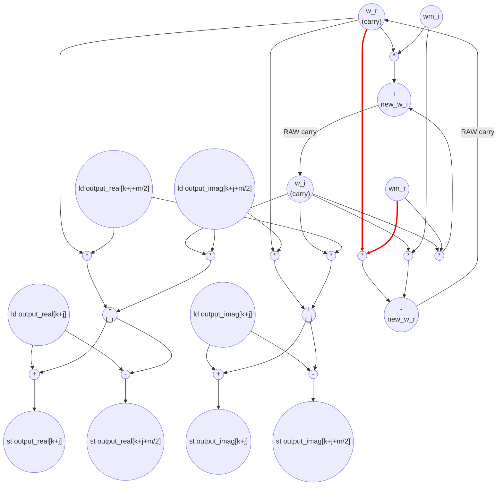

# FFT Butterfly Performance
Parameters: `N = 16`, `log2(N) = 4`. 

## Loop structure
After a one-time copy `output[i] = input[i]`, three nested loops:
- **s-loop** (outer): `s = 1 .. log2(N)`, `log2(N) = 4` iters. Per s-iter computes stage constants `m = 1<<s`, `wm_r = cos(-2π/m)`, `wm_i = sin(-2π/m)`.
- **k-loop** (mid): `k = 0, m, 2m, ...`, `N/m` iters. Per k-iter resets twiddle `w_r = 1, w_i = 0`.
- **j-loop** (inner): `j = 0 .. m/2 − 1`, `m/2` iters. Per j-iter does the length-`m` butterfly on the pair `(k+j, k+j+m/2)`, then updates `w *= wm`.

Per s-iter the j-work is `(N/m) · (m/2) = N/2` j-iters (constant across s), so total j-iters = `log2(N) · N/2 = 4 · 8 = 32` for N=16.

## Loop-carried recurrence — the RAW hazard
The j-loop has a loop-carried RAW on the twiddle `(w_r, w_i)`:
```
new_w_r = w_r * wm_r − w_i * wm_i        // mul + sub from prev-iter w
new_w_i = w_r * wm_i + w_i * wm_r        // mul + add from prev-iter w
w_r ← new_w_r ; w_i ← new_w_i
```
Both `new_w_r` and `new_w_i` are *one mul + one (sub|add)* deep from the previous iter's `w_r, w_i`, computed in parallel. Recurrence latency = 2 → **II_j = 2**.

Array-RAW analysis (none of these add to II_j):
- Within a single j-loop, iter j touches `{k+j, k+j+m/2}` and iter j+1 touches `{k+j+1, k+j+1+m/2}` — disjoint. No cross-j array RAW.
- k-iters within one s-iter touch disjoint blocks of size `m` (k advances by `m`). No cross-k RAW.
- **Across s-iters, every position of `output[0..N-1]` is read-modify-written**, so s-iters fully serialize (whole-array barrier between stages).

**RAW hazard on the very last j-iter** — at `j = m/2 − 1`, the iter still computes `new_w_r, new_w_i` even though no subsequent j-iter consumes them (the loop ends). The recurrence edge is formally still there, so under the strict 1-cycle-per-op model the last iter still pays `II_j = 2`. An optimizer that drops the dead w-update could shave one II per j-loop, saving up to `Σ_s (N/m) = N − 1 = 15` cycles total at N=16 — i.e., the worst case is essentially the entire last s-iter's chain tail. The accounting below conservatively *includes* that dead RAW (numbers below are upper-bound).

## Cycle count (N=16)
- **inner_cycles** (j-loops, treated nested-sequentially per the bit_reverse-style convention):
  - total j-iters = `log2(N) · N/2 = 32`
  - `inner_cycles = total_j_iters · II_j = 32 · 2 = 64`
  - Per s-iter contribution: `(N/2) · 2 = N = 16` cycles, identical across all 4 s-iters. The last s-iter is *not* arithmetically more expensive than earlier ones here (it has 1 k-iter × 8 j-iters; earlier s-iters have e.g. 8 k-iters × 1 j-iter, same product after serialization). It only stands out because the dead-RAW correction above scales as `N/m`, which is *smallest* on the last s-iter — i.e., the dead-RAW penalty is heaviest at small s, lightest at large s.
- **outer_cycles**: (can this be computed in parallel with copying??)
  - Initial copy loop: N iters at II=1 (feed-forward, disjoint addresses) → `N = 16`
  - Per-s prologue (`m = 1<<s`; `-2π/m`; `cos`; `sin`): 1 shift + 1 div + 2 parallel transcendentals ≈ 3 cycles each × `log2(N) = 4` → ≈ 12
  - Per-k prologue (`w_r = 1, w_i = 0`): constant register init, 0 cycles
  - `outer_cycles ≈ 28`
- **total ≈ 64 + 28 = 92**

## Op counts (N=16)
Per j-iter the body issues: 4 loads, 4 stores, 8 mul (4 for `t_r,t_i`; 4 for `new_w_r, new_w_i`), 4 add (`t_i`, `u_r+t_r`, `u_i+t_i`, `new_w_i`), 4 sub (`t_r`, `u_r−t_r`, `u_i−t_i`, `new_w_r`). With `total_j_iters = 32` and the one-time copy `2·N` ld/st pairs:
- loads = `2·N + 4·32 = 32 + 128 = 160`
- stores = `2·N + 4·32 = 32 + 128 = 160`
- multiplies = `8 · 32 = 256`
- adds = `4 · 32 = 128`
- subs = `4 · 32 = 128`
- divs = `log2(N) = 4`     (`(-2π)/m` once per s-iter; `−2π` is a constant)
- bitops = `log2(N) = 4`   (`m = 1 << s`)
- transcendentals = `2 · log2(N) = 8`   (one `cos` + one `sin` per s-iter)
- compares = 0   (loop-bound compares not counted per Convention 3)

## Data Dependency Graph (j-loop body + loop-carry)
The butterfly subgraph is feed-forward; the red edges are the w-recurrence that sets II_j = 2.



The two red back-edges are the loop-carried RAW on `(w_r, w_i)` and set `II_j = 2`. They are *live* on j-iters `0 .. m/2 − 2` and **dead on j = m/2 − 1** — the produced `new_w_r, new_w_i` are computed but never consumed because the j-loop terminates. This is the "RAW hazard on the very last iteration" called out above; a w-update hoist would let the last j-iter run at one-stage feed-forward depth.
