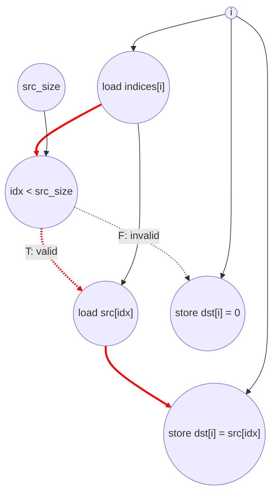

# ASAP Model Notes
- Fully unrollable, each i-iter only writes to its own dst[i]
- Make sure that store operation to dst[i] only happens after idx < src_size is evaluated
- i does not count for the critical path because of full unrolling, but it is still counted in the total operation count

# Gather Performance
Parameters (from `main.cpp`): `N = 1024`, `src_size = 256`.
- `src[i] = i * 2` for `0 <= i < src_size`.
- `indices[i] = (i * 3) % src_size` for `0 <= i < N`.
- Because every generated index is in `[0, 255]`, all `N` lanes take the
  in-bounds arm and write `dst[i] = src[indices[i]]`.

Size parameters used in the formulas:
- `N` = output element count.
- `V` = number of valid indices where `indices[i] < src_size`.
- For the test inputs, `V = N = 1024`.

## Loop classification

| dim | trip_count | kind | II | notes |
|-----|------------|------|----|-------|
| `i` | `N` = 1024 | parallel | n/a | Each iter reads one `indices[i]`, conditionally reads read-only `src[idx]`, and writes a distinct `dst[i]`. Duplicate `idx` values can alias only on the read-only `src` array, so no carried register or memory dependence crosses iterations. Fully unrolled. Under no-predication, the `idx < src_size` compare gates the taken arm: the valid-arm `src[idx]` load and store wait for the compare, while the invalid arm stores constant zero and does not load `src[idx]`. |

`idx` is assigned exactly once from `indices[i]` and is not loop-carried, so it
is anonymous dataflow: the loaded index fans out to the bounds compare and the
`src[idx]` subscript with no scalar load/store round trip. All array subscripts
are bare variable or bare named-scalar subscripts (`indices[i]`, `src[idx]`,
`dst[i]`), so no address-add operation or address-generation cycle is charged.

## Critical path (`total_cycles`)

Under parallel-unroll of `i`, `total_cycles` is the maximum per-lane depth. For
a valid lane:

```
1 (load indices[i])
+ 1 (compare idx < src_size)
+ 1 (load src[idx])                 [inside valid arm; waits for compare]
+ 1 (store dst[i])                  [stores the loaded src value]
= 4
```

The hoisted `src_size` parameter load overlaps the per-lane `indices[i]` load.
The induction-var work for `i` is counted in the op totals, but it is not on the
critical path because each unrolled lane treats `i` as a per-lane constant and
the `[i]` subscripts are bare.

For an invalid lane, the `src[idx]` load is skipped and the else-arm store of
zero fires after the compare:

```
1 (load indices[i])
+ 1 (compare idx < src_size)
+ 1 (store dst[i] = 0)
= 3
```

For the `main.cpp` test vectors, every lane is valid (`V = N`), so:

```
total_cycles = 4
```

More generally, the depth is `4` if any valid lane exists and `3` if all lanes
are invalid.

## Op counts

### Formula

For arbitrary inputs:
- Algorithmic loads: `N` loads of `indices[i]` plus `V` loads of `src[idx]`.
- Algorithmic stores: `N` stores to `dst[i]`, one per lane regardless of branch.
- Algorithmic compares: `N` bounds compares (`idx < src_size`).
- Overhead loads: `N` iterator reads plus hoisted parameter loads for `N` and
  `src_size`.
- Overhead stores/adds/compares: one `i` writeback, `i++`, and `i < N` compare
  per iteration.

### Algorithmic

| op | count | source |
|----|-------|--------|
| loads | `N + V` = **2048** | `indices[i]` (1024) + `src[idx]` on valid lanes (1024) |
| stores | `N` = **1024** | `dst[i]` in the taken arm for every lane |
| compares | `N` = **1024** | `idx < src_size` |

### Overhead (induction, param hoists, address-gen)

| op | count | source |
|----|-------|--------|
| loads | **1026** | iterator `i` reads (1024) + hoisted params `N`, `src_size` (2) |
| stores | **1024** | iterator `i` writebacks |
| adds | **1024** | `i++` |
| compares | **1024** | loop bound `i < N` |
| address_adds | **0** | `indices[i]`, `src[idx]`, and `dst[i]` use bare subscripts; the loaded `idx` value indexes `src` directly |

### Totals

| op | total |
|----|------:|
| loads | **3074** |
| stores | **2048** |
| adds | **1024** |
| compares | **2048** |
| address_adds | **0** |
| muls / divs / shifts / bitops / transcendentals | 0 |

The only data-dependent difference in work is the `src[idx]` load: invalid
lanes still pay for the `indices[i]` load, the bounds compare, and the `dst[i]`
store, but skip the indirect `src` read. The test vectors have no invalid lanes,
so the load total includes all 1024 `src[idx]` loads.

## Data Dependency Graph

Per-lane graph for the parallel-unrolled `i` loop. The valid arm is the critical
path for the `main.cpp` inputs; the invalid arm is shown for completeness.


