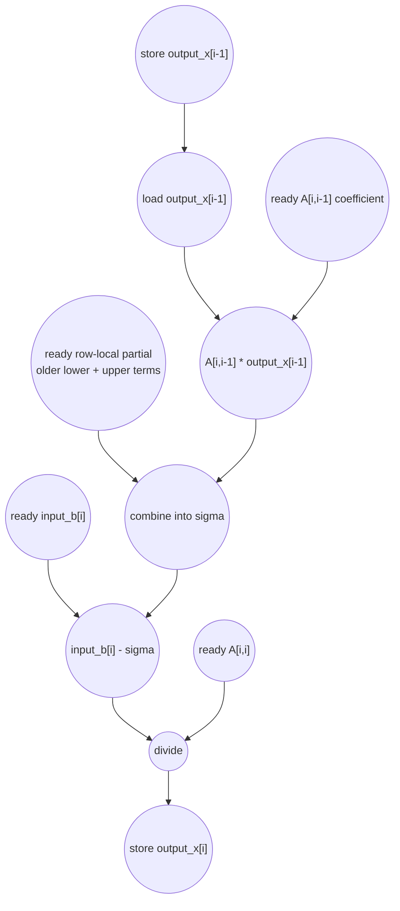

# ASAP Model Notes
- The two inner loops that use j as the iterator read from different/disjoint indices of input_A
    - They both have a multiply and accumulate line and can be tree reduce
- Outer i loop must be sequential since the reads of output_x[j] reads depend on the final values of output_x[i], where i < j

# Gauss-Seidel Iteration Performance

Single Gauss-Seidel sweep for `A*x = b`. For each row `i`, the kernel forms the
off-diagonal sum

```
sum_{j < i} A[i,j] * output_x[j] + sum_{j > i} A[i,j] * input_x[j]
```

and then writes:

```
output_x[i] = (input_b[i] - sigma) / A[i,i]
```

Parameters from `main.cpp`: `N = 32`. The test matrix is diagonally dominant
(`A[i,i] = 10`, off-diagonal entries `1`), `input_b[i] = i + 1`, and
`input_x[i] = 0`. These values affect the numeric result, but not the loop
trips or operation counts.

This kernel is `L1 Static-Affine` in `kernel_perf_difficulty.csv`: the triangular
loop bounds are fixed by `N`. Its latency is still linear because row `i+1`
reads an `output_x[i]` value written by row `i`.

## Loop classification

| dim | trip_count | kind | II | notes |
|-----|------------|------|----|-------|
| row `i` | `N = 32` | sequential | 6 | The lower-triangle sum reads `output_x[j]` for `j < i`, so row `i` cannot complete until earlier rows have produced their updated values. The `LOOM_PARALLEL()` annotation is a hint preserved in IR; the RAW dependence through `output_x` is still semantic. |
| lower `j` | `i` | reduction leaves | n/a | These terms use already-updated `output_x[j]`. For latency, the latest needed term is normally `j = i - 1`; older lower terms can be ready earlier and folded into a row-local partial. |
| upper `j` | `N - i - 1` | reduction leaves | n/a | These terms use old `input_x[j]`, so they do not depend on the current Gauss-Seidel sweep and can be reduced before the row's latest lower-triangle term arrives. |

For each row, the two source `j` loops are modeled as one off-diagonal sum over
`N - 1` products. This is the same source-count / reduced-depth split used in
`col2im_eval.md` and `spmspm_eval.md`: the source-level dynamic work is still
counted, but the associative summation is tree-shaped for the ASAP latency
bound. The difference from `gemv`-style independent row reductions is the
lower-triangle read of `output_x`, which makes the row dimension a true carried
memory dependence. This is analogous to the stage barriers in
`fft_butterfly_eval.md`: structural unrolling or a parallel hint does not remove
a RAW edge through a written array value.

`sigma` is a reduction accumulator, so it is not charged as a memory-backed
scalar load/store. The array accesses `output_x[j]`, `input_x[j]`, `input_b[i]`,
and `output_x[i]` use bare subscripts and add no address arithmetic. The `A`
accesses use `input_A[i * N + j]` or `input_A[i * N + i]`; the row base `i * N`
is loop-invariant within one row and is computed once per row, while each `A`
access contributes one address add for `base + column`.

## Critical path (`total_cycles`)

The first row has no lower-triangle dependency. Its binding path is the
old-vector sum over `N - 1` upper terms:

```
1 (row-base multiply i*N)
+ 1 (address_add base + j)
+ 1 (load A[i,j])
+ 1 (multiply A[i,j] * input_x[j]; input_x[j] load is ready earlier)
+ ceil(log2(N - 1)) (tree-reduce the row's products)
+ 1 (input_b[i] - sigma)
+ 1 (divide by A[i,i]; diagonal A load is ready earlier)
+ 1 (store output_x[i])
```

For `N = 32`, the cold-start row depth is:

```
4 + ceil(log2(31)) + 3 = 12
```

After row 0, the latest input to row `i` is normally `output_x[i - 1]`. Other
row-local terms can be pre-reduced while waiting for that value. The steady
row-to-row recurrence is therefore:

```
load output_x[i - 1]
-> multiply by the ready A[i,i-1] coefficient
-> add into the ready row partial
-> subtract from input_b[i]
-> divide by the ready diagonal A[i,i]
-> store output_x[i]
```

That gives `II = 6` for the row chain. The ordinary `i` induction/control work is
counted in the totals, but it is shorter than this row-value recurrence and
overlaps it in the same way `kmp_table_eval.md` keeps ordinary outer-loop
induction off the longer carried-state chain.

For `N >= 3`:

```
total_cycles = (4 + ceil(log2(N - 1)) + 3) + 6*(N - 1)
             = 6N + 1 + ceil(log2(N - 1))
```

For the checked-in test:

```
total_cycles = 6*32 + 1 + ceil(log2(31))
             = 192 + 1 + 5
             = 198
```

So for `main.cpp`, **`total_cycles = 198`**.

## Op counts

Let:

```
L = sum_i i = N*(N - 1)/2
U = sum_i (N - i - 1) = N*(N - 1)/2
T = L + U = N*(N - 1)
I = N + L + U = N^2
```

For `N = 32`, `L = U = 496`, `T = 992`, and `I = 1024`.

### Algorithmic

| op | count | source |
|----|------:|--------|
| loads | `2T + 2N` = **2,048** | off-diagonal `A` loads and vector loads (`2T`), plus `input_b[i]` and diagonal `A[i,i]` loads (`2N`) |
| stores | `N` = **32** | `output_x[i]` |
| adds | `N*(N - 2)` = **960** | row reductions over `N - 1` products, charged as `N - 2` adds per row |
| subs | `N` = **32** | `input_b[i] - sigma` |
| address_adds | `T + N` = **1,024** | one `base + column` add for each off-diagonal and diagonal `A` access |
| multiplies | `T + N` = **1,024** | `T` product multiplies plus one row-base `i*N` multiply per row |
| divides | `N` = **32** | divide by `A[i,i]` |

### Overhead (induction and hoisted scalar parameter)

| op | count | source |
|----|------:|--------|
| loads | `I + 1` = **1,025** | loop-iterator reads for the outer and two inner loops, plus the hoisted scalar parameter `N` |
| stores | `I` = **1,024** | loop-iterator writebacks |
| adds | `I` = **1,024** | loop increments |
| compares | `I` = **1,024** | loop-bound checks |
| address_adds | **0** | all address arithmetic is listed with the algorithmic `A` accesses above |

### Totals

| op | total |
|----|------:|
| loads | **3,073** |
| stores | **1,056** |
| adds | **1,984** |
| subs | **32** |
| address_adds | **1,024** |
| multiplies | **1,024** |
| divides | **32** |
| compares | **1,024** |
| mods / shifts / bitops / transcendentals | 0 |

Total dynamic operations: **9,249**.

## Data Dependency Graph

One row-to-row link is shown. The row-local partial represents all upper terms
and all older lower terms that can be reduced before the newest predecessor
`output_x[i-1]` arrives.


