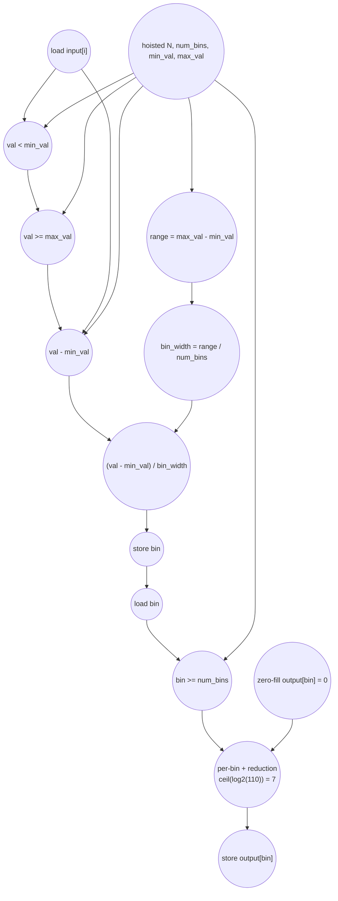

# ASAP Model Notes
- Optimal golden model interpretation: tree reduction
    - Each output bin is an accumulator that adds up the total number of inputs in that bucket
    - For each bin, valid contributors form an independent bucket; normal-path contributors are ready at the same depth under full unrolling.
    - The max number of cycles for the accumulation step will therefore be the log(max inputs in one bin)
    - bin is "memory-backed" and needs 2 additional cycles (store, load) because it has two assignment locations
      - One for the typical assignment, and one for the edge case handling

# Histogram Bin Performance
Parameters (from `main.cpp`): `N = 1024`, `num_bins = 10`,
`min_val = 0.0f`, and `max_val = 100.0f`.

The test input is:

```
input[i] = float(i % 100)
```

so every input value is in range. With `bin_width = 10.0f`, the bin fan-ins are:

| bin | values | fan-in |
|-----|--------|-------:|
| 0 | `0..9` | 110 |
| 1 | `10..19` | 110 |
| 2 | `20..29` | 104 |
| 3 | `30..39` | 100 |
| 4 | `40..49` | 100 |
| 5 | `50..59` | 100 |
| 6 | `60..69` | 100 |
| 7 | `70..79` | 100 |
| 8 | `80..89` | 100 |
| 9 | `90..99` | 100 |

Define:

```
B = num_bins = 10
V = number of values satisfying min_val <= val < max_val = 1024
C = number of valid values taking the bin >= num_bins clamp = 0
H_b = number of valid inputs assigned to bin b
H = max_b H_b = 110
I = B + N = 1034 induction steps across the two source loops
```

The clamp arm is not taken for this input set: `val` is always at most `99.0f`,
so `(val - min_val) / bin_width` is always in `0..9`.

## Loop classification

| dim | trip_count | kind | II | notes |
|-----|------------|------|----|-------|
| zero-fill `i` | `B = 10` | parallel | n/a | Each lane writes a distinct `output[i] = 0`. The stores count and provide the zero identity for the later histogram buckets. |
| count `i` | `N = 1024` | bucketed reduction | n/a | Each input computes one bin after the range guard. Valid inputs assigned to the same bin form an associative `+` bucket over `output[bin]`; different bins are independent. |

The histogram update is a scatter-reduction. The source statement
`output[bin]++` is still counted as a dynamic output load, add, and store for
each valid input, but dependency depth is modeled by grouping contributors by
their resolved bin and tree-reducing the `+1` contributions within each bucket.
This is the same source-counts plus bucketed-depth interpretation used for
scatter-style accumulations in other evals.

The range guard is not predicated. For this concrete input, every lane executes
both range comparisons, then the bin computation, then the `bin >= num_bins`
compare. The clamp body is not taken.

## Critical path (`total_cycles`)

The binding bucket has `H = 110` contributors, so the bucket accumulation depth
is:

```
ceil(log2(H)) = ceil(log2(110)) = 7
```

For a normal valid contributor, the per-lane path to a bucket leaf is:

```
1 load input[i] and hoisted scalar parameters
1 compare val < min_val
1 compare val >= max_val
1 compute val - min_val
1 divide by bin_width
1 store memory-backed bin scalar
1 load bin scalar
1 compare bin >= num_bins
= 8 cycles before the contribution joins its bucket
```

`bin_width` is loop-invariant and is ready by cycle 3
(`load min/max/num_bins -> max_val - min_val -> range / num_bins`), so it is
not later than the guarded per-lane path. The zero-fill store is a shallow
identity input to each output bucket and does not extend the binding path.

After the bin is known and the clamp compare resolves, the deepest bucket
tree-reduces its contributors and stores the final bin count:

```
total_cycles =
  8 (range guard, bin compute, bin scalar round trip, clamp compare)
+ 7 (bucketed reduction over the largest bin)
+ 1 (store output[bin])
= 16
```

## Op counts

### Dynamic formulas

For a general input distribution:

- `V` valid inputs execute the bin computation and `output[bin]++`.
- `C` valid inputs take the clamp arm `bin = num_bins - 1`.
- `H = max_b H_b` determines the accumulation depth.
- Bare subscripts `input[i]`, `output[i]`, and `output[bin]` contribute no
  `address_adds`.

For the checked-in `main.cpp` case, `V = 1024`, `C = 0`, and `H = 110`.

The local scalar `bin` is memory-backed because it has two assignment sites in
source: the initial bin computation and the clamp assignment. In this input set
the clamp store is not taken, so each valid lane charges one `bin` store and one
post-store `bin` load. That load fans out to both the clamp compare and the
`output[bin]` subscript.

### Totals

| op | total | source |
|----|------:|--------|
| loads | 4110 | input loads (`N = 1024`) + output update loads (`V = 1024`) + memory-backed `bin` loads (`V = 1024`) + induction reads (`I = 1034`) + hoisted parameter loads (`N`, `num_bins`, `min_val`, `max_val` = 4) |
| stores | 3092 | zero-fill output stores (`B = 10`) + output update stores (`V = 1024`) + memory-backed `bin` stores (`V + C = 1024`) + induction writes (`I = 1034`) |
| adds/subs | 3083 | `range = max_val - min_val` (1) + `val - min_val` per valid input (`V = 1024`) + `output[bin]++` adds (`V = 1024`) + induction increments (`I = 1034`) |
| address_adds | 0 | all array subscripts are bare index variables or loaded scalar values |
| multiplies | 0 | none |
| divides | 1025 | `bin_width = range / num_bins` (1) + per-valid bin division (`V = 1024`) |
| compares | 4106 | range checks (`2*N = 2048`) + clamp checks (`V = 1024`) + loop-bound checks (`I = 1034`) |
| bitops / shifts / transcendentals | 0 | none |

Casts are not charged as counted operations.

## Data Dependency Graph

One valid, non-clamped contributor is shown below. All 1024 contributors are
fully unrolled; contributors that resolve to the same bin join that bin's
reduction tree. The largest tree has 110 leaves.



The output load and per-update add from `output[bin]++` are counted for every
valid source update. In the dependency model, those updates are represented by
the per-bin reduction tree rather than by a serial read-modify-write chain
through `output[bin]`.
