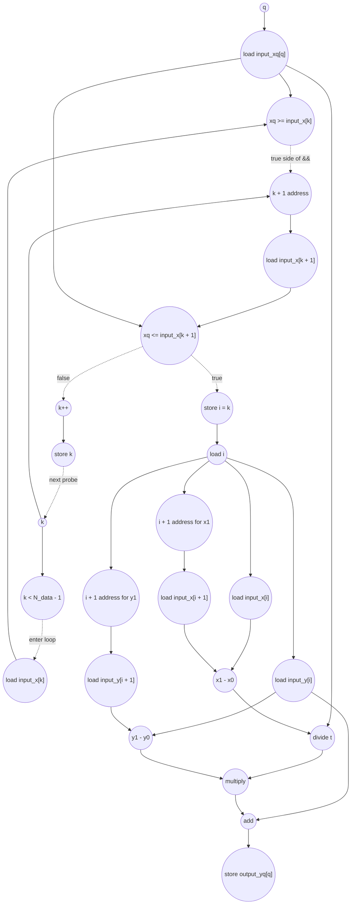

# ASAP Model Notes
- Outer loop is parallel because there are no carried dependencies between q iterations. Each value of q only reads from its own index in the input_xq array and writes to its own index in the output_yq array.
- Inner loop is serial and input data dependent. Critical path under an ideal processor is the number of cycles needed for the largest value of input_xq. This is because the search condition is a linear scan of a sorted array from smallest to largest value.

## Test case in main.cpp
In the provided test case, queries are given in half step intervals. N_query = 64, so the largest value in the input_xq array is 31.5. There are a total of N_data = 32 data points from [0, 31]. Since 31.5 is greater than 31, the inner for loop will run for the maximum number of iterations which is N_data - 1 = 31.

The critical path will then be: load input_xq[q] (overlaps with laod k in the inner loop, free) + 31 * (n cycles per inner loop) + failing final inner loop check (1 cycle?) + (m cycles for linear interpolation step)

# Linear Interpolation Performance
Parameters (from `main.cpp`): `N_data = 32`, `N_query = 64`.
- `input_x[i] = i` and `input_y[i] = i * i` for `0 <= i < N_data`.
- `input_xq[q] = 0.5 * q` for `0 <= q < N_query`.
- The kernel assumes `input_x` is sorted in ascending order; interpolation also
  assumes adjacent `input_x` values are distinct so `x1 - x0` is nonzero.

For these inputs, the search loop executes `K_q` probes for query `q`. The
distribution is:
- `K = 1` for 3 queries: `xq = 0.0, 0.5, 1.0`.
- `K = 2..30` for 2 queries each.
- `K = 31` for 3 queries: `xq = 30.5, 31.0, 31.5`.

So:
- `sum(K_q) = 1024` total search probes.
- `H = 63` queries find an interval and break from the loop.
- `F = 1` query (`xq = 31.5`) finds no interval, pays the final failing
  `k < N_data - 1` check, then falls through with `i = 0`.
- Failed probes that execute `k++`: `1024 - H = 961`.

## Loop classification

| dim | trip_count | kind | II | notes |
|-----|------------|------|----|-------|
| `q` | `N_query` = 64 | parallel | n/a | Each query reads `input_xq[q]`, searches with private `xq`, `i`, and `k` state, and writes distinct `output_yq[q]`. No register, accumulator, or in-place memory value crosses `q` iterations, so the loop fully unrolls under the ASAP model. |
| search `k` | data-dependent, `K_q <= N_data - 1` | sequential (data-dependent termination) | 9 on failed probes | The loop carries the iterator `k`, and `break` makes termination input-dependent. Under no-predication, the loop-bound check gates the body; the `&&` short-circuits, so `input_x[k + 1]` and the upper-bound compare wait for `xq >= input_x[k]`; the `k++` update waits until the interval test resolves false. |

The selected interval scalar `i` is memory-backed because it is initialized to
zero and may also be assigned in the `if` body. The post-search interpolation
loads `i` once per query; that load fans out to the four `input_x`/`input_y`
subscripts. `xq`, `x0`, `x1`, `y0`, `y1`, and `t` are assigned once and are not
loop-carried, so they are anonymous dataflow intermediates with no scalar
load/store round trip.

## Critical path (`total_cycles`)

The outer `q` loop is parallel, so `total_cycles` is the maximum per-query
depth, not the sum over all 64 queries. The binding lane is the no-hit query
`xq = 31.5`, which scans all 31 intervals and then pays the failing loop-exit
check before interpolation falls through with `i = 0`.

For a failed search probe on the main inputs (`xq >= input_x[k]` is true and
`xq <= input_x[k + 1]` is false):

```
1 (load k)
+ 1 (compare k < N_data - 1)
+ 1 (load input_x[k])                 [body waits for loop-bound compare]
+ 1 (compare xq >= input_x[k])
+ 1 (address_add k + 1)               [right side of && waits for first compare]
+ 1 (load input_x[k + 1])
+ 1 (compare xq <= input_x[k + 1])
+ 1 (k++)
+ 1 (store k)
= 9
```

A hit probe skips `k++` and instead stores the selected interval:

```
1 (load k)
+ 1 (compare k < N_data - 1)
+ 1 (load input_x[k])
+ 1 (compare xq >= input_x[k])
+ 1 (address_add k + 1)
+ 1 (load input_x[k + 1])
+ 1 (compare xq <= input_x[k + 1])
+ 1 (store i = k)
= 8
```

The interpolation tail after the search is:

```
1 (load i)
+ 1 (address_add i + 1 for x1 and y1, in parallel)
+ 1 (load input_x[i + 1] / input_y[i + 1])
+ 1 (sub x1 - x0 or y1 - y0)
+ 1 (divide t = (xq - x0) / (x1 - x0))
+ 1 (multiply t * (y1 - y0))
+ 1 (add y0 + ...)
+ 1 (store output_yq[q])
= 8
```

The `input_xq[q]` load overlaps the first `k` load; it feeds every search
compare and the interpolation numerator, but it is ready long before the
deepest late-search operations.

For a query that hits on probe `K`:

```
total_cycles_hit(K) = 9 * (K - 1) + 8 + 8 = 9K + 7
```

For a query that does not hit after `K = N_data - 1` probes:

```
total_cycles_no_hit(K) = 9K + 2 (final load k + failing bound compare) + 8
                       = 9K + 10
```

For the provided test case:

```
max hit depth    = 9 * 31 + 7  = 286
no-hit depth     = 9 * 31 + 10 = 289
total_cycles     = 289
```

## Op counts

Counts below are for the concrete `main.cpp` inputs. They include all executed
dynamic work, even when the work is off the output critical path because the
outer `q` loop is fully unrolled.

### Algorithmic

| op | count | source |
|----|------:|--------|
| loads | **2368** | `input_xq[q]` (64) + search loads `input_x[k]` and `input_x[k + 1]` (`2 * 1024`) + interpolation loads `input_x[i]`, `input_x[i + 1]`, `input_y[i]`, `input_y[i + 1]` (`4 * 64`) |
| stores | **64** | `output_yq[q]` |
| adds/subs | **256** | interpolation: `xq - x0`, `x1 - x0`, `y1 - y0`, and final `y0 + ...` per query |
| multiplies | **64** | `t * (y1 - y0)` |
| divides | **64** | `(xq - x0) / (x1 - x0)` |
| compares | **2048** | search interval tests: `xq >= input_x[k]` and `xq <= input_x[k + 1]` for 1024 probes |

### Overhead (address generation, induction, scalar load/store, param hoists)

| op | count | source |
|----|------:|--------|
| loads | **1155** | outer `q` iterator reads (64) + inner `k` iterator reads (1024 probes + 1 final failing exit read) + post-search scalar `i` reads (64) + hoisted parameter loads `N_data`, `N_query` (2) |
| stores | **1152** | outer `q` writebacks (64) + inner `k` writebacks after failed probes (961) + scalar `i` writes (`i = 0` for 64 queries + `i = k` for 63 hits) |
| adds/subs | **1026** | outer `q++` (64) + inner `k++` after failed probes (961) + hoisted `N_data - 1` (1) |
| compares | **1089** | outer `q < N_query` (64) + inner `k < N_data - 1` (1024 passing checks + 1 final failing no-hit check) |
| address_adds | **1152** | search `input_x[k + 1]` (1024) + interpolation `input_x[i + 1]` and `input_y[i + 1]` (`2 * 64`); all `[q]`, `[k]`, and `[i]` subscripts are bare and charge no address add |

### Totals

| op | total |
|----|------:|
| loads | **3523** |
| stores | **1216** |
| adds/subs | **1282** |
| address_adds | **1152** |
| multiplies | **64** |
| divides | **64** |
| compares | **3137** |
| bitops / shifts / transcendentals | 0 |

## Data Dependency Graph

One query lane is shown. Under the ASAP model, 64 copies of this lane run in
parallel; no edges cross between different `q` values.



## CGRA-Constrained Model

The ASAP bound above assumes unlimited functional units and memory bandwidth.
For a CGRA with separate arithmetic and memory-issue resources:

- `P` - arithmetic PEs, one non-load/store op per PE per cycle.
- `L` - load-issue lanes, one load per lane per cycle.
- `S` - store-issue lanes, one store per lane per cycle.

Every counted load consumes an `L` slot and every counted store consumes an `S`
slot, including induction-variable and memory-backed-scalar accesses. Every
counted non-load/store op consumes a `P` slot, including address adds, divides,
and compares. With `CP` the ASAP dependency bound (`total_cycles`), `A` the
counted non-load/store ops, `LD` the counted loads, and `ST` the counted stores:

```
compute = ceil(A / P)
load    = ceil(LD / L)
store   = ceil(ST / S)
cycles  = max(CP, compute, load, store)
```

**Counts (from the op-count totals above, these inputs).**
- `CP = 289`
- `A  = adds/subs (1282) + address_adds (1152) + multiplies (64) + divides (64) + compares (3137) = 5699`
- `LD = 3523`
- `ST = 1216`

**6x6 example (`P = 36`, `L = 12`, `S = 12`).**

```
compute = ceil(5699 / 36) = 159
load    = ceil(3523 / 12) = 294
store   = ceil(1216 / 12) = 102
cycles  = max(289, 159, 294, 102) = 294
```

**Bottleneck: load-bound by a narrow margin.** The ASAP critical path is 289
cycles, set by the no-hit query's sequential 31-probe search. On a 6x6 fabric,
the aggregate resource lower bound is 294 cycles because the 3523 counted loads
need 294 load-issue cycles. The difference is small: this input is mostly
latency-bound by the deepest search lane, with load bandwidth just overtaking
the dependency depth in the aggregate model.

<!-- BEGIN CGRA-SCHED:interpolate_linear -->
### Finite-Resource Schedule Estimate (time-local)

*Reproducible estimate for the deterministic criticality-priority list-schedule policy defined in [`docs/spec-kernel-performance.md`](../../../docs/spec-kernel-performance.md). It is **not** a lower bound (the aggregate model above is the lower bound) and **not** cycle-accurate RTL; it exposes the short windows of local `P`/`L`/`S` pressure that the aggregate model smooths over.*

**Resource configuration:** `P = 36`, `L = 12`, `S = 12` (`6x6`).

| region | CP | A | LD | ST | aggregate | scheduled (makespan) |
|--------|---:|--:|---:|---:|----------:|---------------------:|
| interpolate_linear | 289 | 5699 | 3523 | 1216 | 294 | 297 |

- **scheduled_cycles** = 297  (sum of ordered-region makespans)
- **aggregate_cycles** = 294  (the lower bound above, unchanged)
- **gap_cycles** = 3  (scheduled − aggregate)
- **gap_ratio** = 1.0102  (scheduled / aggregate)

**Local `P`/`L`/`S` pressure** (saturated cycles / longest saturated run / peak ready backlog):
- `P`: 1 / 1 / 28
- `L`: 293 / 293 / 282
- `S`: 34 / 6 / 52

<!-- END CGRA-SCHED:interpolate_linear -->
