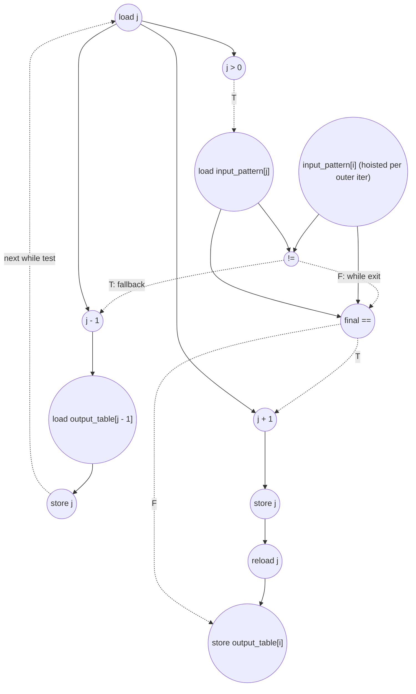

# ASAP Model Notes
- This algorithm determines the length of the longest prefix sequence from input_pattern[0:i] that is also a suffix of input_pattern[0:i]
- Both loops are sequential: 
  - Outer for loop: the starting value of j in iter i is the final value of j in iter i - 1. `output_table[i] = j;`
  - Inner while loop: this loop cannot be parallelized because the termination condition is unknown ahead of time. A linear scan of the input_pattern is necessary for when to terminate. 
- Cycle counts in the below section have been verified by-hand.

# KMP Table Performance
Prefix/failure-table construction for KMP string matching. For each pattern
position `i`, the kernel writes the length `j` of the longest proper prefix of
`input_pattern[0..i]` that is also a suffix of that prefix.

Parameters from `main.cpp`:
- `M = 16`
- `input_pattern = "ABABCABABAABABCD"`
- Expected `output_table = [0, 0, 1, 2, 0, 1, 2, 3, 4, 3, 1, 2, 3, 4, 5, 0]`

This kernel is **L4 Value-Distribution** in `kernel_perf_difficulty.csv`.
The trip count of the fallback loop is not a function of `M` alone; it depends
on the pattern's prefix/failure-link structure. 

Dynamic facts for the `main.cpp` pattern:

| quantity | value | notes |
|----------|------:|-------|
| outer iterations | 15 | `i = 1..15` |
| fallback bodies (`F`) | 5 | taken executions of `j = output_table[j - 1]` |
| final `if` true (`j++`) | 12 | output value increases on these iterations |
| final `if` false | 3 | `i = 1, 4, 15` |
| while `j > 0` tests | 20 | one per fallback body plus one exit test per outer iteration |
| while pattern comparisons | 14 | 5 mismatches plus 9 match exits with `j > 0` |

## Loop classification

| dim | trip_count | kind | II | notes |
|-----|------------|------|----|-------|
| outer `i` | `M - 1` = 15 | sequential | data-dependent; see per-iteration table | Carries `j` and writes `output_table` entries that later fallback loads may read. The DSA source also marks the loop `LOOM_NO_PARALLEL` and `LOOM_NO_UNROLL`. The iterator work is counted, but after the cold-start entry check the `i` induction/control chain overlaps the longer `j` failure-link recurrence; it is not added once per outer iteration. |
| inner `while` | data-dependent | sequential | 7 per taken fallback body | Each taken body jumps from the current `j` to `output_table[j - 1]`. This is not associative: the next candidate prefix is a table lookup selected by the current candidate, so unlimited hardware cannot turn it into a reduction tree. |

`j` is memory-backed: it has multiple assignment sites (`j = 0`,
`j = output_table[j - 1]`, `j++`) and carries state across outer iterations.
A single `j` load in a while test fans out to `j > 0`, the `input_pattern[j]`
subscript, and the `j - 1` address expression when no write intervenes. This is
the same one-load-per-span treatment used for loop-carried scalars in
`clz_eval.md` and `crc32_eval.md`.

`input_pattern[i]` is invariant across one outer iteration, so it is loaded once
per `i` and fanned to all fallback comparisons and the final equality check.
When the while exits by observing `input_pattern[i] == input_pattern[j]` with
`j > 0`, the final `if (input_pattern[i] == input_pattern[j])` reuses those
loaded operands but still counts its own source-level compare. This mirrors
`binary_search_eval.md` and `wildcard_match_eval.md`, where repeated reads of
the same array element inside one dynamic step are represented by one load
feeding multiple compares.

## Critical path (`total_cycles`)

The prologue stores `output_table[0] = 0`, initializes `j = 0`, and initializes
`i = 1`. These stores are counted, but they do not extend the longest path:
`output_table[0]` is ready long before any fallback reads it, and the first
reads of constant-initialized carried scalars are modeled as roots.

The first outer iteration pays a cold-start loop-entry gate:

```
1 (load i)
+ 1 (compare i < M)
= 2
```

That gate is **not** added to every outer iteration. Unlike
`wildcard_match_eval.md`'s outer loop, this `for` loop has no early `return` or
data-dependent loop exit, so iteration `i+1` is not control-dependent on an
unresolved match/fail branch from iteration `i`. The `i` recurrence
(`load i -> i+1 -> store i -> compare i<M`) runs in parallel with the much
longer `j` recurrence and is absorbed in steady state, the same way the sibling
`crc32_eval.md` absorbs ordinary loop setup/induction once the `crc` recurrence
is flowing.

A taken fallback body contributes 7 cycles:

```
1 (load j)
+ 1 (compare j > 0)
+ 1 (load input_pattern[j])
+ 1 (compare input_pattern[i] != input_pattern[j])
+ 1 (address_add j - 1)
+ 1 (load output_table[j - 1])
+ 1 (store j)
= 7
```

The exit/final-output suffix depends on how the while exits:

```
exit via j == 0, final if false:
  load j -> cmp j>0 false -> load input_pattern[0]
  -> final equality cmp false -> store output_table[i]
  = 5

exit via j == 0, final if true:
  load j -> cmp j>0 false -> load input_pattern[0]
  -> final equality cmp true -> j+1 -> store j
  -> reload j -> store output_table[i]
  = 8

exit via j > 0 and pattern match:
  load j -> cmp j>0 true -> load input_pattern[j]
  -> mismatch cmp false -> final equality cmp true
  -> j+1 -> store j -> reload j -> store output_table[i]
  = 9
```

The carried-state contribution for each outer iteration is therefore:

```
j_chain_i = 7 * fallback_count_i + exit_suffix_i
```

For the `main.cpp` pattern:

| i | char | start `j` | fallback count | while exit | final `if` | output `j` | `j_chain_i` |
|---|------|----------:|---------------:|------------|------------|-----------:|------------:|
| 1 | B | 0 | 0 | `j == 0` | false | 0 | 5 |
| 2 | A | 0 | 0 | `j == 0` | true | 1 | 8 |
| 3 | B | 1 | 0 | `j > 0` match | true | 2 | 9 |
| 4 | C | 2 | 1 | `j == 0` | false | 0 | 12 |
| 5 | A | 0 | 0 | `j == 0` | true | 1 | 8 |
| 6 | B | 1 | 0 | `j > 0` match | true | 2 | 9 |
| 7 | A | 2 | 0 | `j > 0` match | true | 3 | 9 |
| 8 | B | 3 | 0 | `j > 0` match | true | 4 | 9 |
| 9 | A | 4 | 1 | `j > 0` match | true | 3 | 16 |
| 10 | A | 3 | 2 | `j == 0` | true | 1 | 22 |
| 11 | B | 1 | 0 | `j > 0` match | true | 2 | 9 |
| 12 | A | 2 | 0 | `j > 0` match | true | 3 | 9 |
| 13 | B | 3 | 0 | `j > 0` match | true | 4 | 9 |
| 14 | C | 4 | 0 | `j > 0` match | true | 5 | 9 |
| 15 | D | 5 | 1 | `j == 0` | false | 0 | 12 |

Total:

```
total_cycles = 2                    (cold-start outer gate)
             + 5 * 7               (fallback bodies)
             + 3 * 5               (j==0, final false)
             + 3 * 8               (j==0, final true)
             + 9 * 9               (j>0 match, final true)
             = 157
```

So for the `main.cpp` input, **`total_cycles = 157`**.

## Op counts

### Algorithmic

| op | count | source |
|----|------:|--------|
| loads | 40 | `input_pattern[i]` once per outer iter (15) + `input_pattern[j]` loads (20) + fallback `output_table[j - 1]` loads (5) |
| stores | 16 | `output_table[0]` plus `output_table[i]` for `i = 1..15` |
| adds | 12 | `j++` on the true final-if path |
| compares | 49 | while `j > 0` tests (20) + while mismatch compares (14) + final equality compares (15) |

### Overhead (loop-carried scalars, induction, address generation)

| op | count | source |
|----|------:|--------|
| loads | 48 | `j` loads in while tests (20) + fresh `j` loads after `j++` before `output_table[i] = j` (12) + `i` iterator reads (15) + hoisted `M` load (1) |
| stores | 34 | `j` init (1) + fallback `j` stores (5) + `j++` stores (12) + `i` init (1) + `i` writebacks (15) |
| adds | 15 | `i++` |
| compares | 15 | loop bound `i < M` |
| address_adds | 5 | `j - 1` inside `output_table[j - 1]`; all other subscripts are bare (`[i]`, `[j]`, `[0]`) |

### Totals

| op | total |
|----|------:|
| loads | **88** |
| stores | **50** |
| adds | **27** |
| address_adds | **5** |
| compares | **64** |
| multiplies / divides / shifts / bitops / transcendentals | 0 |

The dynamic work is small, but the dependency chain is long because the work is
serialized by `j` and by the failure-table backtracking. This is why the kernel
is latency-bound even under unlimited hardware.

## Data Dependency Graph

One taken fallback body. The carried value `j` selects both the pattern entry to
compare and the failure-table entry to load. The carry edge from `store j` to
the next while test is the non-associative recurrence.



The `j == 0` exit path skips `load input_pattern[j]` in the while condition
because of `&&` short-circuiting, then loads `input_pattern[0]` for the final
equality check. The `j > 0` match path reuses the pattern operands loaded by the
while condition but still pays the final equality compare.

## CGRA-Constrained Model

The ASAP bound above assumes unlimited functional units and memory bandwidth.
This section adds the aggregate lower bound for a CGRA with separate arithmetic
and memory-issue resources, following `docs/spec-kernel-performance.md`:

- `P` - arithmetic PEs, one non-load/store op per cycle each.
- `L` - load-issue lanes, one load per cycle each.
- `S` - store-issue lanes, one store per cycle each.

Every counted load consumes an `L` slot and every counted store consumes an `S`
slot, including scalar and induction-variable accesses. Every counted
non-load/store op consumes a `P` slot. With `CP` the ASAP dependency bound,
`A` the counted non-load/store ops, `LD` the loads, and `ST` the stores:

```
compute = ceil(A / P)
load    = ceil(LD / L)
store   = ceil(ST / S)
cycles  = max(CP, compute, load, store)
```

Counts for the `main.cpp` pattern:

- `CP = 157`
- `A = adds (27) + address_adds (5) + compares (64) = 96`
- `LD = 88`
- `ST = 50`

6x6 example (`P = 36`, `L = 12`, `S = 12`):

```
compute = ceil(96 / 36) = 3
load    = ceil(88 / 12) = 8
store   = ceil(50 / 12) = 5
cycles  = max(157, 3, 8, 5) = 157
```

**Bottleneck: dependency-bound.** The finite amount of work is far too small to
saturate a 6x6 fabric, while the failure-link recurrence forces a 157-cycle
serial chain. More PEs or memory lanes do not reduce this input's latency unless
the algorithmic recurrence itself changes or the pattern has fewer fallback
jumps.

<!-- BEGIN CGRA-SCHED:kmp_table -->
### Finite-Resource Schedule Estimate (time-local)

*Reproducible estimate for the deterministic criticality-priority list-schedule policy defined in [`docs/spec-kernel-performance.md`](../../../docs/spec-kernel-performance.md). It is **not** a lower bound (the aggregate model above is the lower bound) and **not** cycle-accurate RTL; it exposes the short windows of local `P`/`L`/`S` pressure that the aggregate model smooths over.*

**Resource configuration:** `P = 36`, `L = 12`, `S = 12` (`6x6`).

| region | CP | A | LD | ST | aggregate | scheduled (makespan) |
|--------|---:|--:|---:|---:|----------:|---------------------:|
| kmp_table | 157 | 96 | 88 | 50 | 157 | 157 |

- **scheduled_cycles** = 157  (sum of ordered-region makespans)
- **aggregate_cycles** = 157  (the lower bound above, unchanged)
- **gap_cycles** = 0  (scheduled − aggregate)
- **gap_ratio** = 1  (scheduled / aggregate)

**Local `P`/`L`/`S` pressure** (saturated cycles / longest saturated run / peak ready backlog):
- `P`: 0 / 0 / 0
- `L`: 2 / 2 / 19
- `S`: 0 / 0 / 0

<!-- END CGRA-SCHED:kmp_table -->
