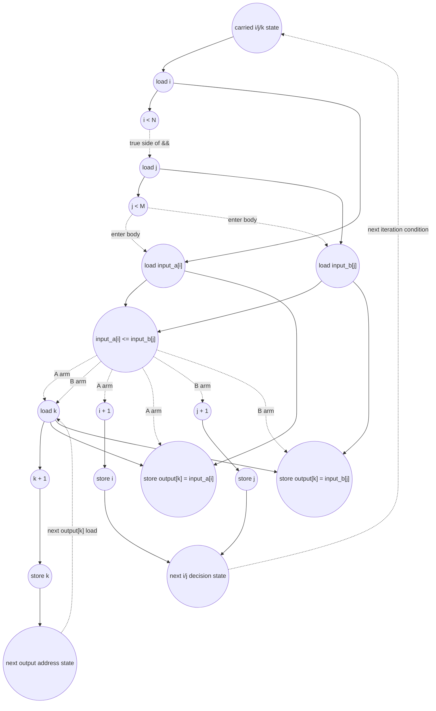

# ASAP Model Notes
- 

# Merge Performance
Parameters (from `main.cpp`): `N = 8`, `M = 6`.

```
input_a = [1, 3, 5, 7, 9, 11, 13, 15]
input_b = [2, 4, 6, 8, 10, 12]
```

The merged output is:

```
[1, 2, 3, 4, 5, 6, 7, 8, 9, 10, 11, 12, 13, 15]
```

The main merge loop alternates between the two arrays until `input_b` is
exhausted:

```
A, B, A, B, A, B, A, B, A, B, A, B
```

So the concrete trace has:

| symbol | meaning | value |
|--------|---------|------:|
| `T` | main merge-loop iterations | `12` |
| `A_take` | main-loop iterations taking from `input_a` | `6` |
| `B_take` | main-loop iterations taking from `input_b` | `6` |
| `A_tail` | iterations of `while (i < N)` after the main loop | `2` |
| `B_tail` | iterations of `while (j < M)` after the main loop | `0` |
| `O` | total output elements | `N + M = 14` |

This is a source-faithful model of the checked-in state machine. A different
merge implementation could compare many split points in parallel, but that
would be an algorithmic rewrite rather than the source-level DAG here.

## Loop classification

| dim | trip_count | kind | II | notes |
|-----|------------|------|----|-------|
| main merge `while (i < N && j < M)` | value/order-dependent, `T = 12` here | sequential | 8 | The loop-control recurrence is the selected `i++` or `j++` update. The `k++` update is a true carry for output addressing, but it trails the selected-index update and does not bind the next merge decision. The `&&` condition short-circuits, so `j < M` waits for `i < N`. |
| `input_a` tail `while (i < N)` | `A_tail = 2` here | sequential | 4 | The binding recurrence is `i++`; `k++` trails the output store and does not bind the next tail bound check. |
| `input_b` tail `while (j < M)` | `B_tail = 0` here | sequential | 4 if entered | The binding recurrence would be `j++`; this trace only performs the final failing bound check. |

The merge state is intrinsically carried: the next
`input_a[i] <= input_b[j]` decision depends on whichever index was incremented
by the previous decision.

The scalars `i`, `j`, and `k` are memory-backed because they are reassigned and
carried across loop iterations. A scalar read several times within one
iteration with no intervening write is loaded once and fanned out to its uses:
for example, the main-loop `i` load feeds `i < N`, `input_a[i]`, and `i++`.
All array subscripts are bare variables (`input_a[i]`, `input_b[j]`,
`output[k]`), so there are no `address_adds`.

## Critical path (`total_cycles`)

The constant-initialized carries `i = 0`, `j = 0`, and `k = 0` are still counted
as stores, but their first reads consume constants and do not extend the first
iteration's dependency chain.

For a main-loop iteration whose branch takes from `input_a`, the binding
carried path is:

```
1 load i
+ 1 compare i < N
+ 1 load j
+ 1 compare j < M
+ 1 load input_a[i] and input_b[j]
+ 1 compare input_a[i] <= input_b[j]
+ 1 compute i + 1
+ 1 store i
= 8 cycles
```

The `input_b` arm has the same depth, replacing `i + 1`/`store i` with
`j + 1`/`store j`. The selected arm cannot begin until the value compare
retires, and only the taken arm's index update is counted. The output-address
path runs alongside the selected-index recurrence:

```
value compare
+ 1 load k
+ 1 store output[k] and compute k + 1
+ 1 store k
```

That `k` writeback is real counted work and feeds the next `output[k]` address,
but the next `k` load is itself gated by the next iteration's value compare.
Thus `k` is slaved to the selected `i`/`j` recurrence and does not set the
main-loop II.

After the twelfth main-loop iteration, the final main-loop check exits because
`j == M`:

```
1 load i
+ 1 compare i < N
+ 1 load j
+ 1 compare j < M, false
= 4 cycles
```

The `input_a` tail copies two elements. Each taken tail iteration has:

```
1 load i
+ 1 compare i < N
+ 1 load input_a[i], load k, and compute i + 1
+ 1 store output[k] and store i
= 4 cycles
```

The tail `k + 1` computation and `k` store trail one cycle later, but they do
not bind the next tail bound check.

The final failing `i < N` tail check is counted but is not output-reachable, so
it does not extend `total_cycles`. The `input_b` tail does not execute for this
trace; its failing check is likewise counted and scheduled but lies after the
last output.

For the checked-in inputs:

```
total_cycles = 8*T + 4 + 4*A_tail
             = 8*12 + 4 + 4*2
             = 108
```

There is no additional `-1` suffix adjustment here: the 4-cycle tail term is
already measured to the output store and selected-index writeback. The final
`k` writeback and the later failing loop checks are still counted as work, but
they are not output-reachable, so they do not extend `total_cycles`.

For a general input ordering, `T`, `A_take`, `B_take`, and the tails depend on
the interleaving of the two sorted arrays. The dynamic work and depth therefore
depend on value distribution/order, not just on `N` and `M`.

## Op counts

### Dynamic formulas

For the concrete trace:

- `T = A_take + B_take = 12`
- `A_tail = N - A_take = 2`
- `B_tail = M - B_take = 0`
- `O = T + A_tail + B_tail = N + M = 14`

### Algorithmic

| op | formula | total | source |
|----|---------|------:|--------|
| loads | `2T + A_tail + B_tail` | **26** | Main-loop value loads from `input_a[i]` and `input_b[j]` (`24`), plus tail `input_a[i]` loads (`2`) |
| stores | `O` | **14** | One `output[k]` store per emitted element |
| compares | `T` | **12** | Main-loop value compare `input_a[i] <= input_b[j]` |

### Overhead (loop-carried scalars, loop conditions, induction, address generation)

| op | formula | total | source |
|----|---------|------:|--------|
| loads | `3T + 2*A_tail + 2*B_tail + 6` | **46** | Main-loop `i`/`j`/`k` reads (`36`), failed main-loop `i`/`j` reads (`2`), tail-a `i`/`k` reads (`4`), failed tail-a `i` read (`1`), failed tail-b `j` read (`1`), and hoisted `N`/`M` loads (`2`) |
| stores | `3 + A_take + B_take + A_tail + B_tail + O` | **31** | Initial stores for `i`, `j`, `k` (`3`), selected main-loop `i`/`j` updates (`12`), tail `i`/`j` updates (`2`), and `k` updates for all output elements (`14`) |
| adds | `A_take + B_take + A_tail + B_tail + O` | **28** | Selected main-loop `i++`/`j++` (`12`), tail index increments (`2`), and `k++` once per output (`14`) |
| compares | `2T + 2 + A_tail + 1 + 1` | **30** | Main-loop `i < N` and `j < M` checks (`24`), failed main-loop checks (`2`), tail-a passing/failing checks (`3`), and tail-b failing check (`1`) |
| address_adds | `0` | **0** | All array accesses use bare scalar subscripts |

### Totals

| op | total |
|----|------:|
| loads | **72** |
| stores | **45** |
| adds | **28** |
| compares | **42** |
| address_adds | **0** |
| multiplies / divides / shifts / bitops / transcendentals | 0 |

## Data Dependency Graph

One main-loop iteration. Dotted edges are no-predication gates: the short-circuit
condition gates the body, and the value compare gates the selected output/index
update. Only the taken arm's index increment is counted dynamically.



## CGRA-Constrained Model

The ASAP bound above assumes unlimited functional units and memory bandwidth.
This section adds the aggregate lower bound for a CGRA with separate arithmetic
and memory-issue resources, following `docs/spec-kernel-performance.md`.

The merge state machine is one ordered region: the main loop and the tail loops
are connected by true scalar RAW dependences through `i`, `j`, and `k`.

With `6x6` resources (`P = 36`, `L = 12`, `S = 12`):

- `CP = 108`
- `A = adds (28) + compares (42) = 70`
- `LD = 72`
- `ST = 45`

```
compute = ceil(70 / 36) = 2
load    = ceil(72 / 12) = 6
store   = ceil(45 / 12) = 4
cycles  = max(108, 2, 6, 4) = 108
```

**Bottleneck: dependency-bound.** The serial merge decision chain dominates the
tiny resource terms for this test size. More PEs or memory lanes cannot shorten
the carried `i`/`j`/`k` recurrence; only a different parallel merge algorithm
would change the asymptotic ASAP depth.

<!-- BEGIN CGRA-SCHED:merge -->
### Finite-Resource Schedule Estimate (time-local)

*Reproducible estimate for the deterministic criticality-priority list-schedule policy defined in [`docs/spec-kernel-performance.md`](../../../docs/spec-kernel-performance.md). It is **not** a lower bound (the aggregate model above is the lower bound) and **not** cycle-accurate RTL; it exposes the short windows of local `P`/`L`/`S` pressure that the aggregate model smooths over.*

**Resource configuration:** `P = 36`, `L = 12`, `S = 12` (`6x6`).

| region | CP | A | LD | ST | aggregate | scheduled (makespan) |
|--------|---:|--:|---:|---:|----------:|---------------------:|
| merge | 108 | 70 | 72 | 45 | 108 | 112 |

- **scheduled_cycles** = 112  (sum of ordered-region makespans)
- **aggregate_cycles** = 108  (the lower bound above, unchanged)
- **gap_cycles** = 4  (scheduled − aggregate)
- **gap_ratio** = 1.037  (scheduled / aggregate)

**Local `P`/`L`/`S` pressure** (saturated cycles / longest saturated run / peak ready backlog):
- `P`: 0 / 0 / 0
- `L`: 0 / 0 / 0
- `S`: 0 / 0 / 0

<!-- END CGRA-SCHED:merge -->
