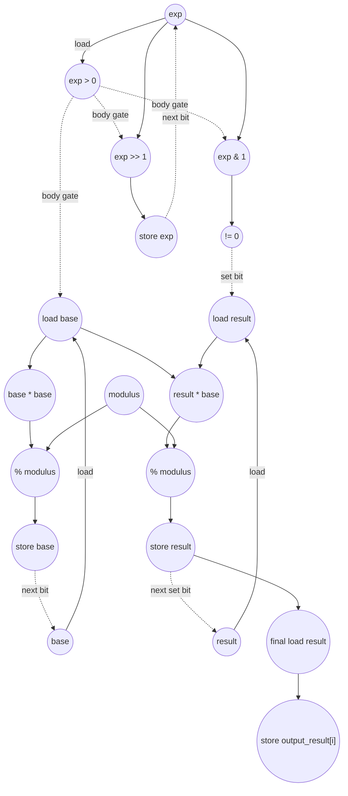

# ASAP Model Notes
- 

# Modular Exponentiation Performance
Parameters from `main.cpp`:
- `N = 256`
- `modulus = 1000000007`
- `input_base[i] = (i + 1) * 123`
- `input_exp[i] = (i + 1) * 7`

For each lane `i`, the kernel computes:

```
output_result[i] = input_base[i] ^ input_exp[i] mod modulus
```

using square-and-multiply from the least-significant exponent bit upward.

This kernel is **L4 Value-Distribution**.
The outer trip count is fixed by `N`, but the inner while trip count and the
number of taken result-update arms depend on the exponent values.

For the `main.cpp` inputs, define:

```
E_i = input_exp[i] = 7 * (i + 1)
K_i = bit_length(E_i)
H_i = popcount(E_i)
```

Dynamic facts for this input set:

| quantity | value | notes |
|----------|------:|-------|
| outer lanes | 256 | `i = 0..255` |
| max exponent | 1792 | `input_exp[255] = 7 * 256` |
| max exponent bit length | 11 | largest `K_i` |
| while body iters (`sum K_i`) | 2527 | one body iter per exponent bit |
| taken result updates (`sum H_i`) | 1356 | one `result = result * base % modulus` per set bit |

Distribution of `K_i`:

| K | lanes |
|---|------:|
| 3 | 1 |
| 4 | 1 |
| 5 | 2 |
| 6 | 5 |
| 7 | 9 |
| 8 | 18 |
| 9 | 37 |
| 10 | 73 |
| 11 | 110 |

## Loop classification

| dim | trip_count | kind | II | notes |
|-----|------------|------|----|-------|
| `i` | `N = 256` | parallel | n/a | Each lane reads `input_base[i]` and `input_exp[i]` and writes a distinct `output_result[i]`. There is no carried scalar or in-place memory dependence across lanes, so the ASAP data-dependence model fully unrolls `i`. The DSA source marks the loop `LOOM_NO_PARALLEL`/`LOOM_NO_UNROLL`, but this eval follows the ideal ASAP model, as in other dependency-based evals. |
| inner `while` | `K_i = bit_length(input_exp[i])` | sequential (data-dependent termination) | 4 for the `exp` and `base` carries | `exp`, `base`, and `result` are loop-carried. `exp >>= 1` and `base = base * base % modulus` are non-associative recurrences, so the bit loop cannot be tree-reduced. The result-update arm fires only on set exponent bits (`H_i` times per lane). |

`result`, `base`, and `exp` are memory-backed: each is reassigned and carried
across inner while iterations. The `base` read in a set-bit iteration fans out
to both `result * base` and `base * base` because no write intervenes between
those reads. `modulus` and `N` are loop-invariant parameters and are hoisted
once.

## Critical path (`total_cycles`)

The outer `i` loop is parallel, so `total_cycles` is the maximum per-lane depth.
For a lane with positive exponent bit length `K`, the high bit is always `1`,
so the final body iteration always takes the result-update arm.

The prologue stores the scalar initial values:

```
base:   load input_base[i] -> % modulus -> store base = 3 cycles
exp:    load input_exp[i]  -> store exp                = 2 cycles
result: store result = 1                               = counted, but not binding
```

The steady lower-bit recurrence is 4 cycles. The `exp` carry is:

```
load exp -> compare exp > 0 -> shift exp >> 1 -> store exp
```

The `base` carry has the same 4-cycle depth after the while gate:

```
load base -> multiply base * base -> % modulus -> store base
```

The exp, base, and result recurrences can overlap across a bit iteration.
The result recurrence advances only on set bits; on consecutive set bits it
ties the 4-cycle carried cadence, while zero-bit gaps give it slack. The final
set bit is always output-reaching because the stored result feeds the final
output store.

```
load exp -> compare exp > 0 -> exp & 1 -> compare != 0
-> load result -> result * base -> % modulus -> store result
```

The final false while check (`exp == 0`) is counted, but it is shorter than the
final result-update path and does not set the lane depth.

Per-lane depth:

```
depth(K) = 2                 (load input_exp[i] -> store exp)
         + 4 * (K - 1)       (lower-bit exp/base recurrences)
         + 8                 (final high-bit test and result update)
         + 2                 (load result -> store output_result[i])
         = 4 * K + 8
```

For the `main.cpp` inputs, `max K_i = 11`, so:

```
total_cycles = max_i depth(K_i) = 4 * 11 + 8 = 52
```

## Op counts

### Dynamic formulas

Using `K = sum K_i = 2527`, `H = sum H_i = 1356`, and `N = 256`:

- while body iterations: `K`
- final false while checks: `N`
- result-update arms: `H`
- bare subscripts: `input_base[i]`, `input_exp[i]`, and `output_result[i]`, so
  `address_adds = 0`

### Algorithmic

| op | count | source |
|----|------:|--------|
| loads | 512 | `input_base[i]` (256) + `input_exp[i]` (256) |
| stores | 256 | `output_result[i]` |
| multiplies | 3883 | `base * base` per bit (`K = 2527`) + `result * base` per set bit (`H = 1356`) |
| mods | 4139 | initial `input_base[i] % modulus` (`N = 256`) + square mods (`K = 2527`) + result-update mods (`H = 1356`) |
| bitops | 2527 | `exp & 1` per while body iter |
| shifts | 2527 | `exp >>= 1` per while body iter |
| compares | 5310 | `exp > 0` while checks (`K + N = 2783`) + implicit `(exp & 1) != 0` checks (`K = 2527`) |

### Overhead (loop-carried scalars, induction, param hoists, address-gen)

| op | count | source |
|----|------:|--------|
| loads | 7180 | `exp` loads for while body and exit checks (`K + N = 2783`) + `base` loads (`K = 2527`) + `result` loads (`H + N = 1612`) + outer `i` reads (`N = 256`) + hoisted `modulus` and `N` loads (2) |
| stores | 7434 | `result` init/update stores (`N + H = 1612`) + `base` init/update stores (`N + K = 2783`) + `exp` init/update stores (`N + K = 2783`) + outer `i` writebacks (`N = 256`) |
| adds | 256 | outer `i++` |
| compares | 256 | outer bound checks `i < N` |
| address_adds | 0 | all array accesses use bare `[i]` subscripts |

### Totals

| op | total |
|----|------:|
| loads | **7692** |
| stores | **7690** |
| adds | **256** |
| address_adds | **0** |
| multiplies | **3883** |
| mods | **4139** |
| bitops | **2527** |
| shifts | **2527** |
| compares | **5566** |
| divides / transcendentals | 0 |

## Data Dependency Graph

One inner while bit-step is shown below. Under parallel unroll of `i`, 256 such
lane-local graphs execute independently. The `exp` and `base` stores feed the
next bit-step. The `result` edge exists only on set-bit iterations.



## CGRA-Constrained Model

The ASAP bound above assumes unlimited functional units and memory bandwidth.
This section adds the aggregate lower bound for a CGRA with separate arithmetic
and memory-issue resources.

With `6x6` resources (`P = 36`, `L = 12`, `S = 12`):

- `CP = 52`
- `A = adds (256) + multiplies (3883) + mods (4139) + bitops (2527) + shifts (2527) + compares (5566) = 18898`
- `LD = 7692`
- `ST = 7690`

```
compute = ceil(18898 / 36) = 525
load    = ceil(7692 / 12)  = 641
store   = ceil(7690 / 12)  = 641
cycles  = max(52, 525, 641, 641) = 641
```

**Bottleneck: load/store-bound.** Under the ASAP dependency model, the longest
single exponent lane is only 52 cycles, but the 256 independent lanes create
enough scalar and array memory traffic that the 6x6 aggregate lower bound is set
by the load/store issue terms.
