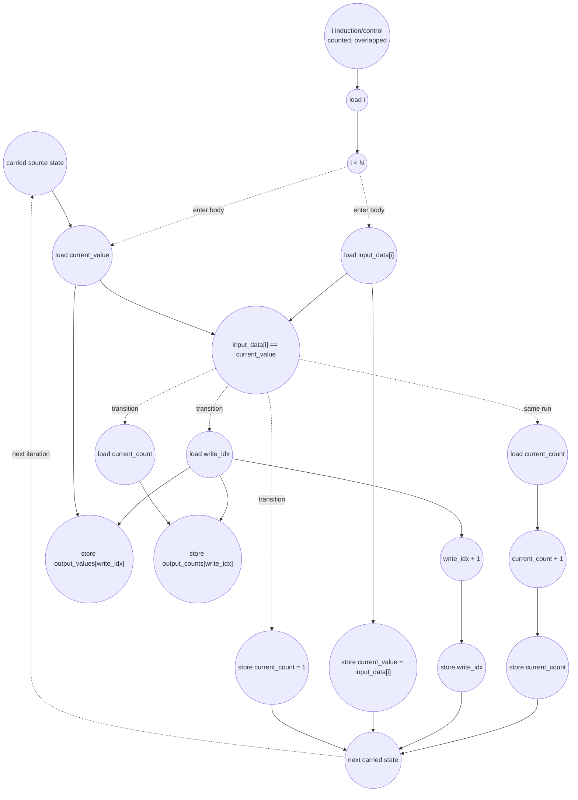

# ASAP Model Notes
- The kernel loop is state-carried: each iteration needs the previous run state before it can decide whether
`input_data[i]` extends the current run or starts a new one.
- The scan is a loop-carried state machine, so the `i` loop is not fully unrollable; however, ordinary `i` induction/control and `input_data[i]` loads can overlap in ASAP. The steady-state critical path is the carried run-state recurrence through `current_value`, `current_count`, and `write_idx`.

# Run Length Encoding Performance
Run-length encoding compresses each maximal run of equal input values into one
`(value, count)` output pair. The checked-in test case uses:

```
N = 20
input = [1,1,1, 2,2, 3,3,3,3, 4,4,4,4,4, 5, 6,6,6, 7,7]
```

So the run lengths are:

```
[3, 2, 4, 5, 1, 3, 2]
```

and:

```
R = number of runs = 7
T = number of transition iterations inside the for-loop = R - 1 = 6
S = number of same-run iterations inside the for-loop = N - R = 13
K = for-loop iterations = N - 1 = 19
```

The expected encoded stream is:

```
output_values = [1, 2, 3, 4, 5, 6, 7]
output_counts = [3, 2, 4, 5, 1, 3, 2]
output_length = 7
```

This is a source-faithful model of the checked-in state machine. A different
RLE implementation could first compute run-boundary flags and then use prefix
sums, giving logarithmic-depth scans, but that would be an algorithmic rewrite
rather than the source-level DAG here.

## Loop classification

| dim | trip_count | kind | II | notes |
|-----|------------|------|----|-------|
| scan `i` | `N - 1 = 19` | sequential | 5 | The loop carries `current_value`, `current_count`, and `write_idx`. The binding recurrence is the selected source-state update; ordinary `i` induction and input loads are counted but overlap the longer carried-state chain after loop entry. |

`current_value`, `current_count`, and `write_idx` are memory-backed because they
are reassigned and carried across loop iterations. The iterator `i` is also a
sequential carried value. Within one dynamic iteration, a named scalar load fans
out to multiple uses when no intervening write occurs: for example, a transition
iteration loads `write_idx` once and uses it for both output stores and the
`write_idx++` update.

All array subscripts are bare variables (`input_data[i]`,
`output_values[write_idx]`, `output_counts[write_idx]`), so there are no
`address_adds`.

## Critical path (`total_cycles`)

The `N == 0` path is not taken for the checked-in test. For `N > 0`, the
non-empty prologue establishes the first carried value:

```
1 load N
+ 1 compare N == 0
+ 1 load input_data[0]
+ 1 store current_value
= 4 cycles
```

The constant-initialized carries (`write_idx = 0`, `current_count = 1`, and
`i = 1`) are still counted as stores, but their first reads consume constants
and do not extend this prologue chain.

Each steady scan iteration has the same 5-cycle carried-state interval. The
ordinary `i` induction/control stream is counted in the op totals, but after the
first loop entry it overlaps the longer source-state recurrence, as in
`kmp_table_eval.md`, `tridiag_solve_eval.md`, and
`gauss_seidel_step_eval.md`. The `input_data[i]` loads are likewise ready before
the carried `current_value` arrives in steady state.

The binding path reaches the equality test through the carried run value:

```
1 load current_value
+ 1 compare input_data[i] == current_value
= 2 cycles to resolve the branch
```

Then the selected arm closes the carried state:

```
same-run arm:
  1 load current_count
  + 1 current_count + 1
  + 1 store current_count
  = 3 cycles

transition arm:
  1 load write_idx
  + 1 write_idx + 1
  + 1 store write_idx
  = 3 cycles
```

The transition arm also stores `output_values[write_idx]`,
`output_counts[write_idx]`, `current_value = input_data[i]`, and
`current_count = 1`, but those paths are no deeper than the `write_idx`
increment path. Thus the source loop has:

```
II = 2 (load current_value, equality compare)
   + 3 (selected carried-state update)
   = 5
```

After the scan, the final run is emitted:

```
1 load write_idx, current_value, current_count
+ 1 store final value/count and compute write_idx + 1
+ 1 store write_idx
+ 1 reload write_idx after the write
+ 1 store output_length
= 5 cycles
```

For `N > 0`:

```
total_cycles = 4 (non-empty prologue)
             + 5 * (N - 1) (scan loop)
             + 5 (final run + output_length)
             = 5N + 4
```

For the `main.cpp` input:

```
total_cycles = 5 * 20 + 4 = 104
```

The total is independent of the run distribution for this source state machine:
same-run and transition iterations have the same 5-cycle carried interval. The
run distribution affects dynamic work, especially output stores and `write_idx`
updates.

For the skipped `N == 0` branch:

```
1 load N + 1 compare N == 0 + 1 store output_length = 3 cycles
```

## Op counts

### Dynamic formulas

For a non-empty input:

- `R` is the number of emitted runs.
- `T = R - 1` transition iterations inside the scan loop.
- `S = N - R` same-run iterations inside the scan loop.
- `K = N - 1` scan-loop iterations.

### Algorithmic

| op | formula | total | source |
|----|---------|------:|--------|
| loads | `N` | **20** | `input_data[0]` plus `input_data[i]` for `i = 1..N-1` |
| stores | `2R + 1` | **15** | `output_values` stores (7), `output_counts` stores (7), and `output_length` store |
| adds | `S + R` | **20** | `current_count++` on same-run iterations (13) plus `write_idx++` for each emitted run (7) |
| compares | `K + 1` | **20** | equality compares inside the scan (19) plus the `N == 0` check |

### Overhead (loop-carried scalars, induction, address generation)

| op | formula | total | source |
|----|---------|------:|--------|
| loads | `(K + 1) + N + (T + 2) + K + 1` | **68** | `current_value` reads (`K` loop reads + final read = 20), `current_count` reads (`S + T + 1 = 20`), `write_idx` reads (`T + 2 = 8`), iterator `i` reads (`K = 19`), hoisted `N` load (1) |
| stores | `(1 + T) + (1 + S + T) + (T + 2) + K` | **54** | `current_value` init/transition stores (7), `current_count` init/update/reset stores (20), `write_idx` init/update stores (8), iterator `i` writeback stores (`K = 19`) |
| adds | `K` | **19** | iterator `i++` |
| compares | `K` | **19** | loop-bound checks `i < N` |
| address_adds | 0 | **0** | all subscripts are bare scalar indices |

### Totals

| op | total |
|----|------:|
| loads | **88** |
| stores | **69** |
| adds | **39** |
| compares | **39** |
| address_adds | **0** |
| multiplies / divides / shifts / bitops / transcendentals | 0 |

## Data Dependency Graph

One scan iteration. Dotted edges are no-predication gates: the selected arm
cannot fire until the equality compare resolves, and only the taken arm's work
is counted dynamically. The `i` control stream is shown because it is counted,
but the steady critical path is the carried run-state path through
`current_value` and the selected state update.


