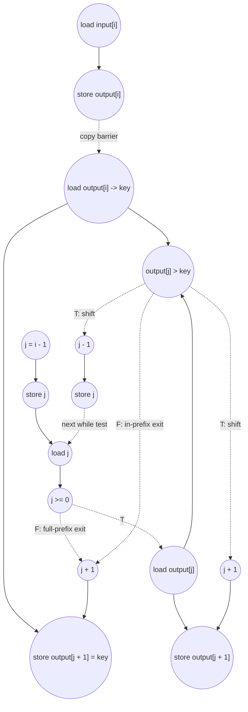

# ASAP Model Notes
- `output[i]` intially set as a copy of `input[i]`, this takes a fixed number of cycles if the loop is fully unrolled (load -> store)
- Outer for loop and inner while loop must be serialized because the state of `output` in each i iteration depends on the content of `output` after the inner loop while runs in the previous iteration (i - 1)
- Further, the while loop checks two conditions during each iteration and these conditions are not known ahead of time. Under the taken branch, both compares need to be evaluated

# Insertion Sort Performance
Parameters from `main.cpp`:
- `N = 512`
- `input[i] = N - i`, so the input is strictly descending.

The descending test input is the insertion-sort worst case: for every outer
iteration `i`, the current `key = output[i]` is smaller than the whole sorted
prefix `output[0..i-1]`. Therefore the inner while body executes exactly `i`
times and then exits through `j < 0`.

This kernel is **L5 Structure-Dependent** in `kernel_perf_difficulty.csv`.
The checked-in test case has a closed form because the input ordering is known,
but a general input needs the per-key shift count.

| symbol | meaning | reverse-input value |
|--------|---------|--------------------:|
| `O` | outer key iterations, `N - 1` | 511 |
| `T_i` | taken inner while bodies for key `i` | `i` |
| `F` | total shifts, `sum_i T_i` | `N(N-1)/2 = 130816` |
| `E_neg` | while exits through `j < 0` | 511 |
| `E_val` | while exits through `output[j] <= key` | 0 |

## Loop classification

| dim | trip_count | kind | II | notes |
|-----|------------|------|----|-------|
| copy `i` | `N` = 512 | parallel | n/a | The copy reads `input[i]` and writes distinct `output[i]` elements. Under the ASAP model this independent copy is fully unrolled; the copy stores form a RAW barrier for the later in-place insertion sort because the sort reads and rewrites `output[]`. |
| outer key `i` | `N - 1` = 511 | sequential | input-dependent | Each key iteration mutates the in-place sorted prefix. Iteration `i+1` consumes the prefix produced by iteration `i`, so outer key iterations cannot overlap even with unlimited hardware. The DSA source also marks the copy loop `LOOM_NO_PARALLEL`/`LOOM_NO_UNROLL`, but this eval follows the ideal ASAP model for independent dimensions. |
| inner `while` | `T_i` taken bodies plus one exit test | sequential | 6 per taken shift body | Carries `j` and mutates overlapping `output[]` locations. The while termination is data-dependent. The `&&` short-circuits: a full-prefix shift exits after `j >= 0` is false, while a normal stop also loads `output[j]` and compares it with `key`. |

`key` is assigned once per outer iteration and not loop-carried, so it is an
anonymous dataflow value: the `output[i]` load feeds the final key store without
separate scalar load/store traffic. `j` is memory-backed because it is initialized
and then decremented across while iterations. One `j` load per while test fans
out to the `j >= 0` compare, the `output[j]` subscript, the conditional
`output[j + 1]` address, and `j--` when no write intervenes.

## Critical path (`total_cycles`)

The copy pass has a 2-cycle barrier:

```
1 (load input[i]) + 1 (store output[i]) = 2
```

All 512 copy lanes overlap under the ASAP model, so the later sort can begin
from `output[]` depths of 2. The insertion-sort loop is then serialized by the
in-place prefix state.

For one outer key with `T` taken inner while bodies, counted from the point where
the key iteration is admitted and `i` is available:

### Per-key prelude

| cycle | critical-path work |
|------:|--------------------|
| C1 | Load `key = output[i]`; compute `j0 = i - 1` in parallel |
| C2 | Store memory-backed scalar `j = j0` |
| C3 | First load of `j0` for the while condition |

### One taken while body

For taken body `r`, with `s = 3 + 6r` and `j_r = i - 1 - r`:

| cycle | critical-path work |
|------:|--------------------|
| `s` | Load scalar `j_r` |
| `s+1` | Compare `j_r >= 0` |
| `s+2` | Load `output[j_r]` for `output[j_r] > key` |
| `s+3` | Compare `output[j_r] > key` |
| `s+4` | Body is now gated open: compute `j_r + 1` for `output[j_r + 1]` and compute `j_r - 1` for `j--` |
| `s+5` | Store `output[j_r + 1] = output[j_r]`; store scalar `j_{r+1}` |

The recurrence edge is `store j_{r+1}` to the next body's `load j_{r+1}`, so
each taken shift body advances the critical path by 6 cycles. The loaded
`output[j_r]` value feeds both the comparison and the shift store; the branch
gate still forces the address generation and stores to wait for the comparison.

### Termination after `T` taken bodies

If the key shifts through the whole prefix and exits because `j_T < 0`:

| cycle | critical-path work |
|------:|--------------------|
| `3 + 6T` | Load `j_T` |
| `4 + 6T` | Compare `j_T >= 0`, false |
| `5 + 6T` | Compute final address `j_T + 1` |
| `6 + 6T` | Store `output[j_T + 1] = key` |

So a full-prefix shift reaches the final key store at:

```
6T + 6
```

If the key stops inside the prefix because `j_T >= 0` but `output[j_T] <= key`:

| cycle | critical-path work |
|------:|--------------------|
| `3 + 6T` | Load `j_T` |
| `4 + 6T` | Compare `j_T >= 0`, true |
| `5 + 6T` | Load `output[j_T]` |
| `6 + 6T` | Compare `output[j_T] > key`, false |
| `7 + 6T` | Compute final address `j_T + 1` |
| `8 + 6T` | Store `output[j_T + 1] = key` |

So an in-prefix stop reaches the final key store at:

```
6T + 8
```

The reverse input always takes the full-prefix path, with `T_i = i`.
Therefore:

```
total_cycles =
  2                                  (parallel copy barrier)
+ sum_{i=1}^{N-1} (6i + 6)           (serialized key insertions)
= 2 + 6 * N(N-1)/2 + 6 * (N-1)
= 2 + 3N(N-1) + 6(N-1)
= 2 + 3(N-1)(N+2)
```

For `N = 512`:

```
total_cycles = 2 + 3 * 511 * 514 = 787964
```

For comparison, an already sorted input would take `T_i = 0` and the in-prefix
stop path for every key:

```
best_case_cycles = 2 + 8(N-1)
```

The asymptotic depth is therefore `Theta(N)` in the best case and
`Theta(N^2)` in the descending worst case. The exact middle cases depend on the
input ordering through `T_i` and the exit type for each key.

## Op counts

Counts below are for the checked-in reverse input. Bare subscripts such as
`output[i]` and `output[j]` contribute no `address_add`. The `j + 1` expression
inside `output[j + 1]` does contribute one `address_add` for each shift store
and each final key store.

### Algorithmic

| op | formula | total | source |
|----|---------|------:|--------|
| loads | `N + O + F` | **131839** | copy `input[i]`; key loads `output[i]`; one `output[j]` load per taken while comparison, also feeding the shift value |
| stores | `N + F + O` | **131839** | copy stores; shift stores `output[j + 1] = output[j]`; final key stores |
| compares | `F` | **130816** | `output[j] > key` on taken while bodies |

### Overhead (loop-carried scalars, induction, address generation)

| op | formula | total | source |
|----|---------|------:|--------|
| loads | `N + O + (F + O) + 2` | **132352** | copy iterator reads; outer iterator reads; `j` reads for every while test; hoisted `N` loads in the ordered copy and sort regions |
| stores | `(N + 1) + (O + 1) + (O + F)` | **132352** | copy iterator init/writebacks; outer iterator init/writebacks; `j` init and `j--` stores |
| adds | `N + O` | **1023** | copy `i++`; outer `i++` |
| subs | `O + F` | **131327** | `j = i - 1`; `j--` |
| address_adds | `F + O` | **131327** | `output[j + 1]` in shift stores and final key stores |
| compares | `N + O + (F + O)` | **132350** | copy loop bounds; outer loop bounds; `j >= 0` while tests including exits |

### Totals

| op | total |
|----|------:|
| loads | **264191** |
| stores | **264191** |
| adds | **1023** |
| subs | **131327** |
| address_adds | **131327** |
| compares | **263166** |
| multiplies / divides / shifts / bitops / transcendentals | 0 |

The work and critical path are both dominated by the `F = 130816` taken shift
bodies. The copy phase is only linear work and contributes only a 2-cycle
barrier to the ASAP depth.

## Data Dependency Graph

One outer key insertion. Dotted edges are no-predication gates: the guarded work
cannot fire until the controlling compare retires, and only the taken arm's ops
are counted dynamically.



The outer key loop serializes these graphs through the in-place `output[]`
prefix: the next key insertion consumes the sorted prefix written by the
previous insertion. Unlike a reduction, the shift sequence is order-dependent
and cannot be tree-scheduled.

## CGRA-Constrained Model

The ASAP bound above assumes unlimited functional units and memory bandwidth.
This section adds the aggregate lower bound for a CGRA with separate arithmetic
and memory-issue resources, following `docs/spec-kernel-performance.md`:

- `P` - arithmetic PEs, one non-load/store op per cycle each.
- `L` - load-issue lanes, one load per cycle each.
- `S` - store-issue lanes, one store per cycle each.

Every counted load consumes an `L` slot and every counted store consumes an `S`
slot, including scalar and induction-variable accesses. Every counted
non-load/store op consumes a `P` slot. With `CP` the ASAP dependency bound,
`A` the counted non-load/store ops, `LD` the loads, and `ST` the stores:

```
compute = ceil(A / P)
load    = ceil(LD / L)
store   = ceil(ST / S)
cycles  = max(CP, compute, load, store)
```

The copy loop is ordered before the in-place insertion-sort loop because the
sort phase reads `output[]` values written by the copy phase. The aggregate
bound is therefore the sum of the copy-region bound and the sort-region bound.

Counts for the `main.cpp` reverse input:

| region | CP | A | LD | ST | compute=⌈A/36⌉ | load=⌈LD/12⌉ | store=⌈ST/12⌉ | region cycles |
|--------|---:|---:|---:|---:|---:|---:|---:|---:|
| copy | 2 | 1024 | 1025 | 1025 | 29 | 86 | 86 | **86** |
| sort | 787964 | 525819 | 263166 | 263166 | 14607 | 21931 | 21931 | **787964** |

6x6 example (`P = 36`, `L = 12`, `S = 12`):

```
cycles = 86 (copy) + 787964 (sort) = 788050
```

**Bottleneck: dependency-bound.** Even though the reverse input performs more
than half a million arithmetic/control ops and more than half a million memory
ops, the serialized insertion chain is much longer than the aggregate resource
terms on a 6x6 fabric. Wider resources do not reduce the worst-case latency
unless the algorithm or source structure exposes a different dependency graph.

<!-- BEGIN CGRA-SCHED:sort_insertion -->
### Finite-Resource Schedule Estimate (time-local)

*Reproducible estimate for the deterministic criticality-priority list-schedule policy defined in [`docs/spec-kernel-performance.md`](../../../docs/spec-kernel-performance.md). It is **not** a lower bound (the aggregate model above is the lower bound) and **not** cycle-accurate RTL; it exposes the short windows of local `P`/`L`/`S` pressure that the aggregate model smooths over.*

**Resource configuration:** `P = 36`, `L = 12`, `S = 12` (`6x6`).

| region | CP | A | LD | ST | aggregate | scheduled (makespan) |
|--------|---:|--:|---:|---:|----------:|---------------------:|
| copy | 2 | 1024 | 1025 | 1025 | 86 | 88 |
| sort | 787964 | 525819 | 263166 | 263166 | 787964 | 787964 |
| **total** |  |  |  |  | **788050** | **788052** |

- **scheduled_cycles** = 788052  (sum of ordered-region makespans)
- **aggregate_cycles** = 788050  (the lower bound above, unchanged)
- **gap_cycles** = 2  (scheduled − aggregate)
- **gap_ratio** = 1  (scheduled / aggregate)

**Local `P`/`L`/`S` pressure** (saturated cycles / longest saturated run / peak ready backlog):
- `P`: 20 / 20 / 476
- `L`: 128 / 85 / 1013
- `S`: 127 / 85 / 12

<!-- END CGRA-SCHED:sort_insertion -->
