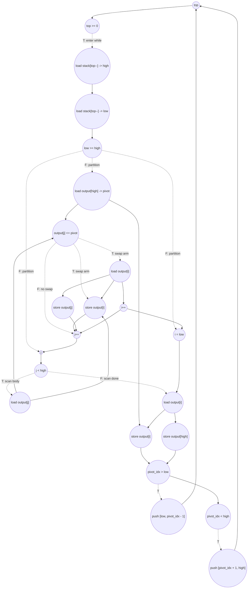

# ASAP Model Notes
- Copy loop can be parallelized via full unrolling
- While and for loop must be serialized due to stack and variable dependencies
    - Dependent variables include `top` and in-place modification of `output[]`
- Total cycles heavily depends on input, which affects taken branches: no closed form in `N`
- Swap is gated by the `output[j] <= pivot` comparison

# Quick Sort Performance
Parameters: `N = 1024` (from `main.cpp`).
- `input[i] = (i * 7 + 13) % N` for `0 <= i < N`.
- The implementation is iterative quicksort with an explicit `stack[64]` and
  last-element pivot (`pivot = output[high]`).

Quicksort is structure-dependent: the partition sizes, selected swap arms, and
stack order are determined by the input ordering. The formulas below use trace
variables from replaying the source-level partition decisions:

| symbol | meaning | test-input value |
|--------|---------|-----------------:|
| `W` | processed while-loop ranges, including skipped singleton ranges | 1024 |
| `R` | nontrivial partitions (`low < high`) | 678 |
| `Z` | skipped ranges (`low >= high`) | 346 |
| `C` | scan comparisons, `sum_r (high_r - low_r)` | 25773 |
| `S` | taken scan-swap arms, `sum_r count(output[j] <= pivot)` | 21104 |
| `L_p` | left subrange pushes (`pivot_idx > low`) | 516 |
| `R_p` | right subrange pushes (`pivot_idx < high`) | 507 |
| `Q` | total child range pushes, `L_p + R_p` | 1023 |

For distinct inputs with `N > 1`, every element is either selected as a pivot in
a nontrivial partition or appears as a skipped singleton range, so
`W = R + Z = N`. The value of `C`, `S`, and the split between `L_p` and `R_p` is
still input ordering dependent.

## Loop classification

| dim | trip_count | kind | II | notes |
|-----|------------|------|----|-------|
| copy `i` | `N` = 1024 | parallel | n/a | The copy reads `input[i]` and writes distinct `output[i]` elements. Under the ASAP model this independent copy is fully unrolled; its stores form a RAW barrier for the later in-place quicksort because partitions read and overwrite `output[]`. |
| stack `while` | data-dependent (`W`) | sequential | trace-dependent | Carries `top`, the stack contents, and the in-place `output[]` state. The next range cannot be popped until the current range has been popped, tested, partitioned if nontrivial, and any child ranges have been pushed. The final failing `top >= 0` termination check is on the control path. |
| partition scan `j` | `high - low` per partition (`C` total) | sequential | trace-dependent | Carries `j` and the partition boundary `i`. The branch `if (output[j] <= pivot)` is not predicated: untaken iterations pay only the compare path, while taken iterations pay the swap body and `i++`. |

`pivot`, `low`, `high`, `pivot_idx`, and `temp` are assigned once in their
dynamic scope and are treated as anonymous dataflow values. `top`, partition
boundary `i`, and scan iterator `j` are memory-backed because they carry state
across iterations or have repeated writes.

## Critical path (`total_cycles`)

The quicksort phase is not a closed-form function of `N` alone. It is the
critical path of the concrete stack trace:

```
total_cycles =
  2 (parallel copy: load input[i] -> store output[i], then RAW barrier)
+ quicksort_setup
+ sum over processed ranges in stack pop order:
     range_pop_and_low_high_test
   + if low < high:
       pivot_load_and_partition_setup
     + sum over scan iters:
         untaken path: j-bound check -> load output[j] -> cmp <= pivot -> j++
         taken path:   j-bound check -> load output[j] -> cmp <= pivot
                     -> load output[i] / reuse output[j] -> two stores
                     -> i++ -> j++
     + final pivot swap using loaded pivot as the output[high] value
     + left/right push tests and selected stack pushes
+ final failing top >= 0 check
```

The binding dependence is the explicit-stack/in-place partition trace, not
functional-unit throughput. Infinite hardware cannot run the source-level
partitions in parallel because this implementation serializes them through
`top` and the stack array. Within a partition, the scan is also sequential:
`j` advances one element at a time, and taken swap arms update the carried
partition boundary `i`.

Asymptotically:
- Balanced/average traces have `C = Theta(N log N)` and `S = Theta(N log N)`,
  so `total_cycles = Theta(N log N)` for this source.
- Worst-case traces for the last-element pivot, such as already sorted input,
  have `C = N(N - 1) / 2` and `total_cycles = Theta(N^2)`.
- The checked-in pseudo-random permutation gives `C = 25773`, `S = 21104`, and
  `R = 678`, so the concrete depth is a replay of those 1024 processed ranges.

This differs from an ideal fork-join recursive quicksort DAG. If the source
spawned left and right child partitions as parallel tasks after each partition,
the depth recurrence would be `D(m) = partition_cp(m) + max(D(left), D(right))`.
The current kernel does not expose that DAG; it exposes a sequential stack
machine.

## Op counts

### Trace formulas

The formulas below count source-level dynamic work for a trace with the symbols
defined above. Bare subscripts such as `output[j]`, `output[i]`, `stack[top]`,
and `input[i]` contribute no `address_adds`; stack-pointer pre/post increments
are counted as regular scalar adds/subs on `top`, not as address arithmetic.
Repeated reads of the same array element collapse when no intervening write can
change that element. Thus the scan compare's `output[j]` load fans out to the
taken swap's RHS use of `output[j]`, and the partition prologue's
`output[high]` pivot load fans out to the final pivot-placement store. The
fan-out removes the extra load; it does not remove the branch gate on the
taken-arm store that consumes the value. This is the same treatment used for
`top`, carried `i`, and carried `j`: one load may feed several uses, but uses
inside a gated body still wait for the controlling compare. The
formulas remain conservative about dynamic self-swaps where `i == j`: those
still charge the `output[i]` load separately from the `output[j]` load.

### Algorithmic

| op | formula | test-input total | source |
|----|---------|-----------------:|--------|
| loads | `N + C + S + 2R` | **49257** | copy `input[i]` (`N`); pivot load (`R`); scan compare load `output[j]` (`C`, also used by the taken swap RHS); taken swap load `output[i]` (`S`); final pivot-swap load `output[i]` (`R`, while the `output[high]` value is the already-loaded pivot) |
| stores | `N + 2S + 2R` | **44588** | copy stores (`N`); two scan-swap stores per taken arm (`2S`); two final pivot-swap stores per partition (`2R`) |
| adds | `S + R_p` | **21611** | partition-boundary `i++` on taken scan arms (`S`) + right child lower bound `pivot_idx + 1` (`R_p`) |
| subs | `L_p` | **516** | left child upper bound `pivot_idx - 1` |
| compares | `1 + W + C + 2R` | **28154** | `N <= 1`; `low >= high` per popped range; `output[j] <= pivot` per scan iter; left/right push tests per nontrivial partition |

### Overhead (stack, carried scalars, induction, param hoists)

| op | formula | test-input total | source |
|----|---------|-----------------:|--------|
| loads | `1 + N + (2W + 2Q + 3) + 2W + (S + R) + C` | **54725** | hoisted `N` load; copy iterator reads; `top` reads for while checks, pops, and pushes; stack array pops; carried partition `i` reads; scan iterator `j` reads |
| stores | `(N + 1) + (2W + 2Q + 3) + (2 + 2Q) + (R + S) + (R + C)` | **55403** | copy iterator init/writebacks; `top` init/writebacks; stack array pushes; carried partition `i` init/writebacks; scan iterator `j` init/writebacks |
| adds | `N + (2 + 2Q) + C` | **28845** | copy `i++`; `top` pre-increments on initial and child pushes; scan `j++` |
| subs | `1 + 2W` | **2049** | initial `N - 1`; two `top--` pop updates per processed range |
| compares | `N + (W + 1) + C` | **27822** | copy loop bound; `top >= 0` including final failing check; scan loop bound |
| address_adds | `0` | **0** | all array and stack accesses use bare variable/scalar subscripts |

### Totals

| op | total |
|----|------:|
| loads | **103982** |
| stores | **99991** |
| adds | **50456** |
| subs | **2565** |
| compares | **55976** |
| address_adds | **0** |
| muls / divs / shifts / bitops / transcendentals | 0 |

The op counts are dominated by the partition trace. The copy phase is only
`Theta(N)` work, while the scan compares, selected swaps, stack traffic, and
carried scalar traffic scale with the input-dependent quicksort trace.

## Data Dependency Graph

Representative nontrivial partition. Dotted edges are strict no-predication
gates: the body under an `if` does not fire until the controlling compare
retires, and only the taken arm contributes dynamic operations.



The copy loop's store to `output[k]` precedes any later partition load from
`output[k]`. After that barrier, the explicit stack and each partition's scan
form the dependency spine. Sibling subranges may be logically independent after
a partition, but this source serializes them through stack pushes and pops, so
the ASAP model follows stack order rather than a parallel recursion tree.
