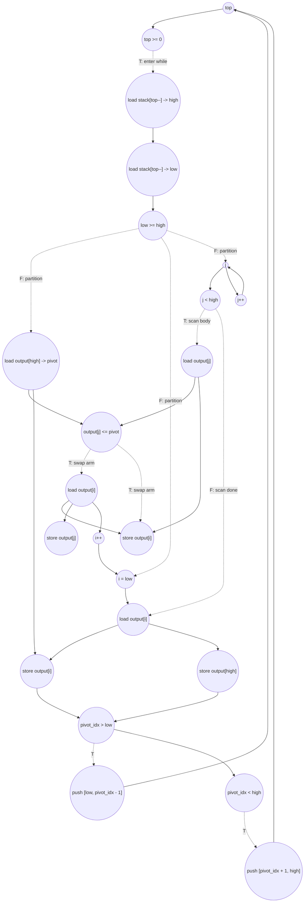

# ASAP Model Notes
- Copy loop can be parallelized via full unrolling
- While and for loop must be serialized due to stack and variable dependencies
    - Dependent variables include `top` and in-place modification of `output[]`
- Total cycles heavily depends on input, which affects taken branches: no closed form in `N`
- Swap is gated by the `output[j] <= pivot` comparison

# Quick Sort Performance
Parameters: `N = 1024` (from `main.cpp`).
- `input[i] = (i * 7 + 13) % N` for `0 <= i < N`.
- The implementation is iterative quicksort with an explicit `stack[64]` and
  last-element pivot (`pivot = output[high]`).

Quicksort is structure-dependent: the partition sizes, selected swap arms, and
stack order are determined by the input ordering. The formulas below use trace
variables from replaying the source-level partition decisions:

| symbol | meaning | test-input value |
|--------|---------|-----------------:|
| `W` | processed while-loop ranges, including skipped singleton ranges | 1024 |
| `R` | nontrivial partitions (`low < high`) | 678 |
| `Z` | skipped ranges (`low >= high`) | 346 |
| `C` | scan comparisons, `sum_r (high_r - low_r)` | 25773 |
| `S` | taken scan-swap arms, `sum_r count(output[j] <= pivot)` | 21104 |
| `L_p` | left subrange pushes (`pivot_idx > low`) | 516 |
| `R_p` | right subrange pushes (`pivot_idx < high`) | 507 |
| `Q` | total child range pushes, `L_p + R_p` | 1023 |

For distinct inputs with `N > 1`, every element is either selected as a pivot in
a nontrivial partition or appears as a skipped singleton range, so
`W = R + Z = N`. The value of `C`, `S`, and the split between `L_p` and `R_p` is
still input ordering dependent.

## Loop classification

| dim | trip_count | kind | II | notes |
|-----|------------|------|----|-------|
| copy `i` | `N` = 1024 | parallel | n/a | The copy reads `input[i]` and writes distinct `output[i]` elements. Under the ASAP model this independent copy is fully unrolled; its stores form a RAW barrier for the later in-place quicksort because partitions read and overwrite `output[]`. |
| stack `while` | data-dependent (`W`) | sequential | trace-dependent | Carries `top`, the stack contents, and the in-place `output[]` state. The next range cannot be popped until the current range has been popped, tested, partitioned if nontrivial, and any child ranges have been pushed. The final failing `top >= 0` termination check is on the control path. |
| partition scan `j` | `high - low` per partition (`C` total) | sequential | trace-dependent | Carries `j` and the partition boundary `i`. The branch `if (output[j] <= pivot)` is not predicated: untaken iterations pay only the compare path, while taken iterations pay the swap body and `i++`. |

`pivot`, `low`, `high`, `pivot_idx`, and `temp` are assigned once in their
dynamic scope and are treated as anonymous dataflow values. `top`, partition
boundary `i`, and scan iterator `j` are memory-backed because they carry state
across iterations or have repeated writes.

## Critical path (`total_cycles`)

Quicksort has no closed-form cycle count in `N`: which elements swap, how the
partitions split, and the stack order all depend on the specific input. So
instead of a formula we replay the sort as a dependency graph and measure its
longest chain. One rule drives everything:

> Each operation finishes at `depth = 1 + max(depth of its inputs)`: it takes
> one cycle and cannot start until its slowest input is ready.

For every memory-backed value (`output[]`, the stack, `top`, `i`, `j`) we track
the cycle it was last written; a load reads `1 +` that cycle and a store updates
it. `total_cycles` is just the depth of the deepest operation. The copy loop
writes every `output[k]` by cycle 2, so all depths start there.

Two chunks set the pace; everything else overlaps them:
- Popping a range — ~7 cycles. `high = stack[top--]; low = stack[top--]`: the
  second `top--` waits on the first, and both wait on the `top >= 0` gate because
  they are `while`-body statements. Reading the stack values and the
  `low >= high` test ride alongside and add no length.
- Scanning one element — 3 cycles. The pacing carry is `j++`
  (`load j -> +1 -> store j`). The `output[j] <= pivot` compare and any swap
  overlap it, because `j++` does not depend on them. A taken swap does extra work
  (`i++`, two stores) but finishes early enough to overlap the next element's
  counter step — which is why the swap count `S` never appears as a `+S` term.

Because each range pops the stack this run just pushed and reads `output[]` cells
it just rewrote, depths accumulate down the trace; the deepest write (or the
final failing `top >= 0` check after the stack empties) is the answer. Infinite
hardware cannot shorten this — the source serializes every partition through
`top` and the in-place array, so there is no parallel recursion to exploit.

The schematic shape of that chain:

```
total_cycles =
  2 (parallel copy: load input[i] -> store output[i], then RAW barrier)
+ quicksort_setup
+ sum over processed ranges in stack pop order:
     range_pop_and_low_high_test
   + if low < high:
       pivot_load_and_partition_setup
     + sum over scan iters:
         untaken path: j-bound check -> load output[j] -> cmp <= pivot -> j++
         taken path:   j-bound check -> load output[j] -> cmp <= pivot
                     -> load output[i] / reuse output[j] -> two stores
                     -> i++                                      [loop-latch j++ is a separate carry]
     + final pivot swap using loaded pivot as the output[high] value
     + left/right push tests and selected stack pushes
+ final failing top >= 0 check
```

Zooming into one scan iteration, with `pivot`, `high`, and the carried scalars
ready at the loop head:

```
Untaken arm (`output[j] > pivot`): 3-cycle carried latch, 4-cycle compare side path
  C1 load j
  C2 compare j < high                  || add j + 1
  C3 load output[j]                    || store updated j
  C4 compare output[j] <= pivot

Taken arm (`output[j] <= pivot`): j latch still 3 cycles; gated i/update tail reaches C7
  C1 load j
  C2 compare j < high                  || add j + 1
  C3 load output[j]                    || store updated j
  C4 compare output[j] <= pivot
  C5 load carried i
  C6 load output[i] for temp                || add i + 1
  C7 store output[i], store output[j]       || store updated i
```

The taken arm reuses the C3 `output[j]` load for `output[i] = output[j]` (no
second load). Its `i++` carry and array stores can still become the *later*
dependency for the final pivot placement and for subsequent taken swaps, so they
are part of the replay even though they overlap the `j` latch.

The replay below applies the `depth` rule operation by operation — a unit-depth
DAG walk, not a residual fit. Let `emit(preds...) = 1 + max(preds...)`, and let
`d(top)`, `d(stack[k])`, `d(output[k])`, `d(i)`, and `d(j)` be the current
last-writer depths of the memory-backed state.

Initialization starts from the parallel copy barrier: every `d(output[k])` is
2 after `load input[k] -> store output[k]`. The hoisted `N` load and `N <= 1`
guard also finish by depth 2, so the first stack push can start at depth 3.
The `top = -1` store is counted in the op totals, but the first `++top` read
uses the compile-time constant (constant-initialized carry rule); the two
initial pushes (setup depth 2) leave the initial range on the stack with
`d(top) = 8`.

For each processed stack range, the pop side of the replay is:

```
top0       = emit(d(top))                  // load top (the carry is d(top)); fans to while check + first pop index
while_cmp  = emit(top0)                    // top >= 0
high       = emit(while_cmp, d(stack[top]))
top_dec0   = emit(while_cmp, top0)
d(top)     = emit(top_dec0)                // first top-- store
top1       = emit(d(top))                  // second pop reads the decremented top
low        = emit(top1, d(stack[top]))
top_dec1   = emit(top1)
d(top)     = emit(top_dec1)                // second top-- store
range_cmp  = emit(high, low)               // low >= high
```

This makes a processed range a 7-cycle `top` pop carry:

```
C1 load top
C2 compare top >= 0
C3 load stack[old top] for high || compute top - 1
C4 store first decremented top
C5 load top for low pop
C6 load stack[new top] for low  || compute top - 1
C7 store second decremented top || compare low >= high
```

The stack loads and `low >= high` comparison overlap the `top` carry; they are
not added as serial work after the two decrements. The carry still does not
collapse to 2-3 cycles, because the `top--` operations are source statements
inside the `while` body and wait for the `top >= 0` gate. They are not a
for-loop latch like `j++`, which is why this treatment differs from the scan
iterator.

For each selected child range push, the replay applies the same two-update
stack-pointer pattern:

```
top_push0 = emit(push_cmp, d(top))
top_inc0  = emit(top_push0)
d(top)    = emit(top_inc0)
d(stack[++top]) = emit(top_inc0, child_bound0)

top_push1 = emit(d(top))
top_inc1  = emit(top_push1)
d(top)    = emit(top_inc1)
d(stack[++top]) = emit(top_inc1, child_bound1)
```

For a nontrivial range, partition setup is gated by `range_cmp` resolving
false:

```
pivot = emit(range_cmp, d(output[high]))
d(i)  = emit(range_cmp, low)
d(j)  = emit(range_cmp, low)
```

Within a partition, the replay uses the local scan timing shown above:

```
load_j    = emit(d(j))
cmp_j     = emit(load_j)
inc_j     = emit(load_j)                   // independent of output[j] <= pivot
d(j)      = emit(inc_j)
load_outj = emit(cmp_j, d(output[j]))
cmp_pivot = emit(load_outj, pivot)

if cmp_pivot is taken:
  load_i       = emit(cmp_pivot, d(i))
  load_outi    = emit(load_i, d(output[i]))
  inc_i        = emit(load_i)
  d(i)         = emit(inc_i)
  d(output[i]) = emit(cmp_pivot, load_outj, load_outi)
  d(output[j]) = emit(cmp_pivot, load_outi)
```

After the scan exit check, the final pivot placement and child-push predicates
are replayed in source order:

```
load_j_exit      = emit(d(j))
scan_exit_cmp    = emit(load_j_exit)
load_i_final     = emit(scan_exit_cmp, d(i))
load_outi_final  = emit(load_i_final, d(output[i]))
d(output[i])     = emit(scan_exit_cmp, pivot, load_outi_final)
d(output[high])  = emit(scan_exit_cmp, load_outi_final)
left_push_cmp    = emit(d(output[i]), d(output[high]), load_i_final, low)
right_push_cmp   = emit(left_push_cmp, d(output[i]), d(output[high]), load_i_final, high)
```

Applying these equations to the checked-in trace gives:

```
scan-latch projection = 3*C = 3*25773 = 77319
top-pop projection    = 7*W = 7*1024  = 7168
child-push projection = 6*Q = 6*1023  = 6138

deepest final output store     = 95850
final failing top >= 0 compare = 95886

total_cycles =
  2 (copy RAW barrier)
+ max(95850, 95886)
= 95888
```

The projection lines are sanity checks on the replay, not a phase-summed
closed form. The exact depth depends on the trace order because stack values,
selected child bounds, scan-exit checks, pivot-placement stores, and taken-arm
`i`/array tails interleave with the `j` and `top` carries.

The taken-swap count `S` is not zero-latency: it affects the replay through the
gated `i` carry, array stores, and the downstream partition shapes. It is also
not a simple `+S` term in the exact CP, because consecutive taken iterations and
the `j` latch overlap in the DAG. The trace replay is the deterministic way to
account for those interactions for this input.

Asymptotically:
- Balanced/average traces have `C = Theta(N log N)` and `S = Theta(N log N)`,
  so `total_cycles = Theta(N log N)` for this source.
- Worst-case traces for the last-element pivot, such as already sorted input,
  have `C = N(N - 1) / 2` and `total_cycles = Theta(N^2)`.
- The checked-in pseudo-random permutation gives `C = 25773`, `S = 21104`, and
  `R = 678`, so the concrete depth is a replay of those 1024 processed ranges.

This differs from an ideal fork-join recursive quicksort DAG. If the source
spawned left and right child partitions as parallel tasks after each partition,
the depth recurrence would be `D(m) = partition_cp(m) + max(D(left), D(right))`.
The current kernel does not expose that DAG; it exposes a sequential stack
machine.

## Op counts

### Trace formulas

The formulas below count source-level dynamic work for a trace with the symbols
defined above. Bare subscripts such as `output[j]`, `output[i]`, `stack[top]`,
and `input[i]` contribute no `address_adds`; stack-pointer pre/post increments
are counted as regular scalar adds/subs on `top`, not as address arithmetic.
Repeated reads of the same array element collapse when no intervening write can
change that element. Thus the scan compare's `output[j]` load fans out to the
taken swap's RHS use of `output[j]`, and the partition prologue's
`output[high]` pivot load fans out to the final pivot-placement store. The
fan-out removes the extra load; it does not remove the branch gate on the
taken-arm store that consumes the value. This is the same treatment used for
`top`, carried `i`, and carried `j`: one load may feed several uses, but uses
inside a gated body still wait for the controlling compare. The
formulas remain conservative about dynamic self-swaps where `i == j`: those
still charge the `output[i]` load separately from the `output[j]` load.

### Algorithmic

| op | formula | test-input total | source |
|----|---------|-----------------:|--------|
| loads | `N + C + S + 2R` | **49257** | copy `input[i]` (`N`); pivot load (`R`); scan compare load `output[j]` (`C`, also used by the taken swap RHS); taken swap load `output[i]` (`S`); final pivot-swap load `output[i]` (`R`, while the `output[high]` value is the already-loaded pivot) |
| stores | `N + 2S + 2R` | **44588** | copy stores (`N`); two scan-swap stores per taken arm (`2S`); two final pivot-swap stores per partition (`2R`) |
| adds | `S + R_p` | **21611** | partition-boundary `i++` on taken scan arms (`S`) + right child lower bound `pivot_idx + 1` (`R_p`) |
| subs | `L_p` | **516** | left child upper bound `pivot_idx - 1` |
| compares | `1 + W + C + 2R` | **28154** | `N <= 1`; `low >= high` per popped range; `output[j] <= pivot` per scan iter; left/right push tests per nontrivial partition |

### Overhead (stack, carried scalars, induction, param hoists)

| op | formula | test-input total | source |
|----|---------|-----------------:|--------|
| loads | `1 + N + (2W + 2Q + 3) + 2W + (S + R) + C` | **54725** | hoisted `N` load; copy iterator reads; `top` reads for while checks, pops, and pushes; stack array pops; carried partition `i` reads; scan iterator `j` reads |
| stores | `(N + 1) + (2W + 2Q + 3) + (2 + 2Q) + (R + S) + (R + C)` | **55403** | copy iterator init/writebacks; `top` init/writebacks; stack array pushes; carried partition `i` init/writebacks; scan iterator `j` init/writebacks |
| adds | `N + (2 + 2Q) + C` | **28845** | copy `i++`; `top` pre-increments on initial and child pushes; scan `j++` |
| subs | `1 + 2W` | **2049** | initial `N - 1`; two `top--` pop updates per processed range |
| compares | `N + (W + 1) + C` | **27822** | copy loop bound; `top >= 0` including final failing check; scan loop bound |
| address_adds | `0` | **0** | all array and stack accesses use bare variable/scalar subscripts |

### Totals

| op | total |
|----|------:|
| loads | **103982** |
| stores | **99991** |
| adds | **50456** |
| subs | **2565** |
| compares | **55976** |
| address_adds | **0** |
| muls / divs / shifts / bitops / transcendentals | 0 |

The op counts are dominated by the partition trace. The copy phase is only
`Theta(N)` work, while the scan compares, selected swaps, stack traffic, and
carried scalar traffic scale with the input-dependent quicksort trace.

## Data Dependency Graph

Representative nontrivial partition. Dotted edges are strict no-predication
gates: the body under an `if` does not fire until the controlling compare
retires, and only the taken arm contributes dynamic operations.



The copy loop's store to `output[k]` precedes any later partition load from
`output[k]`. After that barrier, the explicit stack and each partition's scan
form the dependency spine. Sibling subranges may be logically independent after
a partition, but this source serializes them through stack pushes and pops, so
the ASAP model follows stack order rather than a parallel recursion tree.

## CGRA-Constrained Model

The ASAP bound above assumes unlimited functional units and memory bandwidth.
This section adds the aggregate lower bound for a CGRA with separate arithmetic
and memory-issue resources, following `docs/spec-kernel-performance.md`.

The copy loop is ordered before the in-place quicksort stack machine because the
sort phase reads `output[]` values written by the copy phase. The aggregate
bound is therefore the sum of the copy-region bound and the sort-region bound.

With `6x6` resources (`P = 36`, `L = 12`, `S = 12`):

| region | CP | A | LD | ST | compute=⌈A/36⌉ | load=⌈LD/12⌉ | store=⌈ST/12⌉ | region cycles |
|--------|---:|---:|---:|---:|---:|---:|---:|---:|
| copy | 2 | 2048 | 2049 | 2049 | 57 | 171 | 171 | **171** |
| sort | 95886 | 106949 | 101934 | 97942 | 2971 | 8495 | 8162 | **95886** |

```
cycles = 171 (copy) + 95886 (sort) = 96057
```

**Bottleneck: dependency-bound.** The explicit stack trace dominates the sort
region. The copy region is memory-resource-bound, but it is small compared with
the stack-machine dependency chain.

<!-- BEGIN CGRA-SCHED:sort_quick -->
### Finite-Resource Schedule Estimate (time-local)

*Reproducible estimate for the deterministic criticality-priority list-schedule policy defined in [`docs/spec-kernel-performance.md`](../../../docs/spec-kernel-performance.md). It is **not** a lower bound (the aggregate model above is the lower bound) and **not** cycle-accurate RTL; it exposes the short windows of local `P`/`L`/`S` pressure that the aggregate model smooths over.*

**Resource configuration:** `P = 36`, `L = 12`, `S = 12` (`6x6`).

| region | CP | A | LD | ST | aggregate | scheduled (makespan) |
|--------|---:|--:|---:|---:|----------:|---------------------:|
| copy | 2 | 2048 | 2049 | 2049 | 171 | 173 |
| sort | 95886 | 106949 | 101934 | 97942 | 95886 | 95886 |
| **total** |  |  |  |  | **96057** | **96059** |

- **scheduled_cycles** = 96059  (sum of ordered-region makespans)
- **aggregate_cycles** = 96057  (the lower bound above, unchanged)
- **gap_cycles** = 2  (scheduled − aggregate)
- **gap_ratio** = 1  (scheduled / aggregate)

**Local `P`/`L`/`S` pressure** (saturated cycles / longest saturated run / peak ready backlog):
- `P`: 42 / 42 / 988
- `L`: 170 / 170 / 2037
- `S`: 170 / 170 / 12

<!-- END CGRA-SCHED:sort_quick -->
