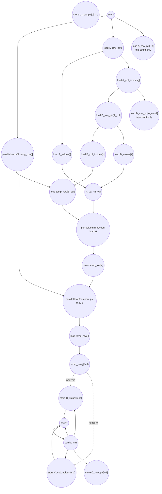

# ASAP Model Notes
- Outer loop can't be unrolled because each inner loop reuses the temp_row buffer to do the sparse matrix multiply
- The zero fill loop (j < K) can be unrolled because each j iteration writes to its own index
- The inner-loop from A_row_start to A_row_end can be tree-reduced
    - Each iteration walks a row in B, whose value is multiplied and accumulated into temp_row[B_col]
    - The B columns targeting the same output column can be tree reduced
- The compression step (last loop j < K) is forced to be serialized since the way the code is written, each store of C_values[nnz] needs the previous iteration's nnz++ in order to index the correct value

# Sparse Matrix Multiply Performance
Parameters (from `main.cpp`): `M = 3`, `N = 4`, `K = 3`.
- `A` is `3x4` in CSR with row nonzero counts `{2, 2, 2}`.
- `B` is `4x3` in CSR with row nonzero counts `{2, 1, 2, 1}`.
- The output is `C = A*B = [[5,0,5], [0,19,0], [1,8,2]]`, so
  `C_values = {5, 5, 19, 1, 8, 2}`,
  `C_col_indices = {0, 2, 1, 0, 1, 2}`, and
  `C_row_ptr = {0, 2, 3, 6}`.

Size parameters used in the formulas:
- `R = nnz(A) = 6`.
- `P = sum_i sum_{a in nz(A_i)} nnz(B_a)` = number of dynamic A/B products.
  For the test input, row product counts are `{4, 2, 3}`, so `P = 9`.
- `f_{i,c}` = number of A/B products in output row `i` that target output
  column `c`.
- `H_i = max_c f_{i,c}` = largest per-column fan-in for output row `i`.
  For the test input, `H = {2, 2, 1}`.
- `Z_i` = number of nonzero entries emitted in output row `i` after the
  `temp_row` scan. For the test input, `Z = {2, 1, 3}` and
  `Z_total = 6`.

## Loop classification

| dim | trip_count | kind | II | notes |
|-----|------------|------|----|-------|
| outer row `i` | `M` = 3 | sequential | row phase | Rows reuse the same `temp_row` scratch buffer and carry the cumulative `nnz` cursor used for CSR output addresses. Row `i+1` cannot safely zero `temp_row` before row `i` has compressed it. |
| zero-fill `j` | `K` = 3 per row | parallel | n/a | Each lane writes a distinct `temp_row[j] = 0`. The zero-fill work is fully unrolled within a row, but it is ordered before that row's source-level `temp_row` reads. |
| A-row `j` | `nnz(A_i)` | reduction / scatter-reduction | n/a | Each A nonzero selects one row of `B` and contributes products into `temp_row[B_col]`. Different A entries can target the same output column, so this is not plain parallel work. The associative `+` can be modeled as per-output-column reduction buckets. |
| B-row `k` | `nnz(B_{A_col})` | reduction leaves | n/a | For a fixed A entry, the B-row entries produce independent product leaves. Products targeting the same `B_col` join the same row-local reduction bucket. |
| compress `j` | `K` = 3 per row | mixed: parallel tests + sequential cursor | cursor | The `temp_row[j] != 0` loads/compares are independent once the row's temp values are finalized, so they issue as parallel tests. Only the taken entries serialize through the carried `nnz` cursor used for CSR output addresses. |

The multiply/update nest is best viewed as a bucketed scatter-reduction: for
each output row `i` and column `c`, all products with `B_col == c` reduce into
one `temp_row[c]` value. That gives logarithmic dependency depth in the bucket
fan-in `f_{i,c}`. This does not make the whole row logarithmic: rows are still
ordered by the shared scratch row and cumulative `nnz`, and the source
compression pass still emits nonzeros through the source-order `nnz` cursor.

This eval keeps the source-level operation counts for the scatter update:
`temp_row[B_col] += ...` charges the dynamic `temp_row` load, add, and store for
each A/B product. The bucketed reduction classification is used for dependency
depth. A physical rewrite that privatizes buckets and writes `temp_row[c]` only
once would reduce memory traffic; that is a different implementation from this
source.

## Critical path (`total_cycles`)

The critical path is aggregate-dependent. It is not a function of only `M`, `N`,
and `K`; it also depends on CSR row lengths and on collisions among the
`B_col_indices` reached by each A row.

For one output row `i`, the live phases are:

```
zero-fill temp_row[0..K-1]       parallel, depth 1; feeds temp_row loads
load A row start                 A_row_ptr[i] feeds product addresses
form A/B product leaves          P_i leaves, where P_i = sum_{a in nz(A_i)} nnz(B_a)
reduce by output column          max_c ceil(log2(max(f_{i,c}, 1)))
store reduced temp_row buckets
compress temp_row[0..K-1]        parallel tests, then carried nnz for taken entries
store C_row_ptr[i+1]
```

Symbolically:

```
total_cycles =
  sum_i row_cycles(i)

row_cycles(i) =
  max(zero_i,
      row_start_i
      + product_leaf_i
      + ceil(log2(max(H_i, 1)))
      + temp_store_i)
  + compress_test_i
  + nnz_cursor_i
  + row_ptr_store_i
```

`C_row_ptr[0] = 0` is an independent output store: it is counted as work and has
depth 1 as an output, but no later operation consumes it, so it does not prefix
the rest of the kernel. Likewise, `zero_i` is a real RAW predecessor for later
`temp_row[...]` loads, but it runs in parallel with row-start and product setup;
for the test input the product path is longer, so zero-fill is hidden by the
`max(...)` term.

`compress_test_i` is the 2-cycle parallel load/compare over finalized
`temp_row[j]` lanes. `nnz_cursor_i` is the serialized taken-entry chain through
the memory-backed `nnz` scalar. A transformed prefix-compaction implementation
could also parallelize the `nnz` placement itself, but that is not what this
kernel source expresses.

For the product side, this section uses a fully-unrolled reduction view: the
start bounds feed the product addresses, while end bounds only determine the
dynamic leaf set. The `A_row_ptr[i+1]` and `B_row_ptr[A_col+1]` loads are still
counted as work, but they are not data predecessors of `A_values[j]`,
`B_values[k]`, or the multiply. No loop-bound compare gates the product body in
this interpretation.

With `row_start_i = 1` for `load A_row_ptr[i]`, the product leaf is 4 cycles:

```
1 load A_values[j] and A_col_indices[j]
1 load B_row_ptr[A_col] in parallel with address_add A_col+1
1 load B_col_indices[k] and B_values[k] in parallel with load B_row_ptr[A_col+1]
1 compute A_val * B_val in parallel with load temp_row[B_col]
```

All other subscripts in that chain are bare variable/scalar subscripts; the only
inline address arithmetic is the `+1` in `B_row_ptr[A_col+1]`, which is included
in the second product-leaf cycle above. The `B_row_ptr[A_col+1]` load overlaps
the product data path and is shown only to make the counted end-bound work
explicit.

For the concrete `main.cpp` input:

| row `i` | A cols | product columns reached | `P_i` | `H_i` | `Z_i` |
|---------|--------|-------------------------|------:|------:|------:|
| 0 | `{0, 2}` | `c0:2, c2:2` | 4 | 2 | 2 |
| 1 | `{1, 3}` | `c1:2` | 2 | 2 | 1 |
| 2 | `{0, 3}` | `c0:1, c1:1, c2:1` | 3 | 1 | 3 |

The deepest reduction bucket has fan-in 2, so the product-combine part adds only
one reduction level for rows 0 and 1 and no reduction level for row 2. The
source-order row sequencing and CSR compression cursor dominate the depth more
than the per-column product reductions on this small test.

Using the DAG above for the concrete test input:

```
row0: max(1, 1 row-start + 4 product-leaf + 1 reduce + 1 temp-store)
      + 10 compress/row-ptr = 17
row1: max(1, 1 row-start + 4 product-leaf + 1 reduce + 1 temp-store)
      + 7 compress/row-ptr = 14
row2: max(1, 1 row-start + 4 product-leaf + 0 reduce + 1 temp-store)
      + 13 compress/row-ptr = 19

total_cycles = 17 + 14 + 19 = 50
```

The compression/row-pointer term is `2 + 3Z_i + 2`: two cycles for the parallel
`load temp_row[j] -> compare` tests over all columns, three carried cycles per
emitted entry for the taken-arm `nnz` load/add/store update, and two final cycles
for `load nnz -> store C_row_ptr[i+1]`. The standalone `C_row_ptr[0] = 0` output
store remains off the binding path because its depth is only 1.

## Op counts

### Formula

Let `R = nnz(A)`, `P = sum_i P_i`, and `Z_total = sum_i Z_i`.

Algorithmic work:
- Row-bound loads: `2M` loads from `A_row_ptr[i]` and `A_row_ptr[i+1]`.
- A-entry loads: `2R` loads from `A_values[j]` and `A_col_indices[j]`.
- B-row-bound loads: `2R` loads from `B_row_ptr[A_col]` and
  `B_row_ptr[A_col+1]`.
- Product/update work: per product, `B_col_indices[k]`, `B_values[k]`, and
  `temp_row[B_col]` are loaded; one multiply, one add, and one `temp_row`
  store execute.
- Zero-fill stores: `M*K` stores to `temp_row[j]`.
- Compression scan: `M*K` loads from `temp_row[j]`, `M*K` nonzero compares,
  `2Z_total` stores to `C_values[nnz]` and `C_col_indices[nnz]`, and `M+1`
  stores to `C_row_ptr`.

Overhead work:
- Loop induction for the five source loops charges iterator loads, increments,
  writebacks, and bound compares for the executed iterations. Following the
  completed eval-file convention, the induction store count includes the loop
  initialization stores.
- `nnz` is a memory-backed carried scalar: the declaration initializes it once,
  each emitted output entry reads it for the two CSR output addresses and the
  increment, each increment writes it back, and each row-end `C_row_ptr[i+1]`
  store reads the current value.
- Address adds are charged only for inline arithmetic inside brackets:
  `A_row_ptr[i+1]` (`M`), `B_row_ptr[A_col+1]` (`R`), and
  `C_row_ptr[i+1]` (`M`). All other subscripts are bare variables or named
  scalars.

### Algorithmic

| op | count | source |
|----|------:|--------|
| loads | `2M + 4R + 3P + M*K` = **66** | row bounds, A entries, B row bounds, per-product B/value/temp loads, compression `temp_row[j]` loads |
| stores | `M*K + P + 2Z_total + (M+1)` = **34** | zero-fill stores, per-product `temp_row` stores, emitted CSR value/column stores, `C_row_ptr` stores |
| adds | `P` = **9** | source-level `temp_row[B_col] += product` adds |
| address_adds | `2M + R` = **12** | `A_row_ptr[i+1]`, `B_row_ptr[A_col+1]`, `C_row_ptr[i+1]` |
| multiplies | `P` = **9** | `A_val * B_values[k]` |
| compares | `M*K` = **9** | `temp_row[j] != 0` compression tests |

### Overhead (induction, param hoists, carried scalar)

| op | count | source |
|----|------:|--------|
| loads | **47** | loop iterator reads (`M + 2M*K + R + P = 36`) + hoisted scalar params `M`, `K` (2) + carried `nnz` reads (`Z_total + M = 9`) |
| stores | **59** | loop iterator init/writeback stores (`52`) + carried `nnz` init/increment stores (`1 + Z_total = 7`) |
| adds | **42** | loop increments (`36`) + `nnz++` (`Z_total = 6`) |
| compares | **36** | loop-bound checks for the five source loops |
| address_adds | **0** | all address arithmetic is listed under algorithmic work above |

### Totals

| op | total |
|----|------:|
| loads | **113** |
| stores | **93** |
| adds | **51** |
| address_adds | **12** |
| multiplies | **9** |
| compares | **45** |
| divs / shifts / bitops / transcendentals | 0 |

The total work is small for the test input, but its shape is representative:
`P` controls the product/update work, `Z_total` controls emitted CSR stores and
`nnz` updates, and `M*K` controls the dense scratch-row zero/scan overhead. The
kernel is therefore L3 aggregate-dependent: exact work and depth require sparse
row aggregates, not just matrix dimensions.

## Data Dependency Graph

One output row is shown. Product leaves that target the same output column feed a
row-local reduction bucket. The compression phase reads and compares finalized
`temp_row` entries in parallel; only the emitted nonzeros advance the carried
`nnz` cursor in source column order.



## CGRA-Constrained Model

No CGRA-constrained schedule block is included for `spmspm` yet because
`tests/scripts/cgra_schedule.py` does not currently provide a `spmspm` DAG
builder. Adding a finite-resource schedule estimate should be done by first
adding a builder contract for the row phases, bucketed reductions, and sequential
compression cursor, then generating a marker-bounded `CGRA-SCHED:spmspm` block
from the helper.
