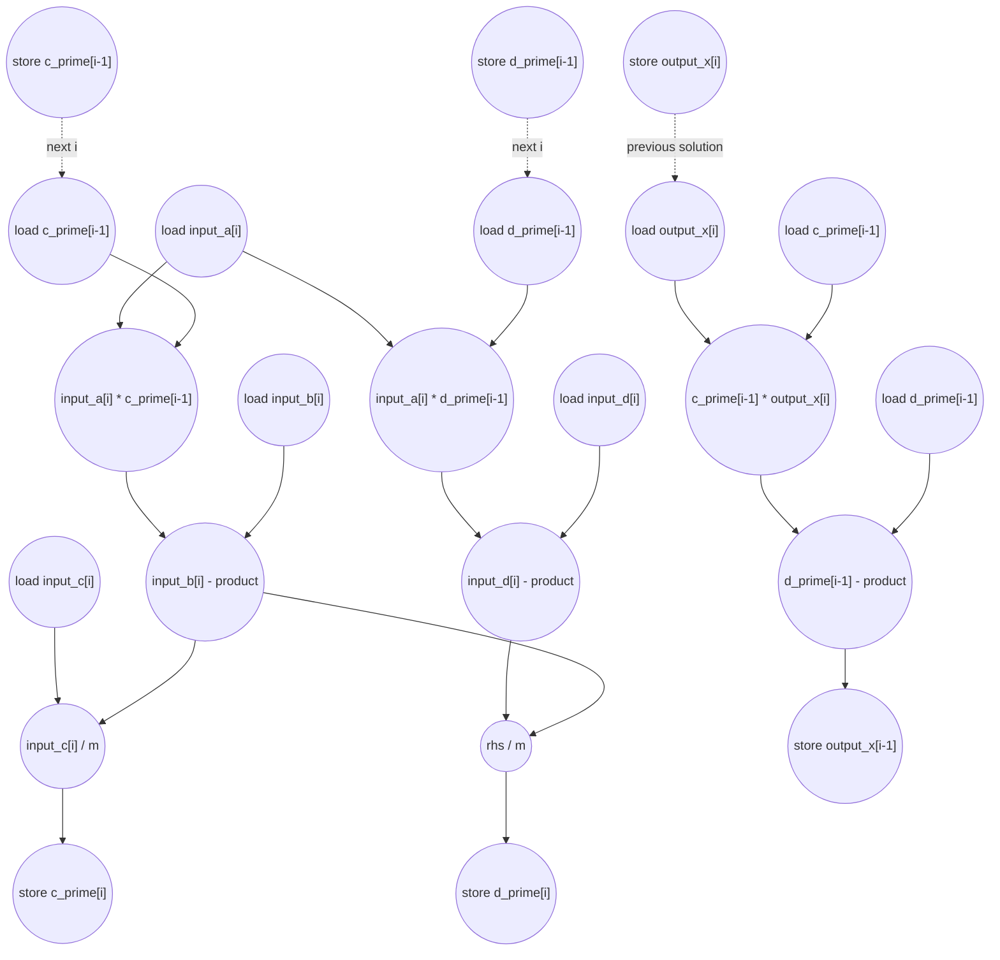

# ASAP Model Notes
- Both loops are sequential
    - c_prime[i] depends on c_prime[i-1] since the first loop is iterating upwards
    - outputx[i-1] depends on outputx[i] since the second loop is iterating downwards
- 

# Tridiag Solve Performance
Thomas tridiagonal solve for `Ax = d`. The kernel first computes modified
upper-diagonal and RHS arrays (`c_prime`, `d_prime`) with forward elimination,
then walks backward to compute `output_x`.

Parameters from `main.cpp`:
- `N = 8`
- `input_a`, `input_b`, `input_c` are the lower, main, and upper diagonals.
- `input_d` is the RHS vector.

This kernel is **L1 Static-Affine** in `kernel_perf_difficulty.csv`: the trip
counts and dynamic work are fixed by `N`. Its ASAP latency is still linear
because the Thomas recurrences are non-associative.

## Loop classification

| dim | trip_count | kind | II | notes |
|-----|------------|------|----|-------|
| forward `i` | `N - 1` = 7 | sequential | 5 | `m` depends on `c_prime[i - 1]`; `d_prime[i]` also depends on `d_prime[i - 1]`. The DSA source marks this loop `LOOM_PARALLEL()` / `LOOM_UNROLL(8)`, but the generated IR still has explicit carried values, so the source dependence remains. |
| backward `i` | `N - 1` = 7 | sequential | 4 | `output_x[i - 1]` consumes `output_x[i]`, so the solution is produced by a reverse carried chain. |

The temporary scalar `m` is assigned once per forward iteration and is not
loop-carried, so it is anonymous dataflow: its defining subtract fans out to the
two divides without scalar load/store traffic. The repeated `input_a[i]` read in
one forward iteration is modeled as one load feeding both products. Bare
subscripts such as `input_b[i]` and `output_x[i]` add no address arithmetic;
`[i - 1]` and `[N - 1]` subscripts do.

## Critical path (`total_cycles`)

The prologue computes `c_prime[0]` and `d_prime[0]`:

```
1 (loads input_c[0], input_b[0], input_d[0])
+ 1 (two divides, in parallel)
+ 1 (stores c_prime[0], d_prime[0])
= 3
```

Each forward-elimination step advances the carried prime chain by 5 cycles. The
`c_prime` and `d_prime` chains have the same depth because the `d_prime` divide
waits for the same denominator `m`.

```
store previous prime
-> load previous prime
-> multiply by input_a[i]
-> subtract from input_b[i] or input_d[i]
-> divide by m
-> store current prime
= 5 cycles per i
```

After forward elimination, back substitution starts from `d_prime[N - 1]`:

```
1 (load d_prime[N - 1])
+ 1 (store output_x[N - 1])
= 2
```

Then each backward step advances the solution chain by 4 cycles:

```
store output_x[i]
-> load output_x[i]
-> multiply c_prime[i - 1] * output_x[i]
-> subtract from d_prime[i - 1]
-> store output_x[i - 1]
= 4 cycles per i
```

The loop-induction work is counted in the totals below, but it is shorter than
the carried value chains and overlaps them after loop entry.

Therefore:

```
total_cycles = 3 + 5*(N - 1) + 2 + 4*(N - 1)
             = 9N - 4
```

For the checked-in test:

```
total_cycles = 9*8 - 4 = 68
```

So for `main.cpp`, **`total_cycles = 68`**.

## Op counts

Let `T = N - 1`. For `N = 8`, `T = 7`.

### Algorithmic

| op | formula | total | source |
|----|---------|------:|--------|
| loads | `3 + 6T + 1 + 3T` | **67** | prologue loads; forward loads of `input_a/b/c/d[i]`, `c_prime[i-1]`, `d_prime[i-1]`; back-substitution loads of `d_prime[N-1]`, `d_prime[i-1]`, `c_prime[i-1]`, `output_x[i]` |
| stores | `2 + 2T + 1 + T` | **24** | `c_prime[0]`, `d_prime[0]`, per-step prime stores, `output_x[N-1]`, and per-step solution stores |
| subs | `2T + T` | **21** | denominator/RHS subtracts in forward elimination and the backward `d_prime - c_prime*output_x` subtract |
| address_adds | `2T + 1 + 3T` | **36** | `c_prime[i-1]`, `d_prime[i-1]`, hoisted `N-1`, and backward `[i-1]` subscripts |
| multiplies | `2T + T` | **21** | two forward products and one backward product per step |
| divides | `2 + 2T` | **16** | two prologue divides plus two forward divides per step |

### Overhead (induction and scalar parameter)

| op | formula | total | source |
|----|---------|------:|--------|
| loads | `2T + 1` | **15** | forward/backward loop-iterator reads plus hoisted scalar parameter `N` |
| stores | `2T` | **14** | forward and backward iterator writeback stores |
| adds | `T` | **7** | forward `i++` |
| subs | `T` | **7** | backward `i--` |
| compares | `2T` | **14** | forward `i < N` and backward `i > 0` loop checks |
| address_adds | `0` | **0** | all address arithmetic is listed with the algorithmic accesses above |

### Totals

| op | total |
|----|------:|
| loads | **82** |
| stores | **38** |
| adds | **7** |
| subs | **28** |
| address_adds | **36** |
| multiplies | **21** |
| divides | **16** |
| compares | **14** |
| bitops / shifts / transcendentals | 0 |

Total dynamic operations: **242**.

## Data Dependency Graph

The graph shows one forward carried step and one backward carried step. Dotted
edges are the loop-carried dependences that force the two loops to remain
sequential under the ASAP model.


