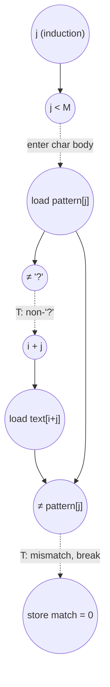

# ASAP Model Notes
- If pattern length is longer than text, return immediately
- Attempt to match pattern starting from the leftmost position to the rightmost position (sliding window)
    - If the character in the input pattern string is not a wildcard and doesn't match the input text, break the loop and shift the sliding window over by one position
    - If the pattern matches the text at a given i index, match = 1 and the kernel is finished

## Cycle Count/Critical Path


# Wildcard Match Performance

Single-character-wildcard substring search: report `1` if `pattern` (length `M`,
with `'?'` matching any character) occurs anywhere in `text` (length `N`), else
`0`. Parameters from `main.cpp`: `N = 64`, `M = 8`.

This kernel is **data-dependent-termination** (an L5 case): trip counts and the
exit point are input-dependent, so cycle counts are reported **per test case**
from `main.cpp`, not as a single closed form. Counts below assume those inputs.

| test case | text / pattern | match? | positions scanned | `total_cycles` |
|-----------|----------------|--------|-------------------|---------------:|
| TC1 | `text` all `'X'` except `text[10..17]="ABCDEFGH"`; `pattern="AB?DE?GH"` | yes @ `i=10` | `0…10` (11) | **169** |
| TC2 | `text` all `'A'`; `pattern="ZZZZZZZZ"` | no | `0…56` (57) | **688** |
| TC3 | `text[i]='A'+(i%26)`; `pattern="????????"` | yes @ `i=0` | `0` (1) | **31** |

## Loop classification

| dim | trip_count | kind | II | notes |
|-----|-----------|------|----|-------|
| outer `i` | data-dependent (`0 … N−M`, exits early on first full match) | sequential (data-dep termination) | 12 (failing position) | No register/accumulator/in-place memory is carried between positions (`match` is re-initialized each iter; `text`/`pattern` are read-only). The carry is the **early `return`** plus the iterator recurrence `i ← i+1`. Under no-predication, position `i+1`'s body is on the not-taken arm of position `i`'s `if(match)`, so it cannot begin until that compare retires; the result is `OR` over positions but evaluated as a serial scan up to the first match. |
| inner `j` | data-dependent (`0 … M−1`, exits early on first mismatch via `break`) | sequential (data-dep termination) | 3 (`'?'`) / 6 (matching char) | "Find first mismatch" scan. Each char `j+1` is gated on char `j`'s no-`break` determination. The `&&` short-circuits, so the `text[i+j]≠pattern[j]` half waits for the `pattern[j]≠'?'` compare. |

**Why both loops are serial — including the fully-matching position.** The
`break`/`return` is a control branch, not merely a carried value. Character
`j+1`'s work lies on the not-taken ("keep going") arm of character `j`'s
mismatch test, so under the no-predication convention it cannot fire until that
compare retires — and this holds for *every* character regardless of the input,
because the model evaluates each gating compare before knowing its outcome and
takes no credit for speculating past it. The hardware cannot know in advance
that a fully-matching position will never `break`, so the matching position
(TC1 `i=10`, TC3 `i=0`) is serial too. "Unlimited hardware" relaxes functional
units / fan-out / memory bandwidth; it does **not** license executing ops past
an unresolved branch.

Contrast: had the kernel been written branch-free as an associative `AND`
reduction (`match &= (pattern[j]=='?' | text[i+j]==pattern[j])` over all `j`, no
`break`), every iteration would run unconditionally and the carry would be a
pure associative `AND` → tree-reduced to `ceil(log2 M)` depth. The early-exit
`break` is exactly what tips this from a reduction into a data-dependent serial
scan, which is why the spec lists `wildcard_match` under data-dependent
termination. The serial bound is therefore deliberately conservative — it may
sit above the true minimum schedule for a fully-matching position — but that
conservatism is the model's stated stance.

## Critical path (`total_cycles`)

### Per-character chain (inner body)

Each executed inner character, from its `j<M` bound check to the determination
that releases the next character:

```
'?' char        : 1 (j<M) + 1 (load pattern[j]) + 1 (cmp ≠ '?', FALSE → short-circuit)            = 3
matching char   : 3 + 1 (address_add i+j) + 1 (load text[i+j]) + 1 (cmp ≠ pattern[j], FALSE)       = 6
mismatching char: 6th cycle's cmp is TRUE → break, then + 1 (store match = 0)                       = 6 (+1)
```

Three compare→body gaps stretch the body beyond raw dataflow depth, exactly as
in `binary_search`: (a) the inner `j<M` bound check gates the char body; (b) the
`&&` short-circuit makes the second compare wait for `pattern[j]≠'?'`; (c) for a
failing char, `store match=0` waits for the mismatch compare to retire.

### Per-position wrapper

```
outer bound check  : 1   (i ≤ N−M gates the position body; N−M is a hoisted loop-invariant sub)
inner scan         : Σ over executed chars (see above)
if(match)          : 2   (load match → cmp match ≠ 0)
i ← i+1            : 2   (add → store; load i is shared with the bound check and address-gen, one load/iter)
```

`match=1` is stored once per position; for a failing position it is dead-WAW
(overwritten by `match=0` before any read) and off the critical path; for the
matching position it is read by `if(match)` but is stored at position start and
overlaps the inner scan, so it never extends `total_cycles`. The outer `i++`
sits on the continue path (after `if(match)`), so it is part of the
position-to-position recurrence — except on the **matching** position, which
`return`s before `i++`.

### Prologue (once)

`load N ‖ load M → cmp M>N (FALSE, fall through)` = 2 cycles; `N−M` is computed
in parallel (cycle 2) and feeds every outer bound check. `wildcard='?'` is a
compile-time constant (cycle 1, no load).

### Assembling the test cases

- **Failing position** (breaks at char 0, non-`'?'`): `1 + 7 + 2 + 2 = 12`.
  The `7` is the char-0 chain through `store match=0`: `j<M(1) + load pattern(1)
  + cmp≠'?'(1) + addr(1) + load text(1) + cmp≠(1) + store match=0(1)`.
- **TC1 match @ i=10** (`pattern="AB?DE?GH"`, chars `[m,m,?,m,m,?,m,m]`): inner
  scan `= 6+6+3+6+6+3+6 (strides of chars 0–6) + 6 (char 7 determination) = 42`;
  position `= 1 + 42 + 1 (inner exit bound) + 2 + 1 (store output=1) = 47`.

```
TC1 = 2 (prologue) + 10·12 (positions 0–9 fail at char 0) + 47 (position 10) = 169
TC2 = 2 (prologue) + 57·12 (positions 0–56 fail at char 0) + 2 (exit bound + store output=0) = 688
TC3 = 2 (prologue) + [1 (outer bound) + 24 (8 '?' chars: 7·3 + 3) + 1 (inner exit) + 2 (if) + 1 (store=1)] = 31
```

For example, in TC1 the "match is at position 10" surfaces as the **ten preceding 12-cycle
failed scans**, not as 10 cycles; the matching position itself is the single
most expensive one (47 cycles), because no `break` fires and all eight
characters are scanned serially.

## Op counts (per test case)

Total dynamic work for the given inputs (independent of scheduling). `wildcard`
is constant (no load); `N`, `M` are loop-invariant (loaded once each); a
memory-backed scalar read several times within one iteration with no intervening
write is loaded once and fanned out (`i` per position; `j`, `pattern[j]` per
char).

| op | TC1 | TC2 | TC3 | source |
|----|----:|----:|----:|--------|
| loads | 77 | 288 | 21 | `pattern[j]`, `text[i+j]`, carried `match`, induction `i`/`j`, prologue `N`/`M` |
| stores | 50 | 229 | 10 | `match` (init + `=0` on break), induction `i`/`j`, `output_match` |
| adds | 28 | 114 | 8 | `i++` (failing positions) + `j++` (per char) |
| subs | 1 | 1 | 1 | `N−M` loop bound (hoisted) |
| address_adds | 16 | 57 | 0 | `i+j` in `text[i+j]` (only on non-`'?'` chars; TC3 has none) |
| compares | 76 | 287 | 20 | outer `i≤N−M`, inner `j<M`, `pattern[j]≠'?'`, `text[i+j]≠pattern[j]`, `match≠0`, prologue `M>N` |
| muls / divs / shifts / bitops / transcendentals | 0 | 0 | 0 | — |

Per-failing-position breakdown (TC1/TC2, char-0 mismatch): loads 5, stores 4,
adds 2, address_adds 1, compares 5. TC1's matching position adds loads 25,
stores 10, adds 8, address_adds 6, compares 25 (and no `i++`).

## Aggregate CGRA lower bound

Per `docs/spec-kernel-performance.md`: separate `P`/`L`/`S` classes, one op/cycle
each, `A` = all `P`-class ops (`adds + subs + address_adds + compares`). Counts
are input-specific, like `CP`. With `6x6` (`P=36`, `L=12`, `S=12`):

| test case | `CP` | `A` | `LD` | `ST` | `compute` | `load` | `store` | aggregate |
|-----------|-----:|----:|-----:|-----:|----------:|-------:|--------:|----------:|
| TC1 | 169 | 121 | 77 | 50 | `⌈121/36⌉=4` | `⌈77/12⌉=7` | `⌈50/12⌉=5` | **169** |
| TC2 | 688 | 459 | 288 | 229 | `⌈459/36⌉=13` | `⌈288/12⌉=24` | `⌈229/12⌉=20` | **688** |
| TC3 | 31 | 29 | 21 | 10 | `1` | `2` | `1` | **31** |

**Bottleneck: dependency-bound** in every case. The total work is tiny relative
to the fabric width, so the serial scan recurrence (`CP`) dominates and more
lanes do not help — the floor scales with how far the scan runs before the first
match (or the end of text), not with fabric width. This is the
data-dependent-termination regime, identical in shape to `binary_search`.

> The finite-resource list-schedule **estimate** (the marker-bounded
> `CGRA-SCHED` block) is not included: `wildcard_match` is not yet a builder in
> `tests/scripts/cgra_schedule.py`. Adding a builder there (and running
> `report wildcard_match --config 6x6`) is the follow-up that would append that
> block; it is an estimate for the spec's scheduling policy, not a lower bound.

## Data Dependency Graph (one inner character)

Per executed character of the inner scan. The next character's `j<M` bound check
is gated by this character's determination compare (no `break`); a failing
character instead feeds `store match=0` and then the outer `if(match)`.

