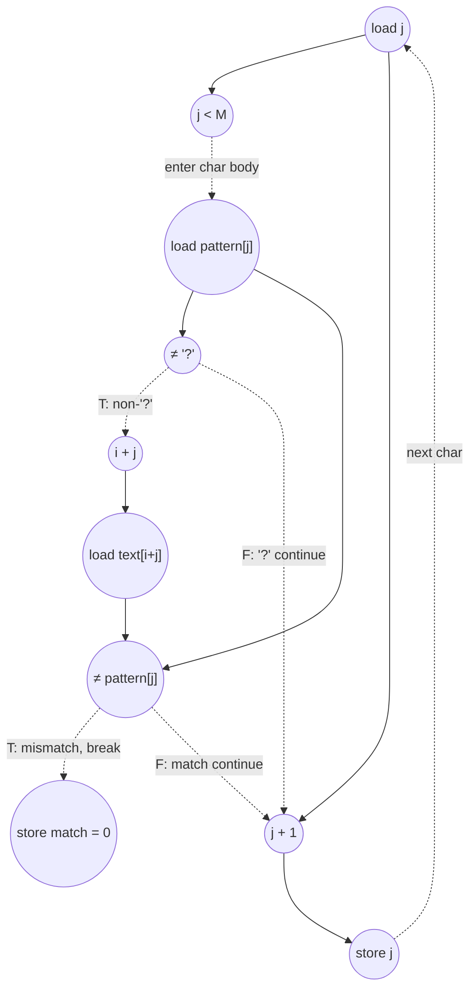

# ASAP Model Notes
- If pattern length is longer than text, return immediately
- Attempt to match pattern starting from the leftmost position to the rightmost position (sliding window)
    - If the character in the input pattern string is not a wildcard and doesn't match the input text, break the loop and shift the sliding window over by one position
    - If the pattern matches the text at a given i index, match = 1 and the kernel is finished

## Cycle Count/Critical Path


# Wildcard Match Performance

Single-character-wildcard substring search: report `1` if `pattern` (length `M`,
with `'?'` matching any character) occurs anywhere in `text` (length `N`), else
`0`. Parameters from `main.cpp`: `N = 64`, `M = 8`.

This kernel is **data-dependent-termination**, classified **L4
(Value-Distribution)** in `kernel_perf_difficulty.csv`: the trip counts and the
exit point depend on the text/pattern *values* — how far each attempted match
runs before mismatching, and the position of the first full match — so cycle
counts are reported **per test case** from `main.cpp`, not as a single closed
form. Counts below assume those inputs.

| test case | text / pattern | match? | positions scanned | `total_cycles` |
|-----------|----------------|--------|-------------------|---------------:|
| TC1 | `text` all `'X'` except `text[10..17]="ABCDEFGH"`; `pattern="AB?DE?GH"` | yes @ `i=10` | `0…10` (11) | **203** |
| TC2 | `text` all `'A'`; `pattern="ZZZZZZZZ"` | no | `0…56` (57) | **745** |
| TC3 | `text[i]='A'+(i%26)`; `pattern="????????"` | yes @ `i=0` | `0` (1) | **55** |

## Loop classification

| dim | trip_count | kind | II | notes |
|-----|-----------|------|----|-------|
| outer `i` | data-dependent (`0 … N−M`, exits early on first full match) | sequential (data-dep termination) | 13 (failing position; 12 at position 0) | No register/accumulator/in-place memory is carried between positions (`match` is re-initialized each iter; `text`/`pattern` are read-only). The carry is the **early `return`** plus the iterator recurrence `i ← i+1`, whose read/increment/write-back lie on the critical path (sequential dim). Under no-predication, position `i+1`'s body is on the not-taken arm of position `i`'s `if(match)`, so it cannot begin until that compare retires; the result is `OR` over positions but evaluated as a serial scan up to the first match. Position 0 reads `i=0`, a constant-init root, so it drops the `load i`. |
| inner `j` | data-dependent (`0 … M−1`, exits early on first mismatch via `break`) | sequential (data-dep termination) | 6 (`'?'`) / 9 (matching char) | "Find first mismatch" scan. Each char `j+1` is gated on char `j`'s no-`break` determination. The `&&` short-circuits, so the `text[i+j]≠pattern[j]` half waits for the `pattern[j]≠'?'` compare. As a **sequential** dim, the `j` recurrence (`load j → j++ → store j`) is on the carried chain; the first char of each scan reads `j=0` (constant-init root, no `load j`), and a breaking char runs no `j++`. |

**Why both loops are serial — including the fully-matching position.** The
`break`/`return` is a control branch, not merely a carried value. Character
`j+1`'s work lies on the not-taken ("keep going") arm of character `j`'s
mismatch test, so under the no-predication convention it cannot fire until that
compare retires — and this holds for *every* character regardless of the input,
because the model evaluates each gating compare before knowing its outcome and
takes no credit for speculating past it. The hardware cannot know in advance
that a fully-matching position will never `break`, so the matching position
(TC1 `i=10`, TC3 `i=0`) is serial too. "Unlimited hardware" relaxes functional
units / fan-out / memory bandwidth; it does **not** license executing ops past
an unresolved branch.

Contrast: had the kernel been written branch-free as an associative `AND`
reduction (`match &= (pattern[j]=='?' | text[i+j]==pattern[j])` over all `j`, no
`break`), every iteration would run unconditionally and the carry would be a
pure associative `AND` → tree-reduced to `ceil(log2 M)` depth. The early-exit
`break` is exactly what tips this from a reduction into a data-dependent serial
scan, which is why the spec lists `wildcard_match` under data-dependent
termination. The serial bound is therefore deliberately conservative — it may
sit above the true minimum schedule for a fully-matching position — but that
conservatism is the model's stated stance.

## Critical path (`total_cycles`)

### Per-character chain (inner body)

Each executed inner character, from its `j<M` bound check to the determination
that releases the next character:

```
continuing chars (run j++):
  '?' char      : load j(1) + j<M(1) + load pattern[j](1) + cmp ≠'?' FALSE(1) + j++(1) + store j(1)                       = 6
  matching char : load j(1) + j<M(1) + load pattern[j](1) + cmp ≠'?'(1) + addr i+j(1) + load text(1) + cmp ≠(1) + j++(1) + store j(1) = 9
breaking char (no j++ — C `break` skips the for-increment):
  mismatching   : load j(1) + j<M(1) + load pattern[j](1) + cmp ≠'?'(1) + addr i+j(1) + load text(1) + cmp ≠ TRUE(1) + store match=0(1) = 8
```

The **first** char of each inner scan reads `j=0`, a constant-init root, so its
`load j` is off the critical path — subtract 1 (`'?'` → 5, matching → 8,
break-at-char-0 → 7). After the last non-breaking char, the loop exits via a
failing bound check: `load j + (j<M, FALSE)` = 2 cycles.

Two effects stretch each char beyond raw dataflow depth. First, three
compare→body gaps, exactly as in `binary_search`: (a) the inner `j<M` bound
check gates the char body; (b) the `&&` short-circuit makes the second compare
wait for `pattern[j]≠'?'`; (c) for a failing char, `store match=0` waits for the
mismatch compare to retire. Second, because the inner `j` loop is a
**sequential** dim, its induction recurrence (`load j → … → j++ → store j`) lies
on the carried chain per `docs/spec-kernel-performance.md` — a sequential-dim
iterator read is part of the carried chain, while only a fully-unrolled
parallel/reduction iterator is rooted. The same applies to the outer `i` read on
every position after the first.

### Per-position wrapper

```
load i             : 1   (carried-i read; one load/position, fanned to the bound check, every i+j address, and i++. OMITTED on position 0: i=0 is a constant-init root)
outer bound check  : 1   (i ≤ N−M gates the position body; N−M is a hoisted loop-invariant sub)
inner scan         : Σ over executed chars (see above)
if(match)          : 2   (load match → cmp match ≠ 0)
i ← i+1            : 2   (add → store; OMITTED on the matching position, which returns before the increment)
```

`match=1` is stored once per position; for a failing position it is dead-WAW
(overwritten by `match=0` before any read) and off the critical path; for the
matching position it is read by `if(match)` but is stored at position start and
overlaps the inner scan, so it never extends `total_cycles`. The outer `i++`
sits on the continue path (after `if(match)`), so it is part of the
position-to-position recurrence — except on the **matching** position, which
`return`s before `i++`.

### Prologue (once)

`load N ‖ load M → cmp M>N (FALSE, fall through)` = 2 cycles; `N−M` is computed
in parallel (cycle 2) and feeds every outer bound check. `wildcard='?'` is a
compile-time constant (cycle 1, no load).

### Assembling the test cases

- **Failing position** (breaks at char 0): `load i(1) + outer bound(1) + 7
  (char-0 break chain) + if(2) + i++(2) = 13`; position 0 drops the `load i`
  (`i=0` root) → `12`. The `7` is `j<M(1) + load pattern(1) + cmp≠'?'(1) +
  addr(1) + load text(1) + cmp≠(1) + store match=0(1)` — char 0's `load j` is a
  root and the `break` runs no `j++`.
- **TC1 match @ i=10** (`pattern="AB?DE?GH"`, chars `[m,m,?,m,m,?,m,m]`): inner
  scan `= 8 (char 0, matching root) + 9+6+9+9+6+9 (chars 1–6) + 9 (char 7) + 2
  (inner-exit bound) = 67`; position `= 1 (load i) + 1 (outer bound) + 67 + 2
  (if) + 1 (store output=1) = 72`.

```
TC1 = 2 (prologue) + 12 (position 0) + 9·13 (positions 1–9) + 72 (position 10) = 203
TC2 = 2 (prologue) + 12 (position 0) + 56·13 (positions 1–56) + 2 (exit: load i + failing bound) + 1 (store output=0) = 745
TC3 = 2 (prologue) + [1 (outer bound, i=0 root) + 49 (8 '?' chars: 5 + 6·7 + 2 inner-exit) + 2 (if) + 1 (store=1)] = 55
```

For example, in TC1 the matching position
itself is the single most expensive one (72 cycles), because no `break` fires
and all eight characters are scanned serially.

## Op counts (per test case)

Total dynamic work for the given inputs (independent of scheduling). `wildcard`
is constant (no load); `N`, `M` are loop-invariant (loaded once each); a
memory-backed scalar read several times within one iteration with no intervening
write is loaded once and fanned out (`i` per position; `j`, `pattern[j]` per
char).

| op | TC1 | TC2 | TC3 | source |
|----|----:|----:|----:|--------|
| loads | 77 | 288 | 21 | `pattern[j]`, `text[i+j]`, carried `match`, induction `i`/`j`, prologue `N`/`M` |
| stores | 52 | 230 | 12 | `match` (init + `=0` on break), induction `i`/`j` write-backs **including the constant-init `i=0` (once) and `j=0` (per position)**, `output_match` |
| adds | 18 | 57 | 8 | `i++` (continuing positions) + `j++` (continuing chars only — `break` skips the for-increment) |
| subs | 1 | 1 | 1 | `N−M` loop bound (hoisted) |
| address_adds | 16 | 57 | 0 | `i+j` in `text[i+j]` (only on non-`'?'` chars; TC3 has none) |
| compares | 76 | 287 | 20 | outer `i≤N−M`, inner `j<M`, `pattern[j]≠'?'`, `text[i+j]≠pattern[j]`, `match≠0`, prologue `M>N` |
| muls / divs / shifts / bitops / transcendentals | 0 | 0 | 0 | — |

Per-failing-position breakdown (TC1/TC2, char-0 mismatch): loads 5, stores 4
(`match=1`, `j=0` init, `match=0`, `i++`), adds 1 (`i++` only — `break` skips
`j++`), address_adds 1, compares 5. TC1's matching position adds loads 25,
stores 11 (`match=1`, `j=0` init, 8×`j++`, `output=1`), adds 8 (`j++`),
address_adds 6, compares 25 (and no `i++`). The kernel-wide `i=0` init store
contributes one further `S` (counted once).

## Aggregate CGRA lower bound

Per `docs/spec-kernel-performance.md`: separate `P`/`L`/`S` classes, one op/cycle
each, `A` = all `P`-class ops (`adds + subs + address_adds + compares`). Counts
are input-specific, like `CP`. With `6x6` (`P=36`, `L=12`, `S=12`):

| test case | `CP` | `A` | `LD` | `ST` | `compute` | `load` | `store` | aggregate |
|-----------|-----:|----:|-----:|-----:|----------:|-------:|--------:|----------:|
| TC1 | 203 | 111 | 77 | 52 | `⌈111/36⌉=4` | `⌈77/12⌉=7` | `⌈52/12⌉=5` | **203** |
| TC2 | 745 | 402 | 288 | 230 | `⌈402/36⌉=12` | `⌈288/12⌉=24` | `⌈230/12⌉=20` | **745** |
| TC3 | 55 | 29 | 21 | 12 | `1` | `2` | `1` | **55** |

**Bottleneck: dependency-bound** in every case. The total work is tiny relative
to the fabric width, so the serial scan recurrence (`CP`) dominates and more
lanes do not help — the floor scales with how far the scan runs before the first
match (or the end of text), not with fabric width. This is the
data-dependent-termination regime, identical in shape to `binary_search`.

## Data Dependency Graph (one inner character)

Per executed character of the inner scan. The `j` induction
(`load j → j++ → store j`) is the sequential carry and lies on the critical
path: `store j` of one char feeds `load j` of the next. The continue (no-`break`)
path runs `j++`; a failing character instead feeds `store match=0` and then the
outer `if(match)`, skipping `j++`.



<!-- BEGIN CGRA-SCHED:wildcard_match -->
### Finite-Resource Schedule Estimate (time-local)

*Reproducible estimate for the deterministic criticality-priority list-schedule policy defined in [`docs/spec-kernel-performance.md`](../../../docs/spec-kernel-performance.md). It is **not** a lower bound (the aggregate model above is the lower bound) and **not** cycle-accurate RTL; it exposes the short windows of local `P`/`L`/`S` pressure that the aggregate model smooths over.*

**Resource configuration:** `P = 36`, `L = 12`, `S = 12` (`6x6`).

`wildcard_match` is reported per input case; these rows are separate kernel invocations and are **not** summed as ordered regions.

| case | CP | A | LD | ST | aggregate | scheduled | gap | ratio |
|------|---:|--:|---:|---:|----------:|----------:|----:|------:|
| TC1 | 203 | 111 | 77 | 52 | 203 | 203 | 0 | 1 |
| TC2 | 745 | 402 | 288 | 230 | 745 | 745 | 0 | 1 |
| TC3 | 55 | 29 | 21 | 12 | 55 | 55 | 0 | 1 |

**Local `P`/`L`/`S` pressure by case** (saturated cycles / longest saturated run / peak ready backlog):
- `TC1`:
  - `P`: 0 / 0 / 0
  - `L`: 1 / 1 / 2
  - `S`: 1 / 1 / 11
- `TC2`:
  - `P`: 0 / 0 / 0
  - `L`: 5 / 5 / 48
  - `S`: 9 / 9 / 103
- `TC3`:
  - `P`: 0 / 0 / 0
  - `L`: 0 / 0 / 0
  - `S`: 0 / 0 / 0

<!-- END CGRA-SCHED:wildcard_match -->
